## Vesting Conditions and Expense Recognition

### Overview

Once grant-date fair value is established, the second core mechanic of ASC 718 (and IFRS 2) is determining **how and when** that fixed value is recognized as compensation expense. This is governed by (1) the type of vesting condition attached to the award and (2) the pattern of vesting (cliff vs. graded) which drives the **attribution method**.

$$\text{Cumulative Expense to Date} = FV_{\text{grant}} \times \text{Awards Expected to Vest} \times \frac{\text{Service Rendered}}{\text{Requisite Service Period}}$$

---

### Taxonomy of Vesting Conditions

ASC 718-10-20 identifies four types of conditions that can attach to an award. Correct classification is essential because each has fundamentally different recognition consequences.

#### Service Conditions

Requires the grantee to render service for a specified period (e.g., "vests over 4 years, 25% annually").

- Compensation cost is recognized over the **requisite service period** — the period during which the grantee must provide service to earn the award.
- If service is not rendered (voluntary/involuntary termination before vesting), the award is **forfeited**, and all previously recognized compensation cost is **reversed**.

#### Performance Conditions

Vesting or exercisability is contingent on achieving a specified target tied to the entity's own **operations or activities** — not its stock price (e.g., cumulative revenue, EPS growth, product launch, IPO occurrence, cost-reduction milestone).

- Grant-date fair value is **not adjusted** for the performance condition itself; only the probability of achievement affects the **recognition pattern**.
- Expense recognition begins when achievement becomes **probable** (not necessarily at grant date) and is trued up as the assessment changes.
- If the condition is ultimately **not met** (and was never appropriately deemed probable, or becomes improbable), all cumulative expense is **reversed**.
- A **performance condition** is distinguished from a **performance target** that affects only the *number of shares* or the *exercise price* (these are still performance conditions per ASC 718, provided they don't depend on market price).

#### Market Conditions

Vesting, exercisability, or the amount realizable is contingent on achieving a specified **stock price** or **market-index-relative metric** (e.g., absolute stock price hurdle, relative TSR ranking vs. peer group).

- The condition is **embedded in the grant-date fair value** via Monte Carlo simulation (see prior item).
- Compensation cost is recognized over the **derived service period** (the expected time to satisfy the market condition, as estimated by the valuation model) as long as the requisite service is rendered.
- **No reversal** occurs if the market condition is not achieved — this is the critical distinguishing feature from performance conditions.

#### Performance Conditions Combined with Market Conditions

Awards can layer both — e.g., "vest based on relative TSR performance, but only if the executive remains employed for 3 years AND the company achieves positive EBITDA." The performance condition (EBITDA) still requires a probability assessment; the market condition (TSR) is embedded in FV and does not reverse. Both conditions may independently gate vesting.

**Key Points**

| Condition Type | Basis | FV Adjustment | Reversal if Not Met? |
| --- | --- | --- | --- |
| Service | Continued employment/service | None | Yes |
| Performance | Company operational/financial metric | None (affects timing/probability only) | Yes, if not achieved |
| Market | Stock price / relative TSR | Yes — embedded via Monte Carlo | No |

---

### Explicit, Implicit, and Derived Service Periods

The requisite service period is not always the stated vesting period on the award certificate:

- **Explicit service period**: Stated directly in the award (e.g., "vests after 3 years of service").
- **Implicit service period**: Not explicitly stated but inferable from the facts and circumstances (e.g., an award that vests upon completion of a specific project reasonably expected to take 18 months implies an 18-month service period even if not stated).
- **Derived service period**: For market-condition awards, the service period is **derived from the Monte Carlo simulation** itself — it represents the median/expected time for the market condition to be satisfied across simulated paths, and it governs the expense attribution period **even if the market condition is satisfied earlier or later than expected, or never**.

**Example**

A market-condition award requires a stock price to reach $50/share, with no explicit vesting date, contractual term 6 years. The Monte Carlo model, run to derive the grant-date FV, also simulates the average time-to-target across all paths that hit $50 — say, 3.4 years. This 3.4-year derived service period governs the expense recognition schedule, regardless of whether the actual stock price hits $50 in year 2 or never within the 6-year term (provided the employee continues providing service through the derived period, or actual vesting, if earlier).

---

### Attribution Methods: Straight-Line vs. Graded Vesting

For awards with a single vesting tranche (cliff vesting), attribution is straightforward: recognize the full grant-date FV ratably over the single service period.

For **graded vesting** awards (e.g., 25% vests each year over 4 years), ASC 718 permits two acceptable methods, treating each tranche as if it were a **separate award** with its own requisite service period, OR:

#### Straight-Line Method

Total compensation cost across all tranches is expensed evenly over the total requisite service period (i.e., over the life of the last-vesting tranche), subject to the constraint that cumulative expense recognized can never be **less than** the vested amount at any reporting date.

$$\text{Expense}_t^{SL} = \frac{\sum_{i=1}^{n} FV_i \times \text{Units}_i}{\text{Total Service Period}}$$

#### Graded (Accelerated) Attribution Method

Each vesting tranche is treated as a separate award, and its associated compensation cost is recognized on a straight-line basis over **its own** (shorter) requisite service period. This "front-loads" expense recognition relative to the straight-line method.

$$\text{Expense}_t^{Graded} = \sum_{i=1}^{n} \frac{FV_i \times \text{Units}_i}{\text{Service Period}_i} \times \mathbb{1}[\text{Tranche } i \text{ still vesting at time } t]$$

**Key Points**

- The choice between straight-line and graded attribution is an **accounting policy election**, applied consistently to all graded-vesting awards with only service conditions.
- **Awards with performance conditions** where the timing of tranche vesting depends on when the performance condition is achieved (not a fixed schedule) generally **must** use the graded-tranche approach, since a single straight-line period cannot be determined until achievement timing is known.
- Under the straight-line method, cumulative expense must never fall below the intrinsic value of tranches already vested — this creates a floor constraint that must be monitored.

**Example**

An award of 4,000 options, grant-date FV $10/option ($40,000 total), vests 25% per year over 4 years.

*Straight-line*: $10,000 expense recognized in each of years 1–4 ($40,000 ÷ 4).

*Graded attribution*: Tranche 1 (1,000 options, 1-year service) recognizes its $10,000 entirely in Year 1. Tranche 2 (1,000 options, 2-year service) recognizes $5,000 in Year 1 and $5,000 in Year 2. Tranche 3 (2-year... 3-year service) spreads $3,333 per year across years 1–3. Tranche 4 spreads $2,500 per year across years 1–4.

Year 1 expense under graded method = $10,000 + $5,000 + $3,333 + $2,500 = **$20,833** — substantially front-loaded relative to the straight-line $10,000.

---

### Forfeitures: Estimate vs. As-Incurred (ASU 2016-09 Policy Election)

ASU 2016-09 introduced a policy election (available to both public and private companies) governing how expected forfeitures are handled:

#### Estimate Method (Pre-ASU 2016-09 Default / Continuing Option)

Compensation cost is recognized net of an estimated forfeiture rate, applied prospectively and trued up when estimates change or actual forfeitures occur.

$$\text{Awards Expected to Vest} = \text{Awards Granted} \times (1 - \text{Estimated Forfeiture Rate})$$

#### As-Incurred Method (Policy Election under ASU 2016-09)

Compensation cost is recognized as if **all** awards granted will vest, with forfeitures recognized as a reversal of previously recognized expense **only in the period they actually occur**.

**Key Points**

- The election is an entity-wide accounting policy choice (not award-by-award) and must be applied consistently.
- The as-incurred method simplifies bookkeeping (no forfeiture-rate estimation and periodic true-ups) but produces more expense volatility in periods with unexpected terminations.
- Nonpublic entities disproportionately favor the as-incurred method due to reduced administrative burden and lack of robust historical forfeiture data needed to support a defensible rate estimate.

---

### Interaction with Award Cancellation and "Improbable-to-Probable" Transitions

- **Award cancellation without replacement**: Treated as an acceleration of vesting; unrecognized compensation cost is recognized immediately at the cancellation date (unless it is, in substance, a repurchase for value below fair value, which may trigger different treatment).
- **Performance condition reassessment**: If a performance condition initially judged improbable becomes probable in a later period, a **cumulative catch-up adjustment** is recorded in that period — recognizing, in one period, the expense that would have been recognized to date had the condition been deemed probable from inception (or from grant date, whichever is appropriate under the facts).

$$\text{Catch-up Adjustment} = \left(FV_{\text{grant}} \times \text{Units} \times \frac{\text{Service Rendered to Date}}{\text{Total Service Period}}\right) - \text{Previously Recognized Expense (\$0 if condition was improbable)}$$

---

### Diagram: Expense Recognition Decision Path by Condition Type (svg_diagram)

```mermaid
flowchart TD
    A[Award Granted - FV Fixed] --> B{Condition Type}

    B -->|Service Only| C[Determine Requisite Service Period]
    B -->|Performance| D{Probable of Achievement?}
    B -->|Market| E[Use Derived Service Period from Monte Carlo]

    C --> F{Vesting Pattern}
    F -->|Cliff| G[Straight-line over single period]
    F -->|Graded| H{Attribution Policy}
    H -->|Straight-line elected| I[Total FV / Total Service Period, floor at vested amount]
    H -->|Graded elected| J[Each tranche recognized over own service period]

    D -->|No| K[No expense recognized]
    D -->|Yes| L[Recognize expense over service period]
    K -->|Becomes probable later| M[Cumulative catch-up adjustment]

    E --> N[Recognize over derived period regardless of actual outcome]

    G --> O{Forfeiture Policy Election}
    I --> O
    J --> O
    L --> O
    N --> O

    O -->|Estimate Method| P[Reduce expense by estimated forfeiture rate; true-up]
    O -->|As-Incurred Method| Q[Recognize full grant assuming vesting; reverse only on actual forfeiture]
```

---

### Common Pitfalls and Practice Notes

- **[Inference]** The most frequent classification error is treating an IPO-contingent vesting condition as a market condition rather than a performance condition — an IPO occurrence is a performance/liquidity event, not a stock-price-based market condition, so no expense is recognized until the IPO becomes probable (typically upon effectiveness), at which point a substantial cumulative catch-up is often required.
- Switching the forfeiture policy election requires evaluation as a change in accounting principle, not a mere estimate change.
- Confusing "vesting period" with "requisite service period" when implicit service periods exist (e.g., a performance condition reasonably expected to take longer than the stated minimum vesting date) can misstate the recognition timeline.
- Under graded attribution, failing to track each tranche as a discrete sub-award with its own schedule is a common spreadsheet-modeling error, particularly for multi-year, multi-tranche executive grants.

**Related Topics**

- Grant-date fair value measurement (valuation model selection by condition type)
- Modification accounting and Type I–IV reclassifications
- Clawback provisions and their interaction with recognized expense (ASC 718 vs. Dodd-Frank clawback rules)
- Income tax accounting for share-based compensation (ASU 2016-09 APIC pool elimination, excess tax benefits/deficiencies through the income statement)
- Nonemployee (ASC 718 post-ASU 2018-07 scope expansion) vs. employee awards
- IFRS 2 vesting condition terminology differences (non-vesting conditions)