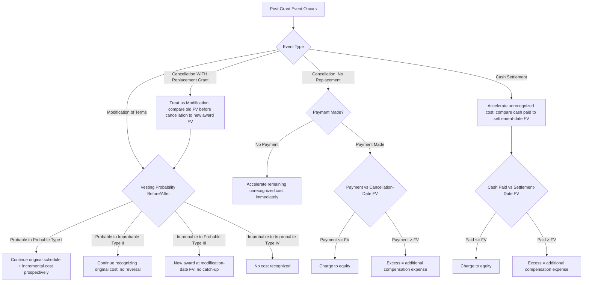

## Modifications, Cancellations, and Settlements

### Overview

After grant date, an award's terms may change (modification), be terminated without replacement (cancellation), or be resolved for cash or shares (settlement). Each event has distinct recognition consequences under ASC 718, all anchored to a single organizing principle: **compare the fair value of the award immediately before and immediately after the event**, and never reduce previously recognized compensation cost for a change that decreases value.

$$\text{Incremental Compensation Cost} = \max\left(0,\ FV_{\text{after}} - FV_{\text{before}}\right)$$

---

### Modifications: The Type I–IV Framework

ASC 718-20-35-3 through 35-9 classifies every modification into one of four types based on (a) the probability of vesting before and after the modification, and (b) the change in fair value. Correct classification determines whether prior expense is trued up, whether incremental cost applies, and over what period any incremental cost is recognized.

#### Type I: Probable-to-Probable

The award was **probable of vesting** before the modification and remains **probable of vesting** after (most common scenario — e.g., extending an exercise window, repricing an underwater option, accelerating vesting).

- Incremental cost = $FV_{\text{after}} - FV_{\text{before}}$ (floored at zero), measured immediately before and after modification using the **same valuation model and assumptions** (e.g., updated stock price, remaining term, updated volatility) except for the specific terms being modified.
- Incremental cost is recognized **prospectively** — original grant-date cost continues on its original schedule; incremental cost is added, generally over the **remaining requisite service period** (or immediately if there is none remaining, i.e., the award was already vested).
- If the award was already **fully vested** at modification, the entire incremental cost is recognized **immediately**.

$$\text{Total Expense}_{\text{post-mod}} = \text{Remaining Original Cost (original schedule)} + \frac{\text{Incremental Cost}}{\text{Remaining Service Period}}$$

**Example**

A fully vested option with original grant-date FV of $1,200,000 (already fully expensed) is repriced from a $40 strike to a $15 strike due to a stock price decline. Post-modification FV, computed with the lower strike and current market inputs, is $1,650,000. Incremental cost = $1,650,000 − $1,200,000 = **$450,000**, recognized immediately in the period of modification since the award is already vested.

#### Type II: Probable-to-Improbable

The award was probable of vesting before the modification but becomes **improbable** afterward (e.g., modifying a performance target to one management now believes is unattainable).

- All compensation cost previously recognized **continues to be recognized** — it is **not reversed**, because the original condition was validly assessed as probable at the time.
- No incremental cost is recognized (since the new award is not expected to vest), unless/until the new condition becomes probable again, in which case a fresh probable-to-probable-style assessment applies going forward.

#### Type III: Improbable-to-Probable

The award was **improbable** of vesting before modification (so little or no expense had been recognized) and becomes **probable** after.

- The modified award is treated as if it were **a new award granted on the modification date**, measured at the modification-date fair value.
- Total compensation cost recognized = full modification-date fair value, recognized over the remaining requisite service period from the modification date forward — with **no** cumulative catch-up for the pre-modification period (since no cost had accrued, there is nothing to true up beyond the go-forward measurement).

$$\text{Expense (from modification date)} = \frac{FV_{\text{modification date}}}{\text{Remaining Service Period}}$$

#### Type IV: Improbable-to-Improbable

The award was improbable before and remains improbable after modification.

- No compensation cost is recognized either before or after, **unless** the modification-date fair value of the (still-improbable) award is used as a measurement basis in case the condition later becomes probable — similar to Type III mechanics, deferred until probability shifts.

**Key Points — Type Classification Summary**

| Type | Before | After | Recognition Treatment |
| --- | --- | --- | --- |
| I | Probable | Probable | Continue original + incremental cost prospectively |
| II | Probable | Improbable | Continue recognizing original cost; no reversal |
| III | Improbable | Probable | New award at modification-date FV; no catch-up |
| IV | Improbable | Improbable | No cost recognized (until/unless probability changes) |

---

### Specific Modification Scenarios

#### Repricing (Underwater Options)

Reducing the exercise price of options whose current stock price is below the original strike. Nearly always a **Type I** modification (options were probable of vesting, remain probable). Requires a full remeasurement comparing pre- and post-modification fair value using consistent model inputs (updated stock price, remaining contractual term, current volatility and rates) except for the strike price itself.

- A repricing is often executed as a formal exchange, tender offer, or direct amendment; disclosure requirements under ASC 718 include the incremental cost and reasons for repricing.
- [Inference] Say-on-pay and proxy advisory firm scrutiny (e.g., ISS, Glass Lewis) commonly treats repricing without shareholder approval as a governance concern, even though the accounting treatment itself is unaffected by shareholder approval status — this is a governance/disclosure consideration layered on top of, not embedded in, the ASC 718 mechanics.

#### Vesting Acceleration

Accelerating vesting (e.g., upon a change in control or as a severance accommodation) causes any unrecognized compensation cost to be recognized **immediately** at the modification date, since the requisite service period is effectively shortened to the modification date.

#### Extending the Exercise Period (Post-Termination)

Extending the window during which a terminated employee may exercise vested options increases the option's time value, generally triggering Type I treatment (since the option was and remains fully vested/probable) with incremental cost recognized immediately (fully vested = no remaining service period).

#### Modifying Performance or Market Conditions

- Changing a **performance** target's difficulty requires reassessing probability of achievement — this is where Type I–IV classification is most consequential, since the before/after probability determination hinges on management's genuine judgment about attainability.
- Changing a **market** condition (e.g., lowering a TSR hurdle) requires a fresh Monte Carlo valuation for the "after" fair value; because market conditions are always considered probable of being met in the FV itself (the condition is embedded in the model, not assessed via a separate probability threshold), such modifications are typically analyzed under Type I mechanics.

---

### Cancellations

#### Cancellation Without Concurrent Grant of a Replacement Award

Treated as an **acceleration of vesting** — any remaining unrecognized compensation cost is recognized immediately in the period of cancellation (mirroring the accounting for an award simply reaching the end of its service period early).

**Exception**: If the entity **pays the employee** an amount to cancel the award (a "settlement" in substance — see below) and that amount is **less than** the fair value of the award at the cancellation date, this may indicate the cancellation is, in substance, part of a larger restructuring or that the difference should be accounted for as a reduction to equity or an expense, depending on facts. [Unverified] The precise line between "cancellation treated as accelerated vesting" and "cancellation as a discounted settlement" can require significant judgment on specific fact patterns and should be evaluated against the current codification and any relevant SEC/EITF guidance for the specific structure involved.

#### Cancellation With Concurrent Grant of a Replacement Award ("Cancellation-and-Replacement")

Accounted for as a **modification** (not a separate cancellation event) — apply the Type I–IV framework by comparing the fair value of the original award immediately before cancellation to the fair value of the replacement award at grant.

$$\text{Incremental Cost} = FV_{\text{replacement award}} - FV_{\text{original award, immediately before cancellation}}$$

This prevents entities from circumventing modification accounting by canceling an award and issuing a "new" one with more favorable terms — the economic substance (an exchange) governs over the legal form (cancellation + separate new grant).

---

### Settlements

#### Cash Settlement of an Equity-Classified Award

When an equity-classified award is settled in cash (e.g., company buys out vested options for cash) rather than by share issuance:

- Any **unrecognized compensation cost** is recognized immediately at settlement (accelerated, as with cancellation).
- The **cash paid** is compared to the **fair value of the equity instruments** at the settlement date:
  - Amount paid **up to** fair value → charged to **equity** (as a repurchase of the equity instrument, consistent with treasury stock-type treatment).
  - Amount paid **in excess of** fair value → recognized as **additional compensation expense**.

$$\text{Additional Expense} = \max(0,\ \text{Cash Paid} - FV_{\text{settlement date}})$$

**Example**

An employee holds fully vested RSUs with a settlement-date fair value of $800,000. The company pays $950,000 cash to settle and cancel the award as part of a retention negotiation. The $800,000 is charged to equity (offsetting the equity previously recorded); the $150,000 excess is recognized as **additional compensation expense** in the period of settlement.

#### Net Share Settlement (Tax Withholding)

Withholding shares to cover the employee's statutory tax obligation on vesting does **not**, by itself, cause liability classification of the remaining award, **provided** the withholding does not exceed the maximum statutory tax rate in the applicable jurisdiction (per ASU 2016-09's expanded practical expedient, which increased the threshold from the minimum statutory rate to a value up to the maximum, allowing more flexibility without triggering liability treatment).

---

### Diagram: Modification and Cancellation Decision Flow (svg_diagram)

---

### Common Pitfalls and Practice Notes

- **[Inference]** The most common misclassification is treating a repriced, underwater, fully-vested option's incremental cost as spread over a future period rather than recognized **immediately** — because the award is already vested, there is no remaining service period over which to spread it.
- Failing to recognize that Type II modifications **do not permit reversal** of previously recognized cost is a frequent error, particularly when a modification appears to make vesting "harder" — the original probable assessment stands.
- Treating a cancellation-and-replacement as two independent events (fully reversing/accelerating the old award, then treating the new award as an unrelated fresh grant) rather than a single net modification analysis understates the incremental cost that should be captured.
- Overlooking that net share settlement for taxes, if it exceeds the maximum statutory rate in the relevant jurisdiction, can cause the **entire award** to be reclassified as a liability, subject to ongoing remeasurement — a significant balance sheet and income statement consequence.

**Related Topics**

- Grant-date fair value measurement (valuation model consistency across modification remeasurement)
- Vesting conditions and expense recognition (probability assessment mechanics feeding Type I–IV analysis)
- Liability vs. equity classification criteria (ASC 718-10-25)
- Business combination effects on outstanding share-based payment awards (replacement awards in M&A, ASC 805)
- Income tax consequences of modifications and settlements (Section 409A/280G considerations, deferred tax asset write-offs)
- Disclosure requirements for modifications (ASC 718-10-50)