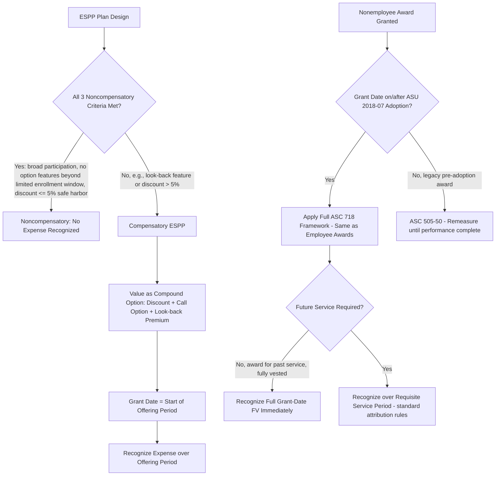

## Employee Stock Purchase Plans and Nonemployee Awards

### Overview

This item covers two distinct extensions of core ASC 718 mechanics: **Employee Stock Purchase Plans (ESPPs)**, which apply special "compensatory vs. noncompensatory" screening tests before ordinary measurement/recognition rules apply, and **nonemployee share-based payments**, which since ASU 2018-07 are measured and recognized under the **same** framework as employee awards — a significant convergence from pre-2019 practice, which had required nonemployee awards to be valued under the (now-superseded) ASC 505-50 framework with materially different mechanics.

---

### Part I: Employee Stock Purchase Plans (ESPPs)

#### Structure

An ESPP allows employees to purchase employer stock, typically through payroll deductions accumulated over an **offering period**, at a discount to market price — commonly with a **look-back feature** that sets the purchase price based on the lower of the stock price at the beginning or end of the offering period.

$$\text{Purchase Price} = (1 - d) \times \min(S_{\text{begin}}, S_{\text{end}})$$

Where $d$ is the discount percentage (commonly 10–15%).

#### The Noncompensatory Plan Test

ASC 718-50-25-1 provides specific criteria that, if **all** are met, allow an ESPP to be classified as **noncompensatory** — meaning **no compensation expense** is recognized at all. All of the following conditions must be satisfied:

1. **Substantively all** eligible employees may participate on an **equitable basis**.
2. The plan incorporates **no option features** other than:
   - Employees have a limited time (generally no more than 31 days) to enroll after the purchase price is fixed, **and**
   - The purchase price is based **solely** on the stock price at the date of purchase (i.e., **no look-back feature**), **or** the discount from market price is **no greater than the amount of a reasonable brokerage commission or transaction fee**.
3. The **discount from market price** does not exceed the greater of:
   - The per-share discount that would reasonably be expected to be a fair discount for issuance costs avoided (transaction cost savings), **or**
   - **5%** of the market price of the shares at purchase date — this **5% safe harbor** is the most commonly relied-upon threshold in practice.

**Key Points**

- A **look-back feature** (purchase price based on the lower of beginning or ending price) **automatically disqualifies** noncompensatory treatment — look-back ESPPs are, by definition, compensatory.
- A discount **greater than 5%** (without demonstrable evidence that it merely reflects avoided issuance costs) disqualifies noncompensatory treatment.
- Because most attractive, widely-adopted ESPPs include both a look-back feature and a discount exceeding 5% (e.g., the common "15% discount with look-back" structure), the **vast majority of ESPPs in practice are compensatory** and require fair value measurement and expense recognition.

#### Compensatory ESPP — Fair Value Measurement

A compensatory ESPP with a look-back feature is, in economic substance, a **compound option** — it combines:

1. A **call option** component (the right to buy at a discount to the ending price), and
2. A component reflecting the **look-back** feature itself (effectively an option on the minimum of the beginning and ending stock prices).

The Black-Scholes model is commonly adapted (or a specialized look-back option pricing formula is used) to value this combined instrument. A frequently used decomposition treats the ESPP as equivalent to a combination of:

- The purchase discount (guaranteed value component), plus
- A call option on the stock, with the option's term equal to the offering period, plus
- (For look-back plans) an additional put-like/look-back component reflecting the benefit of the lower of two prices.

$$FV_{\text{ESPP}} \approx d \times S_{\text{begin}} + (1-d) \times C(S_{\text{begin}}, S_{\text{begin}}, \sigma, r, T, q) + \text{Look-back premium}$$

**Example**

An ESPP offers a 15% discount with a 6-month look-back, offering price fixed at the start. Simplified decomposition:

- Discount component: 15% of beginning stock price = guaranteed minimum value.
- Call option component: a 6-month call option on 85% of a share (since the employee effectively pays 85% of price to receive a full share) valued via Black-Scholes with the offering period as term.
- Look-back component: additional value from the "reset" feature if price declines during the offering period, typically valued as an additional embedded option.

The **grant date** for ESPP fair value measurement purposes is generally the **beginning of the offering period** (when terms, including the number of shares purchasable and price-setting mechanism, are fixed), not the purchase date — this is consistent with the general grant-date principle, though determining the grant date requires confirming the mutual-understanding and enrollment terms are fixed at that point.

**Key Points**

- Multiple sequential or overlapping offering periods within a single "look-back" umbrella plan design (common in practice) each represent separate grants for measurement purposes, each with its own grant-date fair value.
- Expense is recognized over the offering period (the requisite service period), consistent with standard service-condition attribution.

---

### Part II: Nonemployee Share-Based Payment Awards

#### Pre- vs. Post-ASU 2018-07 Framework

Before ASU 2018-07 (effective for most entities in fiscal years beginning after December 15, 2018), nonemployee awards (e.g., to consultants, advisors, non-employee directors in some structures, and certain vendors) were governed by ASC 505-50, which required:

- Measurement at the **earlier of** (a) the date a performance commitment is reached or (b) the date performance is complete, generally **later** than the employee-award grant date.
- Continuous **remeasurement** of the award's fair value at each reporting date until performance was complete (i.e., variable/marked-to-market accounting) — creating significant expense volatility for nonemployee awards relative to employee awards.

ASU 2018-07 **eliminated ASC 505-50** and expanded the scope of ASC 718 to cover **all** share-based payments to nonemployees for goods or services, aligning nonemployee award accounting with employee award accounting:

$$\text{Nonemployee Award Treatment (post-ASU 2018-07)} \equiv \text{Employee Award Treatment}$$

#### Key Convergence Points

- **Grant date fixed measurement**: Nonemployee awards are now measured at **grant date** fair value, fixed and not subsequently remeasured for equity-classified awards — eliminating the prior mark-to-market volatility.
- **Same valuation models**: Black-Scholes, lattice models, and Monte Carlo simulation apply identically based on award features (options, market conditions, etc.).
- **Same expected term guidance**: The contractual term may be used as a practical expedient input to expected term in more circumstances than under the employee framework's simplified method, given nonemployees often lack an ongoing employment relationship pattern comparable to employees.
- **Same vesting condition classification**: Service, performance, and market conditions are classified and treated identically to employee awards.

#### Remaining Distinctions for Nonemployee Awards

- **Classification (equity vs. liability)**: Governed by the same criteria as employee awards under ASC 718 (not ASC 480), a change from pre-ASU 2018-07 practice where liability classification determinations for nonemployees sometimes differed.
- **Attribution period**: If the nonemployee award vests immediately with no future service required (e.g., a fully vested grant to a consultant for past services rendered), the **entire** fair value is recognized **immediately** at grant date, since there is no requisite future service period — this mirrors, but is more commonly encountered in, nonemployee arrangements (e.g., signing bonuses in equity form, consulting engagement completion awards).
- **Scope boundary**: ASU 2018-07 does **not** apply to share-based payments issued to a lender or investor providing financing to the issuer, nor to awards granted in a customer's capacity as a **customer** under ASC 606 (e.g., a customer incentive structured as equity) — those remain outside ASC 718's scope and are evaluated under other guidance (e.g., ASC 606 for customer incentives, or debt/equity guidance for financing-related grants).
- **Nonemployee directors**: Whether a nonemployee director's awards are treated as "employee" or "nonemployee" awards under ASC 718 depends on facts and circumstances of the relationship (e.g., whether the individual is functioning in a manner comparable to an employee for that specific award) — this determination affects primarily disclosure and classification consistency, since post-ASU 2018-07 measurement mechanics converge in substance.

**Key Points**

- The single largest practical change from ASU 2018-07 is the **elimination of ongoing fair value remeasurement** for equity-classified nonemployee awards — a major simplification for companies that previously had to revalue consultant/advisor options quarterly.
- [Inference] Companies transitioning under ASU 2018-07 typically recorded a cumulative-effect adjustment to opening retained earnings for previously-liability-classified nonemployee awards that became equity-classified under the new guidance, reflecting the elimination of the mark-to-market liability.

---

### Diagram: ESPP Compensatory Classification and Nonemployee Award Convergence (svg_diagram)

---

### Common Pitfalls and Practice Notes

- **[Inference]** A frequent error is assuming any ESPP with "just a discount and no look-back" is automatically noncompensatory — the 5% safe harbor threshold must still be checked; a 10% flat discount ESPP without a look-back is still compensatory because it exceeds the 5% safe harbor (absent documented evidence the excess reflects avoided issuance costs).
- Misidentifying the ESPP grant date as the purchase date (end of offering period) rather than the beginning of the offering period, which materially changes the stock price input used in the option-pricing model.
- For legacy nonemployee awards granted before ASU 2018-07 adoption but not yet vested at the adoption date, entities needed to apply specific transition guidance (generally, awards not yet vested continue under prior guidance for accumulated measurement or transition to the new framework per the ASU's specific transition provisions) — [Unverified] transition mechanics for such "in-flight" awards should be confirmed against the specific transition guidance applicable to the entity's adoption date, as treatment can depend on precise vesting status at transition.
- Overlooking the customer-incentive scope exception can lead to erroneously applying ASC 718 to equity issued to a customer, when ASC 606 principal-agent and consideration-payable-to-a-customer guidance should govern instead.

**Related Topics**

- Grant-date fair value measurement (compound option valuation techniques for ESPPs)
- Vesting conditions and expense recognition (attribution mechanics applied to nonemployee awards)
- Modifications, cancellations, and settlements (applicability to nonemployee award changes)
- ASC 606 revenue recognition interaction with customer equity incentives
- Liability vs. equity classification criteria (ASC 718-10-25) as applied to nonemployee grants
- International equivalents: IFRS 2 nonemployee/nonstaff share-based payment scope (goods/services from non-employees)