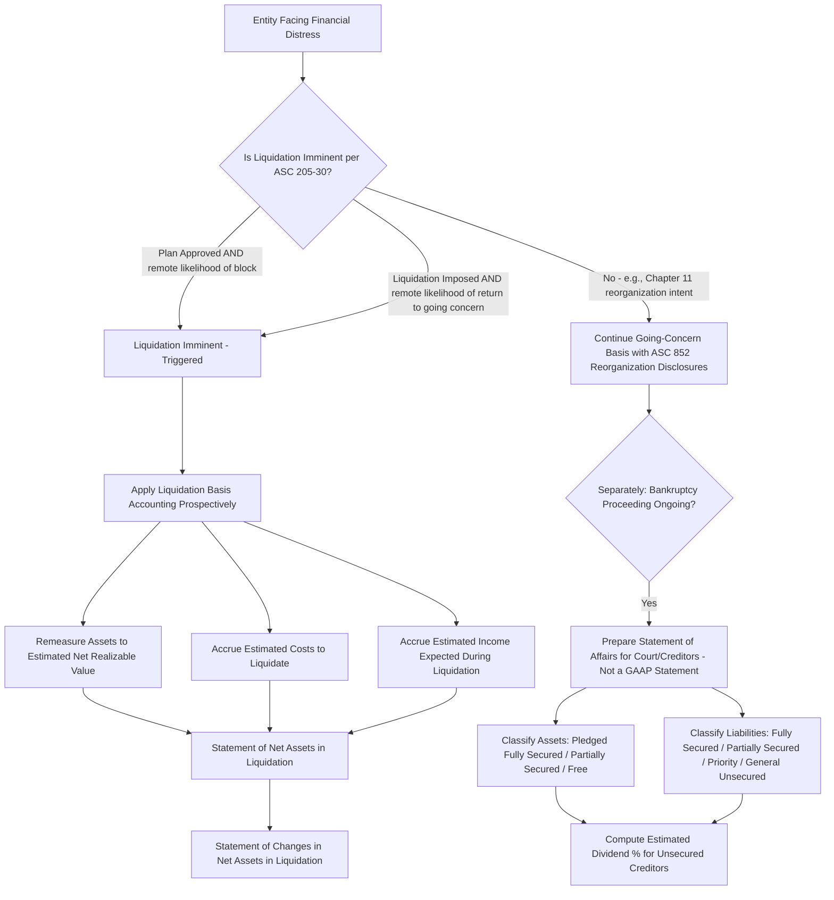

## Statement of Affairs and Liquidation Basis Accounting

### Overview

When an entity's liquidation becomes **imminent**, financial reporting shifts from the going-concern framework to a fundamentally different objective: reporting what stakeholders can expect to **realize and receive** in liquidation, rather than reporting results of continuing operations. Two related but distinct constructs serve this purpose: the **Statement of Affairs** (a legal/practical liquidation-planning tool, historically central to bankruptcy practice and CPA exam coverage) and **liquidation basis accounting** under **ASC 205-30** (the authoritative U.S. GAAP financial reporting framework triggered once liquidation is imminent).

---

### Part I: The Statement of Affairs

#### Purpose and Context

The Statement of Affairs is a specialized report — not a GAAP financial statement — prepared to estimate amounts available to satisfy each class of claim in a liquidation, typically prepared by a trustee, receiver, or the debtor in a Chapter 7 bankruptcy proceeding (liquidation) or informal insolvency. It reorganizes the balance sheet from a "cost/going concern" orientation to a "**realizable value and priority of claims**" orientation.

#### Structure: Assets Side

Assets are classified based on their availability to satisfy specific creditor classes:

- **Assets pledged with fully secured creditors**: Estimated realizable value fully covers (equals or exceeds) the related secured claim.
- **Assets pledged with partially secured creditors**: Estimated realizable value is **less than** the related secured claim — the shortfall becomes an unsecured claim.
- **Free assets**: Unpledged assets, available to satisfy unsecured creditors (after priority claims) — this includes any excess from fully secured assets beyond the secured claim they support.

$$\text{Net Free Assets} = \text{Free Assets (at realizable value)} + \text{Excess from Fully Secured Assets} - \text{Liabilities with Priority}$$

#### Structure: Liabilities Side

Liabilities are classified by legal priority under bankruptcy law (in the U.S., per the priority scheme in the Bankruptcy Code, §507):

1. **Fully secured creditors**: Claim fully covered by pledged asset realizable value.
2. **Partially secured creditors**: Claim exceeds pledged asset realizable value; the unsecured shortfall moves to the unsecured category.
3. **Liabilities with priority** (unsecured but legally preferred): Administrative expenses, certain wage claims (up to statutory limits), certain employee benefit plan contributions, certain tax claims — paid **before** general unsecured creditors from free assets.
4. **General unsecured creditors**: Paid pro rata from remaining net free assets.

#### The Estimated Dividend / Recovery Percentage

The central output of the Statement of Affairs is the **estimated recovery rate** for unsecured creditors:

$$\text{Estimated Dividend \%} = \frac{\text{Net Free Assets Available for Unsecured Creditors}}{\text{Total Unsecured Claims (including shortfalls from partially secured creditors)}}$$

**Example**

A company in liquidation has:

- Assets pledged to Creditor A (secured claim $200,000): estimated realizable value $250,000 → $50,000 excess flows to free assets.
- Assets pledged to Creditor B (secured claim $180,000): estimated realizable value $120,000 → $60,000 shortfall becomes unsecured.
- Free (unpledged) assets: estimated realizable value $300,000.
- Liabilities with priority (trustee fees, wages): $40,000.
- General unsecured creditors (excluding Creditor B's shortfall): $400,000.

$$\text{Net Free Assets} = \$300,000 + \$50,000 - \$40,000 = \$310,000$$

$$\text{Total Unsecured Claims} = \$400,000 + \$60,000 \text{ (Creditor B shortfall)} = \$460,000$$

$$\text{Estimated Dividend \%} = \frac{\$310,000}{\$460,000} = 67.4\%$$

Creditor B, as a partially secured creditor, would recover the full $120,000 from pledged assets **plus** 67.4% of the $60,000 shortfall (≈ $40,435) as an unsecured claimant, for total recovery of approximately $160,435 — illustrating that partially secured creditors participate in both the secured and unsecured recovery pools.

#### Statement of Realization and Liquidation

A companion report — the **Statement of Realization and Liquidation** — tracks actual activity during the liquidation period (assets realized, liabilities liquidated, supplementary charges/credits such as ongoing operating costs or newly discovered assets/liabilities), serving as a **stewardship report** to creditors and the court on the trustee's actual performance versus the Statement of Affairs' original estimates.

**Key Points**

- The Statement of Affairs is a **planning and disclosure tool**, not a substitute for or component of GAAP financial statements — it does not appear in liquidation basis financial statements themselves but is commonly required in bankruptcy court filings and creditor communications.
- Estimated realizable values in the Statement of Affairs should reflect **expected net proceeds from an orderly (or, if applicable, forced) sale**, net of estimated costs to sell — conceptually consistent with the "net realizable value" orientation also used in liquidation basis GAAP accounting (Part II below).

---

### Part II: Liquidation Basis Accounting (ASC 205-30)

#### Trigger: "Imminent" Liquidation

ASC 205-30 requires an entity to prepare financial statements using the liquidation basis of accounting when liquidation is **imminent**. Liquidation is deemed imminent when **either**:

(a) A plan for liquidation has been **approved** by the person(s) with the authority to make such a plan effective, and the likelihood is **remote** that the execution of the plan will be blocked by other parties (e.g., shareholders, if their approval is needed and not yet obtained but expected as a formality), **or**

(b) A plan for liquidation is **being imposed** by other forces (e.g., an involuntary bankruptcy filing) and the likelihood is **remote** that the entity will return from liquidation (e.g., the possibility of emerging from Chapter 7 as a going concern is remote — as opposed to a Chapter 11 reorganization, where going-concern continuation is generally still the intent, and liquidation basis would **not** typically apply unless reorganization itself contemplates liquidation).

**Key Points**

- Filing a bankruptcy petition **does not automatically** trigger liquidation basis accounting — a Chapter 11 reorganization filed with intent to continue as a going concern generally continues to use going-concern GAAP (with substantial incremental disclosures under **ASC 852**, discussed as a related topic).
- The imminence threshold is **remote likelihood of return** — a high bar, meaning liquidation basis is not triggered merely because liquidation is a *possible* or even *likely* outcome; it must be essentially a foregone, approved, or imposed conclusion.
- Once triggered, liquidation basis accounting applies prospectively from the date imminence is established — no retrospective restatement of prior period financial statements is required.

#### Measurement Principles Under Liquidation Basis

Once liquidation basis accounting applies, the balance sheet fundamentally changes in orientation and the income statement is effectively replaced:

- **Assets**: Measured at the estimated **net realizable value** — the amount of cash (or other consideration) the entity expects to collect in carrying out the liquidation, including consideration of the expected manner of liquidation (e.g., orderly sale vs. forced sale) and the associated timeframe.
- **Liabilities**: Recognized in accordance with existing GAAP for liability recognition, but the entity must also accrue **any additional expected costs and income** it expects to incur/earn through the end of liquidation that would not otherwise be recognized under normal GAAP absent the liquidation context (e.g., estimated future payroll, professional fees, and incremental costs of winding down operations, plus any income expected to be earned, such as interest on invested cash, during the liquidation period).
- **New line item — accrued liquidation costs**: A liability (or contra-asset, depending on presentation) is recognized for the estimated costs to be incurred to liquidate the entity to the extent that they can be reasonably estimated, including compensation for professionals and other costs directly associated with the liquidation.

$$\text{Net Assets in Liquidation} = \text{Assets at NRV} - \text{Liabilities (existing + estimated liquidation costs)}$$

#### Required Financial Statements Under Liquidation Basis

- **Statement of Net Assets in Liquidation**: Replaces the balance sheet; presents assets at estimated net realizable value and liabilities (including accrued liquidation costs), with the residual as "net assets in liquidation" — there is no separate equity section broken into components (common stock, APIC, retained earnings) as would exist under going-concern presentation.
- **Statement of Changes in Net Assets in Liquidation**: Replaces the income statement and statement of changes in equity/retained earnings; reconciles the change in net assets in liquidation over the period, showing the effects of remeasurements to net realizable value, accrued costs, and cash received/disbursed.

**Key Points**

- Liquidation basis financial statements **do not present a classified balance sheet** (current vs. noncurrent distinctions become largely irrelevant to the liquidation objective) and do not present an income statement in the traditional sense.
- Disclosures required include the plan for liquidation, the methods and significant assumptions used to measure assets and liabilities at net realizable value, the expected duration of the liquidation process, and the amount of estimated liquidation costs.
- Once an entity begins applying the liquidation basis, it does not later revert to going-concern presentation for the same reporting entity's historical financial statements — liquidation basis continues through the completion of liquidation.

---

### Comparative Framework: Statement of Affairs vs. Liquidation Basis GAAP

| Attribute | Statement of Affairs | Liquidation Basis Accounting (ASC 205-30) |
| --- | --- | --- |
| Authority | Bankruptcy/insolvency practice convention; not GAAP | Authoritative U.S. GAAP |
| Trigger | Insolvency proceeding or informal liquidation planning | "Imminent" liquidation per ASC 205-30 criteria |
| Primary Audience | Court, trustee, creditors | General purpose financial statement users |
| Orientation | Priority of claims and estimated creditor recovery % | Net assets available to equity/residual claimants after all liabilities |
| Core Output | Estimated dividend percentage by creditor class | Statement of Net Assets in Liquidation |
| Classifies Assets By | Pledge status (secured/partially secured/free) | Realizable value alone; no pledge-based classification |

---

### Diagram: Liquidation Basis Trigger and Reporting Path (svg_diagram)

---

### Common Pitfalls and Practice Notes

- **[Inference]** A frequent conceptual error is assuming any bankruptcy filing (including Chapter 11) triggers liquidation basis accounting — the imminence test is specifically about liquidation intent/inevitability, and most Chapter 11 filers continue going-concern reporting (with ASC 852 disclosures) throughout reorganization proceedings.
- Confusing the Statement of Affairs (a claims-priority planning document) with the GAAP-required Statement of Net Assets in Liquidation — they serve different audiences, use different asset classification logic (pledge status vs. pure realizable value), and one is not a substitute for the other.
- Understating accrued liquidation costs by focusing only on costs to sell specific assets while omitting overall wind-down costs (e.g., ongoing minimal payroll, D&O insurance tail coverage, professional fees through dissolution).
- Applying a classified balance sheet or traditional multi-step income statement format to liquidation basis financial statements is inconsistent with ASC 205-30's presentation requirements.
- Overlooking that partially secured creditors participate **twice** in recovery calculations (once via the secured asset realization, once via the pro rata unsecured pool for the shortfall) when computing the Statement of Affairs' overall unsecured recovery percentage.

**Related Topics**

- ASC 852 (Reorganizations) — going-concern disclosures during Chapter 11 proceedings, fresh-start reporting
- Fresh-start accounting upon emergence from bankruptcy
- Priority of claims under the U.S. Bankruptcy Code (§507) in greater depth
- Troubled debt restructurings (TDRs) and creditor accounting for impaired receivables
- Statement of realization and liquidation — detailed trustee stewardship reporting mechanics
- Solvency and going-concern assessment under ASC 205-40 (management's evaluation of substantial doubt, distinct from the liquidation-imminent trigger)