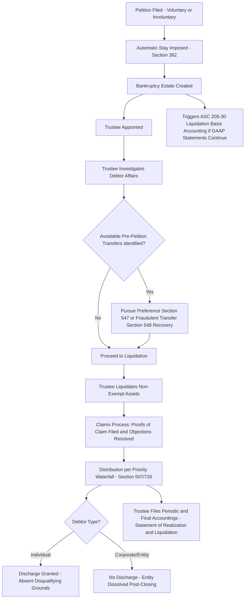

## Chapter 7 Liquidation Proceedings

### Overview

Chapter 7 of the U.S. Bankruptcy Code governs **liquidation** proceedings — the orderly conversion of a debtor's non-exempt assets into cash, distributed to creditors according to statutory priority, followed (for individual debtors) by a discharge of remaining eligible debts. Unlike Chapter 11 (reorganization, going-concern continuation), Chapter 7 contemplates the **cessation of the debtor's business** (for corporate/entity debtors) and is the proceeding that, for accounting purposes, most directly triggers the "imminent liquidation" threshold under **ASC 205-30**, requiring liquidation basis financial reporting.

---

### Filing and Eligibility

#### Voluntary vs. Involuntary Petitions

- **Voluntary petition**: Filed by the debtor itself, commencing the case immediately upon filing.
- **Involuntary petition**: Filed by creditors against the debtor (subject to statutory minimum creditor-count and claim-amount thresholds), requiring a subsequent court determination (an "order for relief") before the case formally commences — the debtor may contest an involuntary filing.

#### Eligible Debtors

Both individuals and business entities (corporations, partnerships, LLCs) may file Chapter 7. Individual debtors are subject to a **means test** (Bankruptcy Code §707(b)) comparing income to state median income and specified expense allowances, which can result in dismissal or conversion to Chapter 13 if the individual appears to have sufficient disposable income to fund a repayment plan — this eligibility screening does not apply to corporate/business entity debtors, which have no analogous "means test" and no discharge of debts upon liquidation (a corporation that liquidates under Chapter 7 typically ceases to exist rather than receiving a discharge, since there is no ongoing entity to benefit from one).

---

### The Automatic Stay

Upon filing (voluntary or upon order for relief for involuntary), Bankruptcy Code §362 imposes an **automatic stay** — an immediate, broad injunction halting virtually all collection actions, lawsuits, foreclosures, and lien enforcement against the debtor and estate property.

**Key Points**

- The stay applies automatically upon filing, without need for a court order — creditors must affirmatively seek "relief from stay" to continue or commence actions against the debtor or estate.
- Certain actions are excepted from the stay (e.g., certain governmental regulatory/police power actions, certain family support obligation actions) per specific statutory carve-outs.
- From an accounting perspective, the automatic stay is a key factor supporting the conclusion that a debtor's liabilities, while not extinguished, become subject to the bankruptcy claims-resolution process rather than ordinary course settlement — informing classification and disclosure.

---

### Creation of the Bankruptcy Estate and Role of the Trustee

Filing creates a **bankruptcy estate**, comprising substantially all of the debtor's legal and equitable interests in property as of the filing date (with specific statutory exclusions and, for individuals, exemptions).

- A **Chapter 7 trustee** is appointed (initially on an interim basis, subject to creditor election rights in some cases) to:
  - Take possession and control of estate property.
  - **Liquidate** (sell) non-exempt assets, maximizing value for creditors.
  - Investigate the debtor's financial affairs, including potential **avoidance actions** (see below).
  - Object to improper claims and administer distributions to creditors per statutory priority.
  - File required reports, including the accounting analogous to the Statement of Affairs / Statement of Realization and Liquidation for the estate's administration.

#### Trustee Avoidance Powers

The trustee has statutory authority to **unwind certain pre-petition transfers** that improperly depleted the estate to the detriment of creditors:

- **Preferential transfers** (§547): Transfers made to a creditor within 90 days before filing (or one year for insiders) on account of an antecedent debt, made while the debtor was insolvent, that allowed the creditor to receive more than it would have in a Chapter 7 liquidation — such transfers can generally be avoided (clawed back) and returned to the estate, subject to statutory defenses (e.g., ordinary course of business, contemporaneous exchange for new value).
- **Fraudulent transfers** (§548): Transfers made with actual intent to hinder, delay, or defraud creditors, or transfers made for less than reasonably equivalent value while the debtor was insolvent (or rendered insolvent) — avoidable, generally with a longer look-back period than preferences (2 years under §548, though state fraudulent transfer law incorporated via §544(b) may extend this further, often to 4+ years depending on the state).

$$\text{Insolvency Test (Balance Sheet)} = \text{Fair Value of Assets} < \text{Total Liabilities}$$

**Key Points**

- Insolvency for preference and fraudulent transfer purposes is generally presumed for the 90-day preference look-back period (rebuttable presumption), but must be affirmatively proven for periods outside that window and for fraudulent transfer claims.
- [Inference] Forensic accountants are frequently engaged to reconstruct the debtor's balance sheet at the transfer date(s) to support or rebut insolvency assertions in preference/fraudulent transfer litigation — this is a significant intersection point between Chapter 7 practice and forensic accounting engagements.

---

### Priority of Distribution (Bankruptcy Code §507 and §726)

Once assets are liquidated, proceeds are distributed according to a strict statutory priority waterfall (each class must be paid in full before the next class receives anything, subject to pro rata sharing within a class if funds are insufficient to pay that class in full):

1. **Secured creditors** (paid first from proceeds of their specific collateral, to the extent of collateral value; unsecured deficiency joins general unsecured class).
2. **Administrative expenses** (§503(b)) — costs of preserving/administering the estate, including trustee fees and professional fees.
3. **Involuntary gap-period claims** (for involuntary cases, ordinary-course claims arising between filing and order for relief).
4. **Wage claims** — up to a statutory dollar cap per employee, for wages earned within a specified pre-petition period.
5. **Employee benefit plan contributions** — up to a statutory cap, for a specified pre-petition period.
6. **Certain grain/fishermen claims** (industry-specific priority categories).
7. **Consumer deposit claims** — up to a statutory cap, for goods/services not delivered.
8. **Certain tax claims** — specified pre-petition tax obligations.
9. **General unsecured creditors** — pro rata from remaining funds.
10. **Subordinated claims / equity interests** — equity holders receive residual value only if all creditor classes are paid in full (rare in Chapter 7 liquidations of insolvent entities).

**Key Points**

- This priority scheme is the statutory foundation underlying the **Statement of Affairs'** classification of "liabilities with priority" versus general unsecured claims.
- Dollar caps on wage, benefit, and consumer deposit priority claims are subject to periodic statutory adjustment; exact current amounts should be verified against the current Bankruptcy Code provisions for the relevant filing date, as amounts are adjusted periodically.

---

### Claims Process

- Creditors file **proofs of claim** by a court-set bar date, establishing the amount and priority/security status asserted.
- The trustee (or other parties in interest) may **object to claims**, requiring court resolution of disputed amounts, validity, or priority.
- Secured creditors may seek relief from the automatic stay to foreclose on collateral directly, or may allow the trustee to liquidate the collateral and remit proceeds up to the secured claim amount.

---

### Discharge (Individual Debtors) and Dissolution (Entities)

- **Individual debtors**: Upon completion of the case (and absent grounds for denial, such as fraud or failure to complete required credit counseling/financial management courses), the individual receives a **discharge**, releasing them from personal liability for most pre-petition debts (certain debts, such as many tax obligations, domestic support obligations, and student loans absent undue hardship, are generally non-dischargeable).
- **Corporate/entity debtors**: Chapter 7 liquidation of a corporation does **not** result in a discharge — the entity simply ceases operations, its assets are liquidated and distributed, and the corporate shell is typically dissolved under applicable state law after the bankruptcy case closes, since there is no continuing entity for a discharge to benefit.

---

### Accounting and Financial Reporting Interface

- Filing (or the point at which liquidation becomes imminent, which for many Chapter 7 filings coincides closely with the filing date itself since Chapter 7 by definition contemplates liquidation) triggers **ASC 205-30 liquidation basis accounting** for the debtor's own financial statements, if the entity continues to prepare GAAP financial statements during the proceeding (in practice, many small/mid-size Chapter 7 debtors cease preparing formal GAAP financial statements altogether once the trustee takes control, with the trustee's own estate accounting — Statement of Affairs and Statement of Realization and Liquidation — serving as the operative financial reporting mechanism for the estate).
- The trustee's periodic reports to the court and creditors (e.g., interim and final accountings) serve functions analogous to, and often incorporate, Statement of Realization and Liquidation concepts — tracking assets realized, expenses of administration, and distributions made against the priority waterfall.

---

### Diagram: Chapter 7 Case Lifecycle (svg_diagram)

---

### Common Pitfalls and Practice Notes

- **[Inference]** A common misconception is that all bankruptcy filings result in a "discharge" — this applies to individual debtors, not corporate entities, which simply cease to exist after Chapter 7 liquidation without a discharge mechanism.
- Confusing the preference look-back period (90 days, or 1 year for insiders) with the fraudulent transfer look-back period (2 years under the Bankruptcy Code itself, potentially longer under state law incorporated via §544(b)) is a frequent error in avoidance-action analysis.
- Assuming secured creditors are unaffected by the bankruptcy process — while their lien rights generally survive, they are still subject to the automatic stay and must seek relief from stay or proceed through the claims process to realize on collateral.
- Overlooking that administrative expense priority (trustee/professional fees) ranks **above** most other unsecured priority categories, meaning a thinly-funded estate can be substantially consumed by administrative costs before wage, tax, or general unsecured creditors receive meaningful recovery — a key driver of low recovery percentages in the Statement of Affairs' dividend calculation.
- Treating Chapter 7 and Chapter 11 as interchangeable for accounting trigger purposes — Chapter 11 filings generally do **not** trigger liquidation basis accounting absent separate evidence that liquidation (rather than reorganization) is the imminent, intended outcome.

**Related Topics**

- Statement of affairs and liquidation basis accounting (direct application of ASC 205-30 in Chapter 7 context)
- Chapter 11 reorganization proceedings and ASC 852 disclosures (contrast with liquidation)
- Fresh-start accounting upon emergence from bankruptcy
- Forensic accounting in preference and fraudulent transfer litigation (insolvency reconstruction, badges of fraud analysis)
- Secured creditor rights and relief from automatic stay proceedings
- Priority of claims under Bankruptcy Code §507 in greater statutory detail