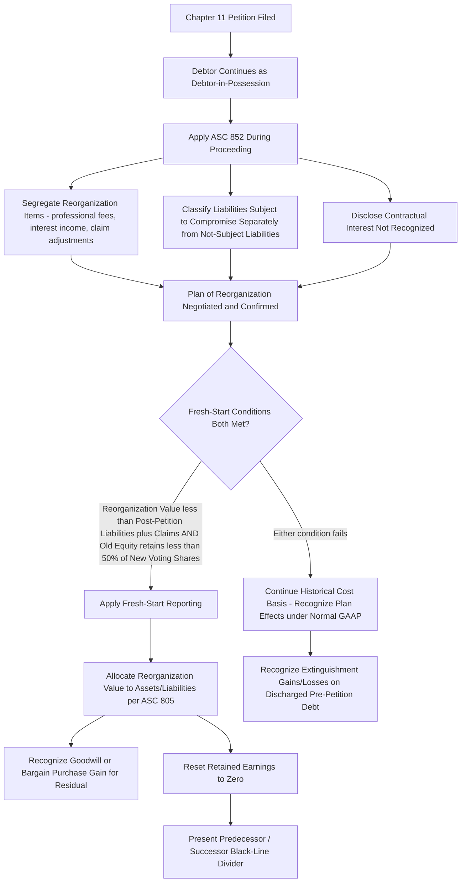

## Chapter 11 Reorganization Accounting

### Overview

Chapter 11 of the Bankruptcy Code provides a framework for a debtor to **reorganize** — restructuring debts, operations, and capital structure — while generally continuing to operate as a **debtor-in-possession (DIP)** and pursuing emergence as a going concern, in contrast to Chapter 7's liquidation orientation. The authoritative accounting guidance governing financial reporting during and upon emergence from Chapter 11 is **ASC 852, *Reorganizations***, which addresses both (1) **ongoing financial reporting during the proceeding** and (2) **fresh-start reporting** upon emergence, when specific conditions are met.

---

### Debtor-in-Possession (DIP) Status and Operational Continuity

Upon filing a Chapter 11 petition, the debtor typically continues to operate its business and manage its assets as a **debtor-in-possession**, retaining the powers and duties of a bankruptcy trustee unless the court orders appointment of a separate trustee (relatively uncommon, typically reserved for cases involving fraud, gross mismanagement, or similar cause).

- The debtor-in-possession has authority, subject to court approval requirements for many transactions, to obtain **DIP financing** (post-petition financing, often with priority "superpriority" liens senior to pre-petition claims, subject to court approval) to fund continued operations.
- Executory contracts and unexpired leases may be **assumed** (continued, with pre-petition defaults cured) or **rejected** (treated as a pre-petition breach, giving rise to an unsecured claim for damages) by the debtor, subject to court approval — a key restructuring tool for shedding unfavorable contracts.

---

### ASC 852: Financial Reporting During Reorganization

#### Segregation of Reorganization Items

The central mechanic of ASC 852 during the pendency of the case is **separately identifying and classifying reorganization items** distinct from the results of ongoing operations, so that financial statement users can distinguish the costs of the bankruptcy process itself from normal business performance.

**Reorganization items** (presented separately, typically as a distinct line item or section in the income statement) include:

- Professional fees directly associated with the reorganization (legal, financial advisory, investment banking fees for the debtor and, in many cases, fees for creditor/equity committees paid by the estate).
- Interest income earned on cash accumulated because of the reorganization (e.g., interest on funds not being used to service pre-petition debt subject to the automatic stay).
- Losses or gains from the sale of assets or settlement of pre-petition liabilities that are directly attributable to the reorganization process.
- Provisions for losses expected to result from the reorganization (e.g., adjustments to claims estimates).
- Certain adjustments to record pre-petition liabilities at the amounts expected to be allowed as claims (see below).

**Key Points**

- Contractual interest expense on pre-petition debt that would ordinarily accrue is generally **not** recognized in the income statement if it is not expected to be paid (i.e., if the plan is expected to result in a discharge or compromise of that interest) — the amount of contractual interest **not** being recognized must be **disclosed** (often in the notes or on the face of the income statement), even though it is not accrued as expense.

$$\text{Reported Interest Expense} = \text{Contractual Interest} - \text{Interest Not Expected to Be Recognized (disclosed separately)}$$

#### Balance Sheet Classification: Liabilities Subject to Compromise

A defining balance sheet feature during Chapter 11 is the separate classification of **"liabilities subject to compromise"** — pre-petition liabilities that may be affected by the plan of reorganization (i.e., subject to potential impairment, modification, or discharge under the plan).

- Liabilities subject to compromise are presented as a **separate line item**, distinguished from liabilities **not** subject to compromise (e.g., fully secured liabilities with adequate collateral protection where the automatic stay and plan are not expected to impair the creditor's recovery, and post-petition liabilities, which are ordinary-course obligations of the estate/DIP and are **not** subject to compromise).
- These liabilities are generally recorded at the **amount expected to be allowed** as a claim, even if this differs from the pre-petition carrying amount (e.g., if a claim is expected to be settled or allowed at a different amount than the recorded pre-petition liability, an adjustment is recognized, generally as a reorganization item).

$$\text{Balance Sheet Presentation:} \quad \text{Liabilities} = \underbrace{\text{Liabilities Not Subject to Compromise}}_{\text{post-petition + unimpaired}} + \underbrace{\text{Liabilities Subject to Compromise}}_{\text{pre-petition, potentially impaired}}$$

**Example**

A debtor has $50 million of pre-petition unsecured bond debt outstanding at filing. The plan of reorganization is expected to compromise this debt, converting bondholders' claims into a combination of new debt and equity valued at approximately $30 million. During the Chapter 11 proceeding (before plan confirmation), the $50 million remains classified as "liabilities subject to compromise" at its allowed claim amount (generally the face/claim amount, not yet written down to the expected settlement value, since the ultimate treatment is not finalized until plan confirmation) — with contractual interest on this debt disclosed but likely not accrued as expense if a compromise of interest is anticipated under the plan.

#### Statement of Cash Flows

Cash flows are classified consistent with the entity's normal operating, investing, and financing classifications, but reorganization items' cash effects should be identified separately (e.g., as a separately captioned line within operating activities, or disclosed) to allow users to isolate the cash impact of the reorganization process itself.

#### Required Disclosures During Reorganization

- The principal categories/circumstances leading to the Chapter 11 filing.
- A description of the reorganization plan status, or if no plan has been filed, the significant matters not yet resolved.
- The amount of pre-petition liabilities subject to compromise, disaggregated by type (e.g., debt, trade payables, accrued liabilities).
- Interest expense recognized versus contractual interest, as noted above.
- Reorganization items disaggregated by significant component (professional fees, interest income, provisions, gains/losses on settled claims, etc.).
- Details of any DIP financing arrangements.

---

### Fresh-Start Reporting Upon Emergence

#### Conditions for Fresh-Start Reporting

Upon emergence from Chapter 11 (plan confirmation and consummation), an entity applies **fresh-start reporting** if **both** of the following conditions are met:

1. The reorganization value of the assets of the emerging entity immediately before the date of confirmation is **less than** the total of all post-petition liabilities and allowed claims, **and**
2. Holders of existing voting shares immediately before confirmation receive **less than 50%** of the voting shares of the emerging entity.

$$\text{Fresh-Start Trigger:} \quad (\text{Reorganization Value} < \text{Post-petition Liabilities} + \text{Allowed Claims}) \ \text{AND} \ (\text{Old Equity Retains} < 50\% \text{ of New Voting Shares})$$

If **either** condition is not met, the entity does **not** apply fresh-start reporting and continues reporting on its historical cost basis, adjusted only for the effects of the plan (e.g., extinguishment gains/losses on discharged debt) under normal GAAP (e.g., ASC 470's debt extinguishment/troubled debt restructuring guidance, as applicable).

#### Mechanics of Fresh-Start Reporting (When Triggered)

When fresh-start reporting applies, the entity is treated, in substance, as a **new reporting entity**:

- **Reorganization value** (conceptually similar to the fair value of the reorganized entity's total assets, typically derived from enterprise value negotiated/determined in the plan confirmation process, e.g., via discounted cash flow analysis, comparable company/transaction analysis) is **allocated to individual assets and liabilities** in conformity with the acquisition method under **ASC 805** (Business Combinations) — essentially applying purchase-price-allocation-style mechanics, even though no external "acquirer" exists in the traditional sense.
- **Goodwill** is recognized for any reorganization value in excess of the amounts allocable to identifiable assets and liabilities at fair value; a bargain purchase-type situation (reorganization value less than net identifiable asset fair value) would similarly follow ASC 805 mechanics (recognized as a gain, per current guidance).
- **Retained earnings/accumulated deficit is reset to zero** — the entity's accumulated historical earnings/deficit history does not carry forward, since it is deemed a new reporting entity from an accounting perspective.
- A **black-line divider** is presented in the financial statements between the **predecessor entity** (pre-emergence) and the **successor entity** (post-emergence), signifying the lack of comparability between the two periods — financial statements for periods prior to fresh-start are labeled "Predecessor," and subsequent periods are labeled "Successor."

$$\text{Successor Entity Opening Balance Sheet} = \text{Reorganization Value Allocated per ASC 805} \ + \ \text{New Capital Structure per Plan}$$

**Example**

A manufacturing company's plan of reorganization is confirmed with a negotiated reorganization value of $180 million. Total post-petition liabilities and allowed claims total $220 million (i.e., reorganization value < total claims, satisfying condition 1). Under the plan, old common shareholders receive only 5% of new equity, with 95% distributed to former bondholders in exchange for their claims (satisfying condition 2, since old equity retains far less than 50%). Fresh-start reporting is triggered: the $180 million reorganization value is allocated to identifiable assets and liabilities at fair value per ASC 805 mechanics, any residual is recorded as goodwill, retained earnings resets to zero, and the successor entity's first balance sheet reflects entirely new bases — with the predecessor's historical financial statements presented separately and clearly delineated as not comparable.

**Key Points**

- Fresh-start reporting is an **all-or-nothing** determination based on the two-part test — there is no partial or elective application.
- The reorganization value determination is often heavily negotiated among stakeholders during plan confirmation and can be a significant source of valuation judgment and potential dispute (e.g., between junior and senior creditor classes, whose recoveries depend directly on the reorganization value used to size the pie).
- [Inference] Because reorganization value drives both the fresh-start trigger test and the subsequent purchase-price-allocation-style balance sheet, disputes over enterprise value in contested plan confirmations often have direct, material downstream financial reporting consequences once the plan is confirmed.

---

### Diagram: Chapter 11 Accounting Lifecycle (svg_diagram)

---

### Common Pitfalls and Practice Notes

- **[Inference]** A frequent error is assuming any bankruptcy filing triggers "liquidation basis" accounting; Chapter 11 with reorganization intent generally continues under the **going-concern** basis with ASC 852 overlays, fundamentally different from ASC 205-30 liquidation basis accounting, which applies only when liquidation itself becomes imminent (including in some Chapter 11 cases that convert to liquidating plans).
- Continuing to accrue full contractual interest expense on debt expected to be compromised, rather than limiting recognized interest expense to the amount expected to be paid and disclosing the unrecognized contractual amount separately.
- Misclassifying a fully secured, unimpaired liability as "subject to compromise" when it should be presented with liabilities not subject to compromise, since the plan is not expected to impair that specific claim.
- Failing to apply the two-part fresh-start test rigorously — sometimes practitioners apply fresh-start reporting based solely on "look and feel" of a significant restructuring without confirming both the reorganization-value-versus-liabilities test and the less-than-50%-old-equity test are independently satisfied.
- Treating fresh-start reporting as optional or as a policy election — it is a **required** outcome once both quantitative/qualitative conditions are met, not a discretionary choice.

**Related Topics**

- Statement of affairs and liquidation basis accounting (contrast with going-concern ASC 852 treatment)
- Chapter 7 liquidation proceedings (contrast in reorganization vs. liquidation intent and accounting trigger)
- Troubled debt restructurings under ASC 470-60 (for entities that restructure debt outside or in conjunction with formal bankruptcy)
- Business combinations and purchase price allocation mechanics under ASC 805 (directly applied in fresh-start reporting)
- Goodwill impairment testing for successor-entity goodwill recognized in fresh-start reporting
- Forensic accounting considerations in contested reorganization value determinations and plan confirmation litigation