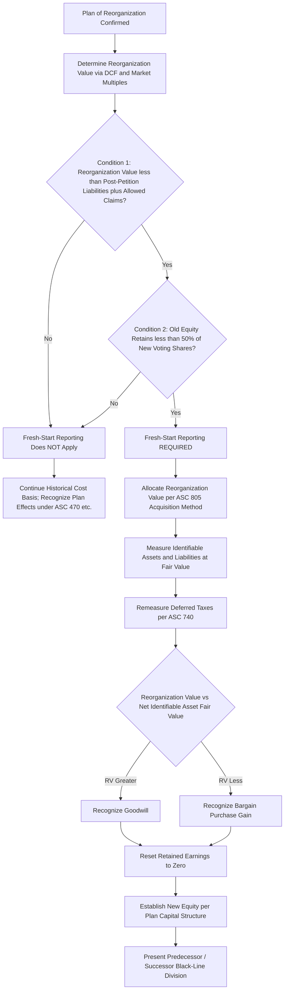

## Fresh-Start Reporting

### Overview

Fresh-start reporting is the accounting mechanism under **ASC 852-10** whereby an entity emerging from Chapter 11 reorganization, upon meeting two specific quantitative/qualitative conditions, is treated as a **new reporting entity** for financial statement purposes. It combines a reset of the entity's historical accounting basis with a purchase-price-allocation-style remeasurement of assets and liabilities, producing a discontinuity between "predecessor" and "successor" financial statements. This item expands on the fresh-start mechanics introduced under Chapter 11 reorganization accounting, with deeper focus on the trigger test, reorganization value determination, and allocation mechanics.

---

### The Two-Part Fresh-Start Trigger Test

Fresh-start reporting is required — not elective — when **both** conditions are satisfied as of the plan confirmation date:

**Condition 1 — Reorganization Value Test**

The reorganization value of the entity's assets immediately before confirmation is **less than** the total of all post-petition liabilities and allowed pre-petition claims.

$$\text{Condition 1:} \quad RV < \text{Post-petition Liabilities} + \text{Allowed Claims}$$

This condition tests whether the enterprise, at its negotiated/determined value, is "insolvent" relative to its total claims — i.e., whether creditors are not being paid in full and some value impairment has genuinely occurred at the enterprise level.

**Condition 2 — Loss of Control Test**

Holders of existing voting shares immediately before confirmation receive **less than 50%** of the voting shares of the emerging (successor) entity.

$$\text{Condition 2:} \quad \text{Old Equity's New Voting Share} < 50\%$$

This condition tests whether there has been a substantive change in control — if old equity retains majority voting control, continuity of ownership argues against treating the entity as new for accounting purposes, even if condition 1 is met.

**Both conditions must be met simultaneously.** If either fails, fresh-start reporting does **not** apply, and the entity continues on its **historical cost basis**, recognizing only the direct accounting effects of the plan itself (e.g., gain/loss on extinguishment of compromised debt under ASC 470, adjustments for settled claims) without a wholesale remeasurement of the balance sheet.

**Key Points**

- This is a bright-line, binary test applied at a single point in time (plan confirmation/effective date) — there is no "partial" fresh-start application.
- A company can be deeply financially distressed and still fail Condition 2 (e.g., if old shareholders negotiate to retain majority equity despite creditor concessions) — in such cases, no fresh-start reporting applies regardless of how severe the reorganization value shortfall was.
- Conversely, a company could satisfy Condition 2 easily (equity wiped out entirely) but technically fail Condition 1 if reorganization value happens to exceed total claims (an unusual but possible fact pattern, e.g., where equity dilution stems from negotiated concessions unrelated to strict enterprise insolvency) — again, both conditions are independently required.

---

### Determining Reorganization Value

Reorganization value is conceptually the **fair value of the entity's assets before considering liabilities** — analogous to enterprise value — as it will exist upon emergence, typically determined during the plan negotiation and disclosure statement process, subject to bankruptcy court approval as part of confirming the plan.

Common valuation methodologies (often triangulated together):

$$RV \approx \text{DCF of Projected Post-Emergence Cash Flows} \ \text{(cross-checked against)} \ \text{Comparable Company/Transaction Multiples}$$

- **Discounted cash flow (DCF)**: Projected post-emergence free cash flows discounted at a weighted average cost of capital reflecting the reorganized entity's anticipated (typically de-levered, lower-risk) capital structure.
- **Guideline public company method**: Applying trading multiples (EV/EBITDA, EV/Revenue) of comparable public companies to the debtor's projected post-emergence financial metrics.
- **Guideline transaction method**: Applying multiples observed in comparable M&A transactions.

**Key Points**

- Reorganization value is negotiated among stakeholders (debtor, creditors' committee, equity committee if one exists) and is frequently the subject of significant **valuation disputes** during plan confirmation — because it directly determines both the fresh-start trigger and the recovery "pie" allocated among claim classes.
- [Inference] Financial advisory and forensic accounting professionals are commonly engaged by competing stakeholder groups (e.g., senior secured creditors seeking a lower reorganization value to argue junior classes are "out of the money," versus junior/equity classes seeking a higher value to argue for recovery) — this valuation contest is a significant area of forensic/expert witness practice in bankruptcy matters.
- The reorganization value used for the fresh-start **trigger test** is generally the same value subsequently allocated to assets and liabilities under the acquisition-method mechanics, once fresh-start is confirmed as applicable.

---

### Allocation Mechanics: Applying ASC 805 Principles

Once fresh-start reporting is triggered, reorganization value is allocated to individual identifiable assets and liabilities following the **acquisition method** framework analogous to ASC 805 (Business Combinations), even though there is no external "accounting acquirer" in the traditional M&A sense — the reorganized entity is treated as if a hypothetical new entity acquired the predecessor's net assets.

#### Allocation Steps

1. **Identify and measure identifiable assets acquired and liabilities assumed** at fair value as of the fresh-start reporting date, following the same recognition and measurement principles as a business combination (e.g., recognizing previously unrecognized intangible assets such as customer relationships, trademarks, or technology, if they meet recognition criteria and are identifiable).
2. **Remeasure deferred tax assets and liabilities** in accordance with existing income tax GAAP (ASC 740) as of the fresh-start date, reflecting the entity's post-emergence tax attributes (noting that NOL carryforwards may be significantly limited or eliminated under tax law provisions triggered by the ownership change inherent in a bankruptcy reorganization).
3. **Recognize goodwill** for the excess of reorganization value over the fair value of identifiable net assets, **or** recognize a bargain purchase gain if identifiable net asset fair value exceeds reorganization value.

$$\text{Goodwill (or Bargain Purchase Gain)} = RV - \sum(\text{FV of Identifiable Assets} - \text{FV of Identifiable Liabilities})$$

4. **Reset accumulated deficit/retained earnings to zero** — since the successor is a new reporting entity, no historical retained earnings or accumulated deficit carries forward.
5. **Establish new equity accounts** reflecting the capital structure issued under the plan (new common stock, new debt instruments, warrants, etc., each measured per applicable GAAP for the instrument type — e.g., ASC 470 for debt, ASC 480/815 for any equity-classified or liability-classified instruments with embedded features).

**Example**

A retailer's plan confirms with a reorganization value of $400 million. Total post-petition liabilities and allowed claims are $500 million (Condition 1 satisfied: RV < claims). Old shareholders receive 2% of new equity (Condition 2 satisfied). Fresh-start allocation:

| Component | Fair Value |
| --- | --- |
| Identifiable tangible assets (inventory, PP&E, etc.) | $310 million |
| Identifiable intangible assets (trademark, customer relationships) | $60 million |
| Identifiable liabilities assumed | ($45 million) |
| **Net identifiable assets** | **$325 million** |
| Reorganization value | $400 million |
| **Goodwill** | **$75 million** |

The successor's opening balance sheet reflects these new asset/liability bases, $75 million of newly recognized goodwill, retained earnings reset to $0, and equity reflecting the new capital structure distributed to creditors and residual old equity holders under the plan.

---

### Predecessor/Successor Reporting and Comparability

- Financial statements for periods **before** the fresh-start date are labeled **"Predecessor"**; financial statements for periods **after** are labeled **"Successor."**
- A **black-line division** is presented between predecessor and successor periods within the same set of comparative financial statements, signaling to users that the successor's financial statements are **not directly comparable** to the predecessor's (different basis of accounting, reset equity, revalued assets, potentially very different capital and cost structures such as depreciation/amortization bases).
- Earnings per share, if presented, restarts for the successor period based on the new share structure — predecessor EPS is not restated or blended with successor EPS.

**Key Points**

- The lack of comparability is a **required emphasis**, not merely a presentational nuance — users (analysts, lenders, investors) must not draw direct period-over-period trend conclusions across the black line without adjustment.
- MD&A and other narrative disclosures typically discuss the fresh-start impacts extensively (e.g., changes in depreciation/amortization expense from revalued PP&E and newly recognized intangibles) to aid users in understanding why successor-period results may look markedly different from predecessor-period results even absent underlying operational changes.

---

### Income Tax Considerations in Fresh-Start Reporting

- Cancellation of indebtedness (COD) income arising from debt discharged in bankruptcy is generally **excluded from taxable income** under IRC §108 (bankruptcy exception), but this exclusion generally requires a corresponding **reduction of tax attributes** (NOL carryforwards, credit carryforwards, asset tax basis) — a significant, technical area often requiring dedicated tax specialist involvement, separate from and layered on top of the GAAP fresh-start mechanics.
- Ownership changes inherent in a Chapter 11 restructuring frequently trigger **IRC §382 limitations**, restricting the annual usable amount of pre-change NOL carryforwards — [Unverified] specific §382 computations and the interaction with bankruptcy-specific relief provisions (e.g., the §382(l)(5) bankruptcy exception, which has its own qualifying conditions and trade-offs) require case-specific tax analysis beyond general GAAP fresh-start mechanics and should be verified against current tax law and the specific plan structure.
- Deferred tax assets/liabilities are remeasured as part of the fresh-start balance sheet, with any resulting valuation allowance assessment performed based on the successor entity's post-emergence facts (e.g., updated projections of future taxable income).

---

### Diagram: Fresh-Start Reporting Decision and Allocation Flow (svg_diagram)

---

### Common Pitfalls and Practice Notes

- **[Inference]** A frequent analytical error is evaluating only one of the two fresh-start conditions and assuming that satisfies the requirement — both the reorganization-value insolvency test and the loss-of-control (less than 50%) test must be independently confirmed; satisfying only one does not trigger fresh-start reporting.
- Treating reorganization value as identical to "total enterprise value" without recognizing it is specifically the value **before** confirmation used for the trigger test, distinguished carefully from the allocated fair values of individual assets determined immediately after in the ASC 805-style allocation.
- Overlooking that predecessor and successor financial statements are **not comparable** and inappropriately computing period-over-period growth rates, trend analyses, or ratio comparisons straight across the black line without qualification.
- Underestimating the tax attribute complexity — assuming COD income exclusion is "free" without recognizing the required attribute reduction (NOL/basis reduction) or potential §382 limitations on any surviving NOLs, which can significantly affect the successor's effective tax rate and deferred tax asset valuation allowance assessment going forward.
- Applying fresh-start mechanics to a company that merely underwent a significant financial restructuring **outside** formal Chapter 11 (e.g., an out-of-court debt exchange) — fresh-start reporting under ASC 852 is specific to Chapter 11 (or comparable formal reorganization proceeding) emergence, not general troubled debt restructurings, which instead follow ASC 470-60.

**Related Topics**

- Chapter 11 reorganization accounting (ASC 852 mechanics during the pendency of the case, preceding fresh-start)
- Business combinations and purchase price allocation under ASC 805 (the direct analog applied in fresh-start allocation)
- Goodwill and intangible asset impairment testing for newly recognized successor-entity goodwill
- Troubled debt restructurings under ASC 470-60 (contrast for out-of-court or non-Chapter 11 restructurings)
- Deferred tax accounting under ASC 740, including valuation allowance assessment post-emergence
- IRC §382 ownership change limitations and the §382(l)(5) bankruptcy exception (tax specialist domain, adjacent to GAAP fresh-start accounting)