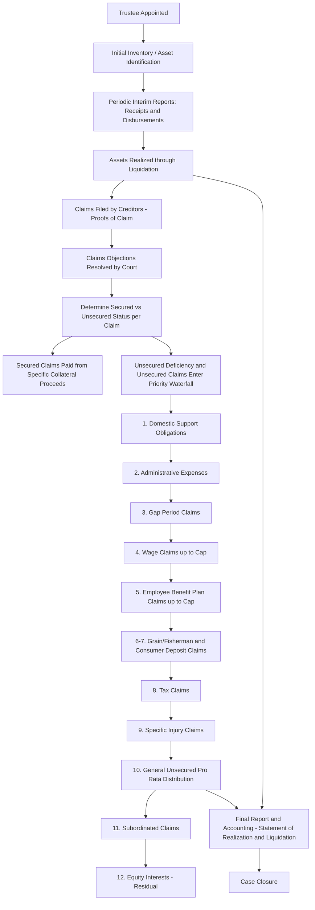

## Trustee Accounting and Creditor Claim Priority

### Overview

This item consolidates two closely linked practice areas that recur throughout bankruptcy engagements: the **specialized accounting and reporting duties of a bankruptcy trustee** administering an estate, and the **statutory priority scheme** governing how estate proceeds are distributed among creditor classes. While the priority waterfall was introduced in the Chapter 7 context, it applies (with case-specific variation) across bankruptcy proceedings generally, and trustee accounting mechanics extend the Statement of Affairs/Statement of Realization and Liquidation concepts into ongoing periodic reporting practice.

---

### Part I: Trustee Accounting Duties and Reports

#### Role and Fiduciary Obligations

A bankruptcy trustee (Chapter 7 trustee, or in some contexts a Chapter 11 trustee where appointed) owes fiduciary duties to the estate and its creditors, requiring:

- Careful **custody and control** over estate assets from appointment through case closure.
- Accurate, timely accounting for all receipts and disbursements.
- Maximization of value for creditors through prudent liquidation, litigation recovery (avoidance actions), and claims administration.

#### Periodic and Interim Reports

Trustees are generally required to file periodic reports with the bankruptcy court (and, depending on jurisdiction and case size, the U.S. Trustee's office) documenting estate activity:

- **Initial report / inventory**: Cataloging estate assets identified upon appointment, often including preliminary estimated values.
- **Interim reports**: Periodic (e.g., quarterly, or per local court rule) summaries of receipts, disbursements, and estate administration activity during the reporting period.
- **Final report and accounting**: A comprehensive summation of all estate activity from appointment through proposed closure, supporting the trustee's request for final compensation approval and case closure, including a full accounting of distributions made per the priority waterfall.

#### The Statement of Realization and Liquidation (Extended)

As introduced in prior coverage, the Statement of Realization and Liquidation is the core periodic/final accounting format, structured to show:

$$\text{Ending Estate Balance} = \text{Beginning Balance} + \text{Assets Realized} - \text{Liabilities Liquidated} \pm \text{Supplementary Items}$$

**Structural components:**

- **Assets to be realized / Assets realized**: Beginning inventory of assets not yet converted to cash, and the actual cash realized from asset dispositions during the period — differences between estimated and actual realization are inherent to the reconciliation.
- **Liabilities to be liquidated / Liabilities liquidated**: Beginning inventory of claims not yet paid, and actual payments made during the period per priority.
- **Supplementary charges**: Items increasing net estate obligations not captured above (e.g., newly discovered liabilities, ongoing administrative costs incurred during the wind-down, professional fees).
- **Supplementary credits**: Items increasing net estate assets not captured above (e.g., newly discovered assets, income earned during administration such as interest on estate cash, favorable litigation recoveries from avoidance actions).

**Key Points**

- This report format functions as a **stewardship accountability tool** — comparing what the trustee estimated (often via an earlier Statement of Affairs) against what was actually achieved, explaining variances.
- Supplementary items are important because initial estimates in a Statement of Affairs are frequently imprecise (asset realizations often differ meaningfully from book value or even initial estimated liquidation value, particularly for specialized assets, litigation claims, or contingent recoveries).

#### Trustee Compensation

Trustee compensation in Chapter 7 cases is generally governed by statutory fee schedules under the Bankruptcy Code (a percentage-based formula applied to amounts disbursed to parties in interest, subject to statutory caps and court approval), while professional advisors engaged by the trustee (attorneys, accountants, financial advisors) typically seek compensation under a "reasonableness" standard subject to detailed fee application and court approval processes — both compensation categories rank as **administrative expenses** in the priority waterfall.

---

### Part II: Creditor Claim Priority — Detailed Framework

#### Foundational Distinction: Secured vs. Unsecured

Before priority ranking applies, claims must first be classified by **security status**:

- **Secured claims**: Backed by a valid, perfected lien on specific estate property; the claim is "secured" only to the extent of the **value of the collateral** — any excess claim amount is bifurcated into an unsecured deficiency claim (per Bankruptcy Code §506(a)).
- **Unsecured claims**: No collateral backing; recovery depends entirely on the priority ranking and pro rata distribution from available (non-collateral) estate assets.

$$\text{Secured Claim Amount} = \min(\text{Collateral Fair Value}, \text{Total Claim}) \quad ; \quad \text{Unsecured Deficiency} = \max(0, \text{Total Claim} - \text{Collateral Fair Value})$$

#### The Statutory Priority Waterfall (Detailed)

Building on the general framework, the detailed statutory order (Bankruptcy Code §§507, 726) for **unsecured** claims (secured claims are satisfied first from their specific collateral, outside this waterfall, before any deficiency joins it) is:

1. **Domestic support obligations** (child support, alimony) — given the **highest** unsecured priority.
2. **Administrative expenses** (§503(b)): Costs of preserving and administering the estate post-petition — trustee fees, professional fees, post-petition trade obligations incurred by the estate in the ordinary course.
3. **Involuntary case "gap" claims**: Ordinary-course unsecured claims arising between the involuntary filing date and the order for relief.
4. **Wage, salary, and commission claims**: Earned within a specified period (statutorily defined, e.g., 180 days) before filing or cessation of business, up to a **per-employee statutory dollar cap**.
5. **Employee benefit plan contribution claims**: For contributions to employee benefit plans arising from services within a specified pre-petition period, up to a statutory cap (coordinated with the wage cap to prevent double-counting).
6. **Grain producer and fisherman claims**: Industry-specific priority claims against grain storage facilities and fish produce storage/processing facilities, up to statutory caps.
7. **Consumer deposit claims**: Individuals who made deposits for goods/services (e.g., layaway, prepaid services) not delivered, up to a statutory per-claimant cap.
8. **Tax claims**: Certain specified pre-petition tax obligations (e.g., income taxes for specified pre-petition periods, certain excise and property taxes) — specific categories and lookback periods are statutorily defined.
9. **Claims for death or personal injury from intoxicated operation of a vehicle/vessel** (a narrow, specific priority category).
10. **General unsecured claims**: All remaining unsecured claims not otherwise granted priority, paid **pro rata** from remaining funds.
11. **Subordinated claims**: Claims contractually or statutorily subordinated (e.g., certain penalty/fine claims, claims subordinated under equitable subordination doctrine for creditor misconduct).
12. **Equity interests**: Residual claimants, paid only if all creditor classes (secured and unsecured, including subordinated) are satisfied in full — rare in insolvent-entity liquidations.

**Key Points**

- Within each priority class, if funds are insufficient to pay that class in full, distribution is **pro rata** among claimants in that class — no claimant within a class receives preferential treatment over another in the same class.
- A class must be paid **100%** before the next lower class receives **any** distribution — this "waterfall" or "absolute priority" structure is foundational to bankruptcy distribution (and closely related to, though procedurally distinct from, the **absolute priority rule** applied in Chapter 11 plan confirmation over dissenting classes).
- Statutory dollar caps (wage claims, benefit plan claims, consumer deposits) are subject to periodic inflation adjustment under the Bankruptcy Code; current caps applicable to a specific filing date should be verified against the then-current statutory amounts.

#### The Absolute Priority Rule (Chapter 11 Context)

Distinct from, but related to, the liquidation priority waterfall, the **absolute priority rule** governs Chapter 11 plan confirmation when a class of claims votes **against** the plan ("cramdown" scenario): a plan cannot be confirmed over a dissenting impaired class unless that class is paid in full, **or** no class junior to it (including equity) receives or retains any property under the plan — reinforcing the same "senior-paid-before-junior" logic in the reorganization-plan-confirmation context, as opposed to a straight liquidation distribution.

**Key Points**

- [Inference] The absolute priority rule is frequently a central point of negotiation leverage in Chapter 11 cases, since junior stakeholders (including existing equity) often seek to negotiate a "gift" or exception from senior classes in exchange for consensual plan support, notwithstanding the strict rule — this dynamic significantly shapes the negotiated reorganization value and recovery allocations referenced in fresh-start reporting analysis.

#### Reconciling to the Statement of Affairs

The priority framework above is the statutory foundation directly underlying the Statement of Affairs' classification of:

- "Liabilities with priority" (categories 1–9 in the detailed list above, when applicable to the specific case), and
- "General unsecured creditors" (category 10) forming the pro rata pool against which the estimated dividend percentage is computed.

$$\text{Statement of Affairs Alignment:} \quad \text{Net Free Assets} = \text{Free Assets} - \sum(\text{Priority Categories 1 through 9})$$

---

### Diagram: Trustee Accounting Cycle and Priority Waterfall (svg_diagram)

---

### Common Pitfalls and Practice Notes

- **[Inference]** A common analytical error is treating all "priority" claims as a single undifferentiated pool rather than recognizing the strict sub-ranking within priority classes (e.g., assuming wage claims and tax claims share equally, when wage claims in fact rank ahead of tax claims in the statutory order).
- Overlooking that secured creditors are satisfied **outside** and **before** the unsecured priority waterfall from their specific collateral — only the unsecured deficiency portion of an under-secured claim enters the general priority scheme.
- Confusing the Chapter 11 **absolute priority rule** (a plan confirmation/cramdown standard) with the Chapter 7 **distribution priority waterfall** (a liquidation distribution mechanic) — related in underlying logic but procedurally and legally distinct concepts applicable in different contexts.
- Failing to net wage and employee benefit plan caps correctly when both apply to the same employee's claims, given the statutory coordination between these two priority categories to prevent a single employee's claim from consuming disproportionate priority capacity.
- In trustee final accountings, omitting supplementary credits (e.g., late-discovered assets, successful avoidance action recoveries) that arose after the original Statement of Affairs estimate, understating the estate's actual performance relative to the stewardship reporting objective.

**Related Topics**

- Statement of affairs and liquidation basis accounting (direct precursor and reconciliation point for priority classification)
- Chapter 7 liquidation proceedings (procedural context in which trustee accounting and priority distribution occur)
- Chapter 11 reorganization accounting and fresh-start reporting (absolute priority rule's role in plan confirmation and reorganization value negotiation)
- Forensic accounting in preference and fraudulent transfer recovery actions (a frequent source of supplementary credits in trustee accountings)
- Secured creditor collateral valuation disputes (§506(a) valuation methodology in contested cases)