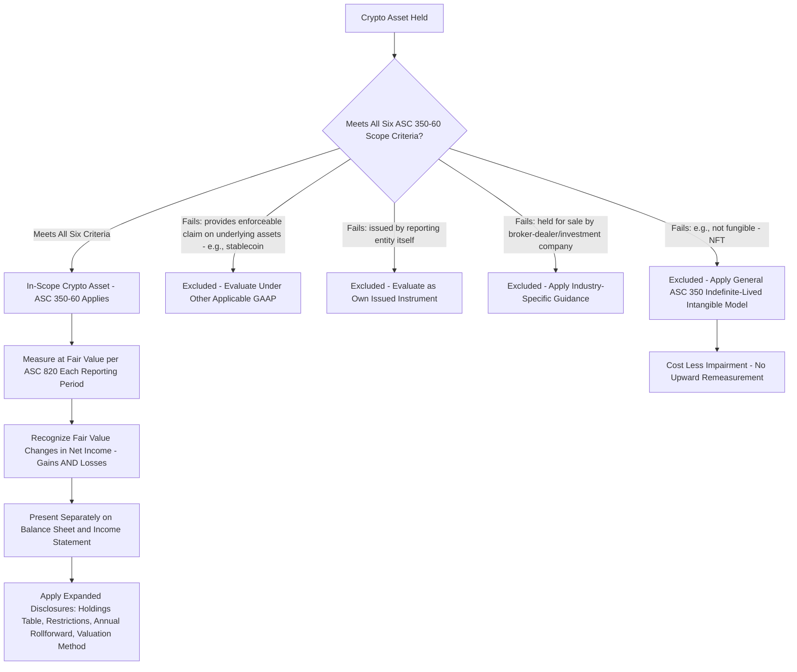

## Scope and Measurement of Crypto Asset Holdings

### Overview

Accounting for crypto assets under U.S. GAAP is governed by **ASC 350-60, *Intangibles—Goodwill and Other—Crypto Assets***, introduced by **ASU 2023-08** (effective for fiscal years beginning after December 15, 2024, with early adoption permitted). This standard represents a fundamental departure from the prior approach, under which crypto assets were analogized to **indefinite-lived intangible assets** under general ASC 350 guidance — measured at cost, tested for impairment, with **no upward remeasurement** permitted even when fair value recovered. ASU 2023-08 replaces that cost-less-impairment model with **fair value measurement through net income** for qualifying crypto assets.

---

### Scope: Which Assets Qualify for ASC 350-60

ASC 350-60 applies only to crypto assets meeting **all** of the following criteria:

1. Meet the definition of an **intangible asset** as defined in the Codification Master Glossary (i.e., lacking physical substance).
2. Do **not** provide the asset holder with enforceable rights to, or claims on, underlying goods, services, or other assets (this **excludes** most asset-backed tokens, tokenized real estate, or tokens representing a claim on an issuer's assets/cash flows).
3. Are created or reside on a **distributed ledger** based on blockchain or similar technology.
4. Are **secured through cryptography**.
5. Are **fungible** (i.e., every unit is interchangeable and identical in specification — this scoping criterion **excludes NFTs**, which are typically unique/non-fungible by design).
6. Are **not created or issued by the reporting entity or its related parties** (excludes an entity's own issued tokens, such as a company's native utility token issued to raise capital or incentivize network participation).

**Key Points**

- **Bitcoin and Ether** are the paradigm examples of in-scope assets — fungible, cryptographically secured, blockchain-native, no embedded claim on an issuer.
- **Stablecoins** backed by and redeemable for fiat currency or other assets are generally **excluded** from ASC 350-60 scope because they typically **do** provide an enforceable right/claim to underlying assets (the redemption backing) — such instruments require separate analysis under other GAAP (e.g., potentially as a financial asset, receivable, or otherwise, depending on structure).
- **NFTs are explicitly excluded** due to the fungibility criterion, and continue to be accounted for as ordinary indefinite-lived intangible assets under general ASC 350 guidance (cost less impairment, no fair value remeasurement).
- **Wrapped tokens, certain governance tokens, and asset-backed tokens** require careful, fact-specific analysis against all six criteria — [Inference] the "enforceable right to underlying assets" criterion is often the most judgment-intensive scoping determination in practice, particularly for tokens with embedded governance or yield-generating features.
- Crypto assets held for sale in the ordinary course of business by a broker-dealer or investment company are scoped out of ASC 350-60 and instead follow existing industry-specific guidance (e.g., ASC 940, ASC 946) that already provides for fair value measurement.

---

### Measurement: Fair Value Through Net Income

For in-scope crypto assets, ASC 350-60 requires measurement at **fair value** as of each reporting date, determined in accordance with **ASC 820** (*Fair Value Measurement*), with changes in fair value recognized in **net income** in each reporting period.

$$\text{Carrying Value}_t = FV_t \quad ; \quad \text{Gain/(Loss) in Net Income}_t = FV_t - FV_{t-1}$$

**Key Points**

- This is a **remeasurement model**, not a cost-less-impairment model — both **increases and decreases** in fair value flow through net income each period, a fundamental reversal of the prior guidance's asymmetric (downside-only) treatment.
- Fair value is determined based on the **principal market** (or most advantageous market, absent a principal market) for the specific crypto asset, consistent with the general ASC 820 hierarchy — for actively traded crypto assets, this is typically the quoted price on the principal exchange without adjustment for blockage factors, aligning with existing fair value measurement conventions for actively traded instruments (i.e., a Level 1 input where the exchange constitutes an active market for the specific unit of account).
- No separate impairment testing is required under ASC 350-60 (the impairment model is superseded for in-scope assets) — the ongoing fair value remeasurement process inherently captures both declines and recoveries.

#### Costs to Acquire Crypto Assets

- Costs incurred to acquire crypto assets (e.g., exchange transaction fees, commissions) are generally **expensed as incurred**, **unless** they qualify for capitalization under other applicable GAAP (e.g., as part of the cost basis under specific other guidance) — the general presumption under ASC 350-60 is that transaction costs do not get added to and carried within the fair-value-remeasured asset balance, since the asset itself is subsequently remeasured to fair value each period regardless of its initial cost basis.

---

### Presentation Requirements

ASC 350-60 introduces specific presentation requirements to enhance transparency around crypto holdings:

- **Balance sheet**: In-scope crypto assets measured at fair value must be presented **separately** from other intangible assets (i.e., not commingled within a general "intangible assets" line item).
- **Income statement**: Gains and losses from remeasuring crypto assets to fair value must be presented **separately** from changes in the carrying amounts of other intangible assets (i.e., a distinct line item or clearly identified within a broader line, rather than buried within general intangible asset amortization/impairment activity).

---

### Disclosure Requirements

ASC 350-60 significantly expands required disclosures relative to the prior cost-less-impairment model, both annually and (for certain disclosures) interim:

- **Significant crypto asset holdings**: Name, cost basis, fair value, and number of units held for each significant crypto asset holding, and the aggregate fair value and cost basis of crypto asset holdings that are not individually significant.
- **Restrictions**: For crypto assets subject to contractual sale restrictions, the fair value of those restricted assets, the nature and remaining duration of the restriction, and circumstances that could cause the restriction to lapse.
- **Rollforward** (annual only): A reconciliation of the opening and closing balances of crypto asset holdings, disaggregating additions (with a description of activity that generated the addition — e.g., purchases, receipt for providing goods/services, receipt through staking rewards), dispositions, and gains/losses.
- **Method for determining fair value**: For crypto assets not measured using a Level 1 quoted price in an active market for identical assets, the fair value measurement method and significant inputs/assumptions.

**Key Points**

- The rollforward disclosure by activity type (e.g., distinguishing "purchases" from "receipt for services rendered" from "staking rewards received") gives users significantly more insight into **why** an entity is accumulating or disposing of crypto assets than the prior guidance's simple cost-less-impairment carrying value disclosure.
- [Inference] Entities engaged in crypto mining or staking operations will find the disaggregated rollforward particularly relevant, since block rewards, transaction fee income, and staking rewards each represent distinct addition categories requiring separate identification and, generally, separate revenue/income recognition analysis outside ASC 350-60 itself (ASC 350-60 governs subsequent measurement of the resulting asset, not the initial recognition/revenue accounting for how the asset was earned).

---

### Statement of Cash Flows Classification

ASC 350-60 does not itself prescribe a specific cash flow statement classification for crypto asset purchases/sales; however, because crypto assets held under this guidance are analogous to other assets held primarily for investment/value-appreciation purposes rather than for use in operations, purchases and sales of crypto assets are generally classified as **investing activities**, consistent with the classification of other long-lived, non-inventory asset transactions — though [Unverified] specific fact patterns (e.g., an entity that regularly transacts in crypto as part of its core, ordinary-course business operations, such as certain crypto-native platforms) may warrant an operating classification instead, and the entity's specific business model should be evaluated against general ASC 230 principles.

---

### Diagram: Crypto Asset Scoping and Measurement Decision Path (svg_diagram)

---

### Common Pitfalls and Practice Notes

- **[Inference]** A common transition-period error is applying ASC 350-60's fair value model to NFTs or asset-backed/stablecoin holdings by analogy — the standard's scope criteria are specific and exclusive; assets failing any one of the six criteria remain under the prior cost-less-impairment intangible asset model or other applicable GAAP entirely.
- Commingling crypto asset fair value gains/losses within a general "other income/expense" line without the required separate presentation, undermining the transparency objective of the standard.
- Overlooking that transaction/acquisition costs are generally expensed as incurred rather than capitalized into the crypto asset's carrying basis — a change in practice for entities previously capitalizing such costs under the prior cost model.
- Failing to disaggregate the annual rollforward by addition/disposition activity type (e.g., lumping "purchases" and "staking rewards received" together), which does not meet the standard's specific disclosure objective.
- Assuming Level 1 quoted-price treatment applies uniformly to all crypto assets — many smaller-cap or less liquid tokens may require Level 2 or Level 3 fair value techniques, with correspondingly more extensive disclosure of methods and inputs.

**Related Topics**

- Revenue recognition for crypto mining, staking rewards, and transaction fee income (ASC 606 interaction, separate from ASC 350-60 measurement)
- Impairment and indefinite-lived intangible asset accounting for out-of-scope assets (NFTs, own-issued tokens)
- Fair value measurement hierarchy and Level 1/2/3 inputs under ASC 820, applied to less liquid crypto assets
- Forensic accounting and tracing techniques for cryptocurrency in fraud investigations and asset recovery
- Digital asset custody, internal controls, and private key management considerations (SOC reporting implications)
- Income tax treatment of cryptocurrency transactions (property characterization, basis tracking, and realization events)