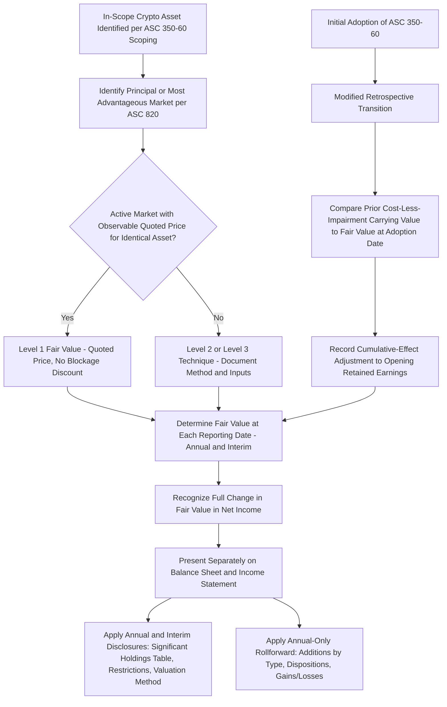

## Fair Value Measurement and Disclosure of Digital Assets

### Overview

This item extends the scope and measurement principles of **ASC 350-60** into deeper focus on the **fair value determination mechanics** under ASC 820 as applied to crypto assets, the **transition method** entities used to adopt the standard, and the **full disclosure package** required on an ongoing basis. Together with the prior item's scoping criteria, this completes the ASC 350-60 measurement and reporting framework.

---

### Fair Value Determination Under ASC 820 for Crypto Assets

#### Unit of Account and Principal Market

Fair value is determined per unit of the crypto asset (e.g., per one bitcoin, per one ether), consistent with how the asset transacts in its principal market.

$$FV_{\text{holding}} = (\text{Quoted Price per Unit in Principal Market}) \times (\text{Number of Units Held})$$

- For actively traded crypto assets with observable quoted prices on one or more exchanges, the entity identifies its **principal market** (the market with the greatest volume and level of activity for the asset that the entity can access) or, absent a clearly identifiable principal market, its **most advantageous market** (the market that maximizes the amount that would be received to sell the asset, net of transaction costs).
- Quoted prices from an active market for identical assets are generally treated as **Level 1** inputs in the ASC 820 fair value hierarchy — consistent with how equity securities traded on an exchange are measured, **without** adjustment for blockage factors (i.e., no discount is applied merely because the entity holds a large quantity relative to daily trading volume).

#### Multiple Exchanges and Price Dispersion

Because crypto assets often trade simultaneously across numerous exchanges (which may show modestly different prices due to liquidity, geographic, or regulatory fragmentation), entities must apply judgment in selecting the principal market consistently:

- The selection should reflect the market with the **greatest volume and activity level** that the entity can **transact in** — not necessarily the exchange with the single highest quoted price.
- Once identified, the principal market should be used **consistently** period-over-period unless facts and circumstances change (e.g., the entity's access to markets changes, or trading volume patterns shift meaningfully).

**Key Points**

- [Inference] In practice, many entities use a reputable price aggregation index or a specific high-volume exchange (e.g., Coinbase for bitcoin, for U.S.-based entities) as a practical proxy for the principal market determination, provided the selected source is well-documented and consistently applied — though the specific market/source used should be supportable under the entity's own ASC 820 analysis rather than assumed by convention.
- For crypto assets that are less liquid, thinly traded, or held in quantities that could affect price if sold (though again, without a blockage discount under Level 1 conventions), a **Level 2 or Level 3** fair value technique may be necessary, particularly where no single active market provides a reliable, observable quoted price.

---

### Recognizing Fair Value Changes in Net Income

Once fair value is determined at each reporting date, the entity records the full change (favorable or unfavorable) directly to net income:

$$\text{Journal Entry (Increase in FV):} \quad \text{Dr. Crypto Asset (FV)} \quad / \quad \text{Cr. Unrealized Gain on Crypto Assets (Net Income)}$$

$$\text{Journal Entry (Decrease in FV):} \quad \text{Dr. Unrealized Loss on Crypto Assets (Net Income)} \quad / \quad \text{Cr. Crypto Asset (FV)}$$

**Example**

An entity holds 100 units of a crypto asset acquired at $40,000 per unit ($4,000,000 cost basis). At the current reporting date, the quoted price on the entity's identified principal market is $52,000 per unit.

$$FV_{\text{current}} = 100 \times \$52,000 = \$5,200,000$$

$$\text{Unrealized Gain Recognized in Net Income} = \$5,200,000 - \$4,000,000 \text{(or prior period FV, if later than acquisition)} = \$1,200,000$$

If the price subsequently declines to $45,000 per unit in the next reporting period, the entity recognizes an unrealized **loss** of $700,000 ([100 × $45,000] − $5,200,000), flowing through net income in that period — in contrast to the prior cost-less-impairment model, under which only declines below the original cost basis (or below the lowest previously impaired carrying value) would have been recognized, and recoveries would never have been reflected.

---

### Transition: Modified Retrospective Adoption

Entities adopting ASC 350-60 apply a **modified retrospective transition method**, recording a **cumulative-effect adjustment** to the opening balance of retained earnings as of the beginning of the fiscal year of adoption (not restating prior comparative period financial statements).

$$\text{Cumulative-Effect Adjustment} = FV_{\text{crypto assets, beginning of adoption year}} - \text{Carrying Value under Prior Cost-Less-Impairment Model}$$

**Example**

An entity holds crypto assets with a cost-less-impairment carrying value of $2,000,000 as of the beginning of its fiscal year of adoption (having recognized cumulative impairment losses of $500,000 against an original $2,500,000 cost basis in prior periods, with no subsequent write-ups permitted under the old model despite price recovery). Fair value of those same holdings as of that same date is $3,800,000. Upon adoption:

$$\text{Cumulative-Effect Adjustment} = \$3,800,000 - \$2,000,000 = \$1,800,000 \text{ increase to opening retained earnings}$$

This adjustment is recorded directly to opening retained earnings (not through net income of the adoption-year comparative period), and the crypto asset's carrying value is reset to its $3,800,000 fair value as the new basis going forward under the fair value remeasurement model.

**Key Points**

- Entities with **no crypto asset holdings** prior to first acquiring them in (or after) the period of adoption may have no cumulative-effect adjustment to record, since there is no pre-adoption carrying value under the old model to reconcile — the asset is simply recognized and measured under the new model from initial acquisition forward.
- Early adoption is permitted and was elected by a number of entities in interim/annual periods before the mandatory effective date (fiscal years beginning after December 15, 2024), reflecting the generally favorable reception of the fair value model relative to the prior cost-less-impairment approach among crypto-holding entities (whose disclosed carrying values were often perceived by users as significantly understated relative to actual economic value in a rising-price environment).

---

### Comprehensive Disclosure Package (Detailed)

#### Annual and Interim Disclosures

- **Significant individual holdings table**: For each significant crypto asset holding — name of the crypto asset, cost basis, fair value, and number of units held.
- **Aggregate non-significant holdings**: Aggregate cost basis and aggregate fair value for crypto asset holdings that are not individually significant, presented in the aggregate rather than itemized.
- **Restrictions disclosure**: If crypto assets are subject to contractual sale restrictions (e.g., lock-up provisions, vesting-like restrictions from certain acquisition structures, or collateral pledges limiting sale), disclose the fair value of restricted assets, the nature and remaining duration of the restriction(s), and the circumstances that could cause the restriction(s) to lapse.
- **Valuation methodology**: For crypto assets not measured using a Level 1 quoted price for identical assets in an active market, disclose the fair value measurement technique(s) and significant inputs/assumptions used (consistent with broader ASC 820 fair value disclosure principles for Level 2/3 measurements).

#### Annual-Only Disclosure: The Rollforward

A reconciliation of the beginning and ending balances of crypto asset holdings for the annual period, disaggregating:

- **Additions**, by type of activity that generated them (e.g., purchases, receipt in exchange for providing goods or services, receipt from staking/mining/block reward activity).
- **Dispositions**, including gains/losses realized upon disposition (distinguished from unrealized fair value changes on assets still held).
- **Gains and losses** included in net income for the period (both realized and unrealized components).

$$\text{Rollforward Identity:} \quad \text{Ending FV Balance} = \text{Beginning FV Balance} + \text{Additions (by type)} - \text{Dispositions} \pm \text{Net Gains/(Losses)}$$

**Key Points**

- The rollforward's disaggregation by addition **type** is a distinctive feature relative to typical rollforward disclosures elsewhere in GAAP (e.g., PP&E rollforwards do not typically require this granularity of source-of-addition detail) — reflecting the FASB's specific interest in helping users understand **how** an entity is accumulating crypto assets (organic business activity like mining/staking versus discretionary treasury purchases).
- Because gains/losses on crypto assets flow through net income each period (not OCI), the rollforward's gain/loss disaggregation ties directly and transparently to the income statement's separately-presented crypto remeasurement line.

---

### Interaction with Interim Reporting

- The fair value measurement and net income recognition requirements apply at **each interim reporting period**, not merely annually — meaning quarterly (or other interim) financial statements for public business entities must reflect current fair value with the corresponding gain/loss in interim net income.
- The **holdings table, restrictions, and valuation methodology disclosures** apply to interim periods as well as annual periods; the **rollforward** disclosure is required **annually only**, reducing interim reporting burden for that specific disaggregated schedule.

---

### Diagram: Fair Value Measurement, Recognition, and Disclosure Cycle (svg_diagram)

---

### Common Pitfalls and Practice Notes

- **[Inference]** A common transition error is recording the cumulative-effect adjustment through the adoption-year's net income rather than directly to opening retained earnings — the modified retrospective method specifically bypasses net income for the catch-up adjustment, recognizing it as a direct equity adjustment as of the beginning of the adoption period.
- Applying a blockage factor discount to a large crypto asset holding measured at a Level 1 quoted price — consistent with other Level 1 financial instruments, no such discount is permitted regardless of holding size relative to daily trading volume.
- Selecting an inconsistent principal market from period to period (e.g., choosing whichever exchange shows the most favorable price in a given quarter) rather than applying a consistently documented principal-market determination methodology.
- Omitting the annual rollforward's disaggregation by addition type, particularly for entities engaged in crypto mining or staking, where distinguishing "purchased" from "earned" additions is often central to understanding the entity's business model and cash flow characteristics.
- Continuing to test for impairment or applying a cost-less-impairment mindset after adoption — the impairment model is fully superseded for in-scope assets; only fair value remeasurement (both directions) applies going forward.

**Related Topics**

- Scope and measurement of crypto asset holdings (foundational scoping criteria determining ASC 350-60 applicability)
- Fair value measurement hierarchy and Level 1/2/3 inputs under ASC 820 more broadly
- Revenue and income recognition for crypto mining, staking, and block reward activities (ASC 606/ASC 610-20 interaction)
- Forensic accounting and blockchain transaction tracing techniques
- Income tax treatment and basis tracking for cryptocurrency transactions
- Internal controls and custody considerations for digital asset holdings (private key security, SOC reporting)