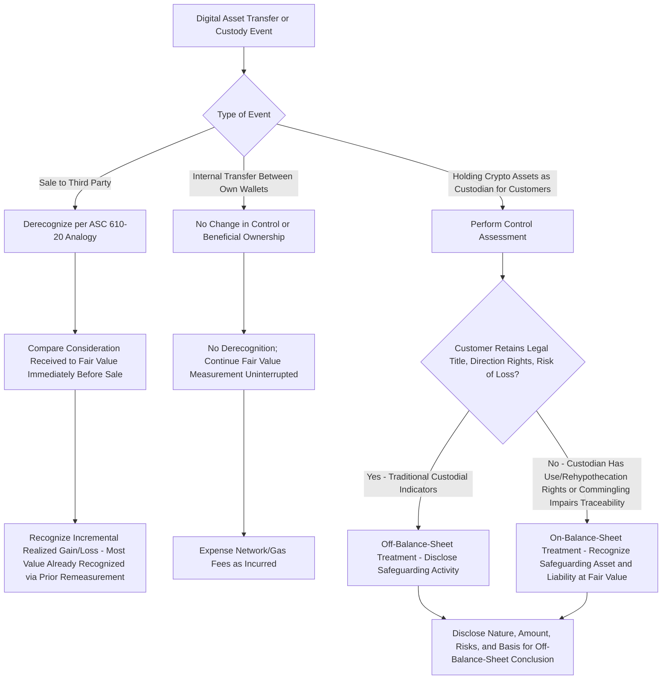

## Accounting for Digital Asset Transfers and Custody Arrangements

### Overview

Beyond the recognition and remeasurement mechanics of ASC 350-60, entities that transfer, custody, or hold digital assets on behalf of others face a distinct set of questions: **derecognition** upon transfer or sale, **control assessment** for custodial arrangements (does the custodian recognize the underlying crypto asset on its own balance sheet, or merely a receivable/obligation?), and disclosure of **safeguarding activities** — an area addressed primarily through **SEC Staff Accounting Bulletin No. 121 (SAB 121)**, its subsequent rescission via **SAB 122**, and general derecognition guidance under **ASC 610-20**.

---

### Derecognition of Crypto Assets Upon Sale or Transfer

ASC 350-60 governs subsequent **measurement** of in-scope crypto assets but does not itself prescribe derecognition guidance — entities apply other existing GAAP, principally **ASC 610-20** (*Other Income—Gains and Losses from the Derecognition of Nonfinancial Assets*), by analogy, since crypto assets in scope of ASC 350-60 are nonfinancial intangible assets for derecognition purposes.

$$\text{Gain/(Loss) on Sale} = \text{Consideration Received} - \text{Fair Value Immediately Before Sale (Carrying Value)}$$

**Key Points**

- Because the asset is carried at fair value each period under ASC 350-60, the **realized** gain or loss upon actual sale is typically small relative to the **cumulative unrealized** gain/loss already recognized in prior periods' net income — most of the economic gain/loss has already been recognized through the ongoing remeasurement process, so the sale-date entry primarily reflects any final period-to-date price movement plus any transaction costs of disposition.
- Transaction costs incurred to **sell** or transfer crypto assets are generally recognized as a reduction of the gain (or increase of the loss) on disposition, consistent with typical treatment of selling costs for nonfinancial assets, unless specific facts suggest a different classification.
- Determining the appropriate **derecognition date** (i.e., when control transfers) generally follows principles analogous to ASC 606's control transfer concept — for most crypto asset transfers, this is typically when the transaction is confirmed on the relevant blockchain (achieving the required number of network confirmations for practical finality), though **[Inference]** the specific point of irrevocable control transfer can require judgment for transactions with extended settlement/confirmation windows or those involving conditional/escrow-like smart contract arrangements.

---

### Custodial and Safeguarding Arrangements: The Control Question

A central accounting question for entities that hold crypto assets **on behalf of customers or other third parties** (e.g., cryptocurrency exchanges, custodians, certain fintech platforms) is whether the **custodian** should recognize the safeguarded crypto assets (and a corresponding liability to the customer) on its **own balance sheet**, or whether the assets remain off the custodian's balance sheet, with only footnote/disclosure recognition of the safeguarding obligation.

This question turns on a **control assessment**: does the custodian have the ability to direct the use of, and obtain substantially all the benefits from, the crypto assets it holds for customers, or does it merely hold them as an intermediary with the customer retaining beneficial ownership and control?

#### SEC Staff Accounting Bulletin No. 121 (SAB 121) — Background

Issued in March 2022, SAB 121 provided SEC staff views that an entity responsible for safeguarding crypto assets held for platform users should recognize a **safeguarding liability** and a corresponding **safeguarding asset**, measured at the fair value of the crypto assets safeguarded as of each reporting date, **on its own balance sheet** — a position that departed from how safeguarding/custodial arrangements are typically accounted for in other asset classes (e.g., traditional securities custody, where off-balance-sheet treatment with disclosure is standard, since the customer retains legal and beneficial ownership).

The rationale offered was that the technological and legal risks inherent in crypto asset safeguarding (e.g., unique risks around private key security, evolving legal precedent on the treatment of crypto assets in custodial bankruptcy) were sufficiently novel and significant to warrant this heightened, balance-sheet-based transparency.

#### Rescission via SAB 122

**[Unverified — verify current status]** SAB 121 was rescinded by SAB 122 in early 2025, removing the presumption that safeguarded crypto assets and the associated safeguarding liability must be recognized on the custodian's balance sheet. Following rescission, entities holding crypto assets in a custodial/safeguarding capacity apply **general, pre-existing GAAP principles** (i.e., the traditional control and risks-and-rewards analysis applicable to any custodial arrangement) to determine whether on-balance-sheet recognition is appropriate for a **specific** arrangement's facts and circumstances, rather than applying a crypto-asset-specific presumption of on-balance-sheet treatment. Given the evolving and closely-watched nature of SEC staff guidance in this area, the precise current status, effective dates, and any subsequent developments should be verified against the SEC's most current published guidance before being relied upon for a specific engagement.

**Key Points**

- Under **general custodial accounting principles** (the framework restored by SAB 122's rescission of SAB 121), the key indicators supporting **off-balance-sheet** treatment (custodian does not recognize the asset) typically include: the customer retains legal title and the ability to direct the crypto asset's use/disposition; the custodian's role is limited to safekeeping/technical custody without discretion over use; and the customer bears the risk of loss (subject to the custodian's operational/security obligations under its custody agreement).
- Indicators potentially supporting **on-balance-sheet** treatment include: the custodian commingles customer assets with its own or other customers' assets in a manner that impairs individual customer traceability; the custodian has contractual rights to use, lend, or rehypothecate customer crypto assets; or the custodial/legal structure otherwise gives the custodian effective control comparable to ownership.
- [Inference] Given the significant balance sheet and regulatory capital implications of on- versus off-balance-sheet treatment for crypto custodians (particularly for regulated entities subject to capital adequacy requirements), this determination is often a focal point of technical accounting consultation and auditor scrutiny for platforms offering crypto custody services.

---

### Bankruptcy and Legal Ownership Considerations in Custody

A significant driver of the safeguarding accounting debate has been **uncertainty in bankruptcy law** regarding whether customer crypto assets held by a custodian are treated as **property of the custodian's bankruptcy estate** (potentially subject to claims of the custodian's general creditors) or as **customer property held in trust/bailment** (protected from the custodian's general creditors) in the event of the custodian's insolvency.

- Terms of service, account agreements, and the specific legal/technical structure of the custody arrangement (e.g., whether private keys are segregated per customer, whether commingling occurs, applicable state/federal law characterizing the relationship) are central to this determination.
- **[Inference]** This bankruptcy-law ambiguity — highlighted prominently by high-profile crypto platform insolvencies where customer asset recovery was contested — has been a significant factor motivating both the original SAB 121 balance-sheet-recognition approach (to enhance transparency about a real economic risk to customers) and the subsequent debate over whether that approach appropriately reflected the underlying economics for well-structured custody arrangements versus imposing a uniform, potentially overly conservative treatment across all crypto custodians regardless of their specific legal structure.

---

### Disclosure Considerations for Custodians (Regardless of On/Off-Balance-Sheet Treatment)

Even where crypto assets remain off the custodian's balance sheet, meaningful disclosure is generally warranted:

- Nature and amount of crypto assets held in a custodial/safeguarding capacity for customers.
- Significant risks and concentrations related to the safeguarding activity (e.g., cybersecurity risk, concentration in a small number of crypto assets, reliance on specific custody technology/vendors).
- The basis for the entity's determination of on- versus off-balance-sheet treatment, including the key facts and judgments supporting that conclusion.

---

### Transfers Between an Entity's Own Wallets/Custody Solutions

A narrower but practically relevant question is the accounting for **internal transfers** — moving an entity's own crypto assets between its own wallets (e.g., from a hot wallet to cold storage, or between the entity's own exchange account and self-custodied wallet):

- Such transfers generally involve **no change in beneficial ownership or control** and therefore **no derecognition or gain/loss recognition** — the asset's fair value measurement under ASC 350-60 continues uninterrupted, with the transfer being an operational/custodial change rather than an accounting event.
- Blockchain network fees ("gas fees") incurred to execute internal transfers are generally expensed as incurred as a cost of maintaining custody/operations, rather than capitalized into the asset's carrying value, since the asset is separately remeasured to fair value regardless.

---

### Diagram: Digital Asset Transfer and Custody Accounting Decision Path (svg_diagram)

---

### Common Pitfalls and Practice Notes

- **[Inference]** A frequent error is assuming that because the asset is remeasured to fair value each period under ASC 350-60, no derecognition analysis is needed upon sale — the periodic remeasurement addresses **holding-period** value changes, while a **separate** derecognition analysis (timing and gain/loss computation) is still required at the point of actual disposition.
- Applying a blanket "off-balance-sheet" or "on-balance-sheet" policy to all custodial arrangements without performing a facts-and-circumstances control assessment for each distinct arrangement, particularly given the post-SAB 122 shift away from a crypto-specific presumption toward general custodial accounting principles.
- Overlooking that the SEC staff guidance in this area (SAB 121/SAB 122) applies specifically to SEC registrants and their staff-level interpretive views — [Unverified] private companies and other GAAP preparers not subject to SEC oversight should evaluate custodial accounting under general, non-SEC-specific GAAP control principles, and should confirm the applicability and current status of any SEC staff guidance to their specific reporting context.
- Capitalizing routine blockchain transaction/gas fees for internal wallet transfers into the crypto asset's cost basis, when the asset's fair value carrying basis under ASC 350-60 makes such capitalization unnecessary and inconsistent with the standard's remeasurement model.
- Failing to consider bankruptcy-remoteness and legal structure documentation when assessing custodial control — the accounting conclusion should be grounded in the actual legal and operational facts of the specific custody arrangement, not merely the entity's business description of itself as a "custodian."

**Related Topics**

- Scope and measurement of crypto asset holdings (foundational ASC 350-60 scoping criteria)
- Fair value measurement and disclosure of digital assets (ongoing remeasurement mechanics preceding any transfer/derecognition event)
- Derecognition of nonfinancial assets under ASC 610-20 in the broader (non-crypto) context
- Forensic accounting and blockchain tracing in custodial insolvency and asset recovery disputes
- Regulatory capital and prudential considerations for regulated crypto custodians
- Internal controls over private key management and custody technology (SOC 1/SOC 2 reporting implications)