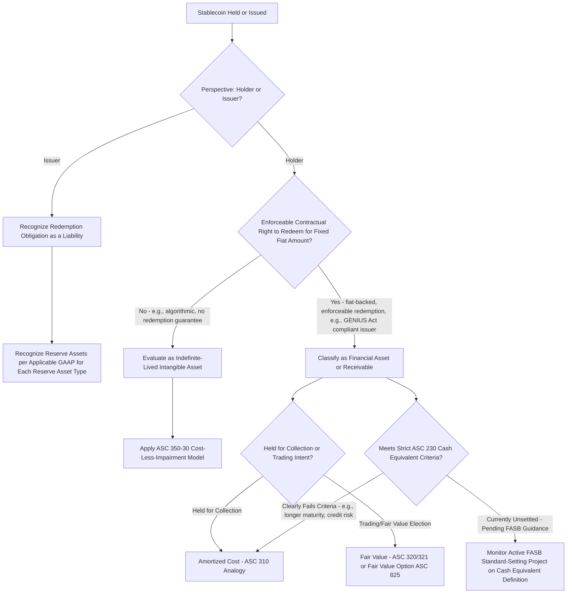

## Stablecoin Classification Considerations

### Overview

Unlike fungible, non-redeemable crypto assets such as bitcoin or ether, **stablecoins** — digital assets designed to maintain a stable value relative to a reference asset (typically the U.S. dollar) — are **explicitly excluded** from the scope of ASC 350-60, because most stablecoin structures provide the holder with an **enforceable right to, or claim on, underlying assets** (the redemption backing), which fails one of ASC 350-60's six scope criteria. This exclusion leaves stablecoin accounting to be resolved through **general GAAP principles applied by analogy**, an area U.S. GAAP does not yet address with a dedicated standard, and one that has been significantly reshaped by 2025's federal stablecoin legislation. **[Unverified — rapidly evolving area]** Given active FASB deliberation and recent legislative change, the specific classification conclusions below should be verified against the most current authoritative guidance and legal framework applicable to the specific stablecoin and reporting date in question.

---

### Why Stablecoins Fall Outside ASC 350-60

Recall the ASC 350-60 scope criteria (from the "Scope and measurement of crypto asset holdings" item): one required condition is that the asset **not** provide the holder with enforceable rights to, or claims on, underlying goods, services, or other assets. Most stablecoins are structured precisely to provide such a claim — a right (contractual, or arising from the issuer's terms of service and reserve structure) to redeem the token for the underlying fiat currency or reserve assets at a fixed or near-fixed rate.

$$\text{Stablecoin} \neq \text{ASC 350-60 Scope} \quad \text{(fails the "no enforceable claim on underlying assets" criterion)}$$

Because of this exclusion, stablecoins require a **separate, facts-and-circumstances classification analysis** rather than automatic fair-value-through-net-income treatment.

---

### The GENIUS Act: Regulatory Backdrop

The **Guiding and Establishing National Innovation for U.S. Stablecoins (GENIUS) Act**, enacted July 18, 2025, established the first comprehensive federal regulatory framework for **payment stablecoins** in the United States. Key provisions relevant to accounting classification analysis:

- Restricts stablecoin issuance to **regulated entities** — subsidiaries of insured depository institutions or newly chartered nonbank stablecoin issuers subject to federal/state oversight.
- Requires issuers to maintain **1:1 reserve backing** with U.S. dollars or specified highly liquid assets (e.g., short-term Treasury securities).
- Mandates **monthly public disclosure** of reserve composition and holdings.
- Requires **annual audited financial statements** for larger issuers and imposes redemption policy transparency requirements.

**Key Points**

- The GENIUS Act is a **regulatory/legal framework**, not an accounting standard — it does not itself dictate GAAP classification, but its requirements (enforceable redemption rights, audited full backing, monthly reserve transparency) are highly relevant **inputs** to the GAAP classification analysis performed by holders and issuers.
- [Inference] Compliance with the GENIUS Act's reserve, audit, and redemption transparency requirements strengthens the case that a compliant, fiat-backed stablecoin functions economically like a cash equivalent, since it more closely satisfies the risk and liquidity characteristics traditionally required for cash equivalent classification — though **the Act itself does not create that classification** as a matter of accounting standards.

---

### Classification Framework by Stablecoin Structure

#### Fiat-Backed, Fully-Reserved, Redeemable Stablecoins (e.g., GENIUS Act-compliant issuances)

For a holder with an **enforceable contractual right to redeem** the stablecoin for a fixed amount of fiat currency, the token functions economically as a **claim on cash** rather than a claim on a fluctuating-value crypto asset. Depending on the specific facts (redemption terms, held-to-maturity intent, issuer creditworthiness, and the entity's own accounting policy elections), such holdings may be evaluated as:

- **A financial asset / receivable**: Measured initially at cost, subsequently at **amortized cost** (analogous to ASC 310-10) if held for collection, or at **fair value** under ASC 320 (if treated as a debt security) or ASC 321 (equity securities — generally inapplicable given the debt-like redemption feature) or via a **fair value option election** under ASC 825-10-25, if the entity elects it.
- **A cash equivalent**: Only if the instrument meets the traditional ASC 230 definition — a short-term, highly liquid investment readily convertible to known amounts of cash, with an original maturity to the holder of three months or less, and subject to insignificant risk of changes in value. This is currently the **most actively debated and unresolved** classification question in the area.

$$\text{Cash Equivalent Test (ASC 230):} \quad \text{Readily Convertible to Known Cash Amount} \ \cap \ \text{Insignificant Risk of Value Change} \ \cap \ \text{Short Maturity}$$

**[Unverified — active standard-setting]** As of the most recent developments available, FASB has publicly indicated it is exploring targeted improvements to clarify whether, and under what conditions, certain payment stablecoins could qualify as cash equivalents — reportedly considering approaches including revising the existing cash equivalent definition, creating a new "digital cash equivalent" category, or adding illustrative examples distinguishing qualifying from non-qualifying stablecoins. No final standard addressing this question had been issued as of this content's preparation; the current classification of even GENIUS Act-compliant stablecoins as cash equivalents remains **unsettled** under existing authoritative GAAP and requires case-specific judgment pending further standard-setting.

#### Algorithmic or Partially-Backed Stablecoins (No Enforceable Redemption Right)

Where the holder does **not** have a contractual, enforceable right to redeem the stablecoin for cash or a fixed reserve asset (e.g., certain algorithmic stability mechanisms that rely on market incentives, arbitrage, or secondary collateral pools rather than direct 1:1 redemption guarantees), the enforceable-claim exclusion from ASC 350-60 may not apply in the same way — however, such tokens also do not straightforwardly qualify as financial assets/receivables given the absence of an enforceable claim.

- In the **absence** of an enforceable redemption right, such a stablecoin is more likely to be classified as an **indefinite-lived intangible asset** under **ASC 350-30**, subject to the traditional cost-less-impairment model — since it would not meet the "financial asset" characterization (no contractual right to receive cash or another financial instrument) and its fungibility/blockchain-native characteristics might otherwise resemble in-scope ASC 350-60 assets, but the specific redemption/claim analysis under ASC 350-60's scope criteria requires case-by-case evaluation of the token's actual mechanism.
- **[Inference]** The historical instability and, in some cases, catastrophic de-pegging failures of certain algorithmic stablecoin designs make this category a heightened area of risk assessment and impairment scrutiny relative to fully-reserved, redeemable structures.

#### Stablecoins Issued by the Reporting Entity Itself (Issuer's Perspective)

From the **issuer's** perspective (rather than the holder's), a stablecoin issued to the public in exchange for fiat currency (with a redemption obligation) is generally recognized as a **liability** — representing the issuer's obligation to redeem the token for the underlying value — analogous to a deposit-taking or e-money liability, rather than as equity or deferred revenue. The corresponding reserve assets held to back the obligation are recognized as assets on the issuer's own balance sheet, generally measured based on the nature of those specific reserve assets (e.g., cash, cash equivalents, or short-term government securities held as reserves would follow the GAAP applicable to those specific instrument types).

$$\text{Issuer Balance Sheet:} \quad \text{Reserve Assets (cash, T-bills, etc.)} \quad \text{vs.} \quad \text{Stablecoin Redemption Liability}$$

---

### Summary Classification Table (Illustrative — Subject to Facts and Evolving Guidance)

| Stablecoin Characteristic | Likely Classification (Holder's Books) | Primary GAAP Reference |
| --- | --- | --- |
| Fiat-backed, enforceable redemption, GENIUS Act-compliant | Financial asset/receivable (amortized cost or fair value); cash equivalent classification unsettled/pending FASB guidance | ASC 310, ASC 320/321, ASC 230 (pending) |
| Algorithmic or partially-backed, no enforceable redemption right | Indefinite-lived intangible asset (cost-less-impairment) | ASC 350-30 |
| Issued by the reporting entity itself | Liability (redemption obligation) | General liability recognition principles; excluded from ASC 350-60 by the "not issued by reporting entity" scope criterion |
| Held by a broker-dealer/investment company for trading/investment purposes | Follows industry-specific fair value guidance | ASC 940, ASC 946 |

---

### Diagram: Stablecoin Classification Decision Path (svg_diagram)

---

### Common Pitfalls and Practice Notes

- **[Inference]** A frequent conceptual error is assuming that all stablecoins qualify for ASC 350-60's fair value model simply because they are blockchain-based and fungible — the enforceable-redemption-claim exclusion is dispositive for most stablecoin structures, routing them instead to financial asset, intangible asset, or liability classification under entirely different GAAP frameworks.
- Treating GENIUS Act compliance as automatically conferring cash equivalent status — the Act is a regulatory/legal framework governing issuance and reserves, not an accounting pronouncement, and the cash equivalent question remains subject to unresolved FASB deliberation as of this content's preparation.
- Applying a uniform classification across all stablecoins without distinguishing fully-reserved, redeemable structures from algorithmic or partially-backed designs — the enforceability and reliability of the redemption right is the central fact pattern driving the entire classification analysis.
- Overlooking the issuer-side liability recognition when focusing only on holder-side classification questions — entities that both hold third-party stablecoins **and** issue their own face distinct analyses on each side of the balance sheet.
- Assuming stablecoin-specific audit guidance is fully mature — attestation and audit procedures for reserve backing and redemption capability currently rely substantially on general auditing frameworks adapted to this asset class, an area still developing in parallel with the accounting classification question.

**Related Topics**

- Scope and measurement of crypto asset holdings (the ASC 350-60 exclusion criterion driving stablecoin treatment)
- Fair value measurement and disclosure of digital assets (contrast with stablecoin's financial-asset/intangible-asset classification path)
- Cash and cash equivalents recognition principles under ASC 230 (the actively evolving frontier for stablecoin classification)
- Financial instrument classification and measurement under ASC 320/321/825
- Regulatory capital and reserve audit considerations for stablecoin issuers under the GENIUS Act
- Forensic accounting considerations in algorithmic stablecoin de-pegging events and reserve verification disputes