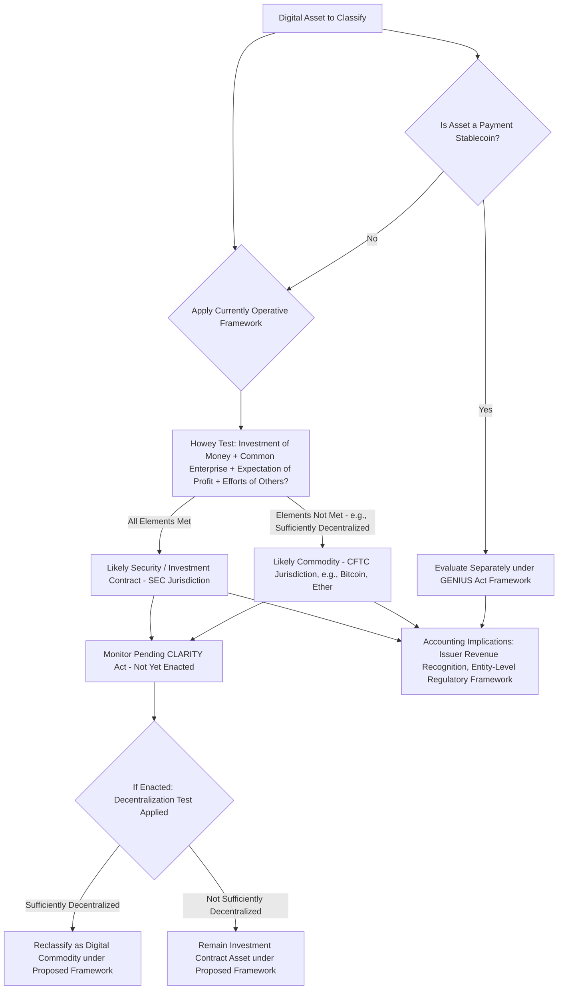

## Distinguishing Digital Asset, Security, and Commodity Treatment

### Overview

Beyond ASC 350-60's accounting scope, a threshold **legal and regulatory** classification question underlies nearly every digital asset engagement: is a given token a **security** (subject to SEC registration, disclosure, and securities law), a **commodity** (subject to CFTC oversight), or something else (e.g., a payment stablecoin under its own framework)? This classification, while primarily a securities/commodities law question rather than a GAAP accounting question per se, has **direct downstream accounting consequences** — affecting revenue recognition for token issuers, disclosure obligations, internal control considerations, and how forensic accountants and auditors approach engagements involving digital assets. **[Unverified — active legislative and regulatory development]** This is a fast-moving area; the framework below reflects the well-established Howey test alongside pending federal legislation not yet enacted as of this content's preparation, and should be verified against the current state of law for any specific engagement.

---

### The Howey Test: The Foundational Securities Law Framework

For decades, U.S. digital asset classification has been governed primarily by the **Howey test**, derived from *SEC v. W.J. Howey Co.* (1946), which defines an "investment contract" (and thus a security) as an arrangement involving:

1. **An investment of money**,
2. **In a common enterprise**,
3. **With a reasonable expectation of profits**,
4. **Derived from the efforts of others** (a promoter or third party, rather than the purchaser's own efforts).

$$\text{Security (Investment Contract)} = \text{Investment of Money} \cap \text{Common Enterprise} \cap \text{Expectation of Profit} \cap \text{Efforts of Others}$$

**Key Points**

- The SEC has historically applied Howey expansively to many token sales and offerings, particularly **initial coin offerings (ICOs)** and tokens marketed with promises of network development, profit-sharing, or value appreciation driven by a centralized development team's efforts.
- The Commodity Futures Trading Commission (CFTC), separately, has asserted that certain digital assets — most prominently **bitcoin and ether** — function as **commodities** (analogous to gold or agricultural commodities) rather than securities, based on their decentralized, non-issuer-dependent characteristics once sufficiently mature/decentralized.
- This dual, court-driven, enforcement-based approach (sometimes described as "regulation by enforcement") produced significant **jurisdictional uncertainty** for years, with classification often resolved only through case-specific litigation (e.g., against specific exchanges or token issuers) rather than clear statutory rules of general application.

---

### The CLARITY Act: Pending Legislative Framework (Not Yet Enacted)

**[Unverified — pending legislation, not current law]** The **Digital Asset Market Clarity Act** ("CLARITY Act," H.R. 3633) is federal legislation intended to establish a comprehensive statutory framework dividing digital asset regulatory authority between the SEC and CFTC. As of the most recent information available, the bill passed the U.S. House of Representatives in July 2025 with bipartisan support and has been advancing through the Senate (having cleared the Senate Banking Committee) but **had not yet passed the full Senate or been signed into law**. Its provisions are **not currently binding law** and should be treated as a **proposed** framework pending further legislative action; current status should be verified before relying on it for any specific engagement.

#### Proposed Tripartite Classification (As Currently Drafted)

The CLARITY Act, as proposed, would divide digital assets into three categories:

1. **Digital commodities** (CFTC jurisdiction): Assets whose value is intrinsically linked to the use and operation of a sufficiently decentralized blockchain protocol — bitcoin and ether are specifically identified as falling into this category under the proposed framework.
2. **Investment contract assets / securities** (SEC jurisdiction, at least during an initial offering phase): Tokens sold or offered with a reasonable expectation of profit derived substantially from the managerial or entrepreneurial efforts of a centralized promoter or development team — generally consistent with Howey-based reasoning, but with proposed statutory codification.
3. **Permitted payment stablecoins**: Governed separately under the GENIUS Act framework (see the "Stablecoin classification considerations" item), rather than under either the digital commodity or investment contract asset categories.

#### The Proposed "Decentralization Test"

A key mechanism in the proposed framework is a **decentralization test** — a means by which a token that may have originated as an "investment contract asset" (security) at the time of its initial offering (when a centralized team's efforts were essential to the network's value and development) could **transition** to "digital commodity" status once the underlying network achieves a sufficient degree of **decentralization** (e.g., no single person or coordinated group retains unilateral control over the network's essential functions, development, or governance).

$$\text{Token Lifecycle (Proposed):} \quad \text{Investment Contract Asset (SEC, at offering)} \ \xrightarrow{\text{Sufficient Decentralization Achieved}} \ \text{Digital Commodity (CFTC)}$$

**Key Points**

- **[Inference]** This proposed "graduation" concept reflects a widely-discussed regulatory theory (sometimes associated with SEC officials' public commentary predating formal legislation) that a token's security-like characteristics can diminish over time as the network matures and centralized promotional efforts recede — though the specific decentralization criteria, evidentiary standards, and transition mechanics under the CLARITY Act as ultimately enacted (if enacted) may differ materially from current drafts, given the bill's unsettled legislative status.
- Even under the proposed framework, **bitcoin and ether** are treated as unambiguously classified digital commodities from the outset — the decentralization test is primarily relevant to the broader universe of other tokens whose classification is currently more contested.

---

### Accounting and Financial Reporting Implications of Classification

While securities/commodities classification is fundamentally a legal question, it carries meaningful accounting consequences:

- **Revenue recognition for issuers**: A token sale characterized as a securities offering (raising capital in exchange for an investment contract) is generally **not** revenue under ASC 606 — it more closely resembles a capital-raising transaction. A token sale properly characterized as a sale of a good/utility token in exchange for goods/services rendered may be evaluated as revenue under ASC 606, subject to identifying performance obligations. The legal characterization is a critical input to this revenue analysis.
- **ASC 350-60 scope interaction**: Recall that ASC 350-60 excludes assets **issued by the reporting entity or its related parties** — so an issuer's own token is never in-scope for the fair value model regardless of its securities/commodity classification; that classification question is more relevant to **holders** of third-party tokens and to the issuer's own liability/equity/deferred revenue characterization of its issuance.
- **Broker-dealer and investment company reporting**: Entities such as digital asset exchanges or funds must determine whether specific tokens they hold or facilitate trading in are securities (potentially subjecting the entity to broker-dealer registration and ASC 940 reporting) or commodities (potentially subjecting derivative/futures activity to different regulatory and accounting treatment) — the security/commodity distinction can determine which industry-specific accounting framework applies at the entity level, not merely at the individual asset level.
- **Disclosure and litigation risk**: Regulatory classification uncertainty is itself a disclosable risk factor for entities engaged in digital asset activities, particularly issuers, exchanges, and funds — auditors and forensic accountants frequently need to assess the reasonableness of management's own classification conclusions as part of financial statement risk assessment.

---

### Practical Analysis Framework for Practitioners

Given the coexistence of the established Howey/CFTC enforcement-based framework and the pending, not-yet-enacted CLARITY Act, a practical classification analysis for a specific digital asset currently should consider:

1. **Current, applicable law**: Apply the Howey test and existing SEC/CFTC enforcement precedent and guidance as the operative framework, since the CLARITY Act's provisions are not yet binding.
2. **The token's specific facts**: Degree of decentralization, presence/absence of a centralized promoter whose efforts drive value, marketing materials and how the token was offered/sold, and whether purchasers had a reasonable expectation of profit from others' efforts.
3. **Monitor legislative and regulatory developments**: Given the CLARITY Act's advanced (but incomplete) legislative status and the SEC/CFTC's own evolving joint interpretive positions, practitioners should track developments closely, as final enactment (if it occurs) could materially change the classification analysis and associated accounting/disclosure conclusions for specific tokens.

---

### Diagram: Digital Asset Regulatory Classification Analysis (svg_diagram)

---

### Common Pitfalls and Practice Notes

- **[Inference]** A significant practical risk is treating the CLARITY Act's proposed framework as **current law** in a classification memo, disclosure, or audit workpaper — as of this content's preparation, the Act had not been signed into law, and its specific mechanics (particularly the decentralization test's precise criteria) remain subject to change through the ongoing legislative process.
- Confusing the **accounting** question (does this asset qualify for ASC 350-60 fair value treatment?) with the **securities/commodities law** question (is this asset a security or a commodity?) — these are related but analytically distinct; an asset can be a commodity under securities law and still fail ASC 350-60 scope for unrelated reasons (e.g., non-fungibility), or vice versa.
- Applying the same classification conclusion uniformly across all tokens without recognizing that Howey-based analysis (and the proposed CLARITY Act framework) is inherently **fact-specific per token** — bitcoin and ether's relatively settled commodity status does not generalize to the broader universe of other tokens, many of which remain genuinely contested.
- Overlooking that a token's classification can **change over time** (the "graduation" concept) even under current enforcement-based practice, as a network decentralizes — a static, one-time classification analysis may become stale as facts evolve.
- Failing to distinguish stablecoins (governed by their own GENIUS Act framework) from the security/commodity binary applicable to other digital assets — stablecoins occupy a conceptually separate regulatory category under current and proposed frameworks alike.

**Related Topics**

- Scope and measurement of crypto asset holdings (ASC 350-60's own, GAAP-specific scoping criteria, distinct from securities/commodities law classification)
- Stablecoin classification considerations (the GENIUS Act framework and its accounting implications)
- Revenue recognition under ASC 606 for token issuances characterized as sales of goods/services versus capital-raising transactions
- Forensic accounting and expert witness considerations in SEC/CFTC enforcement and private securities litigation involving digital assets
- Broker-dealer and investment company industry-specific accounting (ASC 940, ASC 946) as applied to digital asset trading platforms
- Initial coin offering (ICO) and token generation event accounting and disclosure considerations