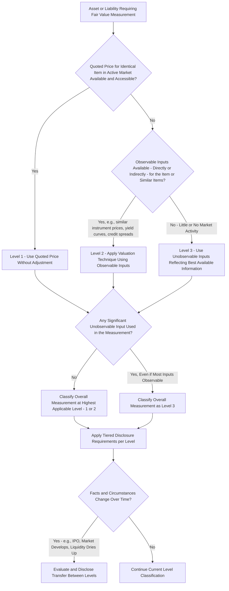

## Fair Value Hierarchy and Input Levels

### Overview

**ASC 820, *Fair Value Measurement***, establishes the authoritative U.S. GAAP framework defining fair value and prescribing a consistent methodology for measuring it. Central to this framework is the **three-level fair value hierarchy**, which categorizes the **inputs** used in valuation techniques based on their observability — not the valuation technique itself, and not the resulting value. This item covers the hierarchy's structure, the exit price principle underlying fair value, and the practical mechanics of level determination and transfer.

---

### The Definition of Fair Value: The Exit Price Principle

ASC 820 defines fair value as:

$$FV = \text{Price received to sell an asset (or paid to transfer a liability) in an orderly transaction between market participants at the measurement date}$$

**Key Points**

- This is an **exit price** notion — the price at which the holder would **sell** the asset (or transfer the liability), not the price paid to **acquire** it (an entry price) — these can differ, particularly for assets acquired in a business combination or through a non-arm's-length transaction.
- The transaction is presumed to occur in the **principal market** for the asset or liability (the market with the greatest volume and level of activity that the reporting entity can access), or, if no principal market exists or is identifiable, the **most advantageous market** (the market that maximizes the amount received or minimizes the amount paid, after considering transaction costs).
- Fair value measurement assumes an **orderly transaction** — not a forced liquidation or distressed sale — between **market participants** who are independent, knowledgeable, and willing and able to transact (not the reporting entity's own specific intended use or entity-specific synergies, unless those characteristics are also available to market participants generally).
- Fair value is measured using the assumptions that **market participants** would use in pricing the asset or liability, including assumptions about risk (e.g., inherent risk in a particular valuation technique, and the risk inherent in the inputs to that technique) — this is a **market-based**, not entity-specific, measurement objective.

---

### The Three-Level Hierarchy: Structure and Rationale

The fair value hierarchy prioritizes the **inputs** to valuation techniques into three broad levels, giving the **highest priority** to observable inputs (Level 1) and the **lowest priority** to unobservable inputs (Level 3). The hierarchy exists to maximize the use of observable market data and minimize the use of unobservable, entity-developed assumptions, thereby enhancing consistency and comparability across entities' fair value measurements.

$$\text{Priority:} \quad \text{Level 1 (highest)} \ > \ \text{Level 2} \ > \ \text{Level 3 (lowest)}$$

#### Level 1 Inputs

**Quoted prices in active markets for identical assets or liabilities** that the reporting entity has the ability to access at the measurement date.

- The **most reliable** evidence of fair value; used **without adjustment** whenever available (except in very limited circumstances, e.g., when the entity holds a large number of similar but not identical instruments and uses a practical expedient, or in certain specific circumstances involving blockage factors, which ASC 820 explicitly **prohibits** adjusting for even for large holdings).
- Examples: actively traded equity securities on a national exchange (e.g., NYSE, NASDAQ), certain actively traded government bonds, exchange-traded derivatives with quoted settlement prices.
- **Key requirement**: the market must be "active" — meaning transactions occur with sufficient frequency and volume to provide ongoing pricing information — and the asset/liability being measured must be **identical**, not merely similar, to the item with the quoted price.

#### Level 2 Inputs

Inputs **other than quoted prices** included within Level 1 that are **observable** for the asset or liability, either **directly** or **indirectly**.

Level 2 inputs include:

- Quoted prices for **similar** (not identical) assets or liabilities in active markets.
- Quoted prices for identical or similar assets or liabilities in markets that are **not active** (e.g., markets with infrequent transactions, or where prices are not current or vary substantially over time or among market participants).
- Inputs **other than quoted prices** that are observable (e.g., interest rates, yield curves, volatilities, credit spreads, prepayment speeds).
- **Market-corroborated inputs**: inputs derived principally from or corroborated by observable market data through correlation or other means.

$$FV_{\text{Level 2}} = f(\text{Observable Market Inputs: yield curves, credit spreads, similar instrument prices})$$

**Example**

A corporate bond that does not trade actively enough for its own quoted price to constitute a reliable Level 1 measurement can often be valued using a **matrix pricing** approach — applying observable yield curves and credit spread data from actively traded bonds of similar credit quality, maturity, and sector to derive an implied price for the specific bond, a classic Level 2 technique.

#### Level 3 Inputs

**Unobservable inputs** for the asset or liability, used only when relevant observable inputs are **not available**, reflecting the reporting entity's **own assumptions** about the assumptions market participants would use in pricing the asset or liability (developed using the best information available in the circumstances).

- Level 3 inputs are used to the extent that observable Level 1 or Level 2 inputs are **not available**, reflecting situations in which there is **little or no market activity** for the asset or liability at the measurement date.
- Examples: unobservable discount rates or growth rate assumptions in a discounted cash flow model for a private company investment; management's own projections used to value contingent consideration; unobservable volatility assumptions for a complex embedded derivative lacking market-quoted analogs.
- Requires the entity to use the **best information available**, which may include the entity's own data, adjusted if reasonably available information indicates market participants would use different assumptions.

**Key Points**

- The level assigned to an **entire** fair value measurement is determined by the **lowest level** input that is **significant** to the measurement as a whole — a measurement that uses primarily Level 2 inputs but incorporates one significant unobservable adjustment is classified in its **entirety** as Level 3, even though most inputs are observable.
- "Significant" in this context requires judgment — an unobservable input that has an immaterial effect on the overall measurement would not, by itself, drag an otherwise Level 2 measurement down to Level 3.

$$\text{Overall Level} = \min(\text{Levels of all inputs used}) \quad \text{where "min" reflects lowest priority (highest number) among significant inputs}$$

---

### Valuation Techniques: Market, Income, and Cost Approaches

ASC 820 identifies three broad valuation approaches, each of which can draw on inputs from any level of the hierarchy depending on data availability:

- **Market approach**: Uses prices and other relevant information from market transactions involving identical or comparable assets/liabilities (e.g., guideline public company multiples, comparable transactions).
- **Income approach**: Converts future amounts (cash flows or earnings) to a single discounted present value (e.g., discounted cash flow analysis, option pricing models such as Black-Scholes or Monte Carlo simulation).
- **Cost approach**: Reflects the amount currently required to replace the service capacity of an asset (replacement cost, often adjusted for obsolescence).

**Key Points**

- The valuation **technique** chosen (market, income, or cost approach) is **conceptually distinct** from the input **level** — a discounted cash flow model (income approach) could use entirely observable market-based discount rate and cash flow inputs (Level 2) or entity-specific unobservable projections (Level 3), depending on the specific facts.
- Entities should use valuation techniques **consistent with** one or more of these approaches, and should use techniques for which sufficient data are available, maximizing observable inputs and minimizing unobservable inputs, while remaining consistent with the exit price/market participant objective.
- A change in valuation technique (or its application) is accounted for as a **change in accounting estimate** per ASC 250, not as a change in accounting principle, and generally does not require retrospective application.

---

### Transfers Between Levels

Fair value measurements can move between hierarchy levels over time as market conditions and data availability change:

- **Transfers into and out of each level** must be identified and disclosed, along with the reasons for the transfers.
- The entity's **policy** for determining when transfers are deemed to have occurred (e.g., as of the beginning of the reporting period, or as of the actual date of the event/change in circumstances) must be disclosed and applied **consistently**.

**Example**

A privately-held equity security valued using unobservable inputs (Level 3, based on management's DCF model) becomes actively traded following the company's IPO during the reporting period. The security **transfers from Level 3 to Level 1**, since a quoted price in an active market for the identical security is now available — a transfer that must be disclosed, including the reason (the IPO event making an active market price newly available).

---

### Disclosure Requirements by Level

ASC 820 disclosure requirements are **tiered by level**, with the most extensive disclosures reserved for Level 3 measurements given their heightened subjectivity:

| Disclosure | Level 1 | Level 2 | Level 3 |
| --- | --- | --- | --- |
| Fair value amount and level classification | Required | Required | Required |
| Valuation technique(s) and inputs used | Not typically required (quoted price) | Required | Required |
| Quantitative information about significant unobservable inputs | N/A | N/A | Required |
| Rollforward of beginning/ending balances (recurring measurements) | N/A | N/A | Required |
| Transfers in/out of the level | Required (in/out) | Required (in/out) | Required (in/out) |
| Sensitivity/narrative description of valuation process and sensitivity to changes in unobservable inputs | N/A | N/A | Required |

**Key Points**

- The **Level 3 rollforward** for recurring fair value measurements must show, at minimum: beginning balance, purchases/issuances/sales/settlements, transfers in/out of Level 3, and total gains/losses (disaggregated between amounts recognized in earnings and other comprehensive income, if applicable), and ending balance.
- Level 3's **quantitative disclosure of significant unobservable inputs** (e.g., a range and weighted average of a discount rate or growth rate assumption used across a portfolio of similar Level 3 investments) is intended to give users insight into the sensitivity and potential variability inherent in these judgmental measurements.

---

### Diagram: Fair Value Hierarchy Determination Process (svg_diagram)

---

### Common Pitfalls and Practice Notes

- **[Inference]** A frequent classification error is assuming the valuation **technique** (e.g., "we used a discounted cash flow model, so this must be Level 3") determines the hierarchy level — the level is driven by the **observability of the inputs** used within that technique, not the technique's inherent complexity; a DCF model built entirely on observable market-based discount rates and consensus analyst cash flow estimates could still be Level 2.
- Failing to recognize that even a single significant unobservable input pulls an **entire** measurement down to Level 3, regardless of how many other inputs are observable — practitioners sometimes incorrectly average or blend levels rather than applying the "lowest significant input" rule.
- Applying a blockage factor discount to a large holding of a Level 1 security — ASC 820 explicitly prohibits this adjustment for Level 1 measurements, regardless of the practical difficulty of actually liquidating a large position without moving the market.
- Under-disclosing Level 3 sensitivity information — merely listing the unobservable inputs without providing the required quantitative range/weighted average and narrative sensitivity discussion fails to meet the standard's transparency objective for the most judgmental measurements.
- Inconsistently applying the entity's stated policy for the **timing** of level transfers (beginning of period vs. date of the triggering event) from period to period, undermining comparability.

**Related Topics**

- Valuation techniques for Level 3 measurements: DCF, option pricing (Black-Scholes, Monte Carlo), and market multiple approaches in depth
- Fair value measurement of financial instruments held by investment companies (ASC 946) and broker-dealers (ASC 940)
- Fair value option elections under ASC 825
- Business combination purchase price allocation and fair value measurement under ASC 805
- Crypto asset fair value measurement application of the hierarchy (principal market determination, Level 1 vs. Level 2/3 classification for less-liquid tokens)
- Goodwill and long-lived asset impairment testing's use of fair value hierarchy concepts