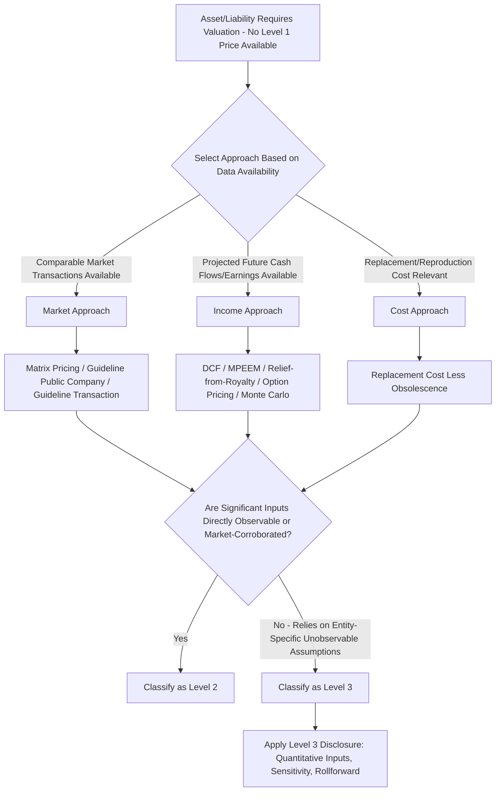

## Valuation Techniques for Level 2 and Level 3 Inputs

### Overview

Where quoted prices for identical assets in active markets (Level 1) are unavailable, entities must apply valuation techniques drawing on observable (Level 2) or unobservable (Level 3) inputs, consistent with ASC 820's three broad approaches — market, income, and cost. This item details the specific techniques most commonly encountered in practice, organized by approach, with attention to the input observability that determines each technique's ultimate hierarchy classification.

---

### Market Approach Techniques

The market approach derives value from prices and other relevant information generated by market transactions involving identical or comparable assets, liabilities, or a group of assets and liabilities (a business).

#### Matrix Pricing (Level 2)

Used extensively for fixed-income securities lacking sufficiently active individual trading, matrix pricing estimates a bond's fair value based on the bond's relationship (credit quality, maturity, coupon, sector) to other, actively-traded benchmark securities.

$$FV_{\text{bond}} = f(\text{Benchmark Yield Curve}, \text{Credit Spread for Rating/Sector}, \text{Coupon}, \text{Maturity})$$

**Key Points**

- A classic, explicitly-named Level 2 technique in ASC 820's implementation guidance — the individual bond's own price is not directly observed, but the inputs used (benchmark yields, sector credit spreads) are observable market data.
- Widely used by bond pricing services and is a common source of Level 2 fair value data.

#### Guideline Public Company Method

Applies valuation multiples (e.g., EV/EBITDA, EV/Revenue, P/E) derived from the trading prices of comparable publicly-traded companies to the subject entity's or asset's own financial metrics.

$$EV_{\text{subject}} = \text{Multiple}_{\text{guideline companies}} \times \text{Metric}_{\text{subject}}$$

**Key Points**

- Classification depends on the **selection and adjustment** of the guideline multiples: if comparable company multiples are used directly with minimal subjective adjustment, this may support **Level 2** classification (the input — the multiple — is market-observable); if significant subjective adjustments are made for differences in size, growth, risk, or marketability (common in practice, since no private company is perfectly comparable to public peers), the measurement is more likely **Level 3**.
- Commonly used in valuing private company equity investments (e.g., venture capital and private equity portfolio holdings), business combination purchase price allocations, and 409A valuations for private company stock options.

#### Guideline Transaction Method

Applies multiples observed in comparable **M&A transactions** (rather than ongoing public trading multiples) to the subject asset's financial metrics — frequently used alongside the guideline public company method as a cross-check, and subject to similar Level 2/Level 3 classification judgment depending on comparability and adjustment significance.

---

### Income Approach Techniques

The income approach converts future economic benefits (cash flows, earnings, cost savings) into a single current (discounted) value.

#### Discounted Cash Flow (DCF) Analysis

$$FV = \sum_{t=1}^{n} \frac{CF_t}{(1+r)^t} + \frac{TV_n}{(1+r)^n}$$

Where $CF_t$ is projected cash flow in period $t$, $r$ is the discount rate (typically a weighted average cost of capital or risk-adjusted rate appropriate to the specific cash flows), and $TV_n$ is the terminal value at the end of the explicit projection period.

**Key Points on Classification**

- **Level 2** classification is supportable when the significant inputs — discount rate, cash flow projections — are derived from or corroborated by **observable market data** (e.g., market-derived yield curves for discount rates, consensus analyst estimates or observable market-implied growth rates for cash flows).
- **Level 3** classification applies when significant inputs rely on the entity's **own unobservable assumptions** — most commonly, **management's internal financial projections** for a private company or a specific reporting unit/asset without directly comparable market-derived cash flow benchmarks, and/or an entity-specific (rather than market-corroborated) discount rate build-up.
- **[Inference]** In practice, most DCF-based fair value measurements for private company investments, complex intangible assets, and reporting units in goodwill impairment testing are classified as **Level 3**, since management's own forward-looking projections are rarely fully corroborated by external market data.

#### Multi-Period Excess Earnings Method (MPEEM)

A specialized DCF variant used primarily to value **identifiable intangible assets** (e.g., customer relationships) in business combination purchase price allocations — isolates the cash flows attributable to the specific intangible asset by deducting **contributory asset charges** for other assets (working capital, fixed assets, other intangibles, assembled workforce) that contribute to the overall cash flows generated.

FV_{\text{intangible}} = \sum_{t=1}^{n} \frac{(\text{Revenue}_t - \text{Costs}_t - \text{Contributory Asset Charges}_t)}{(1+r)^t}$omit

**Key Points**

- Nearly always **Level 3**, given the reliance on management's specific projections for the asset's attributable revenue/cost streams and the judgmental contributory asset charge computations.
- Requires careful identification of a **customer attrition/decay rate** to appropriately taper projected revenues from existing customers over the intangible asset's useful life, itself a significant unobservable input requiring specific disclosure.

#### Relief-from-Royalty Method

Values an intangible asset (typically a trademark or trade name) based on the royalty payments the owner is relieved from paying by owning rather than licensing the asset, applying a market-derived royalty rate to projected revenue.

$$FV_{\text{trademark}} = \sum_{t=1}^{n} \frac{\text{Royalty Rate} \times \text{Projected Revenue}_t \times (1 - \text{Tax Rate})}{(1+r)^t}$$

**Key Points**

- The royalty rate itself is often benchmarked against observable comparable licensing agreements (a market-corroborated input), but the projected revenue stream and discount rate typically remain entity-specific unobservable inputs — generally resulting in **Level 3** classification overall, per the "lowest significant input" rule.

#### Option Pricing Models (Black-Scholes, Lattice, Monte Carlo Simulation)

As detailed in the share-based compensation and complex financial instrument valuation context, these models value option-like payoffs (stock options, warrants, contingent consideration with option-like features, complex embedded derivatives).

$$C = S_0 e^{-qT} N(d_1) - K e^{-rT} N(d_2)$$

**Key Points**

- Classification depends heavily on **volatility and expected term assumptions**: for a private company or an instrument lacking directly observable/traded volatility, these assumptions are typically unobservable (Level 3); for options on actively-traded, exchange-listed underlying securities with observable implied volatility surfaces, these techniques may support Level 2 classification.
- Monte Carlo simulations for market-condition-based compensation awards or complex contingent consideration arrangements are almost always **Level 3**, given the reliance on entity-specific correlation and volatility assumptions for the specific instrument's payoff structure.

---

### Cost Approach Techniques

#### Replacement Cost Method

Estimates the current cost to replace an asset's service capacity, adjusted for physical deterioration, functional obsolescence, and economic obsolescence.

$$FV = \text{Current Replacement Cost (New)} - \text{Depreciation/Obsolescence Adjustments}$$

**Key Points**

- Commonly used for certain tangible long-lived assets (specialized machinery and equipment, certain real estate improvements) where market or income data are insufficient.
- Frequently **Level 3**, given the judgmental nature of obsolescence adjustments, though the underlying replacement cost data (e.g., current construction or equipment costs from published cost indices) may itself be reasonably observable.

---

### Techniques for Contingent Consideration and Earnouts (Business Combinations)

Contingent consideration arrangements (earnouts) in business combinations require fair value measurement at acquisition and, if liability-classified, at each subsequent reporting date until settled.

- **Scenario-based (probability-weighted) method**: Projects multiple discrete performance scenarios, assigns a probability to each, and computes a probability-weighted expected payout, discounted to present value.
- **Option pricing method**: Used when the earnout payout structure has option-like characteristics (e.g., a threshold/cap structure), applying Monte Carlo simulation or a closed-form option model to the relevant performance metric's projected distribution.

$$FV_{\text{earnout}} = \sum_i P_i \times \text{Payout}(\text{Scenario}_i) \times e^{-rT}$$

**Key Points**

- Virtually always **Level 3**, given the reliance on management's own probability assessments and performance projections specific to the acquired business.
- Subsequent remeasurement of contingent consideration liabilities each period is a significant source of Level 3 "gains/losses included in earnings" disclosed in the required rollforward.

---

### Summary Table: Technique-to-Level Tendencies (Facts-Dependent)

| Technique | Approach | Typical Level (Facts-Dependent) |
| --- | --- | --- |
| Matrix pricing | Market | Level 2 |
| Guideline public company (unadjusted multiples) | Market | Level 2 |
| Guideline public company (significantly adjusted) | Market | Level 3 |
| DCF with market-corroborated inputs | Income | Level 2 |
| DCF with management's internal projections | Income | Level 3 |
| MPEEM (intangible assets) | Income | Level 3 (nearly always) |
| Relief-from-royalty | Income | Level 3 (typically) |
| Option pricing (exchange-observable inputs) | Income | Level 2 |
| Option pricing (private company/unobservable volatility) | Income | Level 3 |
| Monte Carlo simulation (market conditions, earnouts) | Income | Level 3 (nearly always) |
| Replacement cost with judgmental obsolescence | Cost | Level 3 (typically) |

---

### Diagram: Valuation Technique Selection and Level Classification Flow (svg_diagram)

---

### Common Pitfalls and Practice Notes

- **[Inference]** A common error is classifying a DCF-based measurement as Level 2 simply because the discount rate references an observable market benchmark (e.g., a market-derived WACC build-up), while overlooking that the **cash flow projections themselves** are management's own unobservable estimates — since cash flow projections are typically the more significant driver of the valuation conclusion, this often means the overall measurement should be Level 3 under the "lowest significant input" principle.
- Treating guideline public company multiples as automatically Level 2 without considering the magnitude of subjective adjustments applied for comparability differences (size, growth, marketability discounts) — heavily adjusted multiples shift the classification to Level 3.
- Underestimating the disclosure burden for MPEEM and Monte Carlo-based Level 3 measurements — the required quantitative unobservable input disclosures (discount rates, attrition rates, volatility assumptions, correlation assumptions) are often more extensive for these sophisticated techniques than practitioners initially anticipate.
- Failing to reassess technique and level classification consistently across reporting periods as market conditions evolve (e.g., a previously illiquid guideline transaction market developing sufficient activity to support more directly observable multiples over time).
- Applying identical valuation techniques and classification conclusions across a portfolio of similar Level 3 investments without considering asset-specific differences that might warrant different techniques or different unobservable input values within the required range/weighted-average disclosure.

**Related Topics**

- Fair value hierarchy and input levels (foundational three-level framework these techniques are classified against)
- Grant-date fair value measurement for share-based compensation (Black-Scholes, lattice, and Monte Carlo techniques in the compensation-specific context)
- Business combinations and purchase price allocation under ASC 805 (MPEEM, relief-from-royalty, and contingent consideration valuation in the acquisition context)
- Goodwill and long-lived asset impairment testing (income approach DCF applications for reporting unit and asset group valuation)
- Crypto asset and digital asset fair value measurement (market approach application to less-liquid tokens)
- Forensic accounting and expert valuation methodology in litigation and dispute contexts