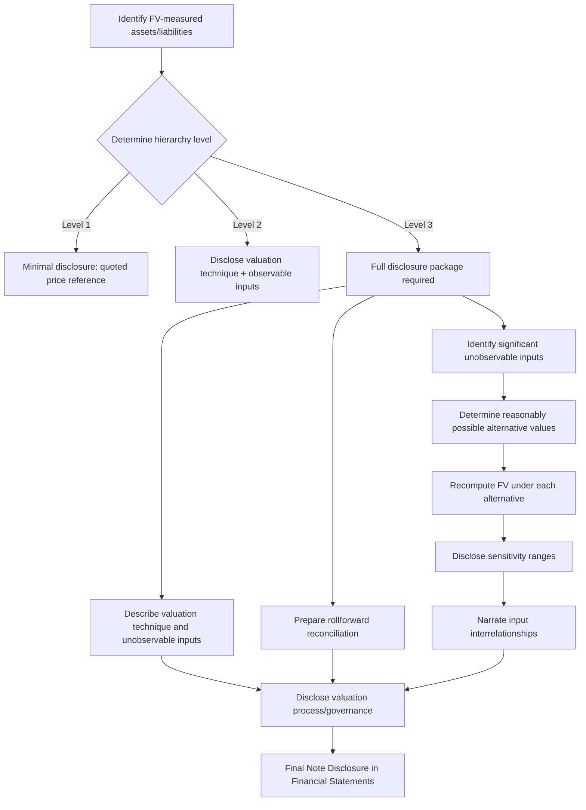

## Fair Value Disclosures and Sensitivity Analysis

### Overview

Fair value disclosure requirements exist to compensate for a fundamental problem: fair value measurement, particularly at Level 2 and Level 3 of the fair value hierarchy, embeds significant management judgment. Without disclosure of inputs, methods, and sensitivity to assumption changes, financial statement users cannot assess the reliability of reported fair values. The governing standards are IFRS 13 *Fair Value Measurement* and ASC 820 (Topic 820) under US GAAP, which are substantially converged on disclosure objectives though they differ in some mechanical requirements.

The disclosure objective, per IFRS 13.91, is for an entity to disclose information that helps users assess (a) the valuation techniques and inputs used, and (b) the effect of Level 3 fair value measurements on profit or loss or other comprehensive income.

### The Fair Value Hierarchy Recap

Disclosure intensity is directly tied to hierarchy level:

- **Level 1** — Quoted prices in active markets for identical assets/liabilities. Minimal disclosure needed; the fair value is objectively observable.
- **Level 2** — Observable inputs other than quoted prices (e.g., quoted prices for similar assets, interest rates, yield curves, credit spreads).
- **Level 3** — Unobservable inputs; the entity's own assumptions about what market participants would use. This is where disclosure and sensitivity analysis requirements are most extensive.

### Core Disclosure Requirements (IFRS 13 / ASC 820)

**For assets and liabilities measured at fair value on a recurring or non-recurring basis:**

1. **Fair value hierarchy classification** — the level within which each class of asset/liability falls.
2. **Transfers between Level 1 and Level 2** — amounts and reasons for transfers, and the entity's policy for determining when transfers are deemed to occur.
3. **Valuation techniques and inputs** — for Level 2 and Level 3, a description of the valuation technique(s) (e.g., market approach, income approach, cost approach) and the inputs used.
4. **Level 3 reconciliation** — a rollforward showing:
   - Opening balance
   - Total gains/losses (recognized in P&L and OCI, disclosed separately)
   - Purchases, sales, issuances, settlements
   - Transfers into/out of Level 3
   - Closing balance
5. **Unrealized gains/losses** — the amount of total gains/losses for Level 3 items still held at period end, and where they are recognized in the income statement.
6. **Valuation processes** — for Level 3, a narrative description of the valuation process used (who performs the valuation, how frequently, how it's validated).
7. **Quantitative sensitivity analysis** for Level 3 items (IFRS 13.93(h)) — a description of the sensitivity of the fair value measurement to changes in unobservable inputs, including interrelationships between inputs if they magnify or mitigate the effect.
8. **Highest and best use disclosure** — for non-financial assets, if the highest and best use differs from current use.

### Sensitivity Analysis: Mechanics

Sensitivity analysis quantifies how much fair value would change given a reasonably possible alternative value for each significant unobservable input. This is not a single-point exercise — it typically involves:

**Step 1 — Identify significant unobservable inputs.**

Common examples by asset class:

| Instrument Type | Key Unobservable Inputs |
| --- | --- |
| Level 3 debt securities | Discount rate, credit spread, prepayment rate |
| Investment property | Capitalization rate, rental growth rate, void period |
| Contingent consideration | Probability of achieving milestones, discount rate |
| Unlisted equity investments | EBITDA multiple, discount for lack of marketability (DLOM) |
| Complex derivatives | Volatility, correlation, credit valuation adjustment (CVA) |
| Biological assets | Discount rate, expected yield, commodity price forecasts |

**Step 2 — Determine the range of reasonably possible alternative inputs.**

This range should reflect what a market participant might reasonably use — not an arbitrary shock, though many preparers use a standardized shock (e.g., ±50bps, ±10%) when a more rigorous range isn't derivable.

**Step 3 — Recompute fair value under each alternative and disclose the range of resulting fair values.**

$$FV_{sensitized} = FV_{base} + \frac{\partial FV}{\partial x} \times \Delta x$$

Where $x$ is the unobservable input and $\frac{\partial FV}{\partial x}$ is the (often numerically approximated, not analytically derived) sensitivity of fair value to that input.

**Step 4 — Narrative discussion of interrelationships.**

IFRS 13.93(h)(ii) specifically requires discussion of interrelationships between unobservable inputs if changing one input is likely to result in a change to another, and the combined effect on fair value. For example, an increase in expected cash flows for a property might correlate with a decrease in the discount rate applied (both driven by improved market sentiment), amplifying the fair value effect rather than operating independently.

### Worked Example: Investment Property (Level 3)

**Facts:**

An entity holds an investment property valued using the income capitalization approach. Base case:

- Stabilized net operating income (NOI): PHP 12,000,000
- Capitalization rate: 7.5%

$$FV = \frac{NOI}{Cap\ Rate} = \frac{12{,}000{,}000}{0.075} = PHP\ 160{,}000{,}000$$

**Sensitivity table for disclosure:**

| Cap Rate Scenario | Cap Rate | Fair Value (PHP) | Change vs. Base |
| --- | --- | --- | --- |
| Low | 7.0% | 171,428,571 | +11,428,571 |
| Base | 7.5% | 160,000,000 | — |
| High | 8.0% | 150,000,000 | (10,000,000) |

**Disclosure narrative would state:** "A 50 basis point decrease in the capitalization rate would increase fair value by approximately PHP 11.4 million; a 50 basis point increase would decrease fair value by approximately PHP 10.0 million. The capitalization rate and expected NOI growth are inversely related; a scenario incorporating both a lower cap rate and higher NOI growth assumption would compound the fair value increase beyond the amount shown in isolation."

This asymmetry (a decrease in cap rate producing a larger absolute PHP change than an equivalent increase) is a natural consequence of the inverse, non-linear relationship between cap rate and value — worth flagging in the write-up as it often confuses students expecting symmetric sensitivity.

### Worked Example: Unlisted Equity Investment Using DLOM

**Facts:**

- Comparable company EBITDA multiple: 6.5x
- Investee EBITDA: PHP 8,000,000
- Enterprise value before discount: PHP 52,000,000
- DLOM applied: 20%

$$FV = EV \times (1 - DLOM) = 52{,}000{,}000 \times (1 - 0.20) = PHP\ 41{,}600{,}000$$

**Sensitivity to DLOM (reasonably possible range 15%–25%):**

| DLOM | Fair Value (PHP) |
| --- | --- |
| 15% | 44,200,000 |
| 20% (base) | 41,600,000 |
| 25% | 39,000,000 |

**Sensitivity to EBITDA multiple (range 6.0x–7.0x, DLOM held at 20%):**

| Multiple | Fair Value (PHP) |
| --- | --- |
| 6.0x | 38,400,000 |
| 6.5x (base) | 41,600,000 |
| 7.0x | 44,800,000 |

### Illustrative Level 3 Reconciliation (Rollforward)

| PHP '000 | Unlisted Equity | Investment Property | Total |
| --- | --- | --- | --- |
| Opening balance, Jan 1 | 38,000 | 155,000 | 193,000 |
| Total gains (P&L) | 1,200 | 3,500 | 4,700 |
| Total gains/(losses) (OCI) | 400 | — | 400 |
| Purchases | 2,000 | — | 2,000 |
| Sales/settlements | — | — | — |
| Transfers into Level 3 | — | 1,500 | 1,500 |
| Transfers out of Level 3 | — | — | — |
| Closing balance, Dec 31 | 41,600 | 160,000 | 201,600 |

### Process Flow for Preparing Fair Value Disclosures

### Diagram: Sensitivity Fan for Investment Property Valuation (svg_diagram)

<svg xmlns="http://www.w3.org/2000/svg" viewBox="0 0 700 400">
<text x="350" y="25" text-anchor="middle" font-size="16" font-weight="bold" font-family="sans-serif">Fair Value Sensitivity to Cap Rate (svg_diagram)</text>
<line x1="80" y1="350" x2="650" y2="350" stroke="black" stroke-width="2" />
<line x1="80" y1="350" x2="80" y2="50" stroke="black" stroke-width="2" />
<text x="365" y="385" text-anchor="middle" font-size="13" font-family="sans-serif">Capitalization Rate (%)</text>
<text x="30" y="200" text-anchor="middle" font-size="13" font-family="sans-serif" transform="rotate(-90 30,200)">Fair Value (PHP millions)</text>

<text x="150" y="365" font-size="11" text-anchor="middle" font-family="sans-serif">7.0%</text>

<text x="365" y="365" font-size="11" text-anchor="middle" font-family="sans-serif">7.5%</text>

<text x="580" y="365" font-size="11" text-anchor="middle" font-family="sans-serif">8.0%</text>

<text x="65" y="340" font-size="11" text-anchor="end" font-family="sans-serif">150</text>

<text x="65" y="260" font-size="11" text-anchor="end" font-family="sans-serif">160</text>

<text x="65" y="160" font-size="11" text-anchor="end" font-family="sans-serif">171</text>

<polyline points="150,163 365,255 580,340" fill="none" stroke="#2563eb" stroke-width="3" />
<circle cx="150" cy="163" r="5" fill="#2563eb" />
<circle cx="365" cy="255" r="5" fill="#dc2626" />
<circle cx="580" cy="340" r="5" fill="#2563eb" />

<text x="150" y="145" font-size="11" text-anchor="middle" font-family="sans-serif">171.4M</text>

<text x="365" y="240" font-size="11" text-anchor="middle" font-family="sans-serif" font-weight="bold">160.0M (base)</text>

<text x="580" y="325" font-size="11" text-anchor="middle" font-family="sans-serif">150.0M</text>

<text x="365" y="60" text-anchor="middle" font-size="11" fill="#555" font-family="sans-serif">Curve is convex: FV = NOI / Cap Rate</text>

</svg>

### Interrelationships Between Unobservable Inputs

A critical, often under-tested area: IFRS 13 explicitly requires discussion of correlations between inputs. Common examples:

- **Discount rate and cash flow growth rate** (real estate, business valuations) — typically move in the same direction with market sentiment, so shocking one at a time understates the true range of outcomes.
- **Volatility and correlation** (derivatives, structured products) — during market stress, both often increase simultaneously.
- **Credit spread and recovery rate** (distressed debt) — a widening credit spread scenario often coincides with a lower assumed recovery rate.

[Inference] Where an entity's disclosure only shows independent single-input shocks without addressing interrelationships, this may not fully satisfy IFRS 13.93(h)(ii) in a strict reading, though many jurisdictions' practice varies in the rigor applied to this narrative element.

### Forensic Accounting Relevance

Fair value disclosures are a common area of financial statement manipulation and forensic scrutiny because Level 3 inputs are inherently unverifiable by outsiders:

- **Cherry-picked comparables** in market multiple approaches to justify a desired valuation.
- **Understated sensitivity ranges** — using implausibly narrow "reasonably possible" ranges to make the fair value appear more precise/reliable than it is.
- **Selective disclosure of interrelationships** — omitting correlations that would widen the disclosed sensitivity range.
- **Classification gaming** — misclassifying a Level 3 asset as Level 2 to avoid the more onerous rollforward and sensitivity disclosures.
- **Round-tripping through valuation specialists** who receive management's desired conclusion before being engaged (a "hired gun" red flag investigated in valuation disputes and litigation support engagements).

A forensic accountant reviewing fair value disclosures typically re-performs the sensitivity calculation independently, cross-checks unobservable inputs against third-party market data where any proxy exists, and interviews the valuation preparer about the process disclosed under the "valuation processes" requirement.

### Common Disclosure Deficiencies (Regulatory Findings)

Findings frequently cited by SEC and IFRS enforcement bodies include:

1. Boilerplate sensitivity language that doesn't quantify the actual dollar/peso impact.
2. Failure to disclose the valuation technique alongside the inputs (disclosing "discount rate: 8%" without stating whether a DCF or another technique was used).
3. Missing disclosure of transfers between Level 2 and Level 3.
4. Sensitivity ranges disclosed at a portfolio level when material individual positions would produce materially different (and more informative) ranges if disaggregated.

### Key Points

- Fair value disclosure and sensitivity analysis intensity scales with hierarchy level; Level 3 carries the heaviest burden.
- The Level 3 rollforward and quantitative sensitivity analysis are the two disclosures most frequently scrutinized by auditors and regulators.
- Sensitivity analysis must address interrelationships between unobservable inputs, not just isolated single-variable shocks.
- Convex value functions (like cap-rate-based valuations) produce asymmetric sensitivity — decreases and increases in the input do not produce proportionally equal-and-opposite fair value changes.
- Level 3 disclosures are a primary forensic red-flag area due to their inherent unverifiability.

**Related Topics**

- Fair value hierarchy classification and transfer policies (Level 1/2/3)
- Discounted cash flow (DCF) valuation techniques under IFRS 13
- Business combination purchase price allocation and contingent consideration valuation
- Impairment testing and fair value less costs of disposal
- Valuation of financial instruments: derivatives, CVA/DVA
- Forensic red flags in Level 3 asset valuation and litigation support
- Highest and best use concept for non-financial assets