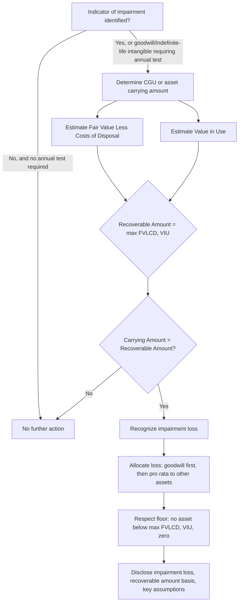
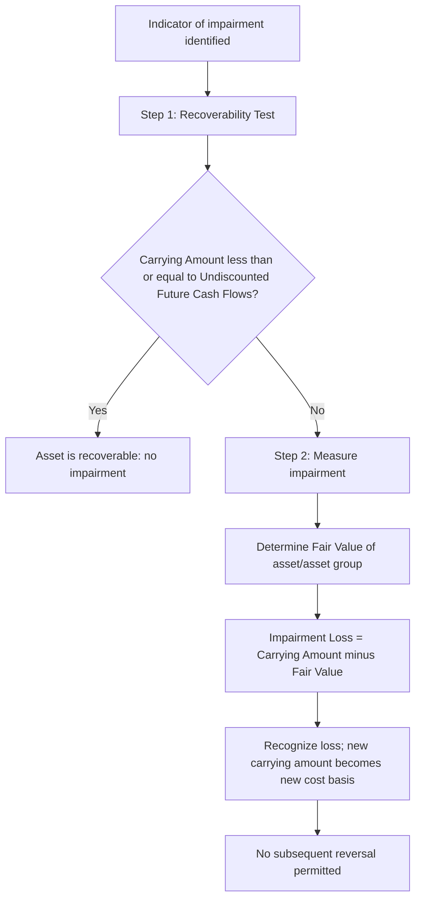

## Impairment Testing Using Fair Value Measurements

### Overview

Impairment testing determines whether an asset's carrying amount exceeds its recoverable amount, requiring a write-down when it does. Fair value measurement enters impairment testing in two distinct ways: as a direct impairment trigger comparison basis (fair value less costs of disposal) and as a required disclosure once impairment is recognized. Governing standards are IAS 36 *Impairment of Assets* (IFRS) and ASC 350/360 (goodwill and long-lived assets respectively, US GAAP). These frameworks differ meaningfully in structure, which is a frequent examination point.

### Core Conceptual Framework: Recoverable Amount (IAS 36)

Under IAS 36, an asset is impaired when its carrying amount exceeds its **recoverable amount**, defined as:

$$Recoverable\ Amount = \max(FVLCD,\ VIU)$$

Where:

- **FVLCD** = Fair Value Less Costs of Disposal
- **VIU** = Value in Use (present value of future cash flows expected from continued use and eventual disposal)

**Impairment loss:**

$$Impairment\ Loss = Carrying\ Amount - Recoverable\ Amount \quad (\text{if positive})$$

The entity does not need to compute both FVLCD and VIU if either one alone already exceeds carrying amount — no impairment exists in that case. If FVLCD cannot be determined reliably (e.g., no active market, no reliable estimate obtainable), VIU is used as the recoverable amount by default.

### Fair Value Less Costs of Disposal (FVLCD)

FVLCD is measured using the IFRS 13 fair value framework (exit price, market participant assumptions, highest and best use), less incremental direct disposal costs (legal fees, transaction taxes, costs of removing the asset) — but **excluding** finance costs and income tax expense.

$$FVLCD = FV_{IFRS13} - Costs\ to\ Sell$$

**Costs to sell typically include:**

- Legal costs and stamp duty/transaction taxes
- Costs of removing the asset
- Incremental costs directly attributable to the disposal

**Excluded from costs to sell:**

- Termination benefits and costs of reorganizing the business following disposal
- Finance costs
- Income tax expense

### Value in Use (VIU)

VIU discounts pre-tax cash flow projections using a pre-tax discount rate that reflects current market assessments of the time value of money and asset-specific risks.

$$VIU = \sum_{t=1}^{n} \frac{CF_t}{(1+r)^t} + \frac{TV_n}{(1+r)^n}$$

Where $CF_t$ is the pre-tax cash flow in period $t$, $r$ is the pre-tax discount rate, and $TV_n$ is the terminal/residual value.

**Key VIU restrictions under IAS 36:**

- Cash flow projections must be based on reasonable and supportable assumptions, giving greater weight to external evidence.
- Projections should be based on the most recent budgets/forecasts approved by management, generally covering a maximum of five years unless a longer period can be justified.
- Cash flows beyond the explicit forecast period are extrapolated using a steady or declining growth rate that does not exceed the long-term average growth rate for the products, industries, or country of operation, unless a higher rate can be justified.
- **Exclude** cash flows from future restructurings the entity is not yet committed to, and from future capital expenditure that improves or enhances the asset's performance beyond its originally assessed standard.
- Exclude financing cash flows and income tax receipts/payments (VIU is a pre-tax, pre-financing measure).

### Worked Example: Cash-Generating Unit (CGU) Impairment Test

**Facts:**

A CGU has a carrying amount of PHP 85,000,000 (including allocated goodwill of PHP 10,000,000). Management estimates:

- FVLCD: PHP 72,000,000
- VIU: computed below

**VIU cash flow projection (pre-tax discount rate 10%):**

| Year | Pre-tax CF (PHP) | PV Factor @10% | PV (PHP) |
| --- | --- | --- | --- |
| 1 | 15,000,000 | 0.9091 | 13,636,500 |
| 2 | 16,000,000 | 0.8264 | 13,222,400 |
| 3 | 17,500,000 | 0.7513 | 13,147,750 |
| 4 | 18,000,000 | 0.6830 | 12,294,000 |
| 5 | 18,500,000 | 0.6209 | 11,486,650 |
| Terminal value (2% perpetuity growth from Yr 5 CF) | — | — | see below |

**Terminal value calculation:**

$$TV_5 = \frac{CF_5 \times (1+g)}{r-g} = \frac{18{,}500{,}000 \times 1.02}{0.10-0.02} = PHP\ 235{,}875{,}000$$

$$PV(TV_5) = 235{,}875{,}000 \times 0.6209 = PHP\ 146{,}450{,}138$$

**Total VIU:**

$$VIU = 13{,}636{,}500 + 13{,}222{,}400 + 13{,}147{,}750 + 12{,}294{,}000 + 11{,}486{,}650 + 146{,}450{,}138 = PHP\ 210{,}237{,}438$$

**Recoverable amount:**

$$Recoverable\ Amount = \max(72{,}000{,}000,\ 210{,}237{,}438) = PHP\ 210{,}237{,}438$$

Since recoverable amount (PHP 210,237,438) exceeds carrying amount (PHP 85,000,000), **no impairment is recognized**. This example illustrates that VIU frequently dominates FVLCD for cash-generating operating units with strong internal cash flow generation, since VIU captures entity-specific synergies FVLCD (an exit price concept) would exclude.

### Contrasting Example: Impairment Recognized

**Facts:** Same CGU, but a major client contract is lost and management revises Year 1–5 cash flows down by 60%, and FVLCD (from a genuine third-party offer) is reassessed at PHP 40,000,000.

Recomputed VIU (60% of prior cash flows, same terminal growth logic) ≈ PHP 84,094,975 (proportional scaling for illustration).

$$Recoverable\ Amount = \max(40{,}000{,}000,\ 84{,}094{,}975) = PHP\ 84{,}094{,}975$$

$$Impairment\ Loss = 85{,}000{,}000 - 84{,}094{,}975 = PHP\ 905{,}025$$

### Allocation of Impairment Loss Within a CGU (IAS 36.104)

When an impairment loss is recognized for a CGU, it is allocated in this order:

1. First, to reduce the carrying amount of any **goodwill** allocated to the CGU.
2. Then, to the other assets of the CGU **pro rata** based on the carrying amount of each asset in the unit.

**Constraint:** No individual asset can be written down below the highest of its own FVLCD (if determinable), its VIU (if determinable), and zero.

**Continuing the example:** The PHP 905,025 impairment loss is first applied entirely against the PHP 10,000,000 goodwill balance (since it's less than the goodwill balance), reducing goodwill to PHP 9,094,975. No allocation to other assets is needed since goodwill absorbs the full loss.

### US GAAP Contrast: ASC 350 (Goodwill) and ASC 360 (Long-Lived Assets)

US GAAP structurally departs from IFRS in a way that is a common point of confusion:

**ASC 360 (long-lived assets held for use):**

- **Step 1 (Recoverability test):** Compare carrying amount to **undiscounted** future cash flows. If carrying amount ≤ undiscounted cash flows, no impairment (this is a screen, not a measurement).
- **Step 2 (Measurement):** Only if Step 1 fails, impairment loss = carrying amount − **fair value** (not VIU; US GAAP does not use a VIU concept for long-lived assets).

**ASC 350 (goodwill):**

- Single-step quantitative test (post-2017 ASU 2017-04 simplification): impairment loss = excess of reporting unit's carrying amount over its **fair value**, capped at the goodwill balance.
- Entities may perform an optional qualitative assessment first ("Step 0") to determine whether the quantitative test is even necessary.

**Key contrast table:**

| Aspect | IAS 36 (IFRS) | ASC 360 / ASC 350 (US GAAP) |
| --- | --- | --- |
| Recoverable amount basis | Higher of FVLCD and VIU | Fair value only (no VIU concept) |
| Long-lived asset screening step | None (direct comparison) | Undiscounted cash flow recoverability test first |
| Reversal of impairment | Permitted (except goodwill) | Prohibited for all assets including goodwill |
| Goodwill testing unit | Cash-generating unit (CGU) | Reporting unit |
| Goodwill impairment steps | Part of CGU-level test | Single quantitative step (post-ASU 2017-04) |

The impairment reversal prohibition under US GAAP versus IFRS's permission (excluding goodwill) is one of the most frequently tested IFRS/GAAP divergence points in this area.

### Process Flow: IAS 36 Impairment Test

### Process Flow: ASC 360 Two-Step Test

### Diagram: Recoverable Amount Decision Logic (svg_diagram)

<svg xmlns="http://www.w3.org/2000/svg" viewBox="0 0 700 300">
<text x="350" y="25" text-anchor="middle" font-size="16" font-weight="bold" font-family="sans-serif">FVLCD vs VIU: Recoverable Amount (svg_diagram)</text>
<rect x="60" y="70" width="220" height="90" rx="8" fill="#dbeafe" stroke="#2563eb" stroke-width="2" />
<text x="170" y="105" text-anchor="middle" font-size="13" font-weight="bold" font-family="sans-serif">FVLCD</text>
<text x="170" y="125" text-anchor="middle" font-size="11" font-family="sans-serif">Exit price basis</text>
<text x="170" y="142" text-anchor="middle" font-size="11" font-family="sans-serif">Market participant view</text>
<rect x="420" y="70" width="220" height="90" rx="8" fill="#fef3c7" stroke="#d97706" stroke-width="2" />
<text x="530" y="105" text-anchor="middle" font-size="13" font-weight="bold" font-family="sans-serif">Value in Use</text>
<text x="530" y="125" text-anchor="middle" font-size="11" font-family="sans-serif">Entity-specific cash flows</text>
<text x="530" y="142" text-anchor="middle" font-size="11" font-family="sans-serif">Includes synergies</text>

<text x="350" y="120" text-anchor="middle" font-size="20" font-weight="bold" font-family="sans-serif">MAX</text>

<line x1="280" y1="115" x2="330" y2="115" stroke="black" stroke-width="2" marker-end="url(#arrow)" />
<line x1="420" y1="115" x2="370" y2="115" stroke="black" stroke-width="2" marker-end="url(#arrow)" />
<rect x="240" y="200" width="220" height="60" rx="8" fill="#dcfce7" stroke="#16a34a" stroke-width="2" />
<text x="350" y="235" text-anchor="middle" font-size="13" font-weight="bold" font-family="sans-serif">Recoverable Amount</text>
<line x1="350" y1="160" x2="350" y2="200" stroke="black" stroke-width="2" marker-end="url(#arrow)" />
</svg>

### Disclosure Requirements (IAS 36.126–137)

For each material impairment loss (and reversal):

- Events and circumstances leading to the impairment.
- Amount of the loss and where recognized in the income statement.
- Whether recoverable amount is FVLCD or VIU, and the fair value hierarchy level if FVLCD is used.
- The valuation technique used to measure FVLCD or VIU.
- Key assumptions used in determining recoverable amount (discount rate, growth rate) and management's approach to determining their values.

**For goodwill and indefinite-life intangibles specifically**, additional disclosure is required regardless of whether an impairment was recognized: the carrying amount allocated to each CGU, the key assumptions, and — critically — a **sensitivity disclosure**: if a reasonably possible change in a key assumption would cause carrying amount to exceed recoverable amount, the entity must disclose the amount by which recoverable amount exceeds carrying amount, the value assigned to the key assumption, and the amount by which that assumption would need to change (headroom analysis).

### Headroom Sensitivity Example

Continuing the first CGU example (no impairment case), suppose recoverable amount (PHP 210,237,438) exceeds carrying amount (PHP 85,000,000) by a headroom of PHP 125,237,438. If a sensitivity test shows that a discount rate increase to 13.5% (from 10%) would erode this headroom to zero, this must be disclosed under IAS 36.134(f), since a "reasonably possible" 350bps discount rate movement is not implausible in current market conditions.

### Forensic Accounting Relevance

Impairment testing is a heavily manipulated area because management has strong incentives to avoid recognizing impairment (debt covenant breaches, executive compensation tied to earnings, avoiding market signaling of business deterioration):

- **Overly optimistic cash flow projections** that consistently exceed actual subsequent performance — a "look-back" comparison of prior-year projections to actual results is a standard forensic procedure.
- **Discount rate manipulation** — using a discount rate below what market evidence would support to inflate VIU.
- **CGU aggregation gaming** — combining a failing unit with a healthy one to dilute impairment indicators at a more aggregate level than IAS 36 permits.
- **Delayed impairment recognition** — waiting for a "big bath" year (e.g., a new CEO's first year) to recognize multiple periods of deferred impairment at once.
- **Goodwill impairment avoidance via qualitative Step 0 overuse** under ASC 350, bypassing quantitative testing based on unsupported qualitative judgment.
- **Terminal value manipulation** — since terminal value often represents 60–80% of total VIU (as in the worked example above, where PV(TV) was roughly 70% of total VIU), small changes in terminal growth rate or discount rate produce outsized effects, and this component receives disproportionately less scrutiny.

[Inference] Because terminal value typically dominates VIU calculations, forensic reviewers often treat the terminal growth rate and discount rate spread ($r - g$) as the single highest-leverage assumption to challenge, though the appropriate degree of scrutiny will vary by engagement and materiality.

### Key Points

- Recoverable amount is the higher of FVLCD and VIU under IAS 36; US GAAP uses fair value alone (with an undiscounted cash flow screening step for long-lived assets).
- VIU is entity-specific and pre-tax/pre-financing; FVLCD is a market participant exit price concept.
- Impairment losses are allocated first to goodwill, then pro rata to other CGU assets, subject to individual asset floors.
- IFRS permits impairment reversal (except goodwill); US GAAP prohibits reversal entirely.
- Goodwill sensitivity/headroom disclosure is mandatory even absent an actual impairment.
- Terminal value dominance in VIU calculations makes discount rate and growth rate assumptions the primary forensic focus area.

**Related Topics**

- Cash-generating unit identification and goodwill allocation
- Discount rate determination (WACC vs. asset-specific risk premiums)
- Reversal of impairment losses and prohibited goodwill reversal
- ASC 350 Step 0 qualitative goodwill assessment
- Terminal value and perpetuity growth model mechanics
- Forensic red flags in management cash flow forecasting
- Fair value hierarchy disclosures and Level 3 sensitivity analysis (linked topic)