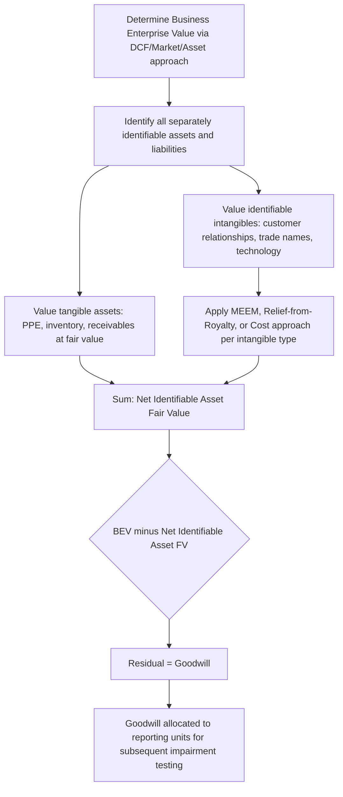

## Business Enterprise Versus Asset-Level Fair Value Applications

### Overview

Fair value measurement is applied at fundamentally different units of account depending on the valuation objective: the **business enterprise level** (the entity or reporting unit as a going concern) versus the **asset level** (individual tangible or intangible assets and liabilities). The distinction matters because value measured at the enterprise level captures synergies, assembled workforce value, and goodwill that disappear when assets are valued individually, and because different accounting standards mandate different units of account for different purposes. Confusing these two levels is one of the most common technical errors in both financial reporting and forensic valuation work.

### The Fundamental Distinction

**Business Enterprise Value (BEV)** — the total value of an operating business as a going concern, capturing the combined value of all tangible assets, intangible assets (recorded and unrecorded), and goodwill, functioning together to generate cash flows.

**Asset-level fair value** — the value of a specific asset or liability in isolation, per its own highest and best use, per the unit of account specified for that asset under the relevant standard (IFRS 13 / ASC 820).

**The reconciliation identity:**

$$BEV = \sum_{i=1}^{n} FV(Identified\ Tangible\ Assets_i) + \sum_{j=1}^{m} FV(Identified\ Intangible\ Assets_j) - FV(Liabilities\ Assumed) + Goodwill$$

Goodwill is definitionally the residual — it is the value of BEV that cannot be attributed to any separately identifiable asset:

$$Goodwill = BEV - Net\ Identifiable\ Asset\ Fair\ Value$$

This residual nature of goodwill is central to understanding why business enterprise valuation and asset-level valuation are not simply additive in reverse — you cannot sum up individually-appraised asset fair values and expect to arrive back at an independently-derived BEV, because BEV captures assembled-workforce synergy, market position, and going-concern value that individual asset appraisals structurally exclude.

### When Each Level Applies

| Context | Unit of Account | Standard |
| --- | --- | --- |
| Business combination (PPAA) | BEV first, then allocated to identifiable assets/liabilities | IFRS 3 / ASC 805 |
| Goodwill impairment testing | Reporting unit / CGU (enterprise-level) | ASC 350 / IAS 36 |
| Long-lived asset impairment | Individual asset or asset group | ASC 360 / IAS 36 |
| Financial instrument fair value | Individual instrument (generally) | IFRS 9 / ASC 825 |
| Investment property | Individual property (or portfolio if managed as such) | IAS 40 |
| Share-based payment | Individual equity instrument | IFRS 2 / ASC 718 |
| Solvency/insolvency analysis | BEV vs. asset liquidation value (different bases entirely) | Forensic/litigation context |

### Business Enterprise Valuation Approaches

**1. Income Approach — Discounted Cash Flow (DCF)**

$$BEV = \sum_{t=1}^{n} \frac{FCFF_t}{(1+WACC)^t} + \frac{TV_n}{(1+WACC)^n}$$

Where $FCFF$ is free cash flow to the firm (unlevered) and $WACC$ is the weighted average cost of capital.

$$WACC = \frac{E}{V} \times r_e + \frac{D}{V} \times r_d \times (1-T)$$

**2. Market Approach — Guideline Public Company / Guideline Transaction Methods**

$$BEV = EBITDA \times Comparable\ EV/EBITDA\ Multiple$$

Or using revenue multiples, invested capital multiples, or industry-specific metrics (e.g., price-per-subscriber for telecom/media).

**3. Asset Approach — Adjusted Net Asset Method**

Used primarily for holding companies, asset-heavy businesses, or as a floor value check:

$$BEV_{asset\ approach} = \sum FV(Assets) - \sum FV(Liabilities)$$

This approach essentially collapses BEV to the sum of asset-level fair values (no separate goodwill/synergy layer), making it the natural bridge between the two valuation levels — though it typically understates value for a profitable operating business precisely because it ignores going-concern synergies.

### Worked Example: Business Combination — Bridging BEV to Asset-Level Fair Values

**Facts:** Acquirer pays PHP 500,000,000 (BEV, per DCF/market approach cross-check) for 100% of Target Co. Identifiable assets and liabilities are fair-valued at the acquisition date (PPAA under IFRS 3):

| Item | Fair Value (PHP) |
| --- | --- |
| Cash | 20,000,000 |
| Accounts receivable | 35,000,000 |
| Inventory | 45,000,000 |
| Property, plant & equipment | 180,000,000 |
| Customer relationships (identified intangible) | 60,000,000 |
| Trade name (identified intangible) | 25,000,000 |
| Total identifiable assets | 365,000,000 |
| Less: Liabilities assumed | (95,000,000) |
| **Net identifiable assets at fair value** | **270,000,000** |

$$Goodwill = 500{,}000{,}000 - 270{,}000{,}000 = PHP\ 230{,}000{,}000$$

The PHP 230,000,000 goodwill represents assembled workforce, expected synergies with the acquirer, market position, and any control premium paid above what a pure sum-of-assets valuation would justify — value that exists at the enterprise level but cannot be individually recognized as a separate identifiable asset under IFRS 3/ASC 805 (IFRS 3.B37 explicitly identifies assembled workforce as an unidentifiable intangible subsumed into goodwill).

### Worked Example: Asset-Level Fair Value in Isolation

Contrast the above with valuing the customer relationship intangible **on its own**, independent of the enterprise transaction, using the Multi-Period Excess Earnings Method (MEEM) — the standard technique for customer-relationship intangibles:

$$FV_{Customer\ Relationships} = \sum_{t=1}^{n} \frac{(Revenue_t \times Attrition\ Factor_t - Contributory\ Asset\ Charges_t) \times (1-T)}{(1+r)^t}$$

**Simplified illustration:**

| Year | Revenue from Existing Customers (PHP) | Contributory Asset Charges (PHP) | After-Tax Excess Earnings (PHP, 25% tax) | PV @ 12% |
| --- | --- | --- | --- | --- |
| 1 | 40,000,000 | 8,000,000 | 24,000,000 | 21,428,571 |
| 2 | 32,000,000 | 6,400,000 | 19,200,000 | 15,306,122 |
| 3 | 25,600,000 | 5,120,000 | 15,360,000 | 10,933,373 |
| 4 | 20,480,000 | 4,096,000 | 12,288,000 | 7,809,552 |
| 5 | 16,384,000 | 3,276,800 | 9,830,400 | 5,578,251 |
| **Total** |  |  |  | **60,055,869** |

This roughly reconciles to the PHP 60,000,000 customer relationship value used in the PPAA table above — but note this figure was derived through **asset-specific** cash flow isolation (contributory asset charges strip out returns attributable to working capital, fixed assets, and assembled workforce used to generate that revenue), a fundamentally different mechanical process from the top-down BEV/DCF calculation.

### Contributory Asset Charges (CAC): The Bridge Mechanism

CACs are the mechanism that connects enterprise-level cash flow to asset-specific cash flow in MEEM. Each contributory asset (working capital, fixed assets, assembled workforce, other intangibles) is assigned a "rental charge" reflecting a fair return on that asset's value, which is deducted from total cash flow before isolating the cash flow attributable to the intangible being valued.

$$CAC_i = FV(Contributory\ Asset_i) \times Required\ Return_i$$

$$Excess\ Earnings = Total\ Enterprise\ Cash\ Flow - \sum_i CAC_i$$

This is the formal mathematical bridge showing how enterprise-level cash flow decomposes into asset-level attributions — each contributory asset "earns" its charge, and whatever remains is attributed to the specific intangible under valuation.

### Process Flow: BEV to Asset-Level Allocation

### Diagram: BEV Decomposition Waterfall (svg_diagram)

<svg xmlns="http://www.w3.org/2000/svg" viewBox="0 0 700 380">
<text x="350" y="25" text-anchor="middle" font-size="16" font-weight="bold" font-family="sans-serif">Business Enterprise Value Decomposition (svg_diagram)</text>
<rect x="40" y="60" width="620" height="50" fill="#1e3a8a" />
<text x="350" y="90" text-anchor="middle" font-size="13" fill="white" font-family="sans-serif" font-weight="bold">Business Enterprise Value: PHP 500,000,000</text>
<rect x="40" y="130" width="140" height="180" fill="#93c5fd" />
<text x="110" y="160" text-anchor="middle" font-size="11" font-family="sans-serif">Net Tangible Assets</text>
<text x="110" y="180" text-anchor="middle" font-size="12" font-weight="bold" font-family="sans-serif">PHP 185M</text>
<rect x="190" y="170" width="140" height="140" fill="#60a5fa" />
<text x="260" y="200" text-anchor="middle" font-size="11" font-family="sans-serif">Customer Relationships</text>
<text x="260" y="220" text-anchor="middle" font-size="12" font-weight="bold" font-family="sans-serif">PHP 60M</text>
<rect x="340" y="230" width="140" height="80" fill="#3b82f6" />
<text x="410" y="255" text-anchor="middle" font-size="11" fill="white" font-family="sans-serif">Trade Name</text>
<text x="410" y="273" text-anchor="middle" font-size="12" fill="white" font-weight="bold" font-family="sans-serif">PHP 25M</text>
<rect x="490" y="60" width="140" height="250" fill="#f59e0b" />
<text x="560" y="180" text-anchor="middle" font-size="12" font-weight="bold" fill="white" font-family="sans-serif">Goodwill</text>
<text x="560" y="200" text-anchor="middle" font-size="12" font-weight="bold" fill="white" font-family="sans-serif">PHP 230M</text>
<text x="560" y="220" text-anchor="middle" font-size="10" fill="white" font-family="sans-serif">(residual)</text>

<text x="350" y="345" text-anchor="middle" font-size="11" font-family="sans-serif">Net identifiable assets (185+60+25=270M) leave a 230M residual attributed to goodwill</text>

</svg>

### Key Divergences Between the Two Levels

**1. Highest and best use application differs.**

IFRS 13 applies highest and best use at the individual asset level for non-financial assets — even within a business combination. An asset might have a higher standalone fair value than its "in-use" value if a market participant would deploy it differently, though this is constrained when the asset is used in combination with other assets in a group.

**2. Discount rates differ by risk profile.**

BEV/DCF uses WACC (blended cost of capital reflecting overall business risk). Asset-level intangible valuations (MEEM) typically use a discount rate for that specific intangible, often 100–300 basis points above WACC to reflect the higher relative risk of a single intangible cash flow stream compared to the diversified enterprise cash flow — while other intangibles like trade names valued via relief-from-royalty may use a rate closer to WACC.

**3. Solvency and insolvency contexts use fundamentally different value bases.**

In litigation and bankruptcy contexts, "fair value" of the enterprise (going concern) is compared against "fair value" or liquidation value of assets individually — and the *same* business can show solvency at the enterprise level while individual assets, sold piecemeal, would not cover liabilities. This divergence is central to fraudulent conveyance and solvency opinion analysis.

**4. Assembled workforce and goodwill cannot be separately recognized as intangible assets.**

IFRS 3.B37 and ASC 805-20-55 explicitly state that assembled workforce does not meet the identifiability criterion and is subsumed into goodwill — a frequent trap where analysts erroneously attempt to carve out a standalone "workforce" intangible.

### Forensic Accounting Relevance

The BEV-versus-asset-level distinction is central to several forensic and litigation contexts:

- **Solvency opinions in fraudulent transfer litigation** — a company that is solvent measured at BEV/going-concern value may be deemed insolvent if assets are valued at forced-liquidation, asset-level values (relevant to preference and fraudulent conveyance claims under bankruptcy law).
- **Shareholder dispute / dissenting shareholder valuations** — disputes frequently center on whether "fair value" (a statutory term in appraisal rights cases, distinct from the accounting fair value concept) should reflect enterprise-level going concern value or a pro-rata asset-level liquidation value, with case law varying significantly by jurisdiction.
- **Purchase price allocation manipulation** — overstating identifiable intangible asset values (which may be amortized, providing a tax or earnings benefit) at the expense of goodwill (or vice versa depending on the incentive), since the total BEV is fixed by the deal price but its internal allocation carries discretion.
- **Fraudulent enterprise value inflation** — using aggressive market comparables or unsupported synergy assumptions to justify an inflated BEV in a related-party transaction or before a financing round, which then cascades into overstated asset-level allocations and inflated goodwill.
- **Divisional/segment-level value obscuring asset impairment** — combining a strong-performing division with a failing one at the CGU/reporting unit level (an enterprise-level unit of account) to avoid asset-level impairment recognition that would be required if tested individually.

[Inference] Because the residual nature of goodwill makes it the "plug" in any PPAA, forensic reviewers often treat unusually large or unusually small goodwill residuals (relative to identifiable intangibles) as a signal warranting closer examination of whether individual intangible valuations were deliberately over- or under-stated to shift value into or out of goodwill for a specific accounting or tax objective.

### Key Points

- BEV is a going-concern, top-down measure capturing synergies and assembled workforce value; asset-level fair value is a bottom-up, standalone measure per the applicable unit of account.
- Goodwill is mathematically defined as the residual between BEV and net identifiable asset fair value — it is never independently measured.
- Contributory asset charges are the formal mechanism (via MEEM) that decomposes enterprise cash flow into asset-specific attributions.
- Discount rates differ systematically between the two levels: WACC at the enterprise level, asset-specific (often higher) rates for individual intangibles.
- Solvency and litigation contexts frequently hinge on which value basis (enterprise vs. asset-level liquidation) is legally and factually appropriate.

**Related Topics**

- Purchase price allocation (PPA) under IFRS 3 / ASC 805
- Multi-Period Excess Earnings Method (MEEM) mechanics
- Relief-from-royalty method for trade names and technology
- Weighted average cost of capital (WACC) derivation
- Goodwill impairment testing and reporting unit determination
- Solvency opinions and fraudulent conveyance analysis
- Dissenting shareholder appraisal rights and statutory fair value