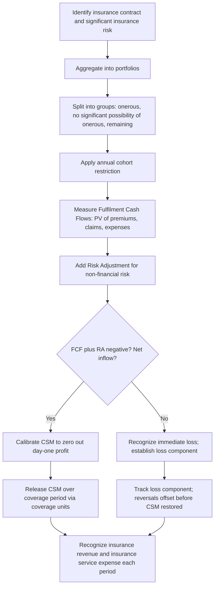

## Insurance Contract Accounting

### Overview

Insurance contract accounting addresses a unique measurement problem: insurers collect premiums upfront in exchange for a promise to pay uncertain, often long-duration future claims. Traditional revenue recognition and liability measurement models don't fit this pattern well, which is why insurance contracts have historically had their own dedicated standards rather than falling under general revenue or financial instrument guidance. The two governing frameworks are **IFRS 17** *Insurance Contracts* (effective globally for IFRS preparers since January 1, 2023, replacing the interim IFRS 4) and **ASC 944** *Financial Services—Insurance* under US GAAP (as amended by ASU 2018-12, the Long-Duration Targeted Improvements, or "LDTI"). These two frameworks are less converged than most other major standards areas, making this a heavily contrasted topic.

### Defining an Insurance Contract

Both frameworks define an insurance contract functionally rather than by legal form: a contract under which one party (the issuer) accepts **significant insurance risk** from another party (the policyholder) by agreeing to compensate the policyholder if a specified uncertain future event (the insured event) adversely affects the policyholder.

**Significant insurance risk test (IFRS 17):** Insurance risk is significant only if an insured event could cause the issuer to pay significant additional benefits in any single scenario with commercial substance, even if the insured event is extremely unlikely. This is a low bar by design — even a small probability of a materially adverse scenario is sufficient to qualify.

Contracts that transfer only financial risk (not insurance risk) — e.g., certain financial guarantee contracts or investment contracts without discretionary participation features — fall outside insurance contract accounting and are instead accounted for as financial instruments under IFRS 9 / ASC 825.

### IFRS 17: The General Measurement Model (GMM) / Building Block Approach (BBA)

IFRS 17's default model measures the insurance contract liability as the sum of four building blocks:

$$Insurance\ Contract\ Liability = FCF + RA + CSM$$

Where:

- **FCF (Fulfilment Cash Flows)** = present value of future cash flows (probability-weighted estimates of premiums, claims, expenses)
- **RA (Risk Adjustment)** = compensation the entity requires for bearing uncertainty about the amount and timing of cash flows arising from non-financial risk
- **CSM (Contractual Service Margin)** = the unearned profit the entity will recognize as it provides insurance coverage over the contract period

**Fulfilment Cash Flows decomposition:**

$$FCF = \sum_{t} \frac{E[Claims_t + Expenses_t - Premiums_t]}{(1+r)^t}$$

Discounted using current market-consistent discount rates that reflect the characteristics of the cash flows (liquidity, currency, duration).

**Contractual Service Margin — the key innovation of IFRS 17:**

At initial recognition, CSM is calibrated so that no day-one profit is recognized on an insurance contract:

$$CSM_{initial} = -(FCF + RA) \quad \text{if positive; if negative, recognized immediately as a loss (onerous contract)}$$

$$CSM_{initial} = Premiums\ Received - FCF - RA \quad \text{(if this is positive)}$$

The CSM is subsequently released to profit or loss over the coverage period in a pattern reflecting the transfer of insurance contract services (typically based on coverage units — a measure of the quantity of insurance coverage provided in each period).

$$CSM_{release_t} = CSM_{t-1} \times \frac{Coverage\ Units_t}{\sum Remaining\ Coverage\ Units}$$

**Key mechanical feature:** the CSM absorbs favorable and unfavorable changes in future service cash flow estimates (unlocking), meaning the CSM balance is adjusted each period for changes in estimates relating to future coverage, while changes relating to past or current service flow directly to profit or loss.

### Worked Example: GMM Initial Recognition

**Facts:** A 5-year term life insurance contract group. At inception:

- Premiums received: PHP 50,000,000
- PV of expected future claims and expenses: PHP 38,000,000
- Risk adjustment for non-financial risk: PHP 4,000,000

**Step 1 — Fulfilment cash flows:**

$$FCF = 38{,}000{,}000 - 50{,}000{,}000 = -12{,}000{,}000 \quad (\text{net inflow position})$$

**Step 2 — Add risk adjustment:**

$$FCF + RA = -12{,}000{,}000 + 4{,}000{,}000 = -8{,}000{,}000$$

**Step 3 — CSM (the plug that zeroes out day-one profit):**

$$CSM = -(FCF + RA) = -(-8{,}000{,}000) = PHP\ 8{,}000{,}000$$

**Initial liability recognized:**

$$Liability = FCF + RA + CSM = -12{,}000{,}000 + 4{,}000{,}000 + 8{,}000{,}000 = PHP\ 0$$

At initial recognition, the liability nets to zero (before considering acquisition cash flows) because the CSM absorbs the expected profit — this is the defining feature distinguishing IFRS 17 from prior practice, which often recognized profit or premium as revenue immediately upon writing the policy.

### Subsequent Measurement: Building Block Movement

| Component | Year 1 Movement |
| --- | --- |
| Opening CSM | 8,000,000 |
| Interest accretion on CSM (5%) | 400,000 |
| Changes in estimates of future cash flows (unlocking) | (500,000) |
| Coverage units released (1/5 of remaining) | (1,580,000) |
| Closing CSM | 6,320,000 |

$$CSM_{release,\ Year\ 1} = (8{,}000{,}000 + 400{,}000 - 500{,}000) \times \frac{1}{5} = PHP\ 1{,}580{,}000$$

This PHP 1,580,000 is recognized as **insurance revenue** in profit or loss for Year 1, alongside the release of the risk adjustment for the expired portion of coverage and the expected incurred claims for the period.

### Onerous Contracts Under IFRS 17

If at initial recognition (or subsequently) $FCF + RA$ is positive (i.e., a net outflow exceeding premiums), the contract is **onerous**, and no CSM asset can be recognized. Instead:

$$Loss\ Recognized\ Immediately = FCF + RA \quad (\text{when positive})$$

A **loss component** is tracked separately within the liability for remaining coverage, and subsequent reversals of the loss (favorable changes) are recognized in profit or loss (reversing the loss component) rather than restoring a CSM until the loss component is fully reversed.

### The Premium Allocation Approach (PAA) — Simplified Model

For short-duration contracts (coverage period ≤ 1 year) or where PAA produces a measurement not materially different from GMM, entities may use the simplified PAA, which resembles traditional unearned premium accounting:

$$Liability\ for\ Remaining\ Coverage = Unearned\ Premium - Deferred\ Acquisition\ Costs\ (if\ applicable)$$

PAA does not require explicit calculation of a CSM during the coverage period — profit emerges naturally as premium is earned, similar to traditional deferred revenue accounting. This is the model most property & casualty (general) insurers use given their typically annual policy terms.

### Level of Aggregation: Portfolios and Groups

IFRS 17 mandates a specific, non-optional aggregation hierarchy that is a frequent examination and audit focus area:

1. **Portfolio** — contracts subject to similar risks and managed together.
2. Within each portfolio, divided into (at minimum) three groups based on profitability at inception:
   - Contracts that are **onerous at initial recognition**
   - Contracts with **no significant possibility of becoming onerous** subsequently
   - **Remaining contracts** in the portfolio
3. Groups cannot include contracts issued more than one year apart ("annual cohorts" requirement).

This granular grouping prevents profitable and onerous contracts from being offset against each other at a higher aggregate level — a deliberate anti-smoothing design feature, directly analogous in spirit to the CGU-level (rather than entity-level) impairment testing requirement under IAS 36.

### Variable Fee Approach (VFA)

For contracts with direct participation features (where the entity's obligation is substantially to pay the policyholder an amount based on the fair value of underlying items, e.g., unit-linked or with-profits contracts), the VFA modifies the CSM mechanics: the CSM also absorbs the entity's share of changes in the fair value of underlying items, not just changes in fulfilment cash flows.

$$CSM\ Adjustment_{VFA} = Entity's\ Share\ of\ \Delta FV(Underlying\ Items) - Changes\ in\ FCF\ relating\ to\ future\ service$$

### US GAAP: ASC 944 and LDTI (ASU 2018-12)

US GAAP retains a more traditional, product-differentiated model rather than IFRS 17's unified building-block approach:

**Short-duration contracts (most P&C insurance):**

- Premiums recognized as revenue over the coverage period (unearned premium reserve model) — broadly similar in spirit to IFRS 17's PAA.
- Claim liabilities recognized based on undiscounted (historically) estimates of ultimate claim costs.

**Long-duration contracts (life, annuities, long-term care) — post-LDTI:**

- **Liability for future policy benefits (LFPB):** cash flow assumptions must be reviewed **at least annually** (a major LDTI change from prior "lock-in" assumptions that were rarely updated) using an upper-medium grade (single-A) discount rate, updated quarterly through OCI.
- **Market risk benefits (MRB):** guarantees embedded in variable annuities and similar products must be measured at **fair value**, with changes recognized in net income (excluding the entity's own credit risk component, which goes to OCI) — a significant shift toward fair-value-style measurement for this specific component.
- **Deferred acquisition costs (DAC):** amortized on a constant level basis over the expected term of the related contracts, decoupled from profit emergence (no longer amortized in proportion to gross profits/margins as under legacy GAAP).

**Key US GAAP contrast with IFRS 17:** ASC 944/LDTI does **not** have a CSM concept. Profit emergence patterns differ substantially — US GAAP does not aim for the same "no day-one profit" discipline IFRS 17 enforces; day-one gains can arise from favorable initial pricing under US GAAP models in ways IFRS 17 specifically prevents through the CSM mechanism.

### Comparison Table: IFRS 17 vs. ASC 944/LDTI

| Aspect | IFRS 17 | ASC 944 (post-LDTI) |
| --- | --- | --- |
| Unified model across product types | Yes (GMM/PAA/VFA variants) | No — differs by short/long-duration |
| Day-one profit deferral mechanism | CSM (explicit, mandatory) | No equivalent; DAC amortization is separate |
| Discount rate updates | Current rates each period (P&L or OCI split) | Annual assumption review; discount rate via OCI (LFPB) |
| Risk adjustment for non-financial risk | Explicit, separately disclosed | No explicit equivalent |
| Embedded guarantee measurement | Via VFA/GMM cash flow modeling | MRBs at fair value (LDTI) |
| Contract grouping | Mandatory annual cohorts, profitability groups | No equivalent explicit grouping regime |

### Process Flow: IFRS 17 GMM Initial and Subsequent Measurement

### Diagram: IFRS 17 Liability Building Blocks (svg_diagram)

<svg xmlns="http://www.w3.org/2000/svg" viewBox="0 0 700 320">
<text x="350" y="25" text-anchor="middle" font-size="16" font-weight="bold" font-family="sans-serif">IFRS 17 Insurance Contract Liability Composition (svg_diagram)</text>
<rect x="80" y="60" width="540" height="60" fill="#93c5fd" stroke="#1e40af" stroke-width="1.5" />
<text x="350" y="95" text-anchor="middle" font-size="13" font-family="sans-serif" font-weight="bold">Estimates of Future Cash Flows (Claims + Expenses − Premiums)</text>
<rect x="80" y="120" width="540" height="60" fill="#fca5a5" stroke="#991b1b" stroke-width="1.5" />
<text x="350" y="155" text-anchor="middle" font-size="13" font-family="sans-serif" font-weight="bold">Discounting to Present Value</text>
<rect x="80" y="180" width="540" height="60" fill="#fde68a" stroke="#92400e" stroke-width="1.5" />
<text x="350" y="215" text-anchor="middle" font-size="13" font-family="sans-serif" font-weight="bold">Risk Adjustment for Non-Financial Risk</text>
<rect x="80" y="240" width="540" height="60" fill="#86efac" stroke="#166534" stroke-width="1.5" />
<text x="350" y="275" text-anchor="middle" font-size="13" font-family="sans-serif" font-weight="bold">Contractual Service Margin (unearned profit)</text>

<text x="640" y="90" font-size="20" font-family="sans-serif">}</text>

<text x="655" y="95" font-size="11" font-family="sans-serif">FCF</text>

</svg>

### Reinsurance Contracts Held (IFRS 17)

Reinsurance contracts held by a ceding insurer are accounted for **separately** from the underlying direct insurance contracts issued — they are not netted. A reinsurance contract held is measured using largely the same building-block logic (FCF, RA, CSM) but from the perspective of the cedant purchasing coverage rather than issuing it, and the CSM on a reinsurance contract held represents the net cost or net gain of purchasing reinsurance, recognized over the reinsurance coverage period.

A key asymmetry: if the underlying direct contracts are onerous (triggering an immediate loss), and the reinsurance contract held covers those underlying contracts, the cedant recognizes a corresponding gain on the reinsurance contract held immediately, rather than waiting for the reinsurance CSM to release over time — this is a specific IFRS 17 amendment (2020) addressing an initial mismatch identified by preparers.

### Forensic and Audit Risk Areas in Insurance Contract Accounting

- **Discount rate selection and yield curve construction** — IFRS 17's requirement for current, market-consistent discount rates creates significant management judgment in illiquid or thin markets; manipulation of the illiquidity premium component can materially shift liability values.
- **Risk adjustment confidence level disclosure gaming** — entities must disclose the confidence level (percentile) used to derive the risk adjustment; understating this can understate the liability.
- **CSM "unlocking" classification errors** — misclassifying changes relating to current/past service (which should hit P&L immediately) as changes relating to future service (which adjust CSM), deferring loss recognition inappropriately.
- **Coverage unit definition manipulation** — since CSM release is driven by coverage units, defining these units in a way that front-loads or back-loads profit recognition is a judgment area subject to abuse.
- **Onerous contract identification avoidance** — aggressive grouping or optimistic cash flow assumptions to avoid classifying a group as onerous, deferring loss recognition.
- **LDTI assumption "cliff" effects** — the shift from lock-in to annual assumption updates under US GAAP LDTI can create large one-time catch-up adjustments; timing the recognition of adverse assumption changes across reporting periods is a manipulation risk.
- **Reinsurance used to manage reported results** — structuring reinsurance arrangements primarily to smooth earnings or manage regulatory capital rather than genuine risk transfer (raising risk transfer sufficiency questions that determine whether reinsurance accounting even applies).

[Inference] Given the complexity and judgment embedded in discount rate curves and coverage unit definitions, external auditors and regulators have generally focused disproportionate scrutiny on these two areas relative to other IFRS 17 inputs, though the specific enforcement emphasis will continue to evolve as post-implementation review findings accumulate.

### Key Points

- IFRS 17's core innovation is the CSM, which mechanically defers all day-one profit and recognizes it over the coverage period via coverage units.
- The building blocks (FCF + RA + CSM) net to zero at initial recognition for profitable contracts; onerous contracts recognize losses immediately instead.
- IFRS 17 mandates granular aggregation (portfolios, profitability-based groups, annual cohorts) specifically to prevent profit/loss smoothing across contracts.
- US GAAP (ASC 944/LDTI) has no CSM equivalent and instead separately addresses long-duration liability assumptions (annual review), market risk benefits (fair value), and DAC (level amortization).
- Reinsurance contracts held are accounted for separately from underlying direct contracts, with a specific onerous-contract offset mechanism.

**Related Topics**

- Discount rate curve construction and illiquidity premium under IFRS 17
- Risk adjustment for non-financial risk: confidence level methodologies
- Variable Fee Approach for participating contracts
- LDTI transition and Liability for Future Policy Benefits mechanics
- Reinsurance contracts held accounting and risk transfer sufficiency testing
- Deferred acquisition cost amortization under legacy GAAP vs. LDTI
- Onerous contract loss components and reversal accounting