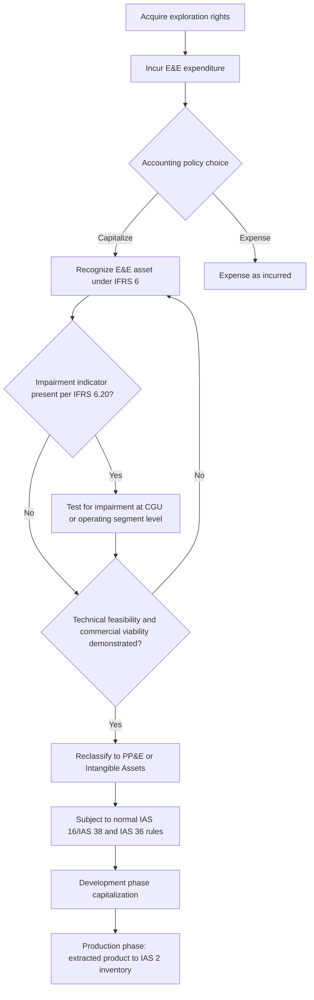
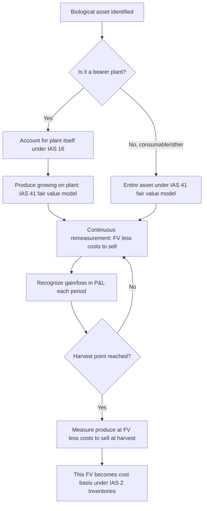

## Extractive Industries and Agriculture Accounting

### Overview

Extractive industries (oil, gas, and mining) and agriculture share a common accounting challenge despite their operational differences: both involve assets whose value is driven by biological growth or subsurface resource discovery processes that occur before conventional revenue-generating activity begins, creating unique recognition, measurement, and disclosure problems that general asset accounting standards do not adequately address. The governing standards are **IFRS 6** *Exploration for and Evaluation of Mineral Resources* and **IAS 41** *Agriculture* under IFRS, with US GAAP addressing extractive activities primarily through **ASC 930** (mining) and **ASC 932** (oil and gas), and agriculture through **ASC 905**.

### Part 1: Extractive Industries — Exploration and Evaluation

**IFRS 6 scope and purpose**

IFRS 6 was deliberately issued as a narrow, interim standard permitting entities to continue existing accounting policies for exploration and evaluation (E&E) expenditures, rather than mandating a single global approach — recognizing that a genuinely converged E&E accounting model was not achievable at the time of issuance. This means IFRS 6 permits significant policy choice, which is itself a notable feature (and exam point): entities may choose to **capitalize** or **expense** E&E costs, provided the policy is applied consistently.

**Phases of extractive activity and their accounting treatment:**

| Phase | Typical Treatment | Standard |
| --- | --- | --- |
| Pre-exploration (regional surveys, license acquisition) | Generally expensed | IFRS 6 / policy choice |
| Exploration and evaluation | Capitalize (IFRS 6 policy choice) or expense | IFRS 6 |
| Development (post technical feasibility/commercial viability) | Capitalize as PP&E / intangible | IAS 16 / IAS 38 |
| Production | Capitalize as inventory (extracted product) | IAS 2 |

**The critical recognition trigger:** once technical feasibility and commercial viability of extracting a mineral resource are demonstrable, E&E assets are reclassified out of the IFRS 6 category into property, plant and equipment or intangible assets (per IAS 16/IAS 38), and are no longer subject to IFRS 6's relaxed measurement rules — they become subject to normal cost/revaluation model and standard impairment testing (IAS 36) from that point forward.

**E&E asset classification and measurement:**

E&E assets are initially measured at cost, which may include:

- Acquisition of exploration rights
- Topographical, geological, geochemical, and geophysical studies
- Exploratory drilling
- Trenching and sampling
- Activities related to evaluating the technical feasibility and commercial viability of extraction

$$E\&E\ Asset\ Cost = Acquisition\ Costs + Exploration\ Costs + Evaluation\ Costs$$

**Impairment indicators specific to E&E assets (IFRS 6.20):**

1. The period for which the entity has the right to explore has expired or will expire in the near future, without renewal being expected.
2. Substantive further exploration/evaluation is neither budgeted nor planned.
3. Exploration/evaluation has not led to discovery of commercially viable quantities and the entity has decided to discontinue activity.
4. Sufficient data exists indicating that, although development is likely to proceed, the carrying amount is unlikely to be fully recovered from successful development or sale.

When any indicator is present, an impairment test under IAS 36 principles is required, though IFRS 6 permits the impairment test to be conducted at a level of aggregation (cash-generating unit) larger than would ordinarily be permitted under IAS 36 — specifically, no larger than an operating segment.

### Successful Efforts vs. Full Cost Method (Oil & Gas — primarily a US GAAP/ASC 932 distinction, though relevant to IFRS practice too)

Two dominant methods exist for oil and gas E&E cost accounting, representing fundamentally different philosophies:

**Successful Efforts Method:**

- Costs of *successful* exploratory wells are capitalized.
- Costs of *dry holes* (unsuccessful exploratory wells) are expensed immediately.
- Geological and geophysical costs are generally expensed as incurred regardless of outcome.

**Full Cost Method:**

- All exploration costs within a large cost center (often a country or continent) are capitalized, whether successful or not.
- Costs are pooled and amortized against the aggregate reserves of the entire cost center.
- Subject to a "ceiling test" — capitalized costs cannot exceed the present value of estimated future net revenues from proved reserves (discounted at a prescribed rate, 10% under SEC rules) plus the cost of unproved properties.

**Ceiling test formula (Full Cost, US GAAP):**

$$Ceiling = PV_{10\%}(Future\ Net\ Revenues\ from\ Proved\ Reserves) + Cost\ of\ Unproved\ Properties - Related\ Tax\ Effects$$

$$Writedown = \max(0,\ Net\ Capitalized\ Costs - Ceiling)$$

**Worked example — Ceiling test:**

| Item | PHP (millions equivalent) |
| --- | --- |
| Net capitalized E&E and development costs | 2,400 |
| PV(10%) of future net revenues, proved reserves | 1,950 |
| Cost of unproved properties | 300 |
| Ceiling | 2,250 |

$$Writedown = 2{,}400 - 2{,}250 = PHP\ 150\ million$$

This writedown is recognized immediately in earnings and — critically — **cannot be reversed** even if oil/gas prices later recover, a key asymmetry that makes the full cost method highly sensitive to commodity price volatility at period-end testing dates.

**Key contrast:** successful efforts produces smoother, more conservative reported income (losses on dry holes are recognized as incurred), while full cost defers recognition of unsuccessful exploration into a pooled cost base, making full-cost-method companies more exposed to sudden, large ceiling-test writedowns when commodity prices decline sharply — this is a standard forensic/analytical point of comparison between oil & gas companies using different methods.

### Asset Retirement Obligations (AROs) / Decommissioning Provisions

Both extractive frameworks require recognition of a liability for the present obligation to dismantle, remove, and restore a site at the end of its productive life — this is one of the largest and most judgment-laden liabilities in extractive industry balance sheets.

$$ARO_{initial} = PV(Estimated\ Future\ Decommissioning\ Costs)$$

The initial ARO is capitalized as part of the related asset's cost (IAS 16/IFRIC 1, or ASC 410 under US GAAP) and depreciated over the asset's useful life, while the liability itself accretes over time using the discount rate applied at initial recognition (unwinding of discount, recognized as a finance cost, not operating expense).

$$ARO_{t} = ARO_{t-1} \times (1 + r) \quad (\text{accretion})$$

**Worked example:**

- Estimated decommissioning cost in 15 years: PHP 80,000,000
- Discount rate: 6%

$$ARO_{initial} = \frac{80{,}000{,}000}{(1.06)^{15}} = PHP\ 33{,}390{,}744$$

Year 1 accretion expense: PHP 33,390,744 × 6% = PHP 2,003,445, added to the liability balance and recognized as a finance cost.

### Part 2: Agriculture (IAS 41)

**Scope and the fair value mandate**

IAS 41 governs the accounting for **biological assets** (living animals and plants), **agricultural produce** at the point of harvest, and government grants related to biological assets. Its defining and most distinctive feature relative to nearly every other asset class in accounting is the **mandatory fair value model**: biological assets are measured at fair value less costs to sell, both at initial recognition and at each subsequent reporting date, with changes recognized immediately in profit or loss — there is no cost model alternative (except in the narrow, rare circumstance where fair value cannot be reliably measured on initial recognition, in which case cost less accumulated depreciation/impairment is used until fair value becomes reliably measurable).

$$Biological\ Asset\ Value = Fair\ Value - Costs\ to\ Sell$$

$$Gain/(Loss)\ from\ FV\ Change = (FV_t - CTS_t) - (FV_{t-1} - CTS_{t-1})$$

**Agricultural produce** — the harvested product from biological assets (e.g., milk from dairy cattle, fruit from trees, wool from sheep) — is also measured at fair value less costs to sell **at the point of harvest**, and this measurement becomes the "cost" basis going forward under IAS 2 (Inventories) for subsequent measurement, since once harvested, the produce is no longer a biological asset (it is not undergoing biological transformation).

**Biological transformation** is the core concept driving IAS 41's approach — it encompasses growth, degeneration, production, and procreation processes that cause qualitative or quantitative changes in a biological asset. Because this transformation process itself creates economic value continuously (a tree grows in volume and quality every day, not just at the point of sale), the standard mandates continuous fair value recognition rather than waiting for a sale transaction, unlike virtually all other asset classes.

### Worked Example: Dairy Cattle (Consumable Biological Asset)

**Facts:**

- Dairy herd, 100 cows, at January 1: fair value PHP 15,000 per head, costs to sell PHP 300 per head
- At December 31: fair value PHP 16,200 per head (due to price changes and physical growth/age), costs to sell PHP 320 per head
- 10 calves born during the year, fair value at birth PHP 4,000 per head, costs to sell PHP 100 per head

**Opening balance:**

$$100 \times (15{,}000 - 300) = PHP\ 1{,}470{,}000$$

**New calves recognized at birth:**

$$10 \times (4{,}000 - 100) = PHP\ 39{,}000$$

**Closing balance (110 head at year-end fair value):**

$$110 \times (16{,}200 - 320) = PHP\ 1{,}746{,}800$$

**Total gain recognized in P&L for the year:**

$$Gain = 1{,}746{,}800 - 1{,}470{,}000 - 39{,}000 = PHP\ 237{,}800$$

IAS 41 requires this gain to be disaggregated in disclosure between the portion attributable to **physical change** (biological growth/aging of the herd) and the portion attributable to **price change** (movement in market prices for cattle of a given specification), since these have different analytical implications for users assessing the sustainability of the reported gain.

### Bearer Plants — The Key Scope Exception

A significant 2014 amendment to IAS 41/IAS 16 carved out **bearer plants** (e.g., grapevines, oil palms, rubber trees, tea bushes — plants used solely to grow produce over multiple periods, with a remote likelihood of being sold as agricultural produce themselves) from the fair value model. Bearer plants are now accounted for under **IAS 16** (cost or revaluation model, depreciated over useful life), while the **produce growing on them** (grapes, palm fruit) remains within IAS 41's fair value scope until harvest.

**This bifurcation is a frequently tested distinction:**

| Item | Standard | Measurement |
| --- | --- | --- |
| Grapevine (bearer plant) | IAS 16 | Cost or revaluation model, depreciated |
| Grapes growing on the vine (biological asset) | IAS 41 | Fair value less costs to sell |
| Harvested grapes (agricultural produce) | IAS 41 at harvest, then IAS 2 | FV less costs to sell at harvest point, becomes inventory cost basis |
| Dairy cow (consumable biological asset, not a bearer plant) | IAS 41 | Fair value less costs to sell throughout |

The rationale: a bearer plant operates similarly to a manufacturing asset (it generates produce repeatedly like a machine generates output) rather than being itself held for sale, making the cost/depreciation model more decision-useful for the plant while the fair value model remains appropriate for the biological produce it generates.

### Fair Value Hierarchy Application to Biological Assets

IAS 41 fair value measurement follows IFRS 13 principles:

- **Level 1**: Quoted prices in an active market for identical biological assets (e.g., livestock commodity exchange quotes) — used when available, as the most reliable evidence.
- **Level 2/3**: In the absence of an active market, entities use the most recent market transaction price, market prices for similar assets with adjustments, or sector benchmarks (e.g., discounted cash flow of expected net cash flows from the asset, though this is essentially a last-resort technique when no market-based evidence exists).

### US GAAP Contrast (ASC 905, Agriculture)

US GAAP does **not** mandate a fair value model for agricultural assets in the way IAS 41 does. Under ASC 905, agricultural producers generally use:

- **Lower of cost or net realizable value** for growing crops and harvested inventory in many cases, OR
- Fair value only in narrow circumstances (e.g., certain readily marketable agricultural commodities meeting specific criteria: interchangeable units, quoted prices, insignificant costs to sell).

This is a substantial IFRS/US GAAP divergence — IAS 41's continuous fair value model has no close US GAAP parallel for the general case, making cross-border comparisons of agribusiness financial statements a genuine area requiring analytical adjustment.

### Process Flow: IFRS 6 E&E Asset Lifecycle

### Process Flow: IAS 41 Biological Asset Measurement

### Diagram: Successful Efforts vs. Full Cost Balance Sheet Impact (svg_diagram)

<svg xmlns="http://www.w3.org/2000/svg" viewBox="0 0 700 340">
<text x="350" y="25" text-anchor="middle" font-size="16" font-weight="bold" font-family="sans-serif">Successful Efforts vs Full Cost Method (svg_diagram)</text>

<text x="175" y="55" text-anchor="middle" font-size="13" font-weight="bold" font-family="sans-serif">Successful Efforts</text>

<rect x="80" y="70" width="190" height="60" fill="`#86efac`" stroke="`#166534`" />

<text x="175" y="105" text-anchor="middle" font-size="11" font-family="sans-serif">Successful wells: Capitalized</text>

<rect x="80" y="140" width="190" height="60" fill="`#fca5a5`" stroke="`#991b1b`" />

<text x="175" y="175" text-anchor="middle" font-size="11" font-family="sans-serif">Dry holes: Expensed immediately</text>

<text x="525" y="55" text-anchor="middle" font-size="13" font-weight="bold" font-family="sans-serif">Full Cost</text>

<rect x="430" y="70" width="190" height="130" fill="`#93c5fd`" stroke="`#1e40af`" />

<text x="525" y="130" text-anchor="middle" font-size="11" font-family="sans-serif">All costs pooled and capitalized</text>

<text x="525" y="150" text-anchor="middle" font-size="11" font-family="sans-serif">(successful and dry holes)</text>

<rect x="430" y="220" width="190" height="50" fill="`#fde68a`" stroke="`#92400e`" />

<text x="525" y="250" text-anchor="middle" font-size="11" font-family="sans-serif">Subject to ceiling test</text>

<text x="350" y="300" text-anchor="middle" font-size="11" font-family="sans-serif">Full cost defers loss recognition into a pooled base, creating sharper writedown risk</text>

</svg>

### Forensic and Analytical Risk Areas

- **Reserve estimate manipulation** — proved reserve quantities are a critical input to the full-cost ceiling test and to depletion/amortization calculations; overstating reserves defers writedowns and reduces per-unit depletion charges, and has historically been the subject of major restatements and regulatory enforcement actions in the oil and gas sector.
- **E&E capitalization policy arbitrage** — since IFRS 6 permits a capitalize-or-expense policy choice, entities under earnings pressure may aggressively capitalize costs that arguably lack a reasonable expectation of future economic benefit, timing the disclosure/reclassification of technical feasibility to defer required impairment testing.
- **ARO discount rate and cost estimate manipulation** — understating decommissioning cost estimates or using an unsupportably high discount rate reduces both the recognized liability and future accretion expense.
- **Biological asset fair value manipulation** — in the absence of active markets (common for many agricultural assets in developing regions), management has substantial discretion in fair value inputs; overstating physical growth assumptions or livestock/crop quality grades inflates non-cash gains that improve reported earnings without corresponding cash flow.
- **Disaggregation gaming in IAS 41 gain disclosure** — mischaracterizing price-driven gains as physical-change gains (or vice versa) to obscure the sustainability or volatility of the reported figure.
- **Bearer plant reclassification timing** — since the 2014 amendment shifted bearer plants to a cost model, entities have discretion in determining when a plant transitions from "developing" (potentially still fair-valued as a biological asset before maturity in some interpretations) to a mature, depreciating bearer plant asset.

[Inference] Because reserve estimates simultaneously affect the ceiling test, depletion rates, and going-concern assessments in extractive industries, external reserve engineer reports are typically the single most heavily relied-upon (and most difficult for a forensic reviewer to independently verify) input in the entire extractive industry financial reporting chain.

### Key Points

- IFRS 6 permits a policy choice between capitalizing and expensing E&E costs, with reclassification to standard PP&E/intangible treatment upon demonstrated technical feasibility and commercial viability.
- Successful efforts and full cost methods (oil & gas) produce materially different earnings volatility profiles; full cost's ceiling test writedowns cannot be reversed.
- IAS 41 mandates continuous fair value measurement of biological assets — a rare departure from cost-based accounting for physical assets — reflecting continuous biological transformation.
- Bearer plants were carved out of IAS 41 into IAS 16's cost/revaluation model in 2014, while produce growing on them remains under IAS 41 until harvest.
- US GAAP (ASC 905) does not mandate a comparable fair value model for agriculture, creating a substantial cross-framework divergence.
- Asset retirement obligations are a major, judgment-laden liability across extractive industries, accreting over time via unwinding of discount.

**Related Topics**

- Reserve estimation methodologies (proved, probable, possible) and SEC/SPE-PRMS classification
- Depletion and units-of-production depreciation methods
- IFRIC 1: Changes in Existing Decommissioning, Restoration, and Similar Liabilities
- Government grants related to biological assets (IAS 20 interaction)
- Fair value hierarchy application in illiquid agricultural commodity markets
- Impairment testing at operating segment level under IFRS 6 vs. standard IAS 36 CGU rules
- Joint arrangements and farm-out transactions in extractive industries