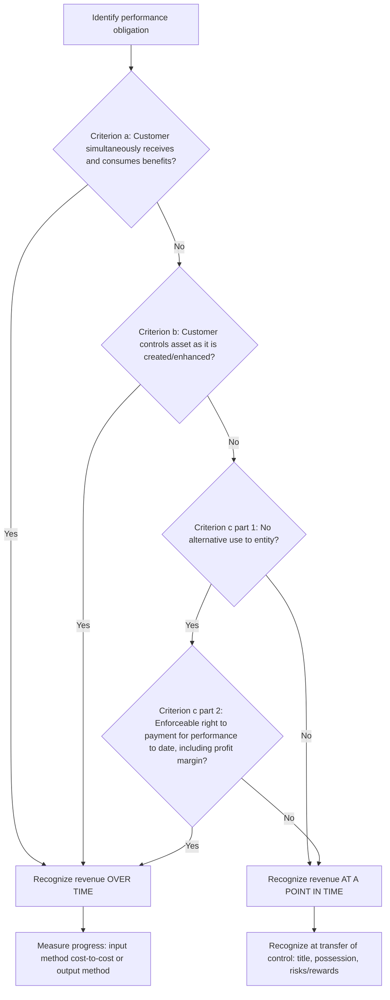
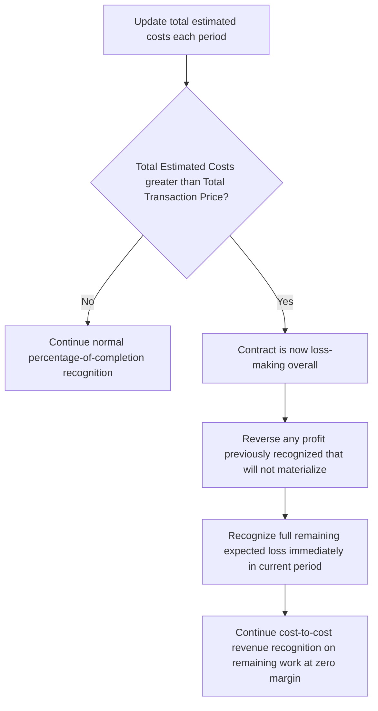

## Real Estate and Construction Contract Accounting

### Overview

Real estate and construction contracts present a distinct revenue recognition challenge: performance frequently spans multiple reporting periods, and determining *when* control transfers to the customer (a point in time versus over time) has a first-order impact on when revenue and profit are recognized. Since 2018 (IFRS) / 2018 (US GAAP, public entities; 2019 private), this area is governed by the converged **IFRS 15** *Revenue from Contracts with Customers* and **ASC 606** *Revenue from Contracts with Customers*, which replaced the older, industry-specific standards (IAS 11 *Construction Contracts*, the percentage-of-completion/completed-contract guidance under legacy US GAAP, and various real-estate-specific guidance including SOP 97-2/ASC 360-20 sale of real estate rules). This topic is a rare case where convergence between IFRS and US GAAP is genuinely high — the five-step model is essentially identical — making the analysis more about correct real-estate/construction-specific application than cross-framework reconciliation.

### The Five-Step Revenue Recognition Model (Foundational Recap)

1. Identify the contract with a customer.
2. Identify the performance obligations in the contract.
3. Determine the transaction price.
4. Allocate the transaction price to the performance obligations.
5. Recognize revenue when (or as) each performance obligation is satisfied.

The critical judgment for real estate and construction is embedded almost entirely in **Step 5**: determining whether control transfers **over time** or **at a point in time**.

### The Over-Time Recognition Criteria (IFRS 15.35 / ASC 606-10-25-27)

Revenue is recognized over time if **any one** of the following three criteria is met:

**Criterion (a):** The customer simultaneously receives and consumes the benefits of the entity's performance as the entity performs (e.g., routine or recurring services).

**Criterion (b):** The entity's performance creates or enhances an asset that the customer **controls** as the asset is created or enhanced (common in construction on land the customer already owns).

**Criterion (c):** The entity's performance does not create an asset with an alternative use to the entity, **and** the entity has an enforceable right to payment for performance completed to date.

$$Over\text{-}time\ Recognition = Criterion(a) \lor Criterion(b) \lor Criterion(c)$$

If none of the three criteria are met, revenue is recognized **at a point in time** — typically upon legal transfer of title, physical possession, and transfer of risks and rewards (the point-in-time indicators under IFRS 15.38).

### Application to Construction Contracts

**Criterion (b) is the most commonly applicable trigger in construction.** When a contractor builds on land or a structure the customer already legally owns or controls (e.g., a customer-owned commercial building being renovated, or infrastructure built on government-owned land under a public works contract), the customer controls the asset as it's built, satisfying criterion (b) directly regardless of alternative use or payment terms.

**Criterion (c) is the key trigger for contractor-owned-land or built-to-order scenarios**, requiring a two-part test:

1. **No alternative use** — the asset cannot be readily redirected to another customer, either due to contractual restriction or practical limitation (e.g., a highly customized building on a specific site with unique specifications).
2. **Enforceable right to payment for performance to date** — the contract must entitle the entity to an amount that at least compensates for performance completed to date (not merely costs incurred, but costs plus a reasonable profit margin) if the customer terminates for reasons other than the entity's non-performance.

$$Right\ to\ Payment \geq Costs\ Incurred\ to\ Date + Reasonable\ Profit\ Margin$$

If either element fails — the asset has alternative use, or the right to payment is merely cost recovery without profit margin — criterion (c) is not satisfied, and (absent criteria a or b) revenue recognition defaults to a point in time.

### Measuring Progress: Input vs. Output Methods

For contracts qualifying for over-time recognition, progress toward completion must be measured using either an **input method** or an **output method**, applied consistently to similar performance obligations.

**Output methods** measure progress by direct observation of value transferred to the customer:

- Surveys of performance completed to date
- Appraisals of results achieved
- Milestones reached
- Units produced or delivered

**Input methods** measure progress based on the entity's efforts or inputs toward satisfaction:

- Costs incurred relative to total expected costs (**cost-to-cost method** — the most common in construction)
- Labor hours expended
- Machine hours used

**Cost-to-cost percentage of completion formula:**

$$\%\ Complete = \frac{Costs\ Incurred\ to\ Date}{Total\ Estimated\ Costs}$$

$$Revenue_{cumulative} = \%\ Complete \times Total\ Transaction\ Price$$

$$Revenue_{current\ period} = Revenue_{cumulative,\ t} - Revenue_{cumulative,\ t-1}$$

**A critical input-method adjustment:** costs that do not depict progress (e.g., significant wasted materials, labor, or other resources not reflected in contract pricing; uninstalled materials where the entity acts as an agent) must be **excluded** from the cost-to-cost calculation, or progress will be overstated relative to actual value transferred.

### Worked Example: Percentage of Completion — Standard Construction Contract

**Facts:** A contractor builds a customized government office building on land owned by Batac City LGU (satisfying criterion (b) — customer controls the asset as it is built). Total contract price: PHP 120,000,000. Total estimated costs: PHP 96,000,000.

| Year | Costs Incurred (Cumulative) | % Complete | Cumulative Revenue | Current Year Revenue | Current Year Costs | Current Year Gross Profit |
| --- | --- | --- | --- | --- | --- | --- |
| 1 | 24,000,000 | 25.0% | 30,000,000 | 30,000,000 | 24,000,000 | 6,000,000 |
| 2 | 62,400,000 | 65.0% | 78,000,000 | 48,000,000 | 38,400,000 | 9,600,000 |
| 3 | 96,000,000 | 100.0% | 120,000,000 | 42,000,000 | 33,600,000 | 8,400,000 |

**Year 2 calculation detail:**

$$\%\ Complete_{Year\ 2} = \frac{62{,}400{,}000}{96{,}000{,}000} = 65\%$$

$$Cumulative\ Revenue_{Year\ 2} = 0.65 \times 120{,}000{,}000 = PHP\ 78{,}000{,}000$$

$$Current\ Year\ Revenue = 78{,}000{,}000 - 30{,}000{,}000 = PHP\ 48{,}000{,}000$$

### Contract Assets and Contract Liabilities

Under IFRS 15/ASC 606, "unbilled receivables" and "billings in excess of costs" terminology from legacy percentage-of-completion accounting is replaced with **contract assets** and **contract liabilities**:

$$Contract\ Asset = Cumulative\ Revenue\ Recognized - Cumulative\ Amounts\ Billed \quad (\text{if positive})$$

$$Contract\ Liability = Cumulative\ Amounts\ Billed - Cumulative\ Revenue\ Recognized \quad (\text{if positive})$$

**Extending the example — billing schedule:**

| Year | Cumulative Revenue | Cumulative Billings | Contract Asset / (Liability) |
| --- | --- | --- | --- |
| 1 | 30,000,000 | 25,000,000 | 5,000,000 (asset) |
| 2 | 78,000,000 | 85,000,000 | (7,000,000) (liability) |
| 3 | 120,000,000 | 120,000,000 | 0 |

A **contract asset** is distinct from a straightforward receivable — it represents a conditional right to consideration (conditional on something other than the mere passage of time, e.g., further performance or reaching a billing milestone), and is subject to impairment assessment under IFRS 9's expected credit loss model, similar to trade receivables.

### Onerous Contract / Expected Loss Recognition

If, at any point, total estimated costs exceed the total transaction price, the **entire expected loss** on the contract must be recognized immediately in the period the loss becomes evident — not spread over the remaining contract term. This is the direct construction-contract analog to IAS 37's onerous contract provisions.

**Worked example — mid-contract cost overrun:**

Continuing the prior example, suppose at the end of Year 2 (65% complete, PHP 62,400,000 costs incurred), a revised cost estimate increases total estimated costs to PHP 128,000,000 (exceeding the PHP 120,000,000 contract price).

$$Total\ Expected\ Loss = 120{,}000{,}000 - 128{,}000{,}000 = PHP\ (8{,}000{,}000)$$

Because the contract is now expected to be loss-making overall, the entity must recognize:

1. Reversal of any profit previously recognized in Year 1 and Year 2 that will not materialize.
2. The full remaining expected loss on uncompleted work, recognized immediately in Year 2 — not deferred to Year 3 when the loss physically occurs.

This immediate full-loss recognition rule is one of the most heavily tested mechanical points in construction contract accounting, precisely because it deviates from the otherwise-smooth percentage-of-completion pattern.

### Variable Consideration in Construction Contracts

Construction contracts frequently include variable consideration elements requiring estimation under the transaction price determination step:

- **Incentive/bonus payments** for early completion
- **Penalties/liquidated damages** for late completion
- **Claims** for additional compensation (scope changes, delays caused by the customer)
- **Unpriced change orders**

Variable consideration is estimated using either the **expected value** method (probability-weighted sum of possible outcomes) or the **most likely amount** method (single most likely outcome in a binary scenario), whichever better predicts the amount the entity is entitled to — and is subject to the **constraint**: variable consideration is only included in the transaction price to the extent it is **highly probable** (IFRS 15) / **probable** (ASC 606, a subtly different threshold in practice, though converged in intent) that a significant reversal will not subsequently occur.

$$Transaction\ Price = Fixed\ Consideration + Variable\ Consideration_{constrained}$$

**Worked example — bonus estimation:**

A contract includes a PHP 5,000,000 bonus if completed 30 days early. Based on progress, management assesses an 80% probability of achieving the bonus (expected value method used, deemed appropriate given the binary but not fully certain nature and management's ability to support the estimate with schedule data).

$$Expected\ Bonus = 5{,}000{,}000 \times 0.80 = PHP\ 4{,}000{,}000$$

If this estimate is judged to meet the "highly probable no significant reversal" constraint, PHP 4,000,000 is included in the transaction price and recognized over time as performance progresses; if the constraint is not met, the bonus is excluded until the constraint is satisfied (typically resolved close to or at completion).

### Real Estate Sales: Applying the Model

Real estate sale transactions (developer selling completed or under-construction residential/commercial units) require the same over-time-versus-point-in-time analysis, but with industry-specific fact patterns that drive the outcome:

**Point-in-time recognition (most common for standard real estate sales):** Where a developer sells a completed unit, or a unit under construction where the buyer does **not** control the work-in-progress asset (criterion (b) fails — the developer, not the buyer, controls the building until legal transfer) and criterion (c) fails (the developer typically **can** redirect the unit to another buyer before completion, and financing/deposit structures usually do not provide an enforceable right to full cost-plus-margin payment on cancellation) — revenue is deferred until legal title/possession transfers at completion or closing.

**Over-time recognition (pre-sold, customized, or specific jurisdictional structures):** Applies where:

- The buyer has a genuine, substantive right to specify or change the design during construction (supports "no alternative use"), **and**
- Local law or contract terms provide the developer an enforceable right to payment for work performed to date if the buyer cancels without cause (satisfying the second leg of criterion (c)).

This distinction is highly fact-specific and jurisdiction-dependent, since local real estate law governs whether a pre-completion buyer genuinely holds enforceable rights equivalent to specific performance or cost-plus-margin compensation on default — several jurisdictions' standard-form purchase contracts have historically failed the enforceable-right-to-payment test even when marketed as "under construction" sales, resulting in point-in-time (completion-based) recognition despite revenue having been collected progressively via installment billing.

### Process Flow: Over-Time vs. Point-in-Time Determination

### Process Flow: Onerous Contract Loss Recognition Trigger

### Diagram: Contract Asset/Liability Movement Over Contract Life (svg_diagram)

<svg xmlns="http://www.w3.org/2000/svg" viewBox="0 0 700 340">
<text x="350" y="25" text-anchor="middle" font-size="16" font-weight="bold" font-family="sans-serif">Contract Asset vs Liability Position (svg_diagram)</text>
<line x1="60" y1="180" x2="640" y2="180" stroke="black" stroke-width="2" />
<line x1="60" y1="60" x2="60" y2="300" stroke="black" stroke-width="2" />
<text x="640" y="200" font-size="11" font-family="sans-serif">Time</text>
<text x="40" y="70" font-size="11" font-family="sans-serif">Asset</text>
<text x="40" y="295" font-size="11" font-family="sans-serif">Liability</text>
<polyline points="150,155 350,240 550,180" fill="none" stroke="#2563eb" stroke-width="3" />
<circle cx="150" cy="155" r="5" fill="#16a34a" />
<circle cx="350" cy="240" r="5" fill="#dc2626" />
<circle cx="550" cy="180" r="5" fill="#555" />

<text x="150" y="140" text-anchor="middle" font-size="11" font-family="sans-serif">Y1: Asset 5.0M</text>

<text x="350" y="260" text-anchor="middle" font-size="11" font-family="sans-serif">Y2: Liability 7.0M</text>

<text x="550" y="165" text-anchor="middle" font-size="11" font-family="sans-serif">Y3: Settled to 0</text>

</svg>

### Disclosure Requirements

Both IFRS 15 and ASC 606 require extensive disclosures relevant to construction/real estate:

- Disaggregation of revenue by category (e.g., by contract type, geography, duration).
- Contract balances: opening/closing contract asset and liability balances, and revenue recognized in the period that was included in the opening contract liability balance.
- Significant judgments made in determining the timing of satisfaction of performance obligations (over time vs. point in time) and in determining the transaction price (including methods used for variable consideration and constraint application).
- Remaining performance obligations: aggregate transaction price allocated to unsatisfied (or partially satisfied) performance obligations, and when the entity expects to recognize that revenue.

### Forensic and Analytical Risk Areas

- **Percentage-of-completion cost estimate manipulation** — the single largest earnings management lever in construction accounting: understating total estimated costs at a period-end inflates the percent-complete calculation and accelerates revenue/profit recognition; conversely, overstating remaining costs can be used to defer income into future periods ("cookie jar" reserves).
- **Cost-to-cost input exclusion gaming** — improperly including costs that don't depict progress (e.g., bulk-purchased but uninstalled materials, or wasted/defective work) inflates the percent-complete figure beyond actual value delivered.
- **Criterion (c) alternative-use and enforceable-payment-right assertions used to accelerate real estate revenue** — developers under cash flow pressure may assert enforceable payment rights that do not genuinely exist under local contract/property law, recognizing revenue over time on pre-sold units that should properly be recognized only at completion.
- **Change order and claims revenue recognized before the "highly probable" constraint is genuinely satisfied** — recognizing disputed claims revenue prematurely, particularly when the claim is contested by the customer and litigation outcome is genuinely uncertain.
- **Loss contract identification deferral** — delaying the recognition of an evident cost overrun to avoid the immediate full-loss recognition requirement, spreading what should be an immediate charge across future periods instead.
- **Bill-and-hold arrangement misuse** — recognizing revenue on real estate or construction materials before genuine transfer of control, structured to accelerate reported sales near period-end.

[Inference] Because total estimated cost is the single denominator driving percentage-of-completion revenue recognition, auditors and forensic reviewers generally treat unexplained downward revisions to previously-stable cost estimates, particularly those occurring disproportionately near quarter-end or year-end, as the highest-priority item for corroboration against underlying project management and procurement records.

### Key Points

- The over-time-versus-point-in-time determination hinges on three alternative criteria; meeting any single one triggers over-time recognition.
- Criterion (b) (customer controls the asset as built) is the dominant trigger for infrastructure/customer-owned-site construction; criterion (c) (no alternative use plus enforceable payment right) governs built-to-order and most real estate development scenarios.
- Cost-to-cost is the dominant input method in construction, but costs not depicting progress must be excluded from the calculation.
- Expected losses on a contract must be recognized in full immediately upon becoming evident, not spread over remaining performance.
- Contract assets and contract liabilities replace legacy "costs and earnings in excess of billings" terminology and carry different risk characteristics (contract assets are subject to impairment assessment).
- Real estate over-time recognition is highly fact- and jurisdiction-specific, turning on genuine substantive design input rights and enforceable cost-plus-margin payment rights on cancellation.

**Related Topics**

- Variable consideration constraint methodologies: expected value vs. most likely amount
- Contract modification accounting (separate contract vs. cumulative catch-up)
- Warranty obligations: assurance-type vs. service-type warranties in construction
- Joint operations and joint venture accounting in construction consortia
- Capitalization of borrowing costs on qualifying real estate development assets (IAS 23)
- Expected credit loss impairment of contract assets under IFRS 9
- Sale-and-leaseback transactions in real estate (IFRS 16 interaction)