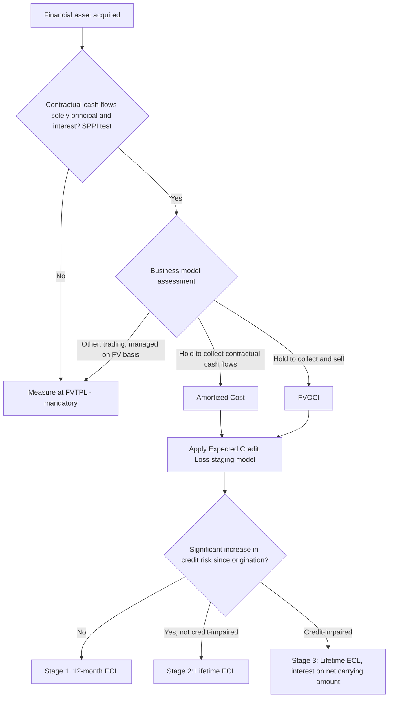
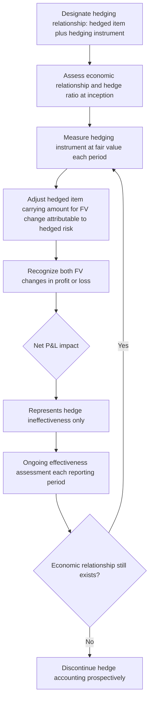

## Financial Institution and Banking Industry Accounting

### Overview

Banking and financial institution accounting is distinguished from general corporate accounting by the nature of the core business: financial instruments themselves are the inventory, and the primary risks (credit, interest rate, liquidity) are financial rather than operational in character. This creates specialized measurement and disclosure requirements across loan loss provisioning, financial instrument classification, capital adequacy, and fair value disclosure that don't arise in non-financial entities. The governing frameworks are **IFRS 9** *Financial Instruments* (IFRS) and **ASC 326** *Current Expected Credit Losses (CECL)* combined with **ASC 310/320/815** under US GAAP, layered with prudential/regulatory capital frameworks (Basel III) that interact with, but are distinct from, financial reporting standards.

### Classification and Measurement of Financial Assets (IFRS 9)

IFRS 9 classifies financial assets into three measurement categories based on two tests applied together — the **business model test** and the **contractual cash flow characteristics test** (often called the "SPPI test" — solely payments of principal and interest).

**Classification decision logic:**

| Business Model | Cash Flows are SPPI? | Classification |
| --- | --- | --- |
| Hold to collect contractual cash flows | Yes | Amortized Cost |
| Hold to collect and sell | Yes | Fair Value through Other Comprehensive Income (FVOCI) |
| Other (trading, held for sale, managed on fair value basis) | N/A | Fair Value through Profit or Loss (FVTPL) |
| Any business model | No (fails SPPI) | FVTPL (mandatory, regardless of business model) |

**The SPPI test** requires that contractual cash flows represent solely payments of principal and interest on the principal amount outstanding — meaning interest should reflect only the time value of money, credit risk, other basic lending risks (liquidity risk), and a profit margin. Instruments with leverage features, contingent/convertible terms, or equity-linked returns generally fail SPPI and default to FVTPL regardless of the business model held.

### Amortized Cost Measurement — Effective Interest Method

For financial assets/liabilities measured at amortized cost, interest income/expense is recognized using the **effective interest rate (EIR)** — the rate that exactly discounts estimated future cash flows through the expected life of the instrument to the gross carrying amount.

$$Carrying\ Amount_0 = \sum_{t=1}^{n} \frac{CF_t}{(1+EIR)^t}$$

$$Interest\ Income_t = Carrying\ Amount_{t-1} \times EIR$$

**Worked example — bond purchased at a discount:**

A bank purchases a 3-year bond, face value PHP 10,000,000, coupon 5% annual, for PHP 9,479,180 (yielding an effective rate of 7%).

| Year | Opening Carrying Amount | Interest Income (EIR 7%) | Cash Coupon (5%) | Closing Carrying Amount |
| --- | --- | --- | --- | --- |
| 1 | 9,479,180 | 663,543 | 500,000 | 9,642,723 |
| 2 | 9,642,723 | 674,991 | 500,000 | 9,817,714 |
| 3 | 9,817,714 | 687,240* | 500,000 + 10,000,000 | 0 |

*Adjusted slightly for rounding to converge exactly to face value at maturity.

$$Interest\ Income_{Year\ 1} = 9{,}479{,}180 \times 0.07 = PHP\ 663{,}543$$

### The Expected Credit Loss (ECL) Model — IFRS 9's Central Innovation

IFRS 9's replacement of the incurred loss model (under legacy IAS 39) with a forward-looking **expected credit loss** model is the single most significant change to bank accounting in the post-financial-crisis reform era. The ECL model requires recognition of credit losses **before** an actual loss event occurs, based on forward-looking information.

**Three-stage general approach:**

| Stage | Credit Risk Condition | ECL Measured Over | Interest Recognized On |
| --- | --- | --- | --- |
| Stage 1 | No significant increase in credit risk since origination | 12-month ECL | Gross carrying amount |
| Stage 2 | Significant increase in credit risk since origination (but not yet credit-impaired) | Lifetime ECL | Gross carrying amount |
| Stage 3 | Credit-impaired (objective evidence of impairment) | Lifetime ECL | Net carrying amount (amortized cost less loss allowance) |

**ECL calculation formula:**

$$ECL = \sum_{t} PD_t \times LGD_t \times EAD_t \times Discount\ Factor_t$$

Where:

- **PD** = Probability of Default
- **LGD** = Loss Given Default (1 − recovery rate)
- **EAD** = Exposure at Default

**12-month ECL** uses PD over the next 12 months applied to lifetime expected losses arising from default events possible within 12 months. **Lifetime ECL** uses PD over the full remaining life of the instrument.

### Worked Example: Three-Stage ECL Calculation

**Facts:** A commercial loan portfolio of PHP 500,000,000 is segmented:

| Stage | Gross Carrying Amount (PHP) | 12-month/Lifetime PD | LGD | EAD | ECL |
| --- | --- | --- | --- | --- | --- |
| Stage 1 | 400,000,000 | 1.5% (12-month) | 40% | 400,000,000 | 2,400,000 |
| Stage 2 | 80,000,000 | 12% (lifetime) | 45% | 80,000,000 | 4,320,000 |
| Stage 3 | 20,000,000 | 100% (already defaulted) | 55% | 20,000,000 | 11,000,000 |
| **Total** | **500,000,000** |  |  |  | **17,720,000** |

$$ECL_{Stage\ 1} = 0.015 \times 0.40 \times 400{,}000{,}000 = PHP\ 2{,}400{,}000$$

$$ECL_{Stage\ 2} = 0.12 \times 0.45 \times 80{,}000{,}000 = PHP\ 4{,}320{,}000$$

$$ECL_{Stage\ 3} = 1.00 \times 0.55 \times 20{,}000{,}000 = PHP\ 11{,}000{,}000$$

**Significant increase in credit risk (SICR)** is the trigger for Stage 1-to-2 transfer, and is the most judgment-intensive threshold in the entire model. Indicators include: changes in external credit ratings, significant changes in PD compared to origination, adverse changes in business/financial/economic conditions expected to affect the borrower's ability to meet obligations, and (as a backstop, rebuttable presumption) contractual payments more than 30 days past due.

### US GAAP: CECL (Current Expected Credit Losses, ASC 326)

CECL, effective for most SEC filers since 2020 and smaller reporting companies/private entities since 2023, is conceptually similar in spirit (forward-looking, day-one loss recognition) but structurally simpler than IFRS 9's three-stage model:

**Key CECL distinction:** there is **no staging concept**. CECL requires recognition of **lifetime expected credit losses** for essentially all in-scope financial assets **from initial recognition**, regardless of whether credit risk has increased — a single-measurement approach rather than IFRS 9's staged 12-month/lifetime bifurcation.

$$CECL\ Allowance = Lifetime\ Expected\ Credit\ Losses \quad (\text{from day one, no staging})$$

**Comparison table:**

| Aspect | IFRS 9 ECL | US GAAP CECL |
| --- | --- | --- |
| Staging | 3 stages (12-month vs. lifetime ECL) | No staging — lifetime ECL always |
| Day-one loss magnitude | Generally lower (12-month ECL for most performing loans) | Generally higher (full lifetime ECL immediately) |
| SICR assessment required | Yes (drives stage transfer) | No |
| Purchased credit-deteriorated assets | Specific POCI (purchased or originated credit-impaired) treatment | Specific PCD (purchased credit-deteriorated) treatment, broadly analogous |
| Forward-looking macroeconomic scenarios | Required, typically probability-weighted multiple scenarios | Required, reasonable and supportable forecast period, reverting to historical loss experience beyond |

The absence of staging under CECL generally results in **higher day-one allowances** compared to IFRS 9 for otherwise-identical loan portfolios, since even a newly originated, fully performing loan requires a full lifetime ECL allowance under CECL versus only a 12-month ECL allowance under IFRS 9 Stage 1 — a frequently tested quantitative contrast point.

### Hedge Accounting

Banks are the most intensive users of hedge accounting given their exposure to interest rate risk on large balance sheets. IFRS 9 (or, by policy choice, continued application of IAS 39's hedge accounting rules) and ASC 815 both permit three hedge types:

**Fair Value Hedge** — hedges exposure to changes in fair value of a recognized asset/liability or firm commitment. Both the hedging instrument and the hedged item's fair value change (attributable to the hedged risk) are recognized in profit or loss, ideally offsetting.

$$Net\ P\&L\ Impact = \Delta FV(Hedging\ Instrument) + \Delta FV(Hedged\ Item, \text{attributable to hedged risk})$$

**Cash Flow Hedge** — hedges exposure to variability in cash flows attributable to a particular risk (e.g., variable rate debt, forecast transactions). The effective portion of the hedging instrument's gain/loss is deferred in OCI (a cash flow hedge reserve) and reclassified to profit or loss when the hedged transaction affects earnings.

**Net Investment Hedge** — hedges foreign currency exposure on a net investment in a foreign operation; mechanically similar to cash flow hedge accounting.

**Hedge effectiveness (IFRS 9's more principles-based approach, replacing IAS 39's bright-line 80-125% test):**

IFRS 9 requires an **economic relationship** between the hedged item and hedging instrument, that credit risk does not dominate the value changes, and that the **hedge ratio** used for accounting matches the ratio actually used for risk management purposes — a qualitative and more flexible standard than IAS 39's rigid retrospective quantitative test, though many banks continue to perform quantitative effectiveness testing as supporting evidence.

### Worked Example: Fair Value Hedge

**Facts:** A bank holds a fixed-rate loan asset (PHP 100,000,000) and enters an interest rate swap (receive floating, pay fixed) to hedge fair value exposure to interest rate movements.

| Item | Fair Value Change |
| --- | --- |
| Hedged loan (fair value decrease due to rate increase) | (2,500,000) |
| Interest rate swap (fair value increase, offsetting) | 2,480,000 |
| **Net P&L impact (hedge ineffectiveness)** | **(20,000)** |

The PHP 20,000 ineffectiveness is recognized in profit or loss; if this were an unhedged position, the full PHP 2,500,000 fair value loss would flow through earnings, illustrating hedge accounting's core purpose — reducing accounting mismatch/volatility that would otherwise arise from measuring the hedging derivative at fair value while the hedged item is measured differently (or not measured at all, in the case of firm commitments).

### Fair Value Disclosure Requirements Specific to Banks

Banks carry disproportionately large populations of Level 2 and Level 3 fair value assets (structured products, illiquid loans, certain derivatives) compared to non-financial entities, making IFRS 13's fair value hierarchy disclosures (see the related "Fair value disclosures and sensitivity analysis" topic) particularly material. Additional bank-specific fair value considerations include:

- **Own credit risk adjustment (Debit Valuation Adjustment, DVA)** — for financial liabilities designated at FVTPL, changes in fair value attributable to the entity's **own credit risk** are presented in OCI (not profit or loss) under IFRS 9, preventing the counterintuitive result of recognizing a gain when the bank's own creditworthiness deteriorates.
- **Credit Valuation Adjustment (CVA)** on derivative assets — an adjustment to derivative fair values reflecting counterparty credit risk.
- **Day-one profit recognition restrictions** — where a financial instrument's transaction price differs from its fair value determined using a valuation technique with unobservable inputs, day-one profit recognition is restricted until the inputs become observable or the instrument is derecognized (IFRS 9.B5.1.2A).

### Capital Adequacy Interaction (Basel III) — Distinguishing Prudential from Accounting Requirements

It is a common point of confusion (and a valuable technical distinction) that **regulatory capital requirements (Basel III) are not the same framework as financial reporting standards**, though they interact closely:

- **Common Equity Tier 1 (CET1) ratio**, **Tier 1 capital ratio**, and **Total Capital ratio** are regulatory constructs measuring capital adequacy relative to risk-weighted assets, calculated per Basel III/local regulator rules — not per IFRS/US GAAP directly, though they start from accounting equity and apply prudential filters and deductions.

$$CET1\ Ratio = \frac{Common\ Equity\ Tier\ 1\ Capital}{Risk\text{-}Weighted\ Assets}$$

- ECL/CECL allowances directly affect retained earnings (accounting) and therefore CET1 capital, but regulators have historically permitted transitional arrangements phasing in the day-one capital impact of ECL/CECL adoption to avoid sudden capital ratio shocks.
- The **liquidity coverage ratio (LCR)** and **net stable funding ratio (NSFR)** are purely prudential liquidity metrics with no direct financial reporting standard counterpart, though disclosed in risk management sections of annual reports (often outside the audited financial statements themselves, in unaudited "Pillar 3" disclosures).

### Process Flow: IFRS 9 Financial Asset Classification

### Process Flow: Fair Value Hedge Accounting Mechanics

### Diagram: IFRS 9 vs CECL Day-One Allowance Comparison (svg_diagram)

<svg xmlns="http://www.w3.org/2000/svg" viewBox="0 0 700 320">
<text x="350" y="25" text-anchor="middle" font-size="16" font-weight="bold" font-family="sans-serif">Day-One Loss Allowance: IFRS 9 vs CECL (svg_diagram)</text>
<line x1="70" y1="260" x2="640" y2="260" stroke="black" stroke-width="2" />
<line x1="70" y1="260" x2="70" y2="60" stroke="black" stroke-width="2" />
<text x="30" y="160" font-size="11" font-family="sans-serif" transform="rotate(-90 30,160)">Allowance Amount</text>
<rect x="150" y="220" width="100" height="40" fill="#93c5fd" stroke="#1e40af" />
<text x="200" y="245" text-anchor="middle" font-size="11" font-family="sans-serif">IFRS 9</text>
<text x="200" y="280" text-anchor="middle" font-size="11" font-family="sans-serif">12-month ECL</text>
<text x="200" y="210" text-anchor="middle" font-size="10" font-family="sans-serif">(Stage 1, low)</text>
<rect x="400" y="100" width="100" height="160" fill="#f59e0b" stroke="#92400e" />
<text x="450" y="245" text-anchor="middle" font-size="11" fill="white" font-family="sans-serif">CECL</text>
<text x="450" y="280" text-anchor="middle" font-size="11" font-family="sans-serif">Lifetime ECL</text>
<text x="450" y="90" text-anchor="middle" font-size="10" font-family="sans-serif">(day one, no staging)</text>

<text x="350" y="300" text-anchor="middle" font-size="11" font-family="sans-serif">Same loan portfolio produces materially higher day-one allowance under CECL</text>

</svg>

### Forensic Accounting Relevance

Banking is one of the most heavily scrutinized industries for accounting manipulation given its systemic importance and the judgment embedded in credit risk modeling:

- **PD/LGD model manipulation** — understating probability of default or loss given default assumptions in internal ratings-based models to reduce ECL/CECL allowances and inflate reported capital and earnings; historically a major driver of bank failures where reported allowances proved dramatically insufficient relative to actual realized losses.
- **SICR threshold gaming (IFRS 9)** — setting internal SICR thresholds unreasonably high to keep deteriorating loans in Stage 1 (12-month ECL) rather than transferring to Stage 2 (lifetime ECL), understating the allowance.
- **Loan modification and troubled debt restructuring classification** — restructuring terms for distressed borrowers in ways designed to avoid credit-impaired (Stage 3/nonaccrual) classification, delaying recognition of losses.
- **Hedge accounting de-designation timing** — strategically discontinuing hedge accounting relationships to manage the timing of OCI reclassification into earnings, or conversely maintaining hedge designations where the economic relationship has genuinely broken down.
- **Fair value Level 3 model manipulation** for structured credit products and illiquid derivatives, where limited external verification is possible — a central feature of the 2008 financial crisis-era mortgage-backed security mispricing.
- **Off-balance-sheet structuring** — using securitization vehicles or other structures to achieve derecognition of loan assets (removing them, and their associated ECL/CECL burden, from the balance sheet) without genuine transfer of risks and rewards, requiring careful application of derecognition criteria (IFRS 9 Section 3.2 / ASC 860).

[Inference] Because ECL/CECL models rely on macroeconomic forecast inputs (unemployment projections, GDP growth, property price indices) that are inherently forward-looking and unverifiable at the time of estimation, regulators and forensic reviewers generally place heavy emphasis on back-testing — comparing prior-period forecast-based allowances against subsequently realized losses — as the most reliable indicator of whether an institution's loss estimation methodology is genuinely unbiased or has been calibrated toward a particular reported outcome.

### Key Points

- IFRS 9 classification depends jointly on the business model test and the SPPI cash flow characteristics test, driving amortized cost, FVOCI, or FVTPL treatment.
- The IFRS 9 three-stage ECL model recognizes 12-month ECL for performing assets and lifetime ECL upon significant credit risk deterioration or impairment; US GAAP's CECL requires lifetime ECL from day one with no staging, generally producing higher initial allowances.
- Hedge accounting (fair value, cash flow, net investment) exists to reduce accounting mismatches between derivatives measured at fair value and hedged items measured differently.
- Regulatory capital ratios (Basel III) are prudential constructs distinct from, but derived from, financial reporting figures — ECL/CECL allowances flow through to affect capital ratios via retained earnings.
- PD/LGD/EAD model assumptions are the highest-leverage, least externally verifiable inputs in bank financial statements, making them the primary forensic focus area.

**Related Topics**

- Basel III capital adequacy framework and risk-weighted asset calculation
- Derecognition of financial assets: securitization and true-sale analysis
- Purchased or originated credit-impaired (POCI) and purchased credit-deteriorated (PCD) asset accounting
- Fair value hierarchy disclosures and Level 3 sensitivity analysis (linked topic)
- Macroeconomic scenario weighting in expected credit loss models
- Troubled debt restructuring and loan modification accounting
- Own credit risk (DVA) presentation in other comprehensive income