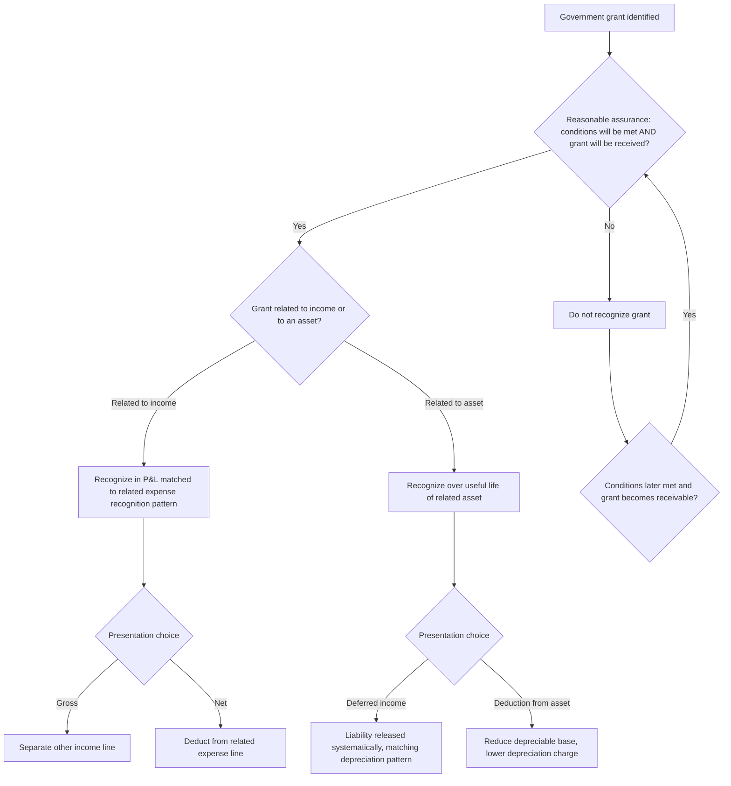

## Government Grant Recognition for Business Entities

### Overview

Government grants present a recognition timing problem distinct from ordinary revenue: an entity receives (or is entitled to receive) resources from government not in exchange for goods or services provided to that government in an ordinary commercial sense, but conditioned on past or future compliance with certain conditions. The governing standard under IFRS is **IAS 20** *Accounting for Government Grants and Disclosure of Government Assistance*. US GAAP has historically had **no single comprehensive standard** directly addressing for-profit entity government grant accounting (a notable and frequently tested gap), leading US GAAP preparers to analogize to other guidance — a structural asymmetry between the two frameworks that is itself an important technical point.

### Definitions Under IAS 20

**Government grants** are assistance by government in the form of transfers of resources to an entity in return for past or future compliance with certain conditions relating to the operating activities of the entity. This excludes:

- Forms of government assistance that cannot reasonably have a value placed on them (e.g., free technical or marketing advice, provision of guarantees).
- Transactions with government that cannot be distinguished from the entity's normal trading transactions (e.g., a government procurement contract priced at arm's length is not a grant).

**Government** is defined broadly to include government agencies and similar bodies, whether local, national, or international.

### The Two Recognition Preconditions

IAS 20.7 requires that government grants (including non-monetary grants at fair value) are **not recognized until there is reasonable assurance that:**

1. The entity will **comply with the conditions** attached to the grant, and
2. The **grant will be received**.

The mere receipt of a grant is not, by itself, conclusive evidence that both conditions have been satisfied — though in practice, receipt of cash is often taken as reasonable assurance of the second condition, while ongoing compliance monitoring addresses the first.

### The Core Recognition Principle: Matching Grants to Related Costs

IAS 20's central mechanism is that grants are recognized in profit or loss on a **systematic basis over the periods in which the entity recognizes the related costs** the grant is intended to compensate — mirroring the matching concept rather than recognizing grant income immediately upon receipt or entitlement (a point-in-time approach that IAS 20 specifically rejects for most grant types).

$$Grant\ Income_t = f(\text{pattern of related expense or asset consumption recognized in period } t)$$

This standard classifies grants into two broad categories with different mechanical treatments:

### Grants Related to Income

These compensate for expenses already incurred, or provide immediate financial support with no future related costs, or relate to future operating expenses.

**Recognition pattern:** recognized in profit or loss over the periods in which the related expenses are recognized, matched against those specific costs.

**Presentation choice (IAS 20.29) — a genuine accounting policy choice:**

1. **Gross presentation**: grant recognized as separate income (often "other income"), with related expenses shown at their full gross amount.
2. **Net presentation**: grant income is deducted from (netted against) the related expense line.

$$\text{Gross method: } Revenue - Expense_{gross} + Grant\ Income = Net\ Profit\ Impact$$

$$\text{Net method: } Revenue - (Expense_{gross} - Grant\ Income) = Same\ Net\ Profit\ Impact$$

Both methods produce identical net profit — the difference is purely presentational (gross revenue/expense figures versus a netted expense line), but this affects key ratios (gross margin, EBITDA) differently, making the disclosed policy choice analytically significant.

**Worked example:** A manufacturer receives a PHP 3,000,000 government grant to subsidize employee retraining costs for a new production line. Total retraining costs of PHP 5,000,000 are incurred and expensed over 2 years (PHP 2,500,000 per year).

| Year | Retraining Expense (Gross) | Grant Income Recognized | Net Expense (if net method) |
| --- | --- | --- | --- |
| 1 | 2,500,000 | 1,500,000 | 1,000,000 |
| 2 | 2,500,000 | 1,500,000 | 1,000,000 |

$$Grant\ Income_{Year\ 1} = 3{,}000{,}000 \times \frac{2{,}500{,}000}{5{,}000{,}000} = PHP\ 1{,}500{,}000$$

Grant income is matched to the pattern of expense recognition, not to the pattern of cash receipt (which might have been received entirely upfront in Year 1).

### Grants Related to Assets

These require an entity to purchase, construct, or otherwise acquire long-term (non-current) assets as a condition of the grant.

**Recognition pattern:** recognized in profit or loss over the useful life of the related asset, matching the pattern of depreciation.

**Presentation choice (IAS 20.24) — again, a genuine policy choice:**

1. **Deferred income method**: the grant is recognized as **deferred income** (a liability), released to profit or loss on a systematic basis over the asset's useful life (typically matching the depreciation charge pattern).
2. **Deduction from asset carrying amount method**: the grant is deducted from the asset's carrying amount, reducing the depreciable base; the grant is effectively recognized in profit or loss over the asset's useful life via a **reduced depreciation charge**, rather than as a separate income line.

**Worked example — comparing both methods:**

An entity purchases equipment for PHP 20,000,000 (useful life 5 years, straight-line, no residual value), receiving a PHP 4,000,000 government grant conditional on the purchase.

**Method 1 — Deferred income:**

| Year | Depreciation Expense | Deferred Grant Income Released | Net P&L Impact |
| --- | --- | --- | --- |
| 1 | 4,000,000 | 800,000 | (3,200,000) |
| 2–5 | 4,000,000 (each) | 800,000 (each) | (3,200,000) each |

$$Annual\ Depreciation = \frac{20{,}000{,}000}{5} = PHP\ 4{,}000{,}000$$

$$Annual\ Grant\ Release = \frac{4{,}000{,}000}{5} = PHP\ 800{,}000$$

**Balance sheet presentation:** Equipment shown gross at PHP 20,000,000 (less accumulated depreciation); Deferred grant income shown as a liability, released systematically.

**Method 2 — Deduction from asset:**

$$Net\ Depreciable\ Base = 20{,}000{,}000 - 4{,}000{,}000 = PHP\ 16{,}000{,}000$$

$$Annual\ Depreciation = \frac{16{,}000{,}000}{5} = PHP\ 3{,}200{,}000$$

| Year | Depreciation Expense (Net Basis) | Net P&L Impact |
| --- | --- | --- |
| 1–5 | 3,200,000 (each) | (3,200,000) each |

**Both methods produce an identical PHP 3,200,000 annual net profit impact** — again illustrating that the presentation choice is purely a display matter, not a measurement difference, but the balance sheet appears materially different: Method 1 shows a gross asset of PHP 20,000,000 with an offsetting liability, while Method 2 shows a net asset of PHP 16,000,000 with no separate liability. This affects total asset turnover ratios, debt-to-asset ratios, and other balance-sheet-based metrics even though income statement impact is unchanged.

### Repayable Grants (Grants Becoming Repayable)

If a government grant becomes repayable (e.g., due to a breach of attached conditions), it is accounted for as a **change in accounting estimate** (per IAS 8), not a prior period error or immediate below-the-line item:

- **For a grant related to income:** the repayment is first applied against any related unamortized deferred credit, with any excess recognized immediately as an expense.
- **For a grant related to an asset:** the repayment increases the carrying amount of the asset (if the deduction method was used) or reduces the deferred income balance (if the deferred income method was used), with any resulting excess depreciation that would have been recognized in prior periods absent the grant recognized immediately as an expense.

$$Immediate\ Expense_{repayment} = Repayment\ Amount - Remaining\ Unamortized\ Grant\ Balance \quad (\text{if repayment exceeds remaining balance})$$

### Non-Monetary Government Grants

Where a government grant takes the form of a non-monetary asset (e.g., land, a building, or other resources) made available to an entity at a below-market or nil cost, the entity has an accounting policy choice:

1. Record both the asset and the grant at the **fair value** of the non-monetary asset, or
2. Record the asset at a **nominal amount** (often zero or PHP 1) plus any incidental costs directly attributable to preparing the asset for its intended use.

This choice affects both the asset's carrying value (and subsequent depreciation) and the corresponding deferred grant income to be released.

### Government Assistance Not in Scope (Excluded from IAS 20's Grant Definition)

IAS 20 explicitly excludes certain forms of government assistance from its core grant recognition model:

- **Government assistance that takes the form of benefits available in determining taxable profit** or that are determined or limited on the basis of income tax liability (e.g., income tax holidays, investment tax credits, accelerated tax depreciation allowances) — these are addressed under **IAS 12** *Income Taxes*, not IAS 20.
- **Government participation in the ownership of the entity** (e.g., government equity injections) — treated as equity transactions, not grants.
- **Forgivable loans from government** — a loan is treated as a government grant when there is **reasonable assurance** that the entity will meet the terms for forgiveness of the loan; until then, it is accounted for as a financial liability under IFRS 9.

This tax-versus-grant boundary is a frequently tested distinction: a reduced corporate tax rate or investment tax credit is generally accounted for through the income tax accounting framework (affecting the effective tax rate reconciliation disclosure), not as government grant income under IAS 20, even though economically both mechanisms provide government financial support to the entity.

### US GAAP: The Absence of a Dedicated For-Profit Grant Standard

This is one of the most consequential IFRS/US GAAP divergences in this narrow but practically important area. US GAAP has historically had no direct equivalent to IAS 20 for for-profit business entities (a comprehensive standard, **ASC 958-605**, exists for not-for-profit entities' contribution accounting, but this scope explicitly excludes for-profit entities).

**In practice, US GAAP for-profit preparers analogize to one of several frameworks by policy election, disclosed as a significant accounting policy:**

| Analogized Framework | Basis | Typical Recognition Pattern |
| --- | --- | --- |
| IAS 20 by analogy | Explicitly permitted as an acceptable analogy in the absence of specific US GAAP guidance | Systematic recognition matched to related costs (mirrors IFRS) |
| Grant/contribution model (ASC 958-605, by analogy) | Analogized from not-for-profit guidance | Recognized as conditions are met; can differ from cost-matching pattern |
| Gain contingency model (ASC 450-30) | Conservative approach | Recognized only when all contingencies resolved / grant is realized or realizable, potentially delaying recognition versus IAS 20 |

This lack of a single authoritative model creates genuine diversity in practice among US GAAP preparers — a company's chosen government grant accounting policy (and the resulting income statement pattern and timing) is disclosed as a significant judgment, and comparing two US companies' grant accounting requires understanding which analogized framework each has elected, since the same grant fact pattern could produce different recognition timing depending on the policy chosen.

[Inference] Given this lack of prescriptive US GAAP guidance, entities in practice have tended toward the IAS-20-by-analogy approach for grants tied to specific identifiable costs (since it most closely mirrors the matching principle already embedded in US GAAP more broadly), while entities receiving grants with more open-ended or contingent conditions have more often applied the gain contingency model, though the specific choice remains an area of genuine practice diversity rather than settled convention.

### Process Flow: IAS 20 Grant Classification and Recognition

### Diagram: Grant-Related-to-Asset — Two Presentation Methods, Same Net Impact (svg_diagram)

<svg viewBox="0 0 700 340" xmlns="http://www.w3.org/2000/svg">
<text x="350" y="25" text-anchor="middle" font-size="16" font-weight="bold" font-family="sans-serif">Deferred Income vs Asset Deduction Method (svg_diagram)</text>

<text x="175" y="55" text-anchor="middle" font-size="13" font-weight="bold" font-family="sans-serif">Deferred Income Method</text>

<rect x="60" y="70" width="230" height="50" fill="`#93c5fd`" stroke="`#1e40af`"/>

<text x="175" y="100" text-anchor="middle" font-size="11" font-family="sans-serif">Asset: PHP 20M (gross)</text>

<rect x="60" y="130" width="230" height="50" fill="`#fde68a`" stroke="`#92400e`"/>

<text x="175" y="160" text-anchor="middle" font-size="11" font-family="sans-serif">Deferred Grant Liability: PHP 4M</text>

<text x="175" y="200" text-anchor="middle" font-size="11" font-family="sans-serif">Depreciation: PHP 4M/yr</text>

<text x="175" y="220" text-anchor="middle" font-size="11" font-family="sans-serif">Grant release: PHP 0.8M/yr</text>

<text x="525" y="55" text-anchor="middle" font-size="13" font-weight="bold" font-family="sans-serif">Asset Deduction Method</text>

<rect x="410" y="90" width="230" height="50" fill="`#86efac`" stroke="`#166534`"/>

<text x="525" y="120" text-anchor="middle" font-size="11" font-family="sans-serif">Asset: PHP 16M (net of grant)</text>

<text x="525" y="200" text-anchor="middle" font-size="11" font-family="sans-serif">Depreciation: PHP 3.2M/yr</text>

<text x="525" y="220" text-anchor="middle" font-size="11" font-family="sans-serif">No separate liability</text>

<text x="350" y="280" text-anchor="middle" font-size="12" font-weight="bold" font-family="sans-serif">Both: PHP 3.2M net annual P&L impact</text>

<text x="350" y="300" text-anchor="middle" font-size="11" font-family="sans-serif">Balance sheet presentation differs materially; income statement does not</text>

</svg>

### Disclosure Requirements (IAS 20.39)

- The accounting policy adopted for government grants, including the methods of presentation used (gross/net for income grants; deferred income/deduction for asset grants).
- The nature and extent of government grants recognized in the financial statements, and an indication of other forms of government assistance from which the entity has directly benefited.
- Unfulfilled conditions and other contingencies attaching to government assistance that has been recognized.

### Forensic and Analytical Risk Areas

- **Premature recognition before reasonable assurance is genuinely established** — recognizing grant income before compliance conditions are realistically expected to be met, particularly for grants with performance conditions extending well beyond the reporting period, to accelerate reported income.
- **Presentation choice used to obscure operating performance** — an entity might select gross presentation (grant as separate "other income") specifically to keep operating expense lines appearing lower or more favorable in ratio analysis, or select net presentation to inflate apparent gross margin, depending on which optic management wishes to emphasize; since IAS 20 permits genuine choice, this is a legitimate policy election but one requiring careful normalization by analysts comparing entities with different elections.
- **Reclassifying what is substantively a tax incentive as a "grant"** (or vice versa) to move the benefit between the income tax line and operating income — since the effective tax rate reconciliation and operating income are scrutinized differently by analysts and covenant calculations, this reclassification can be used to manage perceived operating performance.
- **US GAAP framework-shopping** — given the absence of a single prescribed model, an entity might select (or subtly shift between) analogized frameworks opportunistically to achieve a desired recognition pattern or timing, particularly around covenant compliance dates or executive compensation measurement periods.
- **Forgivable loan classification games** — asserting "reasonable assurance" of loan forgiveness prematurely to reclassify a liability as grant income before the forgiveness conditions are genuinely, objectively satisfied.
- **Non-monetary grant valuation manipulation** — inflating the assessed fair value of a non-monetary grant (e.g., donated land) to increase both the asset base and the corresponding grant income recognized over time.

### Key Points

- IAS 20 requires two preconditions before any grant recognition: reasonable assurance of compliance with conditions, and reasonable assurance of receipt.
- Grants related to income are matched to the related expense recognition pattern; grants related to assets are recognized over the asset's useful life, mirroring depreciation.
- Both income-related and asset-related grants offer a genuine presentation policy choice (gross/net; deferred income/asset deduction) that affects balance sheet and ratio presentation without changing net profit.
- Grants becoming repayable are treated as a change in accounting estimate, not a prior-period error.
- US GAAP has no comprehensive for-profit grant standard, creating genuine practice diversity as entities analogize to IAS 20, the not-for-profit contribution model, or the gain contingency model.
- Tax-based government incentives (tax holidays, investment tax credits) are excluded from IAS 20's grant model and addressed under IAS 12 instead.

**Related Topics**

- IAS 12 income tax accounting and effective tax rate reconciliation for tax-based incentives
- Forgivable government loans: financial liability versus grant classification
- Not-for-profit contribution accounting under ASC 958-605 (comparative framework)
- Government grants for biological assets under IAS 41 (specific interaction)
- Investment tax credit accounting under US GAAP
- Change in accounting estimate versus prior period error distinction (IAS 8)
- Non-monetary asset transactions and fair value measurement at initial recognition