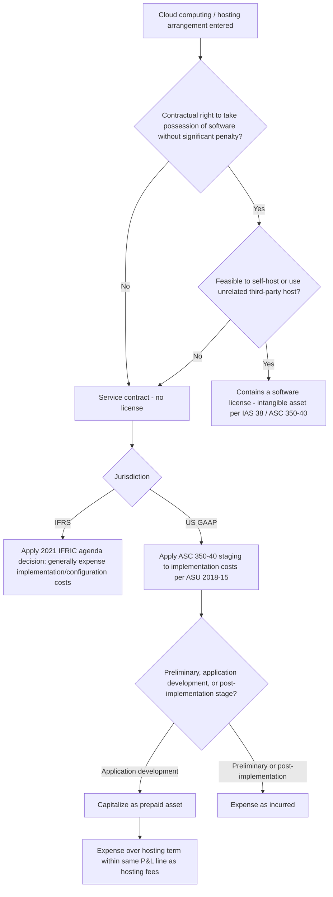
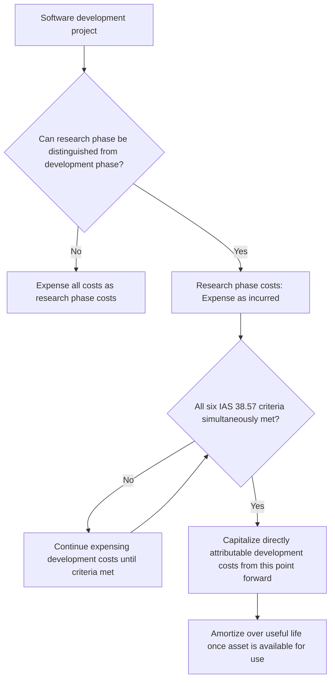

## Software Cost Capitalization and Cloud Computing Arrangements

### Overview

Software and cloud computing costs sit at the intersection of intangible asset accounting and service contract accounting, and the applicable framework depends entirely on **who controls the software** and **how it is delivered** — internally developed versus purchased, on-premise versus hosted, and whether a hosting arrangement conveys a software license or is purely a service. This area has been subject to significant standard-setting activity in the last decade, particularly around cloud computing arrangements, making it one of the more dynamically evolving corners of specialized industry accounting. The governing standards are **IAS 38** *Intangible Assets* under IFRS (with no IFRS-specific standard for cloud computing costs, resolved instead through IFRIC agenda decisions applying existing IAS 38/IAS 1 principles) and, under US GAAP, **ASC 350-40** *Internal-Use Software*, **ASC 985-20** *Costs of Software to Be Sold, Leased, or Marketed*, and **ASC 350-40** as amended by **ASU 2018-15** for cloud computing (hosting) arrangements.

### Part 1: Internally Developed Software — IAS 38 Framework

IAS 38 applies its general intangible asset recognition model to internally generated software, requiring separation of the **research phase** from the **development phase**, with fundamentally different treatment for each.

**Research phase costs** (original and planned investigation undertaken to gain new scientific or technical knowledge/understanding) are **expensed as incurred** — no exceptions.

**Development phase costs** (application of research findings to a plan/design for production of new or substantially improved materials, devices, products, processes, systems, or services, before commercial production) are **capitalized only if all six criteria under IAS 38.57 are simultaneously demonstrated:**

1. **Technical feasibility** of completing the intangible asset so it will be available for use or sale.
2. **Intention** to complete the intangible asset and use or sell it.
3. **Ability** to use or sell the intangible asset.
4. How the asset will generate **probable future economic benefits** (existence of a market, or usefulness if for internal use).
5. **Availability of adequate resources** (technical, financial, and other) to complete development and use/sell the asset.
6. **Ability to reliably measure** the expenditure attributable to the intangible asset during development.

$$Capitalized\ Development\ Cost = \sum (\text{Directly attributable costs incurred from the point all six criteria are met})$$

**Critical mechanical point:** if an entity cannot distinguish the research phase from the development phase of an internal project, **all** expenditure is treated as if incurred in the research phase and expensed — this creates a strong incentive (and audit focus area) for maintaining clear project-phase documentation.

**Directly attributable costs eligible for capitalization** typically include: costs of materials and services used, employee benefit costs of personnel directly engaged in developing the asset, fees to register a legal right, and amortization of patents/licenses used to generate the asset. **General overheads, selling costs, and identified inefficiencies/initial operating losses are excluded.**

### Worked Example: IAS 38 Software Development

**Facts:** An entity develops a proprietary logistics management platform over 18 months.

| Phase | Period | Costs Incurred (PHP) | Treatment |
| --- | --- | --- | --- |
| Research (technology feasibility studies, algorithm exploration) | Months 1–6 | 8,000,000 | Expensed |
| Development (Criteria met from Month 7) | Months 7–18 | 25,000,000 | Capitalized |
| Post-completion training and data migration | After Month 18 | 3,000,000 | Expensed (not part of development cost) |

$$Capitalized\ Intangible\ Asset = PHP\ 25{,}000{,}000$$

$$Total\ Expensed = 8{,}000{,}000 + 3{,}000{,}000 = PHP\ 11{,}000{,}000$$

The point at which all six criteria are simultaneously satisfied is the critical judgment — costs incurred **before** this point cannot be retroactively capitalized even if the project subsequently succeeds (IAS 38.71 explicitly prohibits reinstating previously expensed costs).

### Part 2: US GAAP — Internal-Use Software (ASC 350-40)

ASC 350-40 uses a **three-stage project lifecycle** model, structurally similar in spirit to IAS 38's research/development split but with different named stages and thresholds:

| Stage | Description | Treatment |
| --- | --- | --- |
| **Preliminary project stage** | Conceptual formulation, evaluation of alternatives, vendor/technology selection | Expensed as incurred |
| **Application development stage** | Design, coding, installation, testing (including parallel processing for data conversion, if applicable) | Capitalized |
| **Post-implementation/operation stage** | Training, application maintenance, data conversion (generally, except as noted) | Expensed as incurred |

**Capitalization begins** when (a) the preliminary project stage is complete, and (b) management with relevant authority authorizes and commits to funding the project, and it is probable the project will be completed and used for its intended function.

**Capitalizable application development stage costs include:**

- External direct costs of materials and services (third-party programmers, consultants)
- Payroll and payroll-related costs for employees directly associated with and devoting time to the project (to the extent of time spent directly on the project)
- Interest costs incurred while developing internal-use software (per ASC 835-20, capitalization of interest)

**Excluded regardless of stage:** general and administrative costs, overhead costs, and training costs (always expensed).

### Worked Example: ASC 350-40 Three-Stage Application

**Facts:** A US-reporting subsidiary of a multinational develops an ERP system.

| Stage | Costs (PHP) | Treatment |
| --- | --- | --- |
| Preliminary (vendor evaluation, technology selection) | 4,000,000 | Expensed |
| Application development (coding, configuration, testing) | 32,000,000 | Capitalized |
| Post-implementation (end-user training, minor bug fixes after go-live) | 5,000,000 | Expensed |

$$Capitalized\ Amount = PHP\ 32{,}000{,}000$$

**Key contrast with IAS 38:** ASC 350-40's capitalization trigger (management authorization and commitment to fund, combined with completion of the preliminary stage) is generally considered a **less stringent, more mechanically defined** threshold than IAS 38's six-criteria test — particularly criterion 4 (probable future economic benefits) and criterion 6 (reliable cost measurement), which require more substantive judgment. This can result in earlier capitalization onset under US GAAP relative to IFRS for functionally identical internal software projects, a frequently tested comparative point.

### Part 3: Software to Be Sold, Leased, or Marketed (ASC 985-20)

For software developed for **external sale** (a distinct US GAAP category from internal-use software), the capitalization trigger is different:

$$Capitalization\ begins\ at:\ Technological\ Feasibility$$

**Technological feasibility** is established upon completion of a detailed program design (or, if a detailed program design is not employed, a working model) — a narrower and generally **later** trigger point than ASC 350-40's internal-use software threshold, reflecting the different risk profile (external sale involves market and product-design risk that internal-use projects generally do not).

Costs incurred **before** technological feasibility (i.e., research and preliminary coding to prove the concept works) are expensed; costs incurred **after** technological feasibility but before general release to customers are capitalized, subject to a **net realizable value ceiling test**:

$$Capitalized\ Software\ Cost \leq NRV = Estimated\ Future\ Gross\ Revenue - Estimated\ Costs\ to\ Complete\ and\ Dispose$$

Amortization of capitalized software-to-be-sold costs uses the **greater of** the straight-line method over remaining useful life, or the ratio of current-period revenue to total current and anticipated future revenue from the product.

$$Amortization_t = \max\left(\frac{Net\ Carrying\ Amount}{Remaining\ Useful\ Life},\ Net\ Carrying\ Amount \times \frac{Revenue_t}{Total\ Current\ and\ Future\ Revenue}\right)$$

### Part 4: Cloud Computing Arrangements — The Modern Central Issue

Cloud computing (Software as a Service, or SaaS) arrangements raise a fundamentally different question: does the customer receive a **software license** (an intangible asset the customer controls), or is the arrangement purely a **service contract** (hosting)?

**The determinative test (both IFRS via IFRIC agenda decisions, and US GAAP under ASU 2018-15):**

A cloud computing arrangement includes a software license (and thus potential asset recognition by the customer) **only if both** of the following are present:

1. The customer has the **contractual right to take possession** of the software at any time during the hosting period without significant penalty, **and**
2. It is **feasible** for the customer to either run the software on its own hardware or contract with another party unrelated to the vendor to host the software.

If **either** condition fails, the arrangement is accounted for as a **service contract** — the customer does not recognize an intangible asset; hosting fees are expensed as incurred (or over the service period) as an operating expense, not capitalized as an intangible asset.

$$\text{Contains a License} = \text{Right to take possession} \land \text{Feasible to self-host or third-party host}$$

**In practice, the overwhelming majority of modern true SaaS arrangements (Salesforce-style multi-tenant cloud software) fail this test** — customers typically cannot take possession of the underlying software or migrate it to independent hosting, meaning most SaaS subscriptions are service contracts, not licenses, and generate no intangible asset for the customer.

### The IFRIC Agenda Decision (2021) — A Landmark Clarification for IFRS

IFRS lacks a cloud-computing-specific standard, so the IFRS Interpretations Committee issued an agenda decision in April 2021 addressing **configuration and customization costs** incurred by a customer in a SaaS arrangement that is a service contract (fails the license test above):

**Key conclusions of the agenda decision:**

- If the SaaS arrangement is a service contract (no license), configuration/customization costs generally **cannot** be recognized as a separate intangible asset, because the customer does not control an identifiable resource — the customization typically doesn't create a resource the customer controls independently of the SaaS vendor's platform.
- Such costs are expensed as incurred, **unless** the configuration/customization service is distinct from the SaaS access itself **and** creates a resource controlled by the entity that meets the separate identifiability and control criteria of IAS 38 (e.g., customization performed by a third party wholly independent of the SaaS vendor, resulting in code the customer owns and could deploy elsewhere).
- Even where upfront customization fees are paid to the SaaS vendor, if they don't meet the asset recognition criteria, they are typically expensed — and specifically, if the customer pays the vendor for both a distinct configuration service and ongoing access, judgment is required as to whether the configuration service is genuinely distinct and separately capable of benefiting the customer.

This agenda decision was significant because it retroactively required many entities (across IFRS jurisdictions) to reverse previously capitalized SaaS implementation costs and adjust to a same-period expense pattern, materially affecting reported operating expenses in the SaaS-heavy technology and services sectors.

### US GAAP Cloud Computing — ASU 2018-15 (Aligning Implementation Costs)

Recognizing the same underlying issue, the FASB took a **different resolution path** than IFRS: rather than concluding implementation costs should simply be expensed, ASU 2018-15 requires that a customer in a **hosting arrangement that is a service contract** apply the **same capitalization criteria as ASC 350-40's internal-use software model** to determine which **implementation costs** (not the hosting fees themselves) should be capitalized.

**Key mechanics under ASU 2018-15:**

- The three-stage internal-use software model (preliminary, application development, post-implementation) is applied to implementation activities.
- Capitalizable application-development-stage implementation costs (e.g., configuration, coding of interfaces, data conversion directly related to bringing the system to a functioning state) are capitalized **as a prepaid asset** (not as an intangible asset, since no license/intangible exists) presented in the same balance sheet line as other prepaid assets.
- This capitalized implementation cost asset is expensed over the **term of the hosting arrangement** (including reasonably certain renewal periods) — presented in the income statement within the **same line item** as the ongoing hosting fee expense (i.e., within operating expenses, not as amortization of an intangible asset).

**This is a striking IFRS/US GAAP divergence** despite both frameworks starting from the identical underlying question (SaaS implementation cost treatment): IFRS generally pushes toward expensing, while US GAAP permits capitalization (as a prepaid asset, not an intangible) of qualifying implementation costs, following the internal-use-software staging logic.

### Worked Example: ASU 2018-15 SaaS Implementation Cost Capitalization

**Facts:** A company enters a 5-year SaaS ERP subscription (no license — fails both tests, pure service contract). Implementation costs:

| Stage | Cost (PHP) | Treatment |
| --- | --- | --- |
| Preliminary (vendor selection, requirements gathering) | 2,000,000 | Expensed |
| Application development (configuration, data migration, interface coding) | 15,000,000 | Capitalized as prepaid asset |
| Training | 3,000,000 | Expensed |

$$Capitalized\ Implementation\ Cost = PHP\ 15{,}000{,}000$$

$$Annual\ Expense\ Recognition = \frac{15{,}000{,}000}{5\ years} = PHP\ 3{,}000{,}000\ per\ year$$

This PHP 3,000,000 is presented within operating expenses **alongside** the annual SaaS subscription fee, not as a separate amortization line — a specific presentation requirement distinguishing it from typical intangible asset amortization presentation.

### Comparative Table: IFRS vs. US GAAP Across the Software Spectrum

| Scenario | IFRS Treatment | US GAAP Treatment |
| --- | --- | --- |
| Internally developed software (research phase) | Expensed | Expensed (preliminary project stage) |
| Internally developed software (development/application phase) | Capitalized if 6 IAS 38.57 criteria met | Capitalized once management commits funding post-preliminary stage |
| Software to be sold externally | IAS 38 development criteria applied | ASC 985-20: capitalize from technological feasibility, NRV ceiling test |
| SaaS arrangement with genuine license (rare) | Intangible asset per IAS 38 | Intangible asset per ASC 350-40, license portion |
| SaaS arrangement, service contract, implementation costs | Generally expensed (per 2021 IFRIC agenda decision), narrow exceptions | Capitalized as prepaid asset if meeting internal-use software staging criteria (ASU 2018-15) |
| Presentation of capitalized SaaS implementation costs | N/A (generally expensed) | Prepaid asset; expensed within same line as hosting fee over contract term |

### Process Flow: Cloud Computing Arrangement Classification

### Process Flow: IAS 38 Internally Developed Software Decision Path

### Diagram: Capitalization Timeline Comparison (svg_diagram)

<svg xmlns="http://www.w3.org/2000/svg" viewBox="0 0 700 300">
<text x="350" y="25" text-anchor="middle" font-size="16" font-weight="bold" font-family="sans-serif">Software Capitalization Trigger Points (svg_diagram)</text>
<line x1="60" y1="80" x2="640" y2="80" stroke="black" stroke-width="2" />
<text x="60" y="70" font-size="10" text-anchor="middle" font-family="sans-serif">Start</text>
<text x="640" y="70" font-size="10" text-anchor="middle" font-family="sans-serif">Release</text>
<circle cx="280" cy="80" r="6" fill="#2563eb" />
<text x="280" y="105" text-anchor="middle" font-size="10" font-family="sans-serif">IAS 38: All 6</text>
<text x="280" y="118" text-anchor="middle" font-size="10" font-family="sans-serif">criteria met</text>
<circle cx="220" cy="80" r="6" fill="#16a34a" />
<text x="220" y="145" text-anchor="middle" font-size="10" font-family="sans-serif">ASC 350-40: Mgmt</text>
<text x="220" y="158" text-anchor="middle" font-size="10" font-family="sans-serif">commits funding</text>
<circle cx="380" cy="80" r="6" fill="#f59e0b" />
<text x="380" y="185" text-anchor="middle" font-size="10" font-family="sans-serif">ASC 985-20: Technological</text>
<text x="380" y="198" text-anchor="middle" font-size="10" font-family="sans-serif">feasibility (external sale)</text>

<text x="350" y="240" text-anchor="middle" font-size="11" font-family="sans-serif">ASC 350-40 generally triggers capitalization earliest;</text>

<text x="350" y="255" text-anchor="middle" font-size="11" font-family="sans-serif">ASC 985-20 (external sale) triggers latest</text>

</svg>

### Forensic and Analytical Risk Areas

- **Premature capitalization onset** — asserting IAS 38's six criteria (particularly technical feasibility and reliable cost measurement) are satisfied earlier than genuinely supportable, shifting what should be expensed R&D-style costs onto the balance sheet to inflate reported earnings and EBITDA.
- **Misclassifying research as development** (or vice versa) — since research costs must always be expensed, mischaracterizing exploratory/uncertain work as "development" is a direct earnings management lever.
- **SaaS license test manipulation** — asserting a cloud arrangement contains a software license (enabling intangible asset capitalization) when the contractual right to take possession or the practical feasibility of self-hosting does not genuinely exist, to avoid the more restrictive service-contract expense treatment.
- **Improper capitalization of post-implementation costs** — capitalizing training, ongoing maintenance, or minor enhancement costs that IAS 38/ASC 350-40 explicitly require to be expensed.
- **NRV ceiling test manipulation (ASC 985-20)** — overstating projected future revenue for software-to-be-sold products to avoid a required writedown of capitalized software costs.
- **Amortization period manipulation** — assigning unrealistically long useful lives to capitalized software or SaaS implementation assets, understating current-period expense.
- **Structuring SaaS implementation contracts to shift costs between capitalizable and non-capitalizable categories** — particularly relevant post-ASU 2018-15, where the distinction between preliminary/application-development/post-implementation stage costs is subject to considerable classification judgment, creating an incentive to reclassify what would otherwise be current-period training or support costs as "application development."

[Inference] Because the IAS 38 six-criteria test and the ASC 350-40 three-stage model both rely heavily on management's own internal project documentation and stage-gate records to substantiate the capitalization trigger point, auditors and forensic reviewers typically treat contemporaneous project management documentation (steering committee minutes, stage-gate approval memos, budget authorization records) as the primary evidentiary basis for testing whether the asserted capitalization start date is genuinely supportable, rather than relying on management's retrospective characterization alone.

### Key Points

- IAS 38 requires all six specific criteria to be simultaneously met before development costs can be capitalized; research costs are always expensed, with no exceptions.
- ASC 350-40's three-stage model for internal-use software generally triggers capitalization earlier (upon management commitment post-preliminary stage) than IAS 38's more stringent criteria-based test.
- ASC 985-20 (software to be sold externally) uses technological feasibility as its trigger — typically the latest of the three US GAAP/IFRS thresholds — and imposes a net realizable value ceiling.
- Cloud computing arrangements are classified as containing a license (asset) only if the customer can take possession and feasibly self-host or use an independent host; most modern SaaS fails this test and is a service contract.
- IFRS (per the 2021 IFRIC agenda decision) generally requires expensing SaaS implementation costs when no license exists; US GAAP (ASU 2018-15) permits capitalizing qualifying implementation costs as a prepaid asset under internal-use software staging logic — a significant cross-framework divergence.

**Related Topics**

- Amortization methods and useful life determination for capitalized intangibles
- Impairment testing of capitalized software assets (linkage to IAS 36/ASC 360)
- Research and development cost accounting more broadly (IAS 38 vs. ASC 730)
- Multi-element arrangement revenue recognition for software vendors (ASC 606/IFRS 15 interaction)
- Website development cost capitalization (SIC-32 and analogous US GAAP guidance)
- Patent and other intangible asset registration cost capitalization
- Subscription-based business model revenue recognition and deferred revenue mechanics