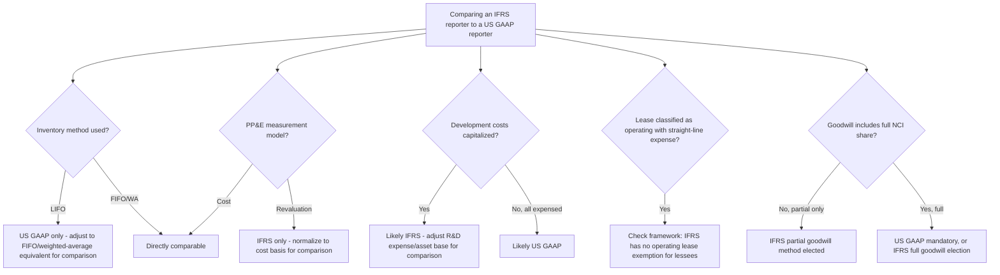

## Key Differences Between US GAAP and IFRS

### Overview

US GAAP (promulgated by the FASB, codified in the ASC — Accounting Standards Codification) and IFRS (promulgated by the IASB) are the two dominant global financial reporting frameworks. Despite a sustained convergence effort (the 2002 Norwalk Agreement between FASB and IASB, active roughly through the mid-2010s) that successfully aligned major areas like revenue recognition (IFRS 15/ASC 606) and leases (IFRS 16/ASC 842 — though even these retain divergences, as covered below), fundamental philosophical and structural differences persist. Understanding these differences is essential for cross-border financial statement analysis, multinational consolidation, and forensic work involving entities that report under different frameworks.

### Foundational Philosophical Distinction

**IFRS is principles-based** — a smaller volume of standards emphasizing the achievement of a fair presentation objective, requiring substantial professional judgment in application, supported by a conceptual framework that can itself be directly referenced when a specific standard doesn't address a fact pattern.

**US GAAP is rules-based** — a much larger body of detailed, specific guidance (the ASC runs to roughly 90+ topics with extensive implementation guidance, illustrative examples, and bright-line thresholds) designed to reduce diversity in practice by prescribing specific mechanical tests.

This is not merely a stylistic difference — it produces genuinely different outcomes: IFRS's principles-based approach can result in different entities reaching different conclusions on economically similar transactions (relying on differing professional judgment), while US GAAP's rules-based approach can result in structuring around bright lines (a transaction engineered to fall just outside a specific numerical threshold to avoid a particular accounting consequence) — a distinction of direct relevance to forensic accounting, since bright-line thresholds are inherently more susceptible to structuring/gaming than a principles-based "substance over form" test.

### Structural and Presentation Differences

| Aspect | IFRS | US GAAP |
| --- | --- | --- |
| Balance sheet order | Typically non-current before current (though not mandated) | Current before non-current (typical practice) |
| Balance sheet classification | Current/non-current split generally required | Classified (current/non-current) or unclassified permitted |
| Income statement | "Statement of profit or loss and other comprehensive income"; expense presentation by nature or function (choice) | "Income statement"; function-based presentation typical |
| Extraordinary items | Prohibited (no such category exists) | Also eliminated (ASU 2015-01) — historically permitted, now converged |
| Statement of cash flows — interest paid | Operating or financing (entity choice) | Operating only |
| Statement of cash flows — interest received | Operating or investing (entity choice) | Operating only |
| Statement of cash flows — dividends paid | Operating or financing (entity choice) | Financing only |
| Statement of cash flows — dividends received | Operating or investing (entity choice) | Operating only |
| Bank overdrafts | May be included in cash equivalents if integral to cash management | Generally classified as financing activity (borrowings) |

The interest/dividend classification flexibility under IFRS versus US GAAP's fixed classification is a frequently tested point, since it means two IFRS preparers can classify identical cash flow items differently — requiring analysts to check the specific policy disclosure before comparing operating cash flow figures across IFRS companies.

### Inventory Accounting

**LIFO (Last-In-First-Out) prohibition under IFRS** is one of the most consequential and frequently tested divergences:

$$\text{IFRS: LIFO is prohibited entirely (IAS 2.25)}$$

$$\text{US GAAP: LIFO is permitted (ASC 330) and widely used, particularly for tax conformity reasons}$$

Under US tax law, the LIFO conformity rule requires that if LIFO is used for tax purposes, it must also be used for financial reporting — creating a genuine economic incentive (tax deferral during inflationary periods) for US companies to adopt LIFO, an incentive that simply does not exist for IFRS preparers since LIFO is unavailable regardless.

**Inventory writedown reversal:**

$$\text{IFRS (IAS 2.33): reversal of previous writedowns is required when circumstances that caused the writedown no longer exist, up to the original cost}$$

$$\text{US GAAP (ASC 330): reversal of inventory writedowns is prohibited — once written down, the new (lower) value becomes the new cost basis with no subsequent reversal}$$

**Worked example — writedown reversal:**

Inventory with original cost PHP 5,000,000 is written down to net realizable value of PHP 3,800,000 in Year 1 due to a market price decline. In Year 2, market conditions recover and NRV rises to PHP 4,500,000.

$$\text{IFRS: reversal recognized} = 4{,}500{,}000 - 3{,}800{,}000 = PHP\ 700{,}000\ (\text{gain, capped at original cost of } 5{,}000{,}000)$$

$$\text{US GAAP: no reversal permitted; inventory remains at } PHP\ 3{,}800{,}000$$

### Property, Plant and Equipment

**Revaluation model:**

$$\text{IFRS (IAS 16): permits a policy choice between the cost model and the revaluation model (fair value)}$$

\text{US GAAP: revaluation of PP&E is prohibited entirely — cost model only}

**Component depreciation:**

IFRS explicitly requires **component depreciation** — each significant part of an item of PP&E with a materially different useful life must be depreciated separately (IAS 16.43). US GAAP does not explicitly mandate component depreciation in the same prescriptive manner, though it is permitted and used in some industries (this is more a difference in emphasis/practice than an outright prohibition).

**Impairment reversal (linked to the earlier impairment testing topic):**

$$\text{IFRS: impairment reversal permitted for assets other than goodwill, up to the depreciated historical cost that would have existed absent the original impairment}$$

$$\text{US GAAP: impairment reversal prohibited for all long-lived assets and goodwill}$$

### Impairment Testing Model Differences (Expanded Cross-Reference)

As covered in the dedicated impairment topic, the core recoverable amount concept differs structurally:

$$\text{IFRS: Recoverable Amount} = \max(FVLCD,\ VIU)$$

$$\text{US GAAP (ASC 360): two-step test} \rightarrow \text{undiscounted cash flow screen, then fair value measurement}$$

This means US GAAP can, in principle, delay impairment recognition relative to IFRS (since the undiscounted screening test in Step 1 is a lower bar to pass than IFRS's direct discounted-value comparison) — though once triggered, US GAAP measurement uses fair value alone, without the VIU concept's entity-specific synergy capture.

### Development Costs

$$\text{IFRS (IAS 38): development costs are capitalized once six specific criteria (technical feasibility, intent, ability, etc.) are met}$$

$$\text{US GAAP (ASC 730): research and development costs are generally expensed as incurred in their entirety, with narrow exceptions (e.g., software development, discussed in the linked software capitalization topic)}$$

This is a substantial and consequential divergence: an IFRS-reporting technology or pharmaceutical company can show meaningfully higher reported assets and lower current-period expense than an otherwise-identical US GAAP reporter, purely due to development cost capitalization — a critical normalization adjustment in cross-framework financial statement comparison and valuation work.

### Financial Instrument Classification and Impairment

| Aspect | IFRS 9 | US GAAP |
| --- | --- | --- |
| Impairment model | Expected Credit Loss (ECL), three-stage (12-month/lifetime) | CECL (ASC 326): lifetime ECL from day one, no staging |
| Classification | Business model + SPPI test → Amortized Cost / FVOCI / FVTPL | ASC 320/321/326: similar categories but different classification mechanics; equity securities generally at FVTPL under ASC 321 (limited exceptions) |
| Own credit risk on liabilities at FVTPL | Presented in OCI | Similarly presented in OCI (ASU 2016-01 aligned this point) |
| Hedge accounting effectiveness | Principles-based "economic relationship" test | More detailed effectiveness assessment methods under ASC 815, though ASU 2017-12 simplified this considerably toward IFRS's approach |

The CECL-versus-three-stage-ECL distinction (detailed in the banking industry topic) generally produces **higher day-one credit loss allowances under US GAAP** relative to IFRS 9 for economically identical loan portfolios.

### Leases

Despite convergence efforts producing broadly similar on-balance-sheet lease recognition (both IFRS 16 and ASC 842 eliminated most off-balance-sheet operating lease treatment for lessees), a key divergence remains in the **lessee income statement presentation**:

$$\text{IFRS 16: single lease expense model} \rightarrow \text{depreciation of right-of-use asset (straight-line)} + \text{interest expense on lease liability (front-loaded due to effective interest method)}$$

$$\text{US GAAP (ASC 842): dual model} \rightarrow \text{Finance leases: same as IFRS (depreciation + interest)}; \text{Operating leases: single straight-line total lease expense recognized}$$

**Worked example — Year 1 lease expense pattern, PHP 10,000,000 lease liability, 5-year term, 6% discount rate, PHP 2,373,964 constant annual payment:**

| Framework | Year 1 Depreciation/Amortization | Year 1 Interest | Total Year 1 Expense | Pattern |
| --- | --- | --- | --- | --- |
| IFRS 16 (all leases) | 2,000,000 | 600,000 | 2,600,000 | Front-loaded (declining over term) |
| US GAAP Operating Lease | — (single lease cost line) | — | 2,373,964 (constant) | Straight-line throughout |

Under IFRS 16, **all** leases (with limited short-term/low-value exemptions) produce a front-loaded expense pattern because interest expense is highest in early years (calculated on the largest remaining liability balance) and declines over time, while straight-line depreciation stays constant — the combination front-loads total expense. Under US GAAP, a lease classified as **operating** (the majority of real estate and equipment leases in practice) produces a constant, straight-line total expense pattern throughout the term — a materially different earnings trajectory for economically identical leases, making lease classification (finance vs. operating) under US GAAP a continuing area of significant judgment even post-ASC 842, whereas IFRS 16 eliminated the lessee classification distinction entirely.

### Goodwill and Business Combinations

| Aspect | IFRS 3 | ASC 805 |
| --- | --- | --- |
| Non-controlling interest (NCI) measurement | Choice: fair value (full goodwill) or proportionate share of net identifiable assets (partial goodwill) | Fair value method only (full goodwill) |
| Goodwill impairment testing unit | Cash-generating unit (CGU) — can be lower than a reporting unit | Reporting unit |
| Goodwill impairment test structure | One-step: compare CGU carrying amount to recoverable amount | One-step (post-ASU 2017-04): compare reporting unit carrying amount to fair value |
| Contingent consideration | Remeasured at fair value through P&L each period (if a liability) | Similarly remeasured at fair value through P&L (broadly converged) |
| Bargain purchase gain | Recognized immediately in P&L after reassessment | Recognized immediately in P&L after reassessment (converged) |

The **NCI measurement choice under IFRS** (full goodwill vs. partial goodwill method) is a significant divergence point — under the partial goodwill method (an IFRS-only option), total reported goodwill will be lower than under the mandatory full-goodwill approach required by US GAAP, for economically identical acquisitions with less-than-100%-owned subsidiaries.

**Worked example — NCI goodwill methods:**

Acquirer purchases 80% of Target for PHP 400,000,000. Target's net identifiable assets fair value: PHP 350,000,000. NCI fair value (20%, based on market price or valuation): PHP 95,000,000.

**Full goodwill method (mandatory under US GAAP; optional under IFRS):**

$$Goodwill = (Consideration + NCI\ FV) - Net\ Identifiable\ Assets = (400{,}000{,}000 + 95{,}000{,}000) - 350{,}000{,}000 = PHP\ 145{,}000{,}000$$

**Partial goodwill method (IFRS option only):**

$$Goodwill = Consideration - (80\% \times Net\ Identifiable\ Assets) = 400{,}000{,}000 - (0.80 \times 350{,}000{,}000) = PHP\ 120{,}000{,}000$$

The PHP 25,000,000 difference (attributable to NCI's implied share of goodwill) exists on the balance sheet under full goodwill but not under partial goodwill — directly affecting future goodwill impairment testing exposure.

### Provisions and Contingencies

$$\text{IFRS (IAS 37): a provision is recognized when a present obligation exists and it is "probable" (interpreted as more likely than not, i.e., } > 50\%\text{)}$$

$$\text{US GAAP (ASC 450): a loss contingency is recognized when "probable" (a materially higher threshold in practice, often interpreted as } \geq 75\text{–}80\%\text{, though not numerically defined) AND reasonably estimable}$$

This threshold interpretation gap — IFRS's "probable" sitting at a lower bar (just over 50%) than US GAAP's "probable" (a substantially higher likelihood in practice) — means an identical litigation exposure or restructuring obligation could result in liability recognition under IFRS while remaining only a disclosed contingent liability under US GAAP, a genuinely important and frequently misunderstood divergence given that both standards use the same English word "probable" with different practical meanings.

**Restructuring provisions:**

$$\text{IFRS: a constructive obligation can trigger provision recognition once a detailed formal plan exists and has begun to be implemented or been announced to those affected}$$

$$\text{US GAAP: generally requires a more specific triggering event (e.g., for one-time termination benefits, communication of the plan to employees with specific enough terms that they can reasonably determine their benefits) under ASC 420, and does not have as broad a "constructive obligation" concept}$$

### Interest Capitalization (Borrowing Costs)

$$\text{IFRS (IAS 23): capitalization of borrowing costs directly attributable to a qualifying asset is mandatory}$$

$$\text{US GAAP (ASC 835-20): capitalization of interest cost for qualifying assets is also mandatory — broadly converged in principle}$$

While broadly converged in the mandatory nature of capitalization, mechanical differences exist in specific averaging methodologies and the treatment of investment income earned on borrowed funds temporarily invested pending expenditure (IFRS requires netting this against capitalized borrowing costs; US GAAP does not require this netting).

### First-Time Adoption

$$\text{IFRS 1: provides a comprehensive framework and specific exemptions for entities adopting IFRS for the first time (e.g., business combinations exemption, fair value as deemed cost exemption)}$$

$$\text{US GAAP: has no equivalent comprehensive "first-time adoption" standard, since transitions into US GAAP are handled through specific transition guidance within individual standards rather than a unified framework}$$

### Process Flow: Key Divergence Decision Points in Cross-Framework Analysis

### Diagram: Probability Threshold Gap for Provisions (svg_diagram)

<svg xmlns="http://www.w3.org/2000/svg" viewBox="0 0 700 260">
<text x="350" y="25" text-anchor="middle" font-size="16" font-weight="bold" font-family="sans-serif">"Probable" Threshold: IFRS vs US GAAP (svg_diagram)</text>
<line x1="60" y1="150" x2="640" y2="150" stroke="black" stroke-width="2" />
<text x="60" y="175" font-size="11" font-family="sans-serif">0%</text>
<text x="350" y="175" font-size="11" text-anchor="middle" font-family="sans-serif">50%</text>
<text x="640" y="175" font-size="11" text-anchor="middle" font-family="sans-serif">100%</text>
<rect x="350" y="130" width="290" height="40" fill="#93c5fd" opacity="0.6" />
<text x="495" y="120" text-anchor="middle" font-size="11" font-family="sans-serif" font-weight="bold">IFRS "probable" zone (&gt;50%)</text>
<rect x="500" y="130" width="140" height="40" fill="#f59e0b" opacity="0.7" />
<text x="570" y="200" text-anchor="middle" font-size="11" font-family="sans-serif" font-weight="bold">US GAAP "probable"</text>
<text x="570" y="215" text-anchor="middle" font-size="11" font-family="sans-serif">(higher bar, ~75-80% in practice)</text>

<text x="425" y="230" text-anchor="middle" font-size="11" font-family="sans-serif">Zone between 50% and ~75-80%: liability recognized under IFRS, disclosed only under US GAAP</text>

</svg>

### Forensic and Analytical Relevance

- **Framework arbitrage in cross-listed entities** — multinational groups with subsidiaries reporting under different frameworks have structuring incentives (e.g., placing debt-financed qualifying assets, inventory-intensive operations, or R&D-heavy activities in the jurisdiction/framework producing the more favorable balance sheet or earnings presentation) that a forensic or M&A due diligence reviewer must normalize for genuine comparability.
- **"Probable" threshold gaming** — a US GAAP reporter facing genuine litigation exposure has more room to argue non-recognition (only disclosure) than an IFRS reporter would, given the differing practical thresholds — a legitimate framework difference, but one requiring careful attention when comparing loss contingency disclosures across frameworks in litigation or investigative contexts.
- **Goodwill impairment testing unit gaming** — IFRS's CGU-level testing (potentially many small units within an entity) versus US GAAP's reporting-unit-level testing (typically larger, more aggregated units) means the same underlying business deterioration might trigger an impairment charge earlier under IFRS's more granular testing level than under US GAAP's more aggregated approach, or vice versa depending on how profitable and unprofitable operations are distributed within the aggregation unit.
- **LIFO liquidation and layer analysis** — for US GAAP LIFO users, forensic analysts specifically examine "LIFO liquidation" events (where inventory quantities decline, causing older, lower-cost LIFO layers to flow into cost of goods sold), which can produce artificially inflated gross margins in a particular period — an analytical adjustment with no IFRS parallel given LIFO's prohibition.
- **Development cost capitalization policy consistency** — under IFRS, inconsistent or opportunistic timing in asserting the six IAS 38 criteria are met (discussed in the software capitalization topic) is a recognized earnings management lever with no direct US GAAP parallel, since US GAAP's blanket expensing approach removes this specific judgment area (though shifts the analytical focus instead to whether costs are being misclassified into the narrow exceptions, like software development, that do permit capitalization).

[Inference] Because IFRS's principles-based standards create more scope for genuine professional judgment divergence between similarly-situated entities, comparative financial statement analysis across the two frameworks generally requires normalizing adjustments in inventory costing method, PP&E measurement basis, capitalized development costs, and lease expense timing before ratio-based comparisons (return on assets, debt-to-equity, gross margin) can be considered meaningfully comparable — though the appropriate magnitude of each adjustment will vary considerably by industry and specific accounting policy elections made.

### Key Points

- IFRS is principles-based with a smaller standard set and heavier reliance on judgment; US GAAP is rules-based with extensive, detailed, often bright-line guidance.
- LIFO is prohibited under IFRS but permitted (and commonly used for tax reasons) under US GAAP — one of the most consequential single divergences for inventory-heavy industries.
- IFRS permits PP&E revaluation and impairment reversal (except goodwill); US GAAP prohibits both.
- IFRS capitalizes qualifying development costs under IAS 38's six-criteria test; US GAAP generally expenses R&D entirely, with narrow software-related exceptions.
- The word "probable" carries a materially different practical threshold under IFRS (just over 50%) versus US GAAP (a notably higher bar), directly affecting provision/contingent liability recognition timing.
- Lease accounting has converged on-balance-sheet recognition but retains a key lessee expense pattern divergence: IFRS 16 front-loads all lease expense; US GAAP's operating lease category produces straight-line expense.
- Goodwill measurement differs via the NCI measurement choice (IFRS's optional partial goodwill method versus US GAAP's mandatory full goodwill method) and the impairment testing aggregation unit (CGU vs. reporting unit).

**Related Topics**

- SEC Form 20-F reconciliation requirements for foreign private issuers (historical IFRS-to-US-GAAP reconciliation)
- IFRS 1 first-time adoption exemptions in detail
- Segment reporting differences (IFRS 8 vs. ASC 280 — largely converged but with some differences in aggregation criteria)
- Earnings per share computation differences (IAS 33 vs. ASC 260)
- Related party disclosure differences (IAS 24 vs. ASC 850)
- Consolidation and control assessment differences (IFRS 10 vs. ASC 810's VIE model)
- Deferred tax accounting differences (IAS 12 vs. ASC 740, including the initial recognition exemption)