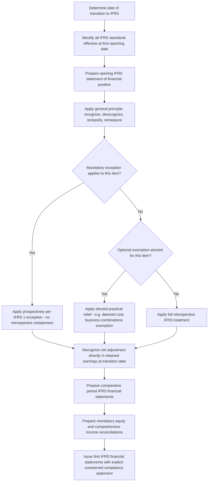

## First-Time Adoption of IFRS

### Overview

IFRS 1 *First-time Adoption of International Financial Reporting Standards* provides the exclusive, mandatory framework for any entity transitioning from its previous GAAP (whether national GAAP, US GAAP, or another framework) to IFRS for the first time. Its core purpose is to ensure an entity's first IFRS financial statements — and the interim reports within the comparative period — contain high-quality, transparent, and comparable information, while managing the practical cost and complexity of full retrospective application. IFRS 1 achieves this balance through a general retrospective application principle paired with a carefully limited set of **mandatory exceptions** and **optional exemptions**.

### Core Definitions

**Date of transition to IFRS** — the beginning of the earliest period for which an entity presents full comparative information under IFRS in its first IFRS financial statements.

**First IFRS financial statements** — the first annual financial statements in which an entity adopts IFRS by an explicit and unreserved statement of compliance with IFRS.

**Opening IFRS statement of financial position** — the entity's statement of financial position at the date of transition.

**Worked example — establishing key dates:**

An entity decides to adopt IFRS for the first time in its financial statements for the year ended December 31, 2027, presenting one year of comparative information (as is typical, and generally the minimum required).

$$\text{Date of transition to IFRS} = January\ 1,\ 2026$$

$$\text{End of comparative period} = December\ 31,\ 2026$$

$$\text{First IFRS reporting date} = December\ 31,\ 2027$$

This means the entity must prepare an **opening IFRS statement of financial position at January 1, 2026** — even though this is not a period presented in the primary annual report format, it is the foundational document from which all subsequent IFRS comparatives and current-period figures are derived, and it must itself comply (subject to the exemptions discussed below) with all IFRS standards effective as of the first IFRS reporting date (December 31, 2027) — not the standards in effect at the transition date itself. This "latest effective standards applied retrospectively to an earlier date" mechanic is a frequently misunderstood aspect of first-time adoption.

### The General Principle: Full Retrospective Application

IFRS 1's default, general rule (IFRS 1.7-8) requires an entity to apply, in its opening IFRS statement of financial position:

1. **Recognize** all assets and liabilities whose recognition is required by IFRS.
2. **Derecognize** items as assets or liabilities if IFRS does not permit such recognition (e.g., certain deferred costs recognized as assets under previous GAAP that IFRS requires to be expensed).
3. **Reclassify** items recognized under previous GAAP as one type of asset, liability, or equity component, but which are a different type under IFRS.
4. **Apply IFRS in measuring** all recognized assets and liabilities.

$$Opening\ IFRS\ Equity = Previous\ GAAP\ Equity + \sum(\text{Recognition, Derecognition, Reclassification, and Remeasurement Adjustments})$$

**All resulting adjustments are recognized directly in retained earnings** (or, if appropriate, another category of equity) at the date of transition — **not** through profit or loss, since these are transition adjustments reflecting the different starting framework, not current-period transactions.

### Worked Example: Opening IFRS Statement of Financial Position Adjustments

**Facts:** An entity transitioning from a previous local GAAP framework to IFRS at January 1, 2026 identifies the following differences:

| Item | Previous GAAP Treatment | IFRS Treatment | Adjustment |
| --- | --- | --- | --- |
| Internally developed software | Fully expensed | Development phase costs capitalized (IAS 38 criteria met) | +PHP 8,000,000 asset recognized |
| Proposed dividend (declared after year-end, before previous GAAP authorization date) | Recognized as a liability at year-end | Not a present obligation at year-end under IAS 10 — derecognized | −PHP 5,000,000 liability derecognized |
| Deferred exploration costs | Capitalized as an intangible asset | Reclassified as PP&E under local IFRS accounting policy election | Reclassification only, no net equity effect |
| Investment property | Cost model, no fair value disclosure | Fair value model elected under IAS 40 | +PHP 12,000,000 upward remeasurement |

**Cumulative equity adjustment:**

$$\Delta Equity = 8{,}000{,}000 + 5{,}000{,}000 + 12{,}000{,}000 = PHP\ 25{,}000{,}000\ \text{increase, recognized in retained earnings at transition}$$

Note the dividend derecognition **increases** equity (removing a liability increases net assets), while the reclassification item has no net equity effect since it merely moves the balance between asset categories.

### Mandatory Exceptions to Retrospective Application

IFRS 1 identifies several areas where **retrospective application is prohibited** — not optional, but a mandatory carve-out — generally because retrospective application would require the use of hindsight in a way that could distort or manipulate historical financial information:

1. **Estimates** — estimates made under previous GAAP at the date of transition must be consistent with estimates made for the same date under previous GAAP (adjusted only for accounting policy differences), unless there is objective evidence that those estimates were in error. This prevents an entity from using hindsight to "correct" a previous good-faith estimate simply because subsequent events revealed a different outcome.
2. **Derecognition of financial assets and liabilities** — an entity applies the IFRS 9 derecognition requirements prospectively from the transition date (with a very limited option to apply retrospectively from a date of the entity's choosing, provided the necessary information was obtained at the time of the original transactions).
3. **Hedge accounting** — an entity cannot retrospectively construct hedge accounting relationships that did not meet the qualifying criteria (including documentation) at the historical date; hedge accounting can only be reflected going forward from transition if the relationship genuinely qualifies at that date, with the exception of hedges of a net investment in a foreign operation which may be applied prospectively from a chosen date.
4. **Non-controlling interests** — certain requirements of IFRS 10 (e.g., attribution of total comprehensive income to NCI even if this results in a deficit) are applied prospectively from the date of transition.
5. **Classification and measurement of financial assets** — the assessment of whether a financial asset meets the SPPI criterion and the business model assessment are made on the basis of facts and circumstances existing at the date of transition, not with hindsight about what happened afterward.
6. **Impairment of financial assets** — the assessment of significant increase in credit risk (relevant to the ECL staging model) is based on reasonable and supportable information available without undue cost or effort at the date of transition, and there is a specific exception simplifying this determination when it is impracticable.

The estimates exception is the most conceptually important: it draws a firm line between correcting genuine previous GAAP measurement errors (permitted, even required) and using the benefit of hindsight to second-guess previously reasonable judgment calls (prohibited).

### Optional Exemptions from Retrospective Application

Unlike the mandatory exceptions, IFRS 1 grants entities a menu of **optional exemptions** — recognizing that full retrospective application in certain areas would be excessively costly or impracticable relative to the benefit. An entity may elect any, all, or none of these exemptions (each independently), and the choice must be disclosed.

**Business combinations exemption** — the single most commonly elected and most consequential exemption. An entity may elect **not** to retrospectively restate past business combinations that occurred before the date of transition to comply with IFRS 3. If elected:

- Goodwill as previously determined under previous GAAP is carried forward, subject to adjustment only for specific required items (e.g., recognizing intangible assets that were not separately recognized under previous GAAP but should be reclassified into or out of goodwill, and testing goodwill for impairment at the transition date under IAS 36 rather than restating the original purchase price allocation).
- This exemption can be elected on an all-or-none basis for all business combinations before a selected date, or applied to all business combinations before transition.

**Fair value or revaluation as deemed cost exemption** — an entity may elect to measure an item of PP&E, investment property, or an intangible asset at its **fair value** at the date of transition and use that fair value as its **deemed cost** going forward, rather than reconstructing a full historical cost basis and accumulated depreciation history under IFRS — a substantial practical relief where historical cost records are incomplete, unreliable, or prohibitively costly to reconstruct.

$$Deemed\ Cost_{transition} = Fair\ Value\ at\ Transition\ Date$$

**Cumulative translation differences exemption** — an entity may elect to reset the cumulative translation adjustment (CTA) for all foreign operations to **zero** at the date of transition, rather than reconstructing the full historical CTA balance retrospectively (which would otherwise require restating decades of foreign currency translation history under IFRS's specific rules).

$$CTA_{deemed} = 0 \quad \text{at transition date, if elected}$$

Any gain or loss on subsequent disposal of the foreign operation is then calculated only from the transition date forward, not from original acquisition — a practical simplification with a real economic consequence (the reset CTA amount is permanently excluded from any future disposal gain/loss calculation).

**Employee benefits (actuarial gains/losses) exemption** — an entity may elect to recognize all cumulative actuarial gains and losses on defined benefit pension plans at the date of transition, even if the entity's ongoing policy under previous GAAP deferred recognition of some portion (a "corridor" approach, now largely obsolete even under current IAS 19, but historically relevant for previous GAAP frameworks that still permitted it).

**Compound financial instruments exemption** — relief from the need to separately identify and account for the equity component of a compound instrument (e.g., a convertible bond) if the liability component is no longer outstanding at the date of transition.

**Other exemptions** exist for share-based payment transactions (relief from full retroactive fair-value-based expensing for equity instruments that vested before transition), insurance contracts, decommissioning liabilities included in the cost of PP&E, leases (transitional relief aligned with the broader IFRS 16 transition provisions), and several other narrower fact patterns.

### Worked Example: Business Combinations Exemption Applied

**Facts:** An entity acquired a subsidiary 6 years before its IFRS transition date. Under previous GAAP, goodwill of PHP 50,000,000 was recognized and has since been amortized (a previous GAAP practice not permitted under IFRS 3/IAS 36) down to a carrying amount of PHP 35,000,000 at the transition date.

**If the business combinations exemption is elected:**

1. The entity does **not** reconstruct the original IFRS 3 purchase price allocation.
2. The PHP 35,000,000 previous GAAP carrying amount becomes the **starting point** under IFRS.
3. **Amortization is discontinued** from the transition date forward (since IFRS prohibits goodwill amortization, requiring impairment-only testing under IAS 36 instead).
4. The entity must test this PHP 35,000,000 goodwill balance for impairment under IAS 36 **as of the transition date**, regardless of whether an impairment indicator existed under previous GAAP.

$$Opening\ IFRS\ Goodwill = \max(0,\ 35{,}000{,}000 - Impairment\ Loss\ if\ any)$$

If the exemption were **not** elected (full retrospective IFRS 3 application), the entity would need to reconstruct the entire original purchase price allocation as it would have been performed 6 years earlier under IFRS 3 — including original fair values of all identifiable assets/liabilities acquired at that historical date — a substantially more costly and often practically infeasible exercise, which is precisely why this exemption exists and is so commonly elected.

### Reconciliations Required in the First IFRS Financial Statements

IFRS 1.24-26 mandates specific reconciliations to help users understand the transition's impact — these reconciliations are a distinctive, one-time disclosure requirement not seen in ongoing IFRS reporting:

1. **Reconciliation of equity** reported under previous GAAP to equity under IFRS, at both:
   - The date of transition to IFRS, and
   - The end of the latest period presented under previous GAAP (typically the same as the comparative period-end under IFRS).
2. **Reconciliation of total comprehensive income** (or profit or loss, if total comprehensive income was not previously reported) under previous GAAP to total comprehensive income under IFRS, for the latest period in the entity's most recent previous GAAP annual financial statements.
3. If an **impairment loss or its reversal** was recognized for the first time in preparing the opening IFRS statement of financial position, disclosures equivalent to those required by IAS 36.

**Illustrative reconciliation structure:**

| Item | Previous GAAP (PHP) | Adjustment | IFRS (PHP) |
| --- | --- | --- | --- |
| Equity at January 1, 2026 (transition date) | 500,000,000 | +25,000,000 | 525,000,000 |
| Profit for year ended December 31, 2026 | 60,000,000 | +3,000,000 | 63,000,000 |
| Equity at December 31, 2026 (comparative period-end) | 560,000,000 | +28,000,000 | 588,000,000 |

Each adjustment line must be explained with sufficient detail for users to understand the nature of the change (e.g., "development cost capitalization: +PHP 2,000,000 profit impact from reduced current-year expense").

### Process Flow: IFRS 1 Adoption Sequence

### Diagram: Retrospective vs. Exempted Treatment Timeline (svg_diagram)

<svg xmlns="http://www.w3.org/2000/svg" viewBox="0 0 700 300">
<text x="350" y="25" text-anchor="middle" font-size="16" font-weight="bold" font-family="sans-serif">IFRS 1 Transition Timeline (svg_diagram)</text>
<line x1="60" y1="150" x2="640" y2="150" stroke="black" stroke-width="2" />
<circle cx="150" cy="150" r="6" fill="#2563eb" />
<text x="150" y="130" text-anchor="middle" font-size="11" font-family="sans-serif">Date of Transition</text>
<text x="150" y="115" text-anchor="middle" font-size="10" font-family="sans-serif">(Jan 1, 2026)</text>
<circle cx="400" cy="150" r="6" fill="#16a34a" />
<text x="400" y="130" text-anchor="middle" font-size="11" font-family="sans-serif">Comparative Period End</text>
<text x="400" y="115" text-anchor="middle" font-size="10" font-family="sans-serif">(Dec 31, 2026)</text>
<circle cx="600" cy="150" r="6" fill="#dc2626" />
<text x="600" y="130" text-anchor="middle" font-size="11" font-family="sans-serif">First IFRS Report Date</text>
<text x="600" y="115" text-anchor="middle" font-size="10" font-family="sans-serif">(Dec 31, 2027)</text>
<rect x="60" y="170" width="90" height="30" fill="#fca5a5" opacity="0.6" />
<text x="105" y="190" text-anchor="middle" font-size="10" font-family="sans-serif">Business combos</text>
<text x="105" y="215" text-anchor="middle" font-size="9" font-family="sans-serif">exemption applies</text>
<text x="105" y="228" text-anchor="middle" font-size="9" font-family="sans-serif">before this point</text>
<rect x="150" y="170" width="450" height="30" fill="#86efac" opacity="0.5" />
<text x="375" y="190" text-anchor="middle" font-size="10" font-family="sans-serif">Prospective mandatory exceptions apply from transition date forward</text>

<text x="350" y="260" text-anchor="middle" font-size="11" font-family="sans-serif">All transition adjustments hit retained earnings at Jan 1, 2026 - never profit or loss</text>

</svg>

### Interaction with Convergence Efforts (Contextual Link)

First-time adoption is where the IFRS-versus-previous-GAAP (frequently US GAAP for entities transitioning from a US GAAP-influenced jurisdiction, or a local GAAP historically modeled on it) divergences discussed in the general convergence topic become concretely operational: every structural difference (LIFO prohibition, development cost capitalization criteria, PP&E revaluation option, provision recognition thresholds, goodwill impairment-only model) surfaces as a specific line-item adjustment in the opening IFRS statement of financial position and the mandatory reconciliations. An entity's IFRS 1 transition disclosures are, in effect, a comprehensive real-world illustration of the accumulated divergence between the two frameworks as applied to that specific entity's actual balance sheet and transaction history.

### Forensic and Analytical Risk Areas

- **Selective exemption election to manage transition-date equity** — since several exemptions are optional and each affects the opening equity figure differently, an entity under scrutiny (e.g., approaching a debt covenant test keyed to equity or leverage ratios) has an incentive to elect the combination of exemptions that produces the most favorable opening equity position, a legitimate but analytically significant choice that must be understood by covenant parties and analysts.
- **Deemed cost fair value manipulation** — since the fair-value-as-deemed-cost exemption permits a one-time fair value election for PP&E/investment property, entities have an incentive to obtain aggressive fair value appraisals at the transition date specifically to establish a higher going-forward depreciable base or asset carrying value, effectively "resetting" asset values upward without genuine transaction support.
- **Impairment testing timing under the business combinations exemption** — since goodwill carried forward under the exemption must be tested for impairment "as of the transition date," there is a narrow but real incentive to time the transition date itself (where an entity has flexibility, e.g., a company merging or restructuring around the same period) to a point when market conditions temporarily support a higher recoverable amount, avoiding an impairment charge on legacy goodwill that might otherwise be unavoidable.
- **Estimates exception exploitation** — while the estimates exception is designed to prevent inappropriate hindsight, an entity might attempt to characterize a previously made poor estimate as requiring "correction of an error" (permitted, allowing a more favorable restated position) rather than accepting the original (less favorable) previous GAAP estimate as-is, when the facts do not genuinely support an error characterization.
- **Reconciliation disclosure quality and completeness** — since the equity and comprehensive income reconciliations are the primary user-facing window into the transition's financial statement impact, incomplete or vaguely worded reconciling item descriptions can obscure the true magnitude and nature of specific adjustments from analysts and auditors performing first-year IFRS due diligence.

[Inference] Because the business combinations and deemed cost exemptions carry the largest potential balance sheet impact of any first-time adoption election, and because both involve considerable one-time valuation judgment exercised only once (at the transition date, never repeated), these two areas typically receive the most intensive audit and regulatory scrutiny during an entity's first IFRS reporting cycle, though the specific enforcement emphasis will vary by jurisdiction and the materiality of the elections made.

### Key Points

- IFRS 1 requires full retrospective application of IFRS effective at the first reporting date, applied back to the date of transition, subject to specific mandatory exceptions and optional exemptions.
- All opening balance sheet transition adjustments are recognized directly in retained earnings (or other equity), never through profit or loss.
- Mandatory exceptions (estimates, derecognition, hedge accounting, NCI, financial instrument classification, impairment) are prohibited from retrospective restatement to prevent inappropriate use of hindsight.
- Optional exemptions (most notably business combinations and fair-value-as-deemed-cost) provide practical relief from excessively costly full retrospective reconstruction, and can be elected independently.
- Mandatory equity and comprehensive income reconciliations are the key one-time disclosure mechanism connecting previous GAAP figures to their IFRS equivalents.

**Related Topics**

- Key differences between US GAAP and IFRS (linked topic — the substantive divergences that transition adjustments operationalize)
- IFRS 3 business combinations and purchase price allocation mechanics
- IAS 16 revaluation model and deemed cost concepts
- IAS 21 cumulative translation adjustment mechanics
- Segment reporting and related disclosure differences across frameworks
- SEC foreign private issuer reporting and historical Form 20-F reconciliation requirements
- Accounting policy changes and correction of errors under IAS 8