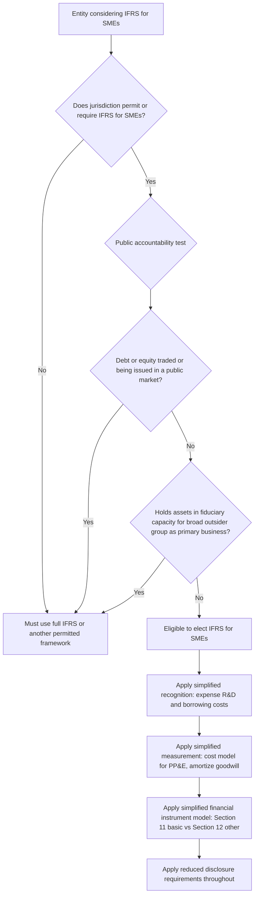

## IFRS for Small and Medium-Sized Entities

### Overview

The **IFRS for SMEs Standard** (issued 2009, with major revisions in 2015 and a third edition effective 2027 following the 2024 amendments) is a deliberately simplified, self-contained financial reporting framework designed for entities that do not have public accountability but still need or wish to produce general purpose financial statements for external users (lenders, credit rating agencies, suppliers, customers). It is not a scaled-down summary of full IFRS but a standalone standard — approximately 250-300 pages compared to the several-thousand-page full IFRS body of standards — organized into a single volume with its own numbered sections rather than cross-referencing individual full IFRS standards.

### Scope: Defining "SME" for This Purpose

The IFRS for SMEs Standard's use of "SME" is a defined technical term specific to this standard, **not** a size-based test (revenue, employees, or asset thresholds are explicitly **not** used to determine eligibility). Instead, eligibility hinges entirely on the absence of **public accountability**:

**An entity has public accountability (and therefore should use full IFRS, not IFRS for SMEs) if either:**

1. Its debt or equity instruments are traded in a public market, or it is in the process of issuing such instruments for trading in a public market (a domestic or foreign stock exchange, or an over-the-counter market), **or**
2. It holds assets in a fiduciary capacity for a broad group of outsiders as one of its primary businesses — this specifically captures banks, credit unions, insurance companies, securities brokers/dealers, mutual funds, and investment banks, even if privately held, because their business model inherently involves holding other people's money.

$$\text{Eligible for IFRS for SMEs} = \neg(\text{Publicly traded instruments}) \land \neg(\text{Primary business: fiduciary holding of assets for broad outsider group})$$

**Critical point:** a large privately-held manufacturing company with billions in revenue is eligible to use IFRS for SMEs (assuming local jurisdiction permits it) precisely because it has no public accountability, while a tiny publicly-listed startup with minimal revenue is **not** eligible, since public accountability — not size — is the determinative test. This is a frequently tested distinction given the intuitive but incorrect assumption that "SME" refers to company size.

**Jurisdictional permission required:** whether an entity may actually use the IFRS for SMEs Standard depends on the laws and regulations of the jurisdiction in which it operates — the IASB does not itself mandate its use anywhere; individual jurisdictions decide whether to permit, require, or prohibit its use for qualifying entities (a two-tier authorization structure worth distinguishing from full IFRS, which similarly requires jurisdictional adoption but is far more widely mandated for public companies globally).

### Core Design Philosophy: Simplification Approaches

The IASB developed the IFRS for SMEs Standard using several deliberate simplification strategies relative to full IFRS:

1. **Omission of topics not relevant to typical SMEs** — entire sections of full IFRS addressing earnings per share (relevant only to publicly traded entities), interim financial reporting, segment reporting, insurance contracts (addressed separately given SME insurers' rare qualification anyway), and assets held for sale are simply **not included**, since these topics are largely irrelevant to non-publicly-accountable entities.
2. **Simplified recognition and measurement principles** — where full IFRS offers a choice between a cost model and a more complex fair value/revaluation model, IFRS for SMEs frequently mandates only the simpler option, or simplifies the more complex model itself.
3. **Substantially reduced disclosure requirements** — full IFRS disclosure notes can run to hundreds of items across many standards; IFRS for SMEs disclosure requirements are dramatically reduced, reflecting the more limited user base (fewer sophisticated capital market participants relying on granular footnote disclosure).
4. **Fewer available accounting policy choices** — where full IFRS permits a choice (e.g., the revaluation model for PP&E), IFRS for SMEs frequently reduces or eliminates the choice to reduce complexity.

### Key Simplification Areas: Recognition and Measurement Differences from Full IFRS

**Goodwill and intangible assets:**

$$\text{Full IFRS (IAS 36/38): goodwill and indefinite-life intangibles are NOT amortized; tested for impairment at least annually}$$

$$\text{IFRS for SMEs: goodwill and ALL intangible assets (including those with indefinite useful lives under full IFRS) are amortized over their useful life; if useful life cannot be reliably estimated, a rebuttable presumption of 10 years applies}$$

This is a major practical simplification — it eliminates the need for annual goodwill impairment testing (a complex, judgment-intensive, and costly exercise under full IFRS) in favor of straightforward systematic amortization, at the cost of losing the more economically precise (but far more burdensome) impairment-only approach.

**Worked example — goodwill treatment comparison:**

An SME-eligible entity recognizes PHP 40,000,000 goodwill in an acquisition, with no reliably estimable useful life.

$$\text{IFRS for SMEs: Annual amortization} = \frac{40{,}000{,}000}{10\ years} = PHP\ 4{,}000{,}000\ per\ year$$

$$\text{Full IFRS: No amortization; annual impairment test required (potentially PHP 0 amortization if no impairment triggers)}$$

**Development costs (research and development):**

$$\text{Full IFRS (IAS 38): development costs capitalized once six specific criteria are met}$$

$$\text{IFRS for SMEs: ALL research and development expenditure is expensed as incurred — no capitalization option at all}$$

This mirrors the US GAAP position discussed in the broader convergence topic — IFRS for SMEs deliberately aligns with the simpler, universally-expensed treatment rather than requiring SMEs to navigate the judgment-intensive six-criteria capitalization test.

**Borrowing costs:**

$$\text{Full IFRS (IAS 23): capitalization of borrowing costs directly attributable to a qualifying asset is mandatory}$$

$$\text{IFRS for SMEs: ALL borrowing costs are expensed as incurred — capitalization is prohibited}$$

**Property, plant and equipment and investment property:**

\text{Full IFRS: revaluation model permitted for PP&E (IAS 16); fair value model available for investment property (IAS 40)}
\text{IFRS for SMEs: cost model only for PP&E (no revaluation option); investment property measured at fair value through profit or loss ONLY IF fair value can be measured reliably without undue cost or effort — otherwise, treated as PP&E under the cost model}

**Financial instruments:**

Full IFRS 9's classification model (business model test + SPPI test, three measurement categories, three-stage ECL model) is significantly simplified in IFRS for SMEs into a two-tier structure:

- **Section 11 (Basic Financial Instruments)** — covers straightforward instruments (cash, receivables/payables, basic loans, basic debt/equity investments) measured generally at amortized cost or, for certain equity investments with a reliable fair value, at fair value through profit or loss — using a simplified **incurred loss** impairment model rather than the full ECL model.
- **Section 12 (Other Financial Instrument Issues)** — covers more complex instruments (derivatives, hedge accounting, more complex debt/equity features), generally requiring fair value through profit or loss measurement.

The **incurred loss model retained for basic financial instruments under IFRS for SMEs** (rather than the forward-looking ECL model mandatory under full IFRS 9) is a substantively different — and generally simpler to apply, though less forward-looking — impairment approach, directly contrasting with the ECL/CECL discussion covered in the banking industry topic.

**Defined benefit pension plans:**

$$\text{Full IFRS (IAS 19): actuarial gains/losses recognized immediately in OCI (no deferral option)}$$

$$\text{IFRS for SMEs: similar immediate recognition, but permits a simplified measurement approach if obtaining a full actuarial valuation would involve undue cost or effort — allowing a simplified method that ignores estimated future salary increases, future service by current employees, and possible in-service mortality}$$

This "undue cost or effort" simplified pension measurement option has no direct full IFRS parallel and reflects the practical recognition that many SMEs cannot justify the cost of a full actuarial valuation for what may be a small or simple pension arrangement.

### Worked Example: Investment Property Measurement Under IFRS for SMEs

**Facts:** An SME-eligible entity owns two investment properties:

- Property A: located in an active, liquid urban commercial real estate market with abundant comparable transactions — fair value reliably measurable without undue cost or effort.
- Property B: a specialized rural agricultural processing facility with no active market and no comparable sales data — fair value cannot be reliably measured without undue cost or effort (would require a costly specialized valuation).

**Treatment:**

$$Property\ A: \text{Measured at fair value through profit or loss each period (Section 16)}$$

Property\ B: \text{Measured under the PP&E cost model (Section 17) — cost less accumulated depreciation and impairment}

This "undue cost or effort" qualifier — appearing in several sections of IFRS for SMEs (investment property, pension plans, and elsewhere) — is a recurring, deliberately pragmatic escape valve unique to this standard, absent from full IFRS, reflecting the standard's core design philosophy that measurement rigor should not impose disproportionate cost on smaller, non-publicly-accountable entities.

### Disclosure Simplifications

IFRS for SMEs disclosure requirements are a small fraction of full IFRS's cumulative disclosure burden. Illustrative comparison:

| Disclosure Area | Full IFRS | IFRS for SMEs |
| --- | --- | --- |
| Fair value hierarchy and Level 3 sensitivity analysis | Extensive (IFRS 13, as covered in the earlier fair value topic) | Substantially reduced; no formal three-level hierarchy disclosure requirement |
| Segment reporting | Required for entities with publicly traded securities (IFRS 8) | Not applicable — omitted entirely from the standard |
| Earnings per share | Required for entities with publicly traded securities (IAS 33) | Not applicable — omitted entirely |
| Related party disclosures | Extensive (IAS 24) | Simplified, focusing on key management personnel compensation in aggregate and material related party transactions |
| Financial instrument risk disclosures | Extensive quantitative and qualitative (IFRS 7) | Simplified, more qualitative-focused |

### Simplified Consolidated and Separate Financial Statements

IFRS for SMEs Section 9 addresses consolidation with generally the same control-based approach as full IFRS (IFRS 10), but with fewer detailed application rules for complex structures (structured entities, variable interest arrangements), reflecting the assumption that SME group structures are typically less complex than those found in large multinational or publicly listed groups.

### Comparison Table: Key Simplifications Summary

| Area | Full IFRS | IFRS for SMEs |
| --- | --- | --- |
| Goodwill/indefinite-life intangibles | No amortization; annual impairment test | Amortized over useful life (10-year rebuttable presumption if unknown) |
| Development costs | Capitalized if 6 criteria met | Always expensed |
| Borrowing costs | Mandatory capitalization for qualifying assets | Always expensed |
| PP&E measurement | Cost or revaluation model | Cost model only |
| Investment property | Fair value model (with cost model alternative in specific circumstances) | Fair value if reliably measurable without undue cost/effort; otherwise cost model |
| Financial instrument impairment | Expected Credit Loss (ECL), forward-looking | Incurred loss model (basic instruments) |
| Segment reporting, EPS | Required (public entities) | Not addressed — omitted |
| Number of standards/sections | ~40+ full standards plus interpretations | 35 sections, single integrated volume |

### Process Flow: Determining Eligibility and Key Treatment Differences

### Diagram: Full IFRS vs IFRS for SMEs Volume and Complexity Comparison (svg_diagram)

<svg xmlns="http://www.w3.org/2000/svg" viewBox="0 0 700 300">
<text x="350" y="25" text-anchor="middle" font-size="16" font-weight="bold" font-family="sans-serif">Standard Volume Comparison (svg_diagram)</text>
<rect x="100" y="240" width="150" height="20" fill="#93c5fd" stroke="#1e40af" />
<text x="175" y="235" text-anchor="middle" font-size="11" font-family="sans-serif">IFRS for SMEs</text>
<text x="175" y="270" text-anchor="middle" font-size="10" font-family="sans-serif">~35 sections, single volume</text>
<rect x="350" y="80" width="250" height="180" fill="#f59e0b" stroke="#92400e" />
<text x="475" y="70" text-anchor="middle" font-size="11" font-family="sans-serif">Full IFRS</text>
<text x="475" y="270" text-anchor="middle" font-size="10" font-family="sans-serif">40+ standards, interpretations, application guidance</text>

<text x="350" y="20" text-anchor="middle" font-size="10" font-family="sans-serif" />

</svg>

### Adoption Considerations and the 2024 Amendments (Third Edition)

The IASB periodically reviews the IFRS for SMEs Standard (roughly every few years) to consider whether to align it with developments in full IFRS. The most substantial recent review resulted in amendments (finalized 2024, generally effective for annual periods beginning on or after January 1, 2027) that, among other changes, aligned certain aspects of the revenue recognition model in IFRS for SMEs more closely with the full IFRS 15 five-step model (previously IFRS for SMEs retained a simpler risk-and-rewards-based revenue model closer to the pre-2018 approach), and introduced a simplified expected credit loss concept for Section 11 while still stopping well short of full IFRS 9's three-stage complexity. [Unverified] The precise final scope and simplification calibration of these 2027-effective amendments should be confirmed against the IASB's final issued text, since standard-setting amendments of this scale sometimes shift in final drafting relative to exposure draft proposals.

### Forensic and Analytical Risk Areas

- **Public accountability test manipulation** — an entity structuring around the fiduciary-holding-of-assets test (e.g., disguising the nature of a lending or deposit-taking business to avoid triggering mandatory full IFRS) to remain eligible for the less rigorous IFRS for SMEs framework and its reduced disclosure burden.
- **Undue cost or effort assertions used opportunistically** — since several IFRS for SMEs provisions permit simpler treatment when fair value or full valuation would involve "undue cost or effort," an entity might assert this qualifier is met specifically to avoid a fair value measurement that would produce a less favorable (e.g., lower) reported asset value, rather than because the cost/effort genuinely is disproportionate.
- **Comparability limitations for credit and lending decisions** — because IFRS for SMEs uses simpler, generally more conservative-by-default measurement (cost model PP&E, amortized goodwill, expensed R&D and borrowing costs), a lender or credit analyst comparing an IFRS for SMEs-reporting borrower against a full-IFRS-reporting comparator must recognize that reported profitability, asset base, and leverage ratios are not directly comparable without normalization — a genuine analytical risk in cross-entity credit analysis rather than a manipulation risk per se.
- **Jurisdictional arbitrage in group structures** — a multinational group with subsidiaries in multiple jurisdictions might structure entity-level reporting frameworks (full IFRS in some jurisdictions, IFRS for SMEs in others where locally permitted) to manage which subsidiaries face the more rigorous disclosure and measurement requirements, complicating group-wide financial statement analysis and consolidation adjustments.

[Inference] Because the "undue cost or effort" qualifier appears in several distinct sections without a single bright-line quantitative threshold, this phrase functions as the primary area of residual judgment within an otherwise deliberately simplified standard, and is therefore the area most likely to receive focused audit attention when an SME's financial statements are subject to external assurance.

### Key Points

- Eligibility for IFRS for SMEs turns entirely on the absence of public accountability (no publicly traded instruments, no primary fiduciary-holding business) — not on company size, revenue, or employee count.
- Jurisdictional permission is required independently of IASB issuance; the IASB does not mandate its use anywhere.
- Key simplifications include: mandatory goodwill/intangible amortization (no impairment-only model), mandatory expensing of R&D and borrowing costs, cost-model-only PP&E, and a simplified incurred-loss financial instrument impairment model.
- The "undue cost or effort" qualifier is a distinctive, recurring pragmatic relief mechanism unique to this standard.
- Disclosure requirements are dramatically reduced relative to full IFRS, reflecting the more limited external user base typically relying on SME financial statements.

**Related Topics**

- Key differences between US GAAP and IFRS (linked topic — many IFRS for SMEs simplifications converge toward positions closer to US GAAP's simpler mandatory-expensing approach)
- First-time adoption of IFRS for SMEs (a parallel, separate transition framework within the standard itself)
- Small business financial reporting frameworks under US GAAP (e.g., the AICPA's Financial Reporting Framework for Small and Medium-Sized Entities, a non-GAAP alternative)
- Section 11 and Section 12 financial instrument classification mechanics in detail
- Private company accounting alternatives under US GAAP (PCC-endorsed ASU simplifications)
- Jurisdictional IFRS adoption status and local GAAP convergence pathways
- Related party disclosure requirements comparison across frameworks