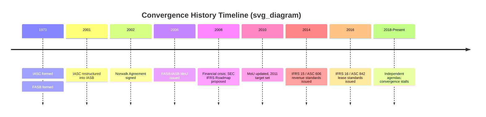
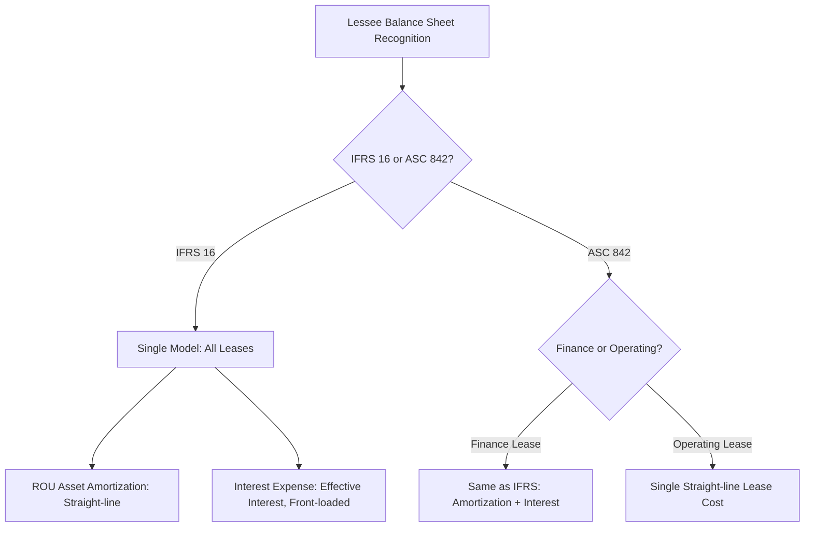

## Convergence History and Remaining Divergence Areas

### Overview

The convergence of International Financial Reporting Standards (IFRS) and U.S. Generally Accepted Accounting Principles (GAAP) represents one of the most significant projects in the history of financial accounting standard-setting. It refers to the multi-decade effort by the International Accounting Standards Board (IASB) and the U.S. Financial Accounting Standards Board (FASB) to reduce or eliminate differences between the two frameworks so that financial statements prepared under either system would be more comparable across borders.

### Historical Timeline

#### Pre-Convergence Era (1973–2001)

- **1973**: The International Accounting Standards Committee (IASC) is formed by professional accountancy bodies from ten countries, issuing International Accounting Standards (IAS).
- **1973**: The FASB is simultaneously established in the U.S., replacing the Accounting Principles Board (APB).
- Through the 1980s–1990s, IAS and U.S. GAAP develop largely independently, with IAS often criticized as containing too many allowed alternatives to be truly comparable.
- **1995–2000**: IASC undertakes a "Core Standards" project with IOSCO (International Organization of Securities Commissions) to produce a set of standards robust enough for cross-border securities listings.

#### Formation of the IASB and Early Convergence (2001–2002)

- **2001**: The IASC is restructured into the **International Accounting Standards Board (IASB)**, an independent standard-setter housed under the IFRS Foundation. New standards issued from this point are called **IFRS**; legacy IAS standards remain in force unless superseded.
- **2002 — The Norwalk Agreement**: The FASB and IASB meet in Norwalk, Connecticut, and formally commit to:
  - Developing high-quality, compatible accounting standards
  - Removing a variety of individual differences between IFRS and U.S. GAAP
  - Coordinating future work programs to maintain compatibility once achieved

This agreement is the foundational milestone of the modern convergence movement.

#### The Memorandum of Understanding Era (2006–2010)

- **2006**: FASB and IASB issue a **Memorandum of Understanding (MoU)**, identifying priority projects (revenue recognition, leases, financial instruments, insurance contracts, consolidation) as short-term and long-term convergence targets.
- **2008**: The global financial crisis accelerates political pressure for a single set of global standards, particularly around fair value measurement and off-balance-sheet financing.
- **2008**: The SEC publishes a proposed "Roadmap" for potential mandatory IFRS adoption by U.S. public companies.
- **2010**: The MoU is updated, reaffirming a target completion date of 2011 for major joint projects.

#### Convergence of Major Standards (2010–2016)

Several landmark joint (or near-joint) standards emerge from this period:

| Project | IFRS Result | US GAAP Result | Convergence Outcome |
| --- | --- | --- | --- |
| Revenue Recognition | IFRS 15 (2014) | ASC 606 (2014) | Substantially converged |
| Leases | IFRS 16 (2016) | ASC 842 (2016) | Converged on recognition, **diverged on lessee expense pattern** |
| Financial Instruments — Classification | IFRS 9 (2014) | ASC 825/321 | Partially converged |
| Financial Instruments — Impairment | IFRS 9 Expected Credit Loss | CECL (ASC 326) | Same objective, **different methodology** |
| Consolidation | IFRS 10 (2011) | ASC 810 (VIE model) | Conceptually aligned, mechanically different |

- **2012**: The SEC issues its final Staff Report on IFRS, effectively declining to set a firm timetable for mandatory U.S. adoption, marking a turning point where full convergence begins to lose momentum in favor of selective alignment.

#### Post-2016: Stalled Convergence and Divergent Paths

- **2014 onward**: Both boards increasingly pursue **independent agendas** rather than joint standard-setting. The formal MoU process is effectively discontinued.
- The FASB retains a **rules-based**, highly detailed standard-setting philosophy (heavily influenced by litigation risk and bright-line tests), while the IASB continues a **principles-based** approach emphasizing professional judgment.
- IFRS becomes mandatory or permitted in over 140 jurisdictions; the United States remains the largest capital market that has **not adopted IFRS** for domestic issuers (foreign private issuers filing with the SEC may use IFRS as issued by the IASB without reconciliation to U.S. GAAP, per a 2007 SEC rule change).

### Conceptual Framework Differences

Although both boards have worked to align their conceptual frameworks, philosophical differences persist:

- **Principles-based (IFRS) vs. Rules-based (US GAAP)**: IFRS relies more heavily on the exercise of professional judgment against broad principles; U.S. GAAP tends to provide detailed, prescriptive guidance and bright-line thresholds (e.g., specific percentage tests).
- **Substance over form**: Both frameworks nominally endorse this, but U.S. GAAP's detailed rules can sometimes be structured around (a practice sometimes termed "form over substance" in a rules-based system).

### Major Remaining Areas of Divergence

#### 1. Inventory Costing

- **US GAAP**: Permits **LIFO** (Last-In, First-Out) in addition to FIFO and weighted-average.
- **IFRS**: **Prohibits LIFO** entirely (IAS 2).
- **Lower of cost or market**: US GAAP (post-ASU 2015-11 for most entities) uses **lower of cost or net realizable value** (aligning somewhat with IFRS), but LIFO-method inventories still use the older lower-of-cost-or-market rule with a ceiling/floor involving replacement cost — a nuance IFRS does not have since it disallows LIFO altogether.
- **Reversal of write-downs**: IFRS **permits reversal** of inventory write-downs if net realizable value recovers (IAS 2.33). US GAAP **prohibits reversal** — once written down, the new basis becomes the cost basis.

#### 2. Property, Plant & Equipment (PP&E)

- **Revaluation model**: IFRS (IAS 16) permits an accounting policy choice to carry PP&E at **revalued amount** (fair value at revaluation date less subsequent depreciation). US GAAP **requires historical cost** with no revaluation option.
- **Component depreciation**: IFRS **requires** componentization (depreciating significant parts of an asset separately when they have different useful lives). US GAAP permits but does not mandate component depreciation in practice, though it is allowed.
- **Impairment reversal**: IFRS (IAS 36) **allows reversal** of impairment losses (except goodwill) if circumstances change. US GAAP **prohibits reversal** of impairment losses on held-for-use long-lived assets.

#### 3. Impairment Testing Model

- **US GAAP**: Uses a **two-step (or, post-ASU 2017-04, one-step) recoverability test**. For most long-lived assets, an impairment loss is recognized only if the carrying amount exceeds the sum of **undiscounted** future cash flows (a "trigger" test), then measured as the excess of carrying amount over fair value.
- **IFRS**: Uses a **single-step** test comparing carrying amount directly to **recoverable amount**, defined as the higher of fair value less costs of disposal and **value in use** (discounted cash flows). This makes IFRS impairment testing generally more sensitive since it uses discounted cash flows at the trigger stage itself.

$$\text{IFRS Recoverable Amount} = \max(\text{Fair Value} - \text{Costs to Sell},\ \text{Value in Use})$$

#### 4. Goodwill

- Both frameworks prohibit amortization of goodwill and require annual impairment testing (with an accounting-alternative exception for certain private companies under US GAAP allowing amortization).
- **Impairment test mechanics differ**: US GAAP tests goodwill at the **reporting unit** level using a quantitative fair-value-vs-carrying-value comparison. IFRS tests at the level of a **cash-generating unit (CGU)** or group of CGUs, using the recoverable amount concept described above.
- **Reversal**: Neither framework permits reversal of goodwill impairment, which is a rare point of alignment.

#### 5. Development Costs (Intangible Assets)

- **US GAAP**: Generally requires **all R&D costs to be expensed** as incurred (with narrow exceptions, e.g., certain software development costs post-technological feasibility).
- **IFRS (IAS 38)**: Requires **research costs to be expensed**, but **development costs must be capitalized** once specific criteria are met (technical feasibility, intention to complete, ability to use/sell, probable future economic benefits, availability of resources, ability to measure expenditure reliably).

This is one of the most consequential divergences for R&D-intensive industries (pharmaceuticals, technology), materially affecting reported assets, expenses, and key ratios (e.g., ROA, EBITDA).

#### 6. Financial Instruments — Impairment

- **US GAAP**: **Current Expected Credit Loss (CECL)** model under ASC 326 — recognizes **lifetime expected losses** immediately upon origination/acquisition of a financial asset, regardless of whether credit risk has increased.
- **IFRS 9**: **Three-stage expected credit loss model** —
  - Stage 1: 12-month expected credit losses (performing assets)
  - Stage 2: Lifetime expected credit losses (significant increase in credit risk)
  - Stage 3: Lifetime expected credit losses (credit-impaired)

CECL is generally considered more conservative/accelerated in loss recognition timing since it does not wait for a "significant increase in credit risk" trigger.

#### 7. Leases

- Both IFRS 16 and ASC 842 eliminated off-balance-sheet operating leases for **lessees**, requiring a right-of-use (ROU) asset and lease liability for nearly all leases.
- **Key divergence — lessee expense pattern**:
  - **IFRS 16**: Single lease-expense model. All leases (with narrow exceptions) are treated like finance leases: separate recognition of interest expense (front-loaded) and ROU asset amortization (straight-line), producing higher expense in early years.
  - **US GAAP (ASC 842)**: Retains a **dual model** distinguishing **finance leases** (similar to IFRS treatment) from **operating leases**, where operating lease expense is recognized on a **straight-line basis** as a single lease cost over the lease term.

#### 8. Revenue Recognition

- IFRS 15 and ASC 606 are the product of a **joint project** and are substantially converged in their core five-step model:
  1. Identify the contract
  2. Identify performance obligations
  3. Determine the transaction price
  4. Allocate the transaction price
  5. Recognize revenue as/when performance obligations are satisfied
- **Residual differences**: US GAAP contains more prescriptive, industry-specific implementation guidance (e.g., for software, franchising) carried over as SEC/legacy guidance codified into ASC 606's subtopics, and differs in narrow areas such as the collectibility threshold and licensing guidance (functional vs. symbolic IP). IFRS relies more on the overarching principle without the same volume of specialized application guidance.

#### 9. Consolidation Models

- **US GAAP**: Dual model — the **Variable Interest Entity (VIE)** model (based on variable interests and power to direct significant activities) and the **voting interest model** (traditional majority-voting control).
- **IFRS 10**: **Single control model** based on three elements: power over the investee, exposure to variable returns, and the ability to use power to affect returns. IFRS does not have a separate "VIE" concept, though the underlying substance-based judgment is conceptually similar.

#### 10. Presentation of Financial Statements

- **Balance sheet ordering**: US GAAP typically presents assets/liabilities in **decreasing order of liquidity** (current first); IFRS commonly presents in **increasing order of liquidity** (non-current first), though IAS 1 permits either presentation.
- **Extraordinary items**: US GAAP eliminated the "extraordinary items" classification (ASU 2015-01); IFRS never permitted this classification (IAS 1 has prohibited it since inception), so this is now a point of alignment rather than divergence, though it illustrates how convergence sometimes occurs unilaterally.
- **Statement of Comprehensive Income**: Both frameworks allow single-statement or two-statement presentation, but classification of items within Other Comprehensive Income (OCI) and recycling rules to profit or loss differ in specific instances (e.g., certain FVOCI equity investments under IFRS 9 are never recycled to P&L, whereas debt instruments are).

#### 11. Development-Stage and Biological Assets

- **IAS 41 (Agriculture)**: Requires biological assets to be measured at **fair value less costs to sell**, with changes recognized in profit or loss. US GAAP has **no direct equivalent standard**; agricultural producers generally use historical cost/lower-of-cost-or-market inventory principles.

#### 12. First-Time Adoption

- IFRS 1 provides a comprehensive framework of mandatory and optional exemptions for entities adopting IFRS for the first time. US GAAP has no equivalent single standard because domestic U.S. filers do not "adopt" GAAP in the same transitional sense; this divergence is structural rather than substantive.

### Forensic and Financial Statement Analysis Implications

From a forensic accounting perspective, these divergences carry direct implications for cross-border comparability and fraud/earnings-management risk assessment:

- **Earnings management via inventory method choice**: LIFO's permissibility in the U.S. (and prohibition under IFRS) means analysts must adjust for **LIFO reserve** disclosures when comparing US GAAP filers to IFRS filers, particularly relevant in inflationary environments.
- **R&D capitalization risk**: IFRS's capitalization criteria for development costs create a judgment-heavy area susceptible to aggressive capitalization to inflate earnings and assets; forensic reviewers should scrutinize whether the IAS 38 criteria (especially "probable future economic benefit" and "technical feasibility") are objectively supportable or used to defer expense recognition improperly.
- **Impairment timing manipulation**: The use of undiscounted cash flows as a US GAAP recoverability trigger (versus IFRS's immediate use of discounted value-in-use) can create a "cliff effect" in US GAAP where impairment is delayed and then recognized in a single large charge — a pattern forensic analysts often examine for "big bath" accounting.
- **Off-balance-sheet financing (pre-2019)**: Historically, differences in lease accounting created opportunities for structuring transactions as operating leases to keep liabilities off-balance-sheet; while both frameworks have curtailed this, the residual dual-model in ASC 842 preserves some structuring incentive around lease classification (finance vs. operating) that does not exist under IFRS 16's single model.
- **Consolidation structuring**: The VIE model's reliance on specific variable-interest criteria (contrasted with IFRS 10's more holistic control assessment) has historically been associated with off-balance-sheet special purpose entity structuring (e.g., Enron-era abuses that directly prompted VIE-model creation under FIN 46(R), now ASC 810).

### Key Points

- Convergence began formally with the **2002 Norwalk Agreement** and reached its most active phase during the **2006–2011 MoU period**.
- The most successful converged standards are **revenue recognition** (IFRS 15/ASC 606); leases and financial instrument impairment achieved convergence in objective but **not** in method.
- Since approximately 2014, the FASB and IASB have largely **pursued independent standard-setting agendas**, and full global convergence is no longer an active near-term policy goal for either board.
- Persistent divergences cluster around **measurement bases** (historical cost vs. revaluation), **loss/impairment recognition triggers** (undiscounted vs. discounted, CECL vs. three-stage ECL), and **capitalization policy** (R&D, particularly development costs).
- The U.S. has not mandated IFRS for domestic issuers; the SEC instead permits IFRS-as-issued-by-IASB for foreign private issuers without reconciliation.

### Related Topics

- IFRS 1: First-Time Adoption of International Financial Reporting Standards
- Reconciliation techniques: converting IFRS financial statements to US GAAP for comparative analysis
- SEC Foreign Private Issuer reporting requirements (Form 20-F)
- IAS 36 vs. ASC 350/360: detailed impairment testing mechanics
- CECL model implementation and forensic red flags in loan loss provisioning
- IAS 38 development cost capitalization: forensic red flags and case studies
- ASC 842 vs. IFRS 16: detailed lessee/lessor accounting comparison
- The IFRS Foundation's IFRS for SMEs standard and its divergence from both full IFRS and US GAAP for private companies
- XBRL taxonomy differences between IFRS and US GAAP filings