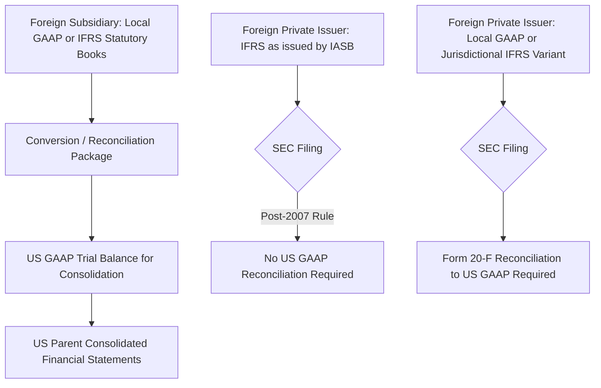
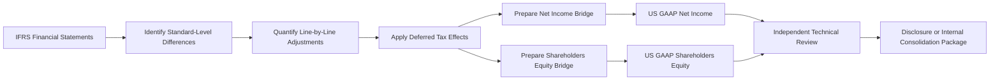

## Reconciliation and Dual-Reporting Considerations

### Overview

Reconciliation and dual reporting refer to the processes and disclosures multinational entities use when their financial results must be presented under two (or more) accounting frameworks simultaneously — most commonly **IFRS and US GAAP**. This arises from cross-listings, regulatory requirements in multiple jurisdictions, group-level consolidation of subsidiaries prepared under local GAAP, and historical SEC filing requirements. Understanding the mechanics of reconciliation is essential both for financial statement preparers managing multinational reporting and for forensic accountants assessing whether adjustments between frameworks are being used to manage reported outcomes.

### Historical and Regulatory Context

- **Pre-2007**: Foreign private issuers (FPIs) filing with the U.S. Securities and Exchange Commission (SEC) that prepared financial statements under a non-US-GAAP framework (including IFRS) were required to file a **Form 20-F reconciliation**, quantitatively reconciling net income and shareholders' equity to US GAAP, per Item 17/18 of Form 20-F.
- **2007 — SEC Rule Change**: The SEC eliminated the reconciliation requirement for FPIs that prepare financial statements using **IFRS as issued by the IASB** (not a jurisdictional variant such as "IFRS as adopted by the EU," unless it is confirmed equivalent). This was a landmark event that reduced the compliance burden for foreign issuers and implicitly endorsed IFRS as a credible, SEC-acceptable framework without full U.S. convergence.
- **Post-2007 residual reconciliation needs**: Reconciliation remains necessary in several contexts:
  - FPIs using **local-variant IFRS** (e.g., "IFRS as adopted by the EU" with carve-outs, historically relevant to certain financial institutions regarding IAS 39 hedge accounting)
  - Non-IFRS foreign filers (e.g., using local GAAP) still filing Form 20-F
  - **US multinational groups** consolidating foreign subsidiaries that maintain statutory books under local GAAP or IFRS, requiring conversion to US GAAP for group consolidation
  - **Debt covenant and regulatory reporting** where lenders or regulators require a specific framework
  - **M&A due diligence**, where target company financials must be normalized to the acquirer's framework for comparability

### Why Dual Reporting Exists

Entities may need to produce financial information under more than one framework for several structural reasons:

1. **Cross-border listings**: A company listed on both a US exchange and a home-country exchange (e.g., London, Frankfurt, Hong Kong) may face separate framework requirements.
2. **Group consolidation**: A US-parent multinational must consolidate foreign subsidiaries; if those subsidiaries' statutory financial statements are prepared under local GAAP or IFRS, a **GAAP conversion** (sometimes called "US GAAP wrap" or "IFRS conversion package") must be performed before consolidation.
3. **Regulatory/tax filings**: Local tax authorities often require statutory accounts under local GAAP even when group reporting is under IFRS or US GAAP.
4. **Financing agreements**: Loan covenants, bond indentures, or private equity reporting requirements may specify a particular framework.
5. **Transition periods**: Entities converting from local GAAP to IFRS (first-time adoption under IFRS 1) or jurisdictions adopting IFRS on a phased basis.

### Mechanics of a Reconciliation

A typical net income and shareholders' equity reconciliation (historically required in Form 20-F, and still used internally for GAAP conversion packages) follows a structured bridge format:

**Net Income Reconciliation Example (IFRS to US GAAP)**

| Line Item | Amount ($000s) |
| --- | --- |
| Net income under IFRS | 50,000 |
| Adjustment: Development costs expensed under US GAAP (capitalized under IFRS) | (8,000) |
| Adjustment: Reversal of PP&E impairment recognized under IFRS (not permitted under US GAAP) | (3,500) |
| Adjustment: Difference in lease expense pattern (ASC 842 operating lease straight-line vs. IFRS 16 front-loaded) | 1,200 |
| Adjustment: Inventory — reversal of write-down permitted under IFRS but not US GAAP | (900) |
| Tax effect of above adjustments | 2,750 |
| **Net income under US GAAP** | **41,550** |

Each reconciling item must be:

- **Individually identified** and quantified
- Supported by a clear technical rationale tied to the specific standard difference
- **Tax-effected** appropriately, since temporary differences created by GAAP adjustments often have deferred tax consequences that themselves differ from the originally reported tax provision

**Shareholders' Equity Reconciliation** follows the same bridge logic but reflects the **cumulative balance-sheet effect** of all such adjustments (not just the current-period income statement effect), since prior-period differences accumulate in retained earnings and other equity accounts.

$$\text{Equity}_{\text{US GAAP}} = \text{Equity}_{\text{IFRS}} + \sum(\text{Cumulative Reconciling Adjustments, net of tax})$$

### Common Reconciling Items (IFRS to US GAAP Direction)

| Area | Nature of Adjustment |
| --- | --- |
| Development costs | Add back to expense (US GAAP disallows capitalization) |
| Inventory (LIFO) | If US GAAP entity elects LIFO, reconcile FIFO/weighted-average IFRS figures to LIFO layers |
| Inventory write-down reversals | Remove IFRS-permitted reversals |
| PP&E revaluation | Remove revaluation surplus; restate to historical cost basis |
| Impairment reversals (non-goodwill) | Remove reversals not permitted under US GAAP |
| Financial instrument impairment | Reconcile IFRS 9 staged ECL to CECL lifetime-loss basis |
| Leases | Reclassify and recompute expense pattern differences between single (IFRS 16) and dual (ASC 842) models |
| Deferred tax | Recompute based on each adjustment's temporary difference impact |
| Actuarial gains/losses (pensions) | Differences in OCI treatment and corridor approaches (largely converged post-IAS 19 revisions, but transition-period differences may remain) |

### Dual-Reporting Governance and Control Considerations

From an internal controls and audit perspective, entities maintaining dual reporting capability must address:

- **Chart of accounts design**: A well-designed multinational chart of accounts often includes **parallel ledgers** or **adjustment/mapping tables** that allow a single source trial balance to be translated into either framework without re-entering transactions.
- **ERP configuration**: Modern ERP systems (e.g., SAP, Oracle) support **parallel accounting** functionality, maintaining separate "ledgers" for local statutory GAAP, group IFRS, and US GAAP reporting simultaneously from the same underlying transactions.
- **Reconciliation ownership and review**: Reconciliation schedules should be prepared by qualified technical accounting personnel and subject to **independent review**, given the judgment involved in items like development-cost capitalization criteria or impairment recoverability assessments.
- **Documentation of technical positions**: Because many reconciling items hinge on principles-based judgment (especially under IFRS), a well-controlled dual-reporting environment maintains **technical accounting memos** justifying each significant position taken (e.g., why certain development costs met IAS 38 capitalization criteria).
- **Consistency across periods**: Reconciling items should be tracked on a **rollforward basis** period-over-period so that cumulative balance-sheet adjustments in the equity reconciliation are internally consistent with the sum of historical income-statement reconciling items (net of items running directly through OCI).

### Forensic and Audit Risk Considerations

Reconciliation and dual-reporting processes carry specific fraud and misstatement risks that forensic accountants and auditors should assess:

1. **Selective or incomplete adjustment**: Management may fail to identify or intentionally omit a reconciling item that would be unfavorable (e.g., not adjusting for a US GAAP-prohibited impairment reversal), overstating US GAAP net income.
2. **Manipulation of judgment-based reconciling items**: Areas requiring significant judgment — particularly R&D capitalization thresholds and impairment recoverable-amount estimates — are natural areas to examine for aggressive positions that inflate the "more favorable" framework's results.
3. **Inconsistent tax effecting**: Reconciling items must be tax-effected using appropriate jurisdictional tax rates and rules; errors or intentional shortcuts here can distort the reconciliation's bottom line without an obvious footprint in the underlying reconciling items themselves.
4. **Rollforward breaks**: A forensic reviewer should trace the **cumulative equity reconciliation** against the **sum of historical income-statement adjustments** (adjusted for OCI-routed items and any prior restatements) — a break in this rollforward can be a red flag for either error or deliberate obscuring of adjustments.
5. **"Framework shopping" in disclosure**: Where an entity has discretion regarding which framework to emphasize in investor communications (e.g., non-GAAP reconciliations, press releases), forensic and analytical review should consider whether the presentation choice is being used to highlight the framework producing more favorable optics for a given period.
6. **Consolidation-package review**: For US multinationals, GAAP conversion packages prepared by foreign subsidiary controllers (who may have less US GAAP technical depth) are a common source of **unintentional misstatement risk** at the elimination/consolidation level; forensic and audit procedures often include re-performance testing of a sample of conversion adjustments.

### Illustrative Reconciliation Process Flow

### Practical Example

**Scenario**: A UK-based subsidiary of a US parent capitalizes $5 million of software development costs in the current year under IAS 38, having met the technical feasibility and probable-future-benefit criteria. Under the parent's US GAAP consolidation policy, these costs do not qualify for capitalization (assume costs incurred prior to establishing technological feasibility under the relevant US GAAP software-cost guidance) and must be expensed.

**Conversion adjustment**:

- Reduce IFRS-basis intangible assets by $5,000,000
- Increase current-period expense by $5,000,000 in the US GAAP consolidation package
- Recognize a deferred tax asset for the resulting temporary difference (assuming the cost is deductible for tax purposes over time regardless of book treatment), at the applicable statutory rate
- Document the technical accounting position for both the original IFRS capitalization decision and the US GAAP consolidation adjustment, since both must independently withstand audit scrutiny

### Key Points

- Dual reporting is driven by **cross-listings, subsidiary consolidation, regulatory filings, and financing agreements**, not by a single uniform requirement.
- The **2007 SEC rule change** eliminated Form 20-F reconciliation for FPIs using IFRS as issued by the IASB, but reconciliation needs persist for local-GAAP filers, jurisdictional IFRS variants, and internal US GAAP consolidation of foreign subsidiaries.
- A reconciliation bridge must **quantify each standard-level difference individually**, apply appropriate **tax effects**, and tie the **cumulative equity reconciliation** to the historical rollforward of income-statement adjustments.
- **ERP parallel-ledger functionality** and **strong technical documentation practices** are the primary control mechanisms supporting reliable dual reporting.
- Reconciliation processes carry meaningful **forensic risk** around selective adjustment, judgment-based item manipulation, tax-effecting errors, and consolidation-package misstatement — areas warranting targeted audit and forensic procedures.

### Related Topics

- SEC Form 20-F requirements and Foreign Private Issuer reporting
- ERP parallel accounting configuration for multi-framework reporting (SAP, Oracle)
- IFRS 1 first-time adoption exemptions and their interaction with reconciliation
- Deferred tax accounting for GAAP-conversion temporary differences (ASC 740 / IAS 12)
- Non-GAAP financial measures and SEC Regulation G considerations
- Group consolidation and elimination entry review procedures
- Technical accounting memo standards and documentation best practices
- Cross-border M&A financial due diligence and GAAP normalization techniques