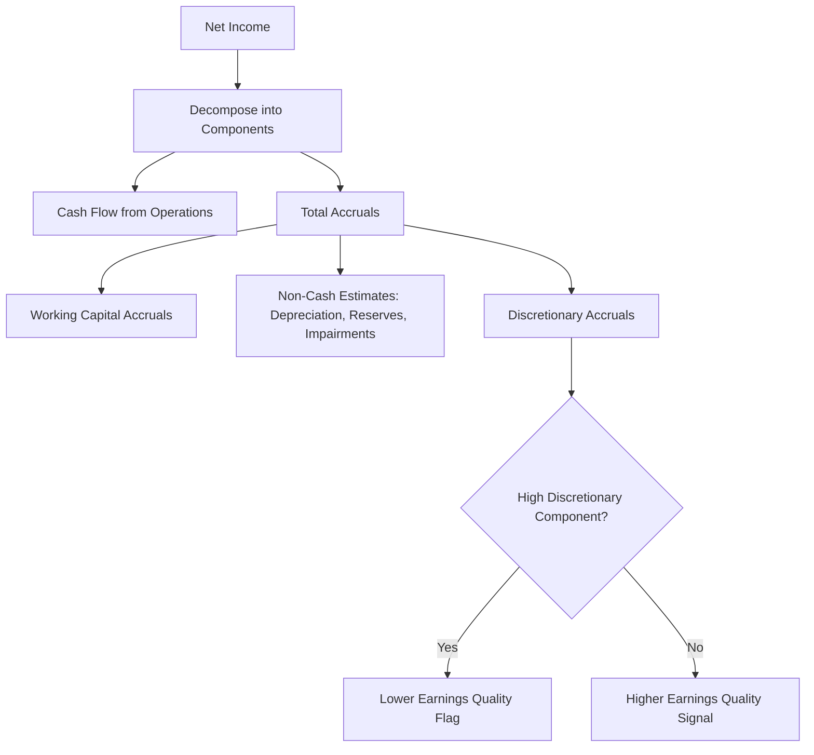
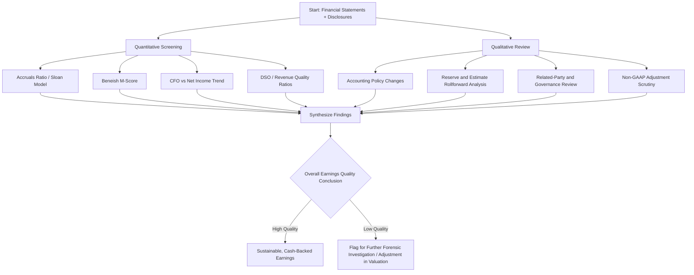

## Quality of Earnings Assessment Techniques

### Overview

Quality of earnings (QoE) assessment refers to the systematic analytical process of evaluating whether a company's reported earnings accurately represent its sustainable, cash-generative economic performance, as opposed to being inflated, deflated, or distorted by accounting choices, estimates, one-time items, or aggressive judgment. QoE analysis is a core discipline in forensic accounting, M&A due diligence, credit analysis, and equity research, sitting at the intersection of financial statement analysis and fraud detection.

### Defining "High-Quality" vs. "Low-Quality" Earnings

**High-quality earnings** are characterized by:

- Strong correlation with **operating cash flow**
- Derivation from **core, recurring operations** rather than one-time events
- Conservative, consistent application of accounting estimates and policies
- Minimal reliance on management judgment in areas prone to manipulation (revenue timing, reserve levels, capitalization decisions)
- Sustainability and predictive value for future performance

**Low-quality earnings** typically exhibit:

- Divergence between net income and cash flow from operations
- Heavy reliance on **non-recurring gains**, **one-time items**, or **aggressive estimates**
- Frequent changes in accounting policy or estimates that coincide with performance pressure
- Reliance on **related-party transactions** or **off-balance-sheet arrangements**
- **Accruals-heavy** income composition relative to cash-based income

### The Core Analytical Framework: Accruals vs. Cash Flow

The foundational QoE technique is decomposing net income into its **cash component** and **accrual component**:

$$\text{Net Income} = \text{Cash Flow from Operations} + \text{Total Accruals}$$

A widening gap between net income and operating cash flow — particularly if net income consistently and materially exceeds CFO over multiple periods — is one of the most reliable **red flags** for earnings quality deterioration, since accruals are inherently more subject to estimation and manipulation than realized cash flows.

**Simple accruals ratio**:

$$\text{Accruals Ratio} = \frac{\text{Net Income} - \text{Cash Flow from Operations}}{\text{Average Total Assets}}$$

A high or rising accruals ratio suggests earnings are increasingly driven by non-cash items (receivables growth, inventory build-up, deferred revenue recognition, changes in estimates) rather than realized cash generation.

### The Sloan Accruals Model

Academic research (Sloan, 1996) formalized the observation that firms with high accruals relative to cash flows tend to experience **subsequent earnings reversals** and underperform firms with low accruals, because the market tends to naively fixate on earnings without adjusting sufficiently for the persistence differential between cash flows and accruals.

**Total accruals (balance sheet approach)**:

$$\text{TA} = \Delta\text{Current Assets} - \Delta\text{Cash} - \Delta\text{Current Liabilities} + \Delta\text{Short-Term Debt} - \text{Depreciation \& Amortization}$$

Firms in the highest accruals decile have historically shown lower average future stock returns than firms in the lowest accruals decile, consistent with the market's initial overpricing of accrual-driven earnings.

### Beneish M-Score (Earnings Manipulation Detection Model)

The Beneish M-Score is a widely used quantitative model combining eight financial ratios to estimate the probability that a company has manipulated its earnings.

$$M = -4.84 + 0.920(DSRI) + 0.528(GMI) + 0.404(AQI) + 0.892(SGI) + 0.115(DEPI) - 0.172(SGAI) + 4.679(TATA) - 0.327(LVGI)$$

| Variable | Full Name | Interpretation |
| --- | --- | --- |
| DSRI | Days Sales in Receivables Index | Sharp increases suggest revenue inflation via receivables |
| GMI | Gross Margin Index | Declining margins may pressure manipulation |
| AQI | Asset Quality Index | Rising non-core/intangible assets relative to total assets |
| SGI | Sales Growth Index | High growth firms face greater manipulation pressure |
| DEPI | Depreciation Index | Declining depreciation rates may indicate income smoothing |
| SGAI | SG&A Index | Disproportionate SG&A changes relative to sales |
| TATA | Total Accruals to Total Assets | Core accruals-based manipulation proxy |
| LVGI | Leverage Index | Rising leverage may create covenant-driven manipulation incentive |

An M-Score greater than approximately **-1.78** is traditionally treated as a signal of increased probability of earnings manipulation, though this threshold and the model's overall precision should be treated as **[Unverified]** in any specific application, since the model was calibrated on a historical sample and its predictive power varies by industry, time period, and firm characteristics.

### Cash Flow Statement Analysis Techniques

QoE assessment places heavy emphasis on the statement of cash flows, since cash-based measures are less susceptible (though not immune) to manipulation compared to accrual-based earnings.

- **CFO vs. Net Income trend analysis**: Persistent, widening divergence over 3–5 years is a stronger signal than any single-period gap.
- **Classification shifting within cash flow statement**: Analysts should scrutinize whether items are being classified to inflate **operating cash flow** at the expense of investing or financing categories (e.g., capitalizing costs that should be expensed shifts cash outflows from operating to investing activities, artificially boosting CFO).
- **Free cash flow conversion**:

$$\text{FCF Conversion} = \frac{\text{Free Cash Flow}}{\text{Net Income}}$$

A ratio consistently and significantly below 1.0 warrants investigation into why reported earnings are not converting into cash.

- **Quality of cash flow components**: Distinguishing cash flow driven by **core working capital efficiency** versus cash flow driven by **one-time working capital liquidation** (e.g., aggressively delaying payables or accelerating receivable collection near period-end, sometimes called "channel stuffing" in reverse).

### Revenue Quality Analysis

Since revenue recognition is a primary area of earnings management, QoE analysis specifically examines:

- **Days Sales Outstanding (DSO) trend**: A rising DSO relative to historical levels or peers may indicate channel stuffing, bill-and-hold arrangements, or premature revenue recognition.

$$DSO = \frac{\text{Accounts Receivable}}{\text{Total Credit Sales}} \times 365$$

- **Revenue recognition policy changes**: Any change in the pattern, timing, or method of revenue recognition (particularly around multi-element arrangements, licensing, or long-term contracts) should be assessed against ASC 606 / IFRS 15 five-step model compliance and evaluated for a shift toward more front-loaded recognition.
- **Related-party revenue**: Revenue derived from related parties or entities with less arm's-length pricing dynamics carries elevated scrutiny.
- **Bill-and-hold and channel-stuffing indicators**: Disproportionate revenue growth in the final weeks of a reporting period, combined with rising channel inventory levels at distributors, is a classic red flag pattern.

### Expense and Reserve Quality Analysis

- **Reserve/allowance analysis** (bad debt reserves, warranty reserves, litigation reserves, restructuring reserves): Analysts examine whether reserve levels are being **released** (reducing expense, boosting earnings) during periods of earnings pressure without a corresponding improvement in underlying risk — a classic "cookie jar reserve" manipulation technique.
- **Capitalization vs. expensing patterns**: A shift toward capitalizing costs that were previously expensed (or vice versa) without a clear change in underlying business substance is a significant quality flag, since it directly affects the accrual/cash divergence discussed above.
- **One-time and non-recurring item scrutiny**: Analysts should assess whether "non-recurring" charges are, in fact, **recurring in substance** (e.g., a company reporting "restructuring charges" in five consecutive years is arguably mischaracterizing an ongoing operating cost).
- **Normalized/adjusted earnings reconciliation**: Critically evaluating management's non-GAAP adjustments (adjusted EBITDA, adjusted net income) for whether add-backs are genuinely non-recurring or represent recurring cash costs being excluded to present a more favorable picture.

### Management Estimates and Judgment Areas

Because many accounting figures rely on estimates, QoE assessment gives particular attention to:

| Estimate Area | Quality Assessment Focus |
| --- | --- |
| Allowance for credit losses / CECL reserves | Consistency of loss-rate assumptions vs. macroeconomic and portfolio trends |
| Goodwill and intangible impairment testing | Reasonableness of discount rates, growth assumptions, and reporting unit definitions |
| Revenue variable consideration estimates | Consistency of estimation methodology period-over-period |
| Warranty and contingency reserves | Historical accuracy of prior-period estimates vs. actual outcomes ("estimate accuracy tracking") |
| Useful life and depreciation assumptions | Changes that unexpectedly reduce depreciation expense without operational justification |
| Fair value measurement (Level 3 inputs) | Degree of subjectivity and sensitivity of valuation models to unobservable inputs |

A useful forensic technique is **estimate accuracy tracking** — comparing prior-period estimates (e.g., warranty reserves, bad debt allowances) against actual subsequent experience to assess whether management has a pattern of **optimistic bias** (consistently underestimating liabilities/reserves) that inflates earnings in the estimation period.

### Qualitative and Governance-Based QoE Indicators

Beyond quantitative ratios, QoE assessment incorporates qualitative signals:

- **Frequency of restatements** and **material weakness disclosures**
- **Auditor changes**, especially following disagreements or shortly before a significant estimate change
- **Management/CFO turnover**, particularly unexplained departures
- **Complexity and opacity of corporate structure** (excessive use of special purpose entities, complex intercompany arrangements)
- **Executive compensation structure**: Heavy weighting toward short-term, earnings-based metrics (rather than long-term value creation metrics) can create incentive alignment issues that increase manipulation risk
- **Related-party transaction volume and disclosure quality**

### Comprehensive QoE Analytical Process

### Practical Example: Applying the Framework

**Scenario**: A company reports net income growth of 20% year-over-year, but operating cash flow has declined by 5% over the same period.

**Step-by-step QoE analysis**:

1. **Calculate the accruals ratio** — a sharply rising ratio confirms the divergence is accrual-driven.
2. **Decompose accruals**: Identify whether the increase stems from receivables growth (DSO analysis), inventory build-up, or a reduction in reserve levels.
3. **Check revenue quality**: If DSO has increased materially and outpaces peer/industry trends, investigate for premature recognition or channel stuffing.
4. **Review reserve rollforwards**: Check whether bad debt or warranty reserves were reduced without a corresponding improvement in underlying risk indicators.
5. **Assess non-GAAP reconciliation**: Determine whether reported "adjusted" earnings exclude items that are, in substance, recurring.
6. **Conclusion**: If the divergence is concentrated in a single, explainable, non-recurring working-capital event (e.g., a one-time inventory build ahead of a plant closure), earnings quality concerns may be limited. If the divergence is broad-based and coincides with reserve releases and DSO deterioration, this constitutes a **material earnings quality red flag** warranting downward adjustment to normalized earnings in a valuation or credit context.

### Key Points

- Quality of earnings analysis centers on the **divergence between accrual-based net income and cash flow from operations**, since accruals carry greater manipulation and estimation risk.
- The **Sloan accruals model** and **Beneish M-Score** provide quantitative, though imperfect, frameworks for flagging manipulation risk; their outputs should be treated as screening tools rather than definitive conclusions. [Inference: model outputs require corroboration with qualitative review before drawing conclusions about actual manipulation.]
- **Revenue quality** (DSO trends, related-party revenue, recognition policy changes) and **reserve/estimate quality** (rollforward accuracy, release patterns) are the two most heavily scrutinized technical areas.
- **Non-GAAP earnings reconciliations** deserve independent scrutiny, since "adjusted" metrics can be used to systematically exclude recurring costs.
- Qualitative governance indicators — restatement history, auditor changes, executive turnover, compensation structure — meaningfully complement quantitative screening and should never be assessed in isolation from the numerical analysis.

### Related Topics

- Beneish M-Score: detailed ratio construction and industry calibration considerations
- Altman Z-Score and bankruptcy prediction models as complementary distress indicators
- Revenue recognition fraud schemes under ASC 606 / IFRS 15
- Cookie-jar reserve accounting and SEC enforcement case studies
- Non-GAAP financial measures and SEC Regulation G compliance
- Forensic ratio analysis: Days Inventory Outstanding, Days Payable Outstanding, cash conversion cycle
- Restatement analysis and material weakness disclosure trends
- Related-party transaction disclosure requirements (ASC 850 / IAS 24) and forensic red flags