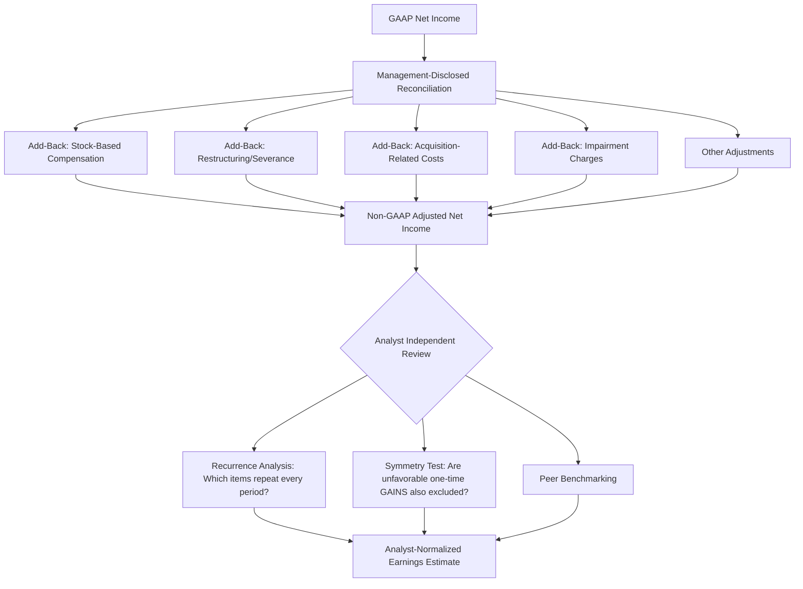

## Non-GAAP Measures and Adjusted Earnings Analysis

### Overview

Non-GAAP financial measures are performance metrics disclosed by companies that adjust GAAP-based figures by including or excluding specific amounts, with the stated intent of providing investors additional insight into "core" or "underlying" operating performance. Common examples include Adjusted EBITDA, Adjusted Net Income, Free Cash Flow, and Organic Revenue Growth. While these measures can offer legitimate analytical value, they are also a significant area of scrutiny in forensic accounting and financial statement analysis because they are **not subject to the same rigor, consistency, or auditability as GAAP measures**, and management has considerable discretion in their construction.

### Regulatory Framework

#### SEC Regulation G and Item 10(e) of Regulation S-K

- **Regulation G** governs the use of non-GAAP financial measures in any public disclosure by SEC registrants. It requires:
  - A **reconciliation** of the non-GAAP measure to the **most directly comparable GAAP measure**
  - A statement of the reasons management believes the non-GAAP measure provides useful information to investors
  - A prohibition on non-GAAP presentations that are **misleading**
- **Item 10(e) of Regulation S-K** applies specifically to SEC filings (as opposed to earnings releases and other furnished disclosures covered by Regulation G) and imposes additional requirements:
  - The GAAP measure must be presented with **equal or greater prominence** than the non-GAAP measure
  - Non-GAAP measures may not be presented on the **face of GAAP financial statements** or in the notes
  - Non-GAAP measures may not use **titles confusingly similar** to GAAP line items
  - Certain per-share non-GAAP liquidity measures are prohibited entirely (e.g., non-GAAP "earnings per share" that functions as a liquidity measure)

#### SEC Compliance and Disclosure Interpretations (C&DIs)

The SEC has periodically updated its Compliance and Disclosure Interpretations on non-GAAP measures, with recurring enforcement themes including:

- Prohibiting the exclusion of **normal, recurring cash operating expenses** necessary to run the business
- Scrutinizing individually tailored **revenue recognition or measurement methods** that deviate from GAAP in ways that function as a non-GAAP revenue measure without proper labeling
- Requiring consistent application of non-GAAP adjustments **period-over-period**, and requiring disclosure when methodology changes
- Prohibiting **cherry-picking**: excluding recurring charges while including recurring gains (asymmetric adjustment)

### Common Non-GAAP Measures

| Measure | Typical Construction | Primary Use Case |
| --- | --- | --- |
| Adjusted EBITDA | Net income + interest + taxes + D&A + stock comp + one-time items | Valuation multiples, credit analysis, covenant compliance |
| Adjusted Net Income | Net income excluding designated non-recurring/non-cash items | "Normalized" earnings for per-share comparisons |
| Free Cash Flow (FCF) | Operating cash flow less capital expenditures | Liquidity and capital allocation capacity |
| Organic Revenue Growth | Reported revenue growth excluding FX, M&A, divestiture effects | Isolating "core" business growth |
| Adjusted Gross Margin | Gross margin excluding certain cost allocations or one-time items | Segment/product profitability comparison |
| Constant Currency Metrics | Results recalculated at prior-period FX rates | Isolating operational performance from currency translation |

$$\text{Adjusted EBITDA} = \text{Net Income} + \text{Interest} + \text{Taxes} + \text{D\&A} + \text{Stock-Based Compensation} + \text{Other Add-Backs}$$

### Analytical Framework for Assessing Non-GAAP Measure Quality

#### 1. Reconciliation Transparency Assessment

A high-quality non-GAAP disclosure provides:

- A **clear, itemized reconciliation** from the nearest GAAP measure, with each adjustment separately quantified (not bundled into a single "other adjustments" line)
- **Consistent line items** period-over-period, allowing trend analysis
- Sufficient narrative explanation of **why** each item is excluded

Red flags include:

- Reconciliations that bundle multiple, dissimilar adjustments into vague categories (e.g., "other non-recurring items")
- Reconciling items that appear **every single period**, undermining the "non-recurring" characterization
- Reconciliations presented with less prominence, smaller font, or buried in appendices relative to the non-GAAP headline figure

#### 2. Recurrence Analysis of "Non-Recurring" Items

A central forensic technique is tracking whether items labeled "non-recurring," "one-time," or "unusual" actually **recur** across multiple reporting periods.

**Recurrence tracking table example**:

| Adjustment Category | Y1 | Y2 | Y3 | Y4 | Y5 | Pattern |
| --- | --- | --- | --- | --- | --- | --- |
| Restructuring charges | ✓ | ✓ | ✓ | ✓ | ✓ | Recurring — quality concern |
| Litigation settlement | ✓ | — | — | ✓ | — | Genuinely episodic |
| Acquisition-related costs | ✓ | ✓ | ✓ | ✓ | ✓ | Recurring — reflects ongoing M&A strategy, arguably a core cost |
| Stock-based compensation add-back | ✓ | ✓ | ✓ | ✓ | ✓ | Recurring, real economic cost to shareholders (dilution) |

Items appearing in **most or all periods** should be treated with skepticism as being genuinely "non-recurring," and analysts frequently choose to **add such items back into their own normalized earnings estimate** regardless of management's characterization.

#### 3. Stock-Based Compensation Add-Back Scrutiny

The add-back of stock-based compensation (SBC) expense in Adjusted EBITDA and Adjusted Net Income is one of the most heavily debated non-GAAP practices:

- **Argument for exclusion (management view)**: SBC is a non-cash expense and does not require a current cash outlay.
- **Argument against exclusion (analyst/critic view)**: SBC represents a **real economic cost** to existing shareholders through **dilution**, and companies that rely heavily on equity compensation are effectively substituting a "hidden" cash-equivalent cost. Excluding it can materially overstate underlying profitability, particularly for growth-stage technology companies with large SBC expense relative to revenue.

A useful analytical adjustment is calculating a **"SBC-inclusive" adjusted metric** to assess the sensitivity of reported non-GAAP profitability to this single adjustment:

$$\text{SBC-Adjusted EBITDA} = \text{Adjusted EBITDA} - \text{Stock-Based Compensation}$$

#### 4. Trend and Magnitude Analysis

- **Growing gap between GAAP and non-GAAP earnings** over time is itself a quality signal — if the non-GAAP adjustment quantum is increasing as a percentage of GAAP net income, this suggests either (a) the underlying business is generating genuinely more one-time costs (unusual), or (b) management is expanding the scope of what it characterizes as non-recurring to manage the narrative.

$$\text{Non-GAAP Adjustment Ratio} = \frac{\text{Non-GAAP Net Income} - \text{GAAP Net Income}}{|\text{GAAP Net Income}|}$$

- A ratio that is consistently large (e.g., non-GAAP net income routinely 2–3x GAAP net income) warrants deep scrutiny of the reconciliation detail.

#### 5. Peer and Industry Benchmarking

- Comparing a company's non-GAAP adjustment practices against **direct industry peers** helps identify whether a given company's adjustments are aggressive relative to sector norms (e.g., most SaaS peers add back SBC and capitalized commissions similarly; a company with materially different or more numerous adjustment categories should be examined further).

### Structural/Diagrammatic View of Non-GAAP Analysis

### The Symmetry Test

A key forensic technique is testing whether management's non-GAAP adjustments are applied **symmetrically**:

- If a company excludes non-recurring **losses/expenses** (e.g., litigation charges, impairments) from adjusted earnings, a symmetric and unbiased approach would also exclude non-recurring **gains** (e.g., gains on asset sales, litigation settlements received, favorable one-time tax benefits) from the same adjusted measure.
- **Asymmetric adjustment** — where only unfavorable items are excluded while favorable one-time items are retained — is a strong indicator of a non-GAAP measure being constructed to present the most favorable possible narrative rather than genuinely isolate core operating performance, and has been a recurring focus of SEC enforcement actions.

### Free Cash Flow Analysis Considerations

Free Cash Flow is a widely used non-GAAP liquidity measure, but its construction should also be scrutinized:

- **Capital expenditure classification**: Companies sometimes distinguish "maintenance capex" from "growth capex," excluding the latter from FCF calculations used to assess distributable cash — a distinction that is inherently judgmental and should be tested against disclosed capex breakdowns.
- **Definition consistency**: FCF can be defined as CFO minus total capex, CFO minus only maintenance capex, or CFO minus capex plus/minus various other items; comparability across companies requires normalizing to a **consistent definition**.
- **Working capital timing effects**: One-time working capital benefits (e.g., extending payables temporarily) can inflate a single period's FCF without reflecting a sustainable trend, so multi-period averaging is generally more reliable than single-period FCF analysis.

### Forensic Red Flags Checklist

1. Non-GAAP adjustments that appear in **every reporting period** despite being labeled "unusual" or "non-recurring"
2. **Asymmetric treatment** of one-time gains versus one-time losses
3. **Expanding categories** of adjustments over time (methodology creep)
4. Non-GAAP measures given **greater prominence** than GAAP measures in earnings releases or investor presentations (a Regulation S-K Item 10(e) concern for SEC filings specifically, and a qualitative concern even in furnished materials)
5. **Vague or bundled** reconciling line items lacking sufficient itemized detail
6. Large and/or **growing divergence** between GAAP and non-GAAP earnings as a percentage of GAAP earnings
7. Non-GAAP revenue or per-share liquidity measures that may run afoul of specific SEC prohibitions
8. Add-backs of costs that, on closer examination, reflect **recurring and integral operating costs** to the business model (e.g., serial-acquirer companies treating all acquisition costs as non-recurring despite M&A being a core, ongoing strategy)

### Practical Example

**Scenario**: A technology company reports GAAP net income of $10 million and Adjusted Net Income of $45 million, with the primary reconciling items being:

- Stock-based compensation: $20 million (present in all prior 8 quarters)
- Acquisition-related integration costs: $8 million (present in 7 of the last 8 quarters, coinciding with an active M&A strategy)
- Litigation settlement expense: $5 million (first occurrence in company history)
- Restructuring charges: $2 million (present in 6 of the last 8 quarters)

**Analysis**:

- The **litigation settlement** is genuinely episodic and reasonably excludable as non-recurring.
- **Stock-based compensation**, **acquisition-related costs**, and **restructuring charges** all show high recurrence rates, suggesting they function as **ongoing operating costs** of the business model (continuous equity-based hiring/retention strategy, an active M&A growth strategy, and continuous restructuring, respectively) rather than genuine one-time events.
- An analyst applying a recurrence-based normalization might construct an alternative "normalized" earnings figure that adds back only the litigation settlement, yielding approximately $15 million — materially below management's $45 million Adjusted Net Income figure, illustrating the scale of impact that reconciliation scrutiny can have on earnings quality conclusions.

### Key Points

- Non-GAAP measures are governed primarily by **SEC Regulation G** (all public disclosures) and **Item 10(e) of Regulation S-K** (SEC filings specifically), both of which require reconciliation to the nearest GAAP measure and prohibit misleading presentation.
- The most important forensic technique is **recurrence analysis**: tracking whether "non-recurring" items actually recur across multiple periods, which undermines their exclusion rationale.
- **Stock-based compensation add-backs** deserve particular scrutiny given the real economic dilution cost to shareholders, despite being non-cash.
- The **symmetry test** — checking whether one-time gains are excluded as consistently as one-time losses — is a powerful and simple technique for detecting narrative-driven (rather than analytically principled) non-GAAP construction.
- A **growing or persistently large gap** between GAAP and non-GAAP earnings, especially when driven by an expanding or inconsistent set of adjustment categories, is a key earnings-quality red flag warranting analyst-level re-normalization of reported performance.

### Related Topics

- SEC Regulation G and Item 10(e) of Regulation S-K: detailed compliance requirements
- SEC enforcement actions and case studies involving non-GAAP measure abuse
- Adjusted EBITDA in leveraged finance and covenant compliance analysis
- Stock-based compensation accounting under ASC 718 and dilution analysis
- Free cash flow definitions and cross-company comparability techniques
- Quality of earnings assessment techniques (accruals analysis, Beneish M-Score)
- Pro forma financial information versus non-GAAP measures: regulatory distinctions
- Management discussion and analysis (MD&A) disclosure requirements under Regulation S-K