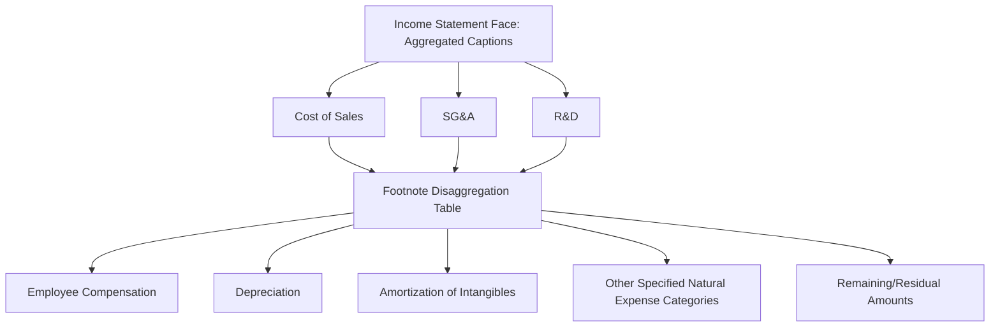

## Disaggregated Expense Disclosures and Analytical Use

### Overview

Disaggregated expense disclosure refers to the practice of breaking down aggregated income statement expense captions (such as Cost of Sales, SG&A, or R&D) into their underlying natural and functional components — for example, splitting SG&A into employee compensation, depreciation, amortization, and other specified categories. This has historically been an area of relatively limited prescriptive U.S. GAAP guidance, but has become a major focus of standard-setting and financial statement analysis due to investor demand for greater expense transparency, culminating in FASB's **ASU 2024-03 (DISE)**.

### Historical Context: Limited Pre-Existing Guidance

Prior to recent standard-setting developments, there was limited guidance in ASC 220 on the presentation of expenses in the income statement and disaggregation of expense captions. Presentation of certain income statement expense captions was historically driven largely by industry practice, SEC guidance (e.g., Regulation S-X requirements for certain expense line items), or company-specific voluntary disclosure choices, resulting in significant inconsistency across companies and industries regarding how much expense detail investors could access. Historically, separate presentation of specific expense captions was not required unless required by industry-specific guidance or upon a triggering event, such as a goodwill impairment. [deloitte](https://dart.deloitte.com/USDART/home/publications/deloitte/heads-up/2024/fasb-issues-final-standard-on-dise)[bdo](https://arch-pre.bdo.com/Disaggregated-Income-Statement-Expenses-DISE)

### FASB ASU 2024-03 — Disaggregation of Income Statement Expenses (DISE)

#### Origin and Objective

Based on investor and other constituent feedback requests for more information about income statement expenses, the FASB introduced guidance requiring expanded disclosures for public business entities about specific income statement expenses, issued as **ASU 2024-03**, *Income Statement — Reporting Comprehensive Income — Expense Disaggregation Disclosures (Subtopic 220-40)*, on November 4, 2024. The primary goal of Subtopic 220-40 is to provide greater transparency about the components of specific expense categories in the income statement. [bdo](https://arch-pre.bdo.com/Disaggregated-Income-Statement-Expenses-DISE)[bdo](https://arch-pre.bdo.com/Disaggregated-Income-Statement-Expenses-DISE)

#### Scope and Mechanics

Critically, the standard **does not change income statement presentation** on the face of the statement itself. The ASU does not change the expense captions an entity presents on the face of the income statement; rather, it requires disaggregation of certain expense captions into specified categories in disclosures within the footnotes to the financial statements. [deloitte](https://dart.deloitte.com/USDART/home/publications/deloitte/heads-up/2024/fasb-issues-final-standard-on-dise)

The disclosure applies to **public business entities (PBEs)** as defined under U.S. GAAP. The required categories generally include natural expense types such as employee compensation, depreciation, amortization, and other specified categories embedded within existing income statement captions (e.g., within cost of sales, SG&A, and R&D).

#### Effective Dates

The effective date was subsequently clarified via a follow-up standard. The FASB released ASU 2025-01, which revises the effective date of ASU 2024-03 to clarify that all public business entities are required to adopt the guidance in annual reporting periods beginning after December 15, 2026, and interim periods within annual reporting periods beginning after December 15, 2027. [deloitte](https://dart.deloitte.com/USDART/home/news/all-news/2025/jan/fasb-effective-date-asu-disaggregation-income-statement)

This clarification was necessary because non-calendar-year-end entities could have concluded that initial adoption of the ASU's amendments was required in an interim reporting period, rather than in an annual reporting period under the original wording. Entities within the ASU's scope are permitted to early adopt the standard. [deloitte](https://dart.deloitte.com/USDART/home/news/all-news/2025/jan/fasb-effective-date-asu-disaggregation-income-statement)[deloitte](https://dart.deloitte.com/USDART/home/news/all-news/2025/jan/fasb-effective-date-asu-disaggregation-income-statement)

The standard can be applied prospectively, though retrospective application is also permitted as an option.

#### Illustrative Disclosure Concept

A simplified conceptual illustration of the type of disaggregation now required — breaking out employee compensation embedded across multiple existing income statement captions — is a condensed breakdown providing new employee compensation information disaggregated from multiple income statement expense line items, in addition to the aggregate share-based compensation expense value already required elsewhere in the financial statements. [fwcook](https://fwcook.com/fasb-proposed-accounting-standards-update-on-income-statement-expense-disaggregation-disclosure/)

### Natural vs. Functional Expense Classification

Understanding DISE requires distinguishing two classification bases:

- **Functional classification**: Expenses grouped by their business purpose (e.g., Cost of Sales, Selling, General & Administrative, Research & Development). This is the traditional US GAAP income statement presentation basis.
- **Natural classification**: Expenses grouped by their inherent economic nature (e.g., employee compensation, depreciation, amortization, raw materials, utilities), regardless of which functional department incurred them.

DISE effectively requires a **hybrid disclosure**: expenses remain presented functionally on the face of the income statement, but footnotes now disaggregate each major functional caption into its natural-expense components. This mirrors, though does not fully replicate, aspects of **IFRS's** long-standing dual approach (IAS 1 permits either a "nature of expense" or "function of expense" presentation on the face of the income statement, with additional natural-expense disclosure required in the notes if function-based presentation is used).

### Analytical Uses of Disaggregated Expense Data

#### 1. Labor Cost Intensity and Operating Leverage Analysis

By isolating employee compensation embedded across Cost of Sales, SG&A, and R&D, analysts can compute a **total labor cost ratio** independent of how a company chooses to functionally classify its workforce:

$$\text{Labor Cost Ratio} = \frac{\text{Total Employee Compensation (all captions)}}{\text{Total Revenue}}$$

This allows more consistent **cross-company comparison** in labor-intensive industries, since companies have historically differed in how they classify similar workforce costs (e.g., one company may classify customer support staff within Cost of Sales while a peer classifies similar staff within SG&A), previously distorting gross margin and SG&A ratio comparisons.

#### 2. Depreciation and Amortization Visibility Within Operating Captions

Historically, D&A embedded within Cost of Sales or SG&A was often only disclosed in aggregate on the cash flow statement, making it difficult to assess the **non-cash component of gross margin or operating expense ratios** by function. Disaggregated disclosure allows analysts to:

- Reconstruct a more precise **cash-basis gross margin** by removing embedded D&A from Cost of Sales
- Assess **capital intensity trends** by function over time, rather than only in aggregate

$$\text{Cash Cost of Sales} = \text{Reported Cost of Sales} - \text{Embedded D\&A in Cost of Sales}$$

#### 3. Earnings Quality and Expense Reclassification Detection

Disaggregated disclosure directly supports several **quality-of-earnings techniques**:

- **Reclassification monitoring**: If a company shifts costs between functional captions (e.g., moving costs from Cost of Sales to a below-the-line "Other" caption) to inflate gross margin optics, the underlying natural-expense disaggregation makes such reclassification more visible, since the natural cost components should remain economically consistent even if functional labels change.
- **Stock-based compensation transparency**: Since SBC is a required natural category, analysts can trace SBC embedded within each functional caption rather than relying solely on the aggregate SBC figure disclosed elsewhere, enabling more precise **non-GAAP add-back verification** (cross-referencing management's Adjusted EBITDA SBC add-back against the newly disaggregated by-caption detail).
- **Margin trend explanatory power**: When gross margin or operating margin changes period-over-period, disaggregated natural-expense detail allows analysts to attribute the change to specific cost drivers (e.g., rising labor cost ratio vs. rising D&A vs. other) rather than relying on qualitative MD&A narrative alone.

#### 4. Peer Benchmarking Consistency

Because natural expense categories are less subject to functional classification discretion than the highly judgmental functional captions (Cost of Sales vs. SG&A boundaries vary significantly by company policy), disaggregated natural-expense data provides a more **standardized basis for peer comparison**, particularly in industries where functional cost allocation practices have historically varied widely (e.g., software companies allocating hosting costs between Cost of Sales and R&D).

### Implementation Challenges

The FASB acknowledged that this process may be challenging for some entities if their financial reporting systems do not currently track information at the natural-expense-by-functional-caption level required by the new disclosure. This creates several practical implementation considerations relevant to both preparers and forensic reviewers assessing disclosure quality post-adoption: [bdo](https://arch-pre.bdo.com/Disaggregated-Income-Statement-Expenses-DISE)

- **General ledger and cost-center mapping**: Entities must be able to map natural expense types (payroll, depreciation, amortization) across every functional caption they present, which may require enhancements to chart-of-accounts structure or cost-allocation methodologies.
- **Allocation methodology consistency**: Where costs are shared across functions (e.g., a facility housing both manufacturing and R&D staff), companies must apply and disclose a **consistent, supportable allocation methodology**, creating a new area of accounting judgment subject to audit and forensic scrutiny.
- **Transition-period comparability**: Because early adoption is permitted and mandatory adoption is staggered relative to interim versus annual periods, analysts should verify the **specific adoption status and transition method** (prospective vs. retrospective) when comparing disclosures across companies during the transition window.

### Comparison to IFRS Practice

| Aspect | US GAAP (Post-DISE) | IFRS (IAS 1) |
| --- | --- | --- |
| Face-of-statement presentation | Functional only (unchanged) | Company choice: function or nature |
| Natural expense disclosure requirement | New footnote requirement (ASU 2024-03) | Required in notes if function-based presentation is chosen (long-standing) |
| Effective date | FY beginning after Dec 15, 2026 (annual); interim FY beginning after Dec 15, 2027 | N/A — long-standing existing requirement |
| Granularity focus | Employee compensation, D&A, and other specified natural categories by caption | Nature-of-expense categories in aggregate, less prescriptive by-caption granularity historically required |

This comparison illustrates that DISE moves US GAAP disclosure practice **directionally closer** to long-standing IFRS notes-based natural-expense transparency, though the specific mechanics, required categories, and level of granularity differ and should not be treated as fully equivalent.

### Forensic and Analytical Red Flags to Monitor Post-Adoption

1. **Residual/"other" category size**: A disproportionately large unallocated residual within the disaggregation table may indicate incomplete disaggregation or an attempt to obscure specific cost drivers.
2. **Allocation methodology changes**: Shifts in how shared costs are allocated across functional captions from period to period, absent a clear operational rationale, warrant scrutiny for potential margin-management motives.
3. **Inconsistency between disaggregated SBC and previously disclosed aggregate SBC**: Reconciliation breaks between the newly required by-caption SBC detail and the pre-existing aggregate SBC footnote should tie out; unexplained differences merit investigation.
4. **Comparability gaps during transition**: Early adopters versus later adopters, and prospective versus retrospective transition elections, can create temporary **comparability gaps** across peer sets that should be explicitly adjusted for in cross-sectional analysis.

### Key Points

- ASU 2024-03 (DISE) requires disaggregation of specified income statement expense captions into natural-expense categories **within the footnotes**, without altering face-of-statement presentation.
- The effective date, as clarified by **ASU 2025-01**, is annual reporting periods beginning after **December 15, 2026**, and interim periods within annual reporting periods beginning after **December 15, 2027**, with early adoption permitted.
- The standard directly enables **labor cost intensity analysis, embedded D&A visibility, and SBC add-back verification** — each a meaningful enhancement to existing quality-of-earnings and non-GAAP scrutiny techniques.
- Implementation is expected to be operationally challenging for entities whose financial systems do not currently track natural-expense detail at the functional-caption level, creating a new area of **allocation methodology judgment** subject to audit and forensic review.
- The standard moves US GAAP **directionally closer** to long-standing IFRS natural-expense notes disclosure practice, though mechanical differences remain and full equivalence should not be assumed.

### Related Topics

- Quality of earnings assessment techniques: accruals analysis and recurrence testing
- Non-GAAP measures and adjusted earnings analysis: stock-based compensation add-back verification
- IAS 1 presentation of financial statements: nature-of-expense vs. function-of-expense methods
- Segment reporting disaggregation requirements (ASU 2023-07, Topic 280) as a parallel disclosure-expansion initiative
- Cost allocation methodologies for shared/overhead expenses across functional captions
- SEC Regulation S-X expense presentation requirements
- Chart-of-accounts design for multi-dimensional (functional and natural) expense tracking
- Comparative margin analysis techniques using disaggregated natural-expense data