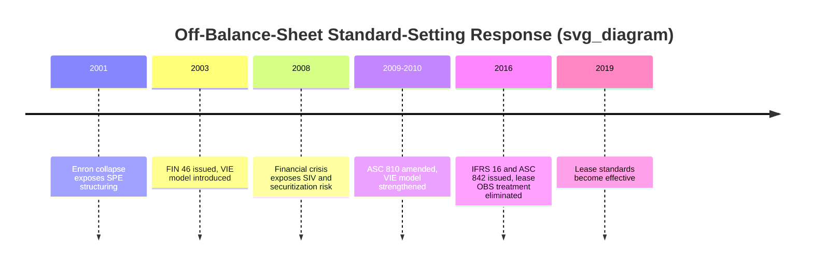
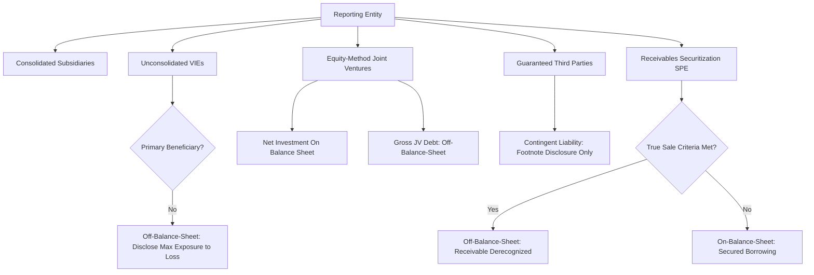

## Off-Balance-Sheet Exposure Identification

### Overview

Off-balance-sheet (OBS) exposure identification refers to the analytical process of detecting financial obligations, risks, and interests that do not appear as recognized assets or liabilities on a company's balance sheet, but which nonetheless create real economic exposure to the reporting entity. Despite significant standard-setting efforts over the past two decades to bring former off-balance-sheet items onto the balance sheet (most notably lease accounting reform), off-balance-sheet analysis remains a critical forensic and credit-analysis discipline because structuring incentives persist and new forms of OBS exposure continue to emerge.

### Historical Context and Standard-Setting Response

Off-balance-sheet financing has historically been associated with major accounting scandals and subsequent regulatory responses:

- **Enron (2001)**: Extensive use of special purpose entities (SPEs) structured to avoid consolidation under the then-existing bright-line ownership tests, hiding debt and inflating reported performance. This directly prompted the FASB's issuance of **FIN 46/46(R)** (now codified in **ASC 810**), introducing the **Variable Interest Entity (VIE)** consolidation model to capture entities controlled through means other than majority voting ownership.
- **Pre-2019 operating lease accounting**: Operating leases were kept entirely off-balance-sheet under legacy US GAAP (ASC 840) and IFRS (IAS 17), allowing companies to acquire substantial use of assets while reporting neither the asset nor the corresponding liability — a widely cited example of structuring to avoid balance sheet recognition. This was remediated by **ASC 842** and **IFRS 16** (effective 2019), which require lessees to recognize a right-of-use asset and lease liability for substantially all leases.
- **2008 Financial Crisis**: Widespread use of off-balance-sheet **structured investment vehicles (SIVs)** and securitization structures by financial institutions obscured true leverage and risk exposure, contributing to systemic underestimation of bank balance sheet risk and prompting subsequent consolidation and disclosure reforms (e.g., changes to ASC 810's VIE model application to securitization entities).

### Categories of Remaining Off-Balance-Sheet Exposure

Despite these reforms, several categories of OBS exposure remain relevant for analysis:

#### 1. Variable Interest Entities Not Consolidated

Even under the strengthened VIE model, entities may hold a **variable interest** in another entity without being deemed the **primary beneficiary** (the party required to consolidate), if they lack either:

- The **power** to direct the activities that most significantly impact the VIE's economic performance, or
- The **obligation to absorb losses** or **right to receive benefits** that could be significant to the VIE

Analysts should review footnote disclosures of **unconsolidated VIEs**, including maximum exposure to loss, to assess whether the entity retains meaningful economic risk despite non-consolidation.

#### 2. Guarantees and Contingent Obligations

- **Financial guarantees**: Guarantees of third-party debt (e.g., guaranteeing a joint venture's borrowings, or an unconsolidated subsidiary's obligations) create contingent liability exposure disclosed in footnotes (ASC 460 / IAS 37) but typically **not recognized as a liability** unless payment becomes probable and estimable.
- **Debt guarantees to joint ventures and equity-method investees**: Since equity-method investments are generally recorded net (single-line "investment" asset) rather than consolidated, guarantees extended to support an investee's borrowings represent exposure **beyond** what appears in the investment carrying value.
- **Purchase commitments and take-or-pay arrangements**: Long-term commitments to purchase goods or services (common in energy, telecommunications, and manufacturing) create future cash outflow obligations that may not meet liability recognition criteria until performance occurs, despite representing substantive future economic commitments.

#### 3. Equity Method Investments and Joint Ventures

- Investments accounted for under the **equity method** (typically 20–50% ownership with significant influence but not control) are presented as a **single net asset line** on the investor's balance sheet, with the investee's **gross assets and liabilities excluded** from consolidation.
- This creates analytical distortion: an investor may have proportionate exposure to substantial debt held within a joint venture or equity-method investee that is **entirely invisible** in consolidated leverage ratios unless the analyst separately reviews investee-level financial information disclosed in footnotes (often required under ASC 323 / IAS 28 summarized financial information disclosures).

$$\text{Adjusted Leverage} = \frac{\text{Consolidated Debt} + (\text{Ownership \%} \times \text{Investee Debt})}{\text{Consolidated EBITDA} + (\text{Ownership \%} \times \text{Investee EBITDA})}$$

#### 4. Factoring and Receivables Securitization

- **Receivables factoring/securitization** structured to qualify as a **true sale** under ASC 860 (Transfers and Servicing) removes receivables from the balance sheet, generating cash while eliminating the related asset. If structuring fails to meet true-sale criteria (e.g., retained recourse or continuing involvement is too extensive), the transaction should instead be accounted for as a **secured borrowing**, keeping both the receivable and a corresponding liability on the balance sheet.
- Forensic analysts scrutinize whether **true-sale treatment is being aggressively applied** to structures that retain substantive risk (e.g., significant recourse provisions, retained servicing with implicit guarantees, or repurchase obligations), effectively achieving off-balance-sheet financing in substance.
- **Supply chain finance / reverse factoring programs**: A supplier finance arrangement in which a company effectively extends its payment terms to suppliers, who then sell their receivables to a financial intermediary, can result in obligations that resemble debt in substance but are classified as **trade payables** rather than borrowings — a structuring practice that has drawn increasing regulatory and analyst attention.

#### 5. Operating Lease Residual Exceptions

While ASC 842 and IFRS 16 brought most leases onto the balance sheet, certain exceptions preserve limited OBS treatment:

- **Short-term leases** (12 months or less, without a purchase option reasonably certain to be exercised) may be excluded from balance sheet recognition under both standards.
- **Low-value asset leases**: IFRS 16 provides an explicit low-value asset exemption (with no direct US GAAP equivalent), allowing certain small-ticket leased assets to remain off-balance-sheet.
- **Variable lease payments** not based on an index or rate are excluded from the initial lease liability measurement, potentially understating the economic lease obligation if a company structures payment terms to be predominantly variable/usage-based.

#### 6. Take-or-Pay and Long-Term Purchase Commitments

Certain long-term contractual arrangements — such as power purchase agreements, long-term supply contracts, and certain outsourcing agreements — may contain embedded financing characteristics or create substantial fixed future payment obligations without meeting on-balance-sheet liability recognition criteria, particularly when the arrangement does not meet the definition of a lease under ASC 842/IFRS 16 lease-identification criteria.

#### 7. Pension and Post-Retirement Obligations (Partial Recognition Issues)

While defined benefit pension obligations are generally recognized on the balance sheet (ASC 715 / IAS 19), certain **multiemployer pension plan** obligations create a distinct OBS-adjacent risk: participating employers in multiemployer plans generally recognize only their **required contributions as expense**, with the plan's **unfunded liability** disclosed only in footnotes rather than recognized proportionately on the employer's balance sheet — creating a potentially significant hidden exposure, particularly in industries with heavy union multiemployer plan participation (e.g., trucking, construction, some retail sectors).

#### 8. Litigation and Environmental Contingencies

Loss contingencies (litigation, environmental remediation obligations) are only recognized as liabilities when a loss is **both probable and reasonably estimable** under ASC 450 (or IAS 37's "probable" threshold, which differs subtly in definition and estimation practice from US GAAP). Contingencies that are **reasonably possible** (a lower threshold than probable) but not probable are disclosed only in footnotes, without balance sheet recognition, despite representing genuine potential future cash outflows.

### Analytical Techniques for Identifying and Quantifying OBS Exposure

#### 1. Footnote and Commitments Disclosure Review

A structured review of the **commitments and contingencies footnote**, **guarantees footnote**, **related-party transactions footnote**, and **VIE disclosures** is the primary starting point. Key data points to extract:

- Maximum exposure to loss on unconsolidated VIEs
- Guarantee amounts and terms (including triggering conditions)
- Purchase commitment schedules by maturity
- Contingent liability ranges disclosed under "reasonably possible" loss language

#### 2. Adjusted Leverage Ratio Construction

Building an **economic balance sheet** that incorporates OBS items provides a more complete leverage picture than reported figures alone:

$$\text{Economic Debt} = \text{Reported Debt} + \text{Guaranteed Third-Party Debt} + \text{Proportionate JV/Equity-Method Debt} + \text{Securitized Receivables (if true-sale treatment is aggressive)}$$

Rating agencies (S&P, Moody's, Fitch) routinely perform similar **off-balance-sheet adjustments** when calculating adjusted leverage metrics for credit ratings, particularly incorporating operating lease-like commitments, pension underfunding, and guarantee exposure even where GAAP/IFRS does not require on-balance-sheet recognition.

#### 3. Related-Party and Structured Entity Mapping

Constructing an **organizational and contractual relationship map** of all entities in which the reporting company holds an interest — subsidiaries, VIEs, joint ventures, equity-method investees, and structured financing vehicles — helps visualize where consolidation boundaries may not align with actual economic control or risk exposure.

#### 4. Trend Analysis of Commitment Schedules

Comparing the disclosed **future minimum commitment schedule** (by maturity year) against historical actual cash outflows helps assess whether disclosed commitments are being consistently understated or whether new commitment categories are emerging that warrant closer contractual review.

#### 5. Comparison of Segment/Subsidiary-Level Data to Consolidated Figures

Where summarized financial information for significant equity-method investees or VIEs is disclosed (often required once certain materiality thresholds are met under SEC Rule 3-09 or 4-08(g) of Regulation S-X, or under ASC 323's summarized financial information requirements), analysts should extract investee-level debt and compare it against the investor's proportionate ownership to quantify the "look-through" leverage exposure.

### Forensic Red Flags in Off-Balance-Sheet Structuring

1. **Complex, opaque corporate structures** with numerous special purpose entities, particularly those domiciled in jurisdictions offering minimal disclosure requirements
2. **Related-party transactions with unconsolidated entities** that lack clear arm's-length economic rationale
3. **Aggressive true-sale conclusions** for receivables transfers that retain substantial recourse, servicing obligations, or repurchase provisions
4. **VIE consolidation conclusions that appear inconsistent** with the economics of power and variable interest exposure (e.g., an entity that provides substantially all of a VIE's financing and receives substantially all of its variable returns, yet concludes it is not the primary beneficiary)
5. **Disproportionate growth in guarantee footnote disclosures** relative to balance sheet growth, suggesting increasing reliance on off-balance-sheet risk transfer
6. **Supply chain finance program growth** disclosed qualitatively but not quantified, potentially masking a shift from trade payables to disguised financing
7. **Frequent restructuring of joint venture ownership percentages** around consolidation thresholds (e.g., maintaining exactly 49–50% ownership to avoid consolidation triggers)

### Practical Example

**Scenario**: A manufacturing company reports total consolidated debt of $200 million. Footnote review reveals:

- A 40%-owned joint venture with $150 million of its own debt, none of which is guaranteed by the reporting company
- A $30 million guarantee of a separate unconsolidated VIE's construction financing
- A receivables securitization program that removed $50 million of receivables from the balance sheet under true-sale accounting, with a retained recourse obligation of up to $10 million disclosed in the footnotes

**Adjusted economic debt calculation**:

$$\text{Economic Debt} = \$200M + (40\% \times \$150M) + \$30M + \$10M = \$300M$$

This represents a **50% increase** over reported consolidated debt, illustrating the potential magnitude of distortion when off-balance-sheet exposures are excluded from leverage analysis — a difference that could materially affect credit assessment, valuation multiples, and covenant compliance analysis if unadjusted.

### Key Points

- Major standard-setting reforms (VIE consolidation model under ASC 810, lease accounting under ASC 842/IFRS 16) have substantially reduced — but not eliminated — off-balance-sheet structuring opportunities.
- Remaining OBS exposure categories include **unconsolidated VIEs, guarantees, equity-method joint venture debt, receivables securitization, short-term/low-value lease exceptions, multiemployer pension underfunding, and loss contingencies below the probable-and-estimable recognition threshold**.
- Constructing an **adjusted/economic leverage ratio** that incorporates proportionate JV debt, guarantees, and aggressively structured securitizations provides a materially more complete risk picture than reported balance sheet figures alone.
- **True-sale accounting conclusions** for receivables transfers and **VIE primary-beneficiary determinations** are the two most judgment-intensive areas warranting forensic scrutiny, since both hinge on structuring decisions that can be calibrated specifically to avoid on-balance-sheet recognition.
- Rating agencies routinely apply similar off-balance-sheet adjustments in credit analysis, underscoring that professional credit and equity analysts do not rely solely on reported GAAP/IFRS balance sheet figures for leverage assessment.

### Related Topics

- ASC 810 Variable Interest Entity consolidation model: detailed primary beneficiary analysis
- ASC 860 transfers and servicing: true sale vs. secured borrowing criteria
- Equity method accounting (ASC 323 / IAS 28) and summarized investee financial information disclosures
- Supply chain finance / reverse factoring: disclosure trends and SEC/FASB response
- Rating agency adjusted leverage methodologies (S&P, Moody's, Fitch off-balance-sheet adjustments)
- Multiemployer pension plan withdrawal liability and disclosure requirements
- ASC 450 / IAS 37 loss contingency recognition thresholds: probable vs. reasonably possible
- Special purpose entity structuring: historical case studies (Enron, structured investment vehicles)