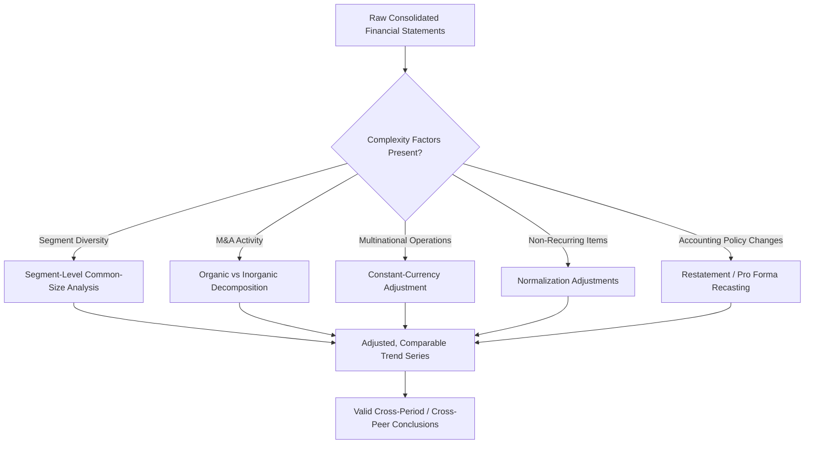
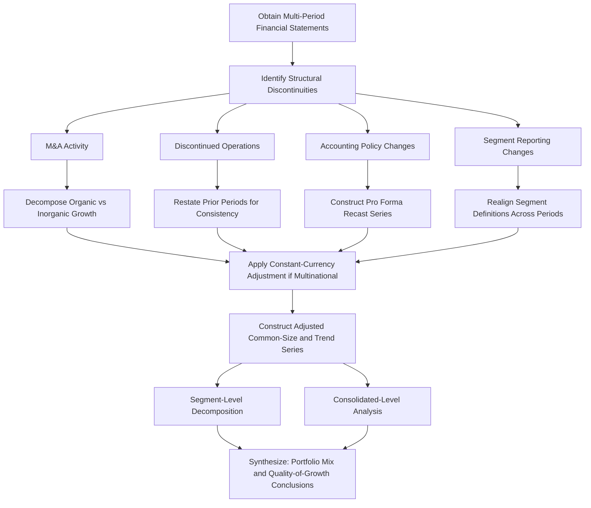

## Common-Size and Trend Analysis for Complex Entities

### Overview

Common-size and trend analysis are foundational financial statement analysis techniques that normalize financial data to enable comparison across time periods, peer companies, and business segments. While conceptually simple in application to a single, straightforward entity, these techniques require significant methodological adaptation when applied to **complex entities** — multi-segment conglomerates, entities with significant M&A activity, multinational operations with currency translation effects, and organizations undergoing structural change — where naive application can produce misleading conclusions.

### Common-Size Analysis Fundamentals

#### Vertical Common-Size Statements

Vertical (or "common-size") analysis expresses each line item as a percentage of a base figure within the same period:

$$\text{Common-Size Income Statement Item} = \frac{\text{Line Item}}{\text{Total Revenue}} \times 100$$

$$\text{Common-Size Balance Sheet Item} = \frac{\text{Line Item}}{\text{Total Assets}} \times 100$$

This normalization allows comparison of **cost structure and capital structure proportions** independent of absolute company size, making it a primary tool for peer benchmarking.

#### Horizontal (Trend) Analysis

Horizontal analysis expresses each line item relative to a **base-year** value, tracking growth or decline over time:

$$\text{Trend Index}_t = \frac{\text{Line Item}_t}{\text{Line Item}_{\text{base year}}} \times 100$$

This isolates **growth trajectory** independent of absolute dollar magnitude, useful for identifying inflection points, accelerating/decelerating trends, and divergence between related line items (e.g., revenue growth outpacing or lagging receivables growth).

### Why Complex Entities Require Adapted Methodology

Naive common-size or trend analysis assumes a **stable, comparable base** across the periods or entities being compared. Complex entities frequently violate this assumption through:

1. **Segment heterogeneity**: A conglomerate's consolidated common-size ratios blend businesses with fundamentally different cost structures and margin profiles, obscuring segment-level dynamics.
2. **M&A-driven structural shifts**: Acquisitions and divestitures change the underlying business mix, making period-over-period consolidated trend comparisons potentially non-comparable ("apples to oranges") unless adjusted.
3. **Currency translation effects**: Multinational entities' reported figures reflect both underlying operational performance and foreign exchange translation effects, which can distort trend analysis if not isolated.
4. **Non-recurring items and reclassifications**: One-time charges, discontinued operations reclassification, and changes in segment reporting structure can create artificial discontinuities in trend series.
5. **Accounting policy changes**: New standard adoption (e.g., ASC 842 lease capitalization, revenue recognition changes) can create structural breaks in historical trend series that do not reflect genuine economic change.

### Segment-Level Common-Size Analysis

For multi-segment entities, consolidated-level common-size analysis should be supplemented with **segment-level common-size statements**, using segment revenue, segment assets, or segment operating income as the relevant base, drawing on required segment disclosures (ASC 280 / IFRS 8).

**Illustrative segment common-size comparison**:

| Metric (% of Segment Revenue) | Segment A (Mature) | Segment B (Growth) | Segment C (Declining) | Consolidated |
| --- | --- | --- | --- | --- |
| Gross Margin | 45% | 62% | 28% | 44% |
| SG&A | 15% | 35% | 12% | 20% |
| Operating Margin | 25% | 18% | 8% | 19% |
| Revenue Growth (YoY) | 2% | 35% | (8%) | 8% |

This decomposition reveals that the **consolidated operating margin of 19%** masks dramatically different underlying economics — a mature, high-margin core business; a lower-margin but rapidly growing segment; and a declining, low-margin segment. A purely consolidated trend analysis would obscure the **portfolio mix shift** driving consolidated results, which is critical for both valuation (segments often warrant different multiples) and forensic assessment (management may selectively emphasize segment-level metrics that present the most favorable narrative).

### Organic vs. Inorganic Growth Decomposition

For entities with active M&A programs, trend analysis must separate **organic (same-store/like-for-like) growth** from **inorganic growth** attributable to acquisitions, to assess genuine underlying business trajectory.

$$\text{Reported Growth} = \text{Organic Growth} + \text{Acquisition Contribution} + \text{Divestiture Impact} + \text{FX Translation Effect}$$

**Decomposition technique**:

1. Identify the **acquisition/divestiture closing dates** and revenue contribution disclosed in business combination footnotes (ASC 805 / IFRS 3 pro forma disclosures often provide this).
2. For the first 12 months following an acquisition, exclude the acquired entity's revenue from the "organic" base to isolate legacy-business performance.
3. Calculate **organic growth rate** using only the pre-existing business base, and separately quantify the **inorganic contribution** as the acquired entity's incremental revenue.

**Illustrative decomposition**:

| Component | Contribution to Reported Revenue Growth |
| --- | --- |
| Organic growth | 4.5% |
| Acquisition contribution | 6.0% |
| Divestiture impact | (1.5%) |
| FX translation effect | (0.8%) |
| **Total Reported Growth** | **8.2%** |

This decomposition is essential for forensic and analytical purposes: a company reporting strong headline revenue growth driven predominantly by acquisitions (rather than organic execution) presents a materially different quality-of-growth picture than one achieving comparable growth organically, with direct implications for sustainability and valuation multiple assessment.

### Constant-Currency Adjustment for Multinational Entities

For entities with significant foreign operations, reported (as-reported) trend figures reflect both **operational performance** and **currency translation effects** from converting foreign subsidiary results into the parent's reporting currency.

**Constant-currency methodology**: Recalculate current-period foreign-denominated results using **prior-period average exchange rates**, isolating the underlying operational trend from currency fluctuation noise.

$$\text{Constant-Currency Revenue}_t = \sum_{\text{currencies}} (\text{Local Currency Revenue}_t \times \text{Prior-Period FX Rate})$$

$$\text{FX Translation Effect} = \text{As-Reported Revenue}_t - \text{Constant-Currency Revenue}_t$$

Analysts should verify whether management's disclosed constant-currency figures use a **consistent methodology** period-over-period (e.g., always using prior-year average rates versus spot rates), since inconsistent methodology can itself become a subtle non-GAAP presentation quality concern analogous to those discussed in non-GAAP measure analysis.

### Normalization for Non-Recurring Items and Structural Breaks

Before conducting multi-period trend analysis, analysts should normalize for:

- **Discontinued operations reclassification**: When a business is classified as held-for-sale or discontinued, prior-period comparatives are typically restated to exclude it from continuing operations; analysts must ensure they are comparing **consistently restated** prior-period figures rather than originally-reported figures that included the since-divested business.
- **Accounting policy transition breaks**: Adoption of major new standards (e.g., ASC 842/IFRS 16 lease capitalization, ASC 606/IFRS 15 revenue recognition changes, CECL) can create artificial step-changes in balance sheet ratios (e.g., a sudden increase in total assets and liabilities from lease capitalization) that do not reflect genuine business change. Where entities provide **transition disclosures** or dual presentation during adoption year, analysts should use these to construct a consistent pre/post-adoption series.
- **Restatement history**: Where prior-period financials have been restated (for error correction or other reasons), trend analysis should incorporate the **restated figures** consistently, and any pattern of frequent restatement itself constitutes an earnings-quality red flag warranting separate investigation.

### Weighted-Average and Rolling Analysis Techniques for Volatile Complex Entities

For entities with significant period-to-period volatility (cyclical industries, entities with large one-time items, or those undergoing active portfolio restructuring), **rolling multi-period averages** (e.g., trailing 4-quarter or trailing 3-year averages) can smooth noise and reveal underlying trend direction more reliably than single-period common-size snapshots.

$$\text{Trailing 4-Quarter Common-Size Ratio} = \frac{\sum_{i=1}^{4} \text{Line Item}_i}{\sum_{i=1}^{4} \text{Revenue}_i}$$

### Common-Size Balance Sheet Considerations for Complex Capital Structures

For entities with complex capital structures (multiple debt tranches, preferred equity, noncontrolling interests, or significant intangible assets from serial acquisitions), standard common-size balance sheet analysis should be supplemented with:

- **Tangible vs. intangible asset decomposition**: Since serial acquirers accumulate significant goodwill and intangible assets through purchase accounting, a common-size analysis using **total assets** as the base can understate the proportion of "productive" tangible/working capital assets; a supplementary **tangible common-size analysis** (excluding goodwill and acquisition-related intangibles from the base) provides additional insight into the underlying operating asset base.

$$\text{Tangible Asset Ratio} = \frac{\text{Line Item}}{\text{Total Assets} - \text{Goodwill} - \text{Acquired Intangibles}} \times 100$$

- **Noncontrolling interest treatment**: Consolidated common-size ratios should be reviewed alongside the **noncontrolling interest** disclosure to assess what proportion of consolidated assets, revenue, and income is actually attributable to the parent versus minority partners in less-than-wholly-owned subsidiaries — a distinction particularly relevant for entities with significant joint venture or partial-ownership consolidation structures.

### Analytical Workflow for Complex Entity Trend Analysis

### Forensic Applications

Common-size and trend analysis, properly adapted for complexity, supports several forensic objectives:

1. **Masking segment deterioration**: A declining or troubled segment's weakening performance can be obscured within consolidated common-size ratios if strong performance in other segments compensates; segment-level analysis is essential to detect this.
2. **Acquisition-driven growth narrative management**: Companies facing organic growth deceleration may increase M&A activity to sustain headline growth optics; organic/inorganic decomposition directly tests whether this pattern is present.
3. **Currency effect obfuscation**: In periods of favorable currency movements, companies may emphasize as-reported (currency-inflated) growth figures in investor communications while downplaying constant-currency figures that reveal weaker underlying operational trends, or vice versa depending on which framing is more favorable.
4. **Goodwill and intangible asset masking of tangible deterioration**: A serial acquirer's total-asset-based common-size ratios can obscure deteriorating tangible asset productivity if goodwill accumulation from overpaying for acquisitions is not separately identified and excluded in a supplementary tangible-asset analysis.
5. **Selective base-period manipulation**: Analysts should be alert to management selectively choosing base periods or trend windows in investor presentations (e.g., a 3-year CAGR starting from an unusually depressed base year) that create a misleadingly favorable trend narrative — a technique sometimes termed "cherry-picking the base period."

### Practical Example

**Scenario**: A diversified industrial conglomerate reports consolidated revenue growth of 12% and consolidated gross margin expansion from 32% to 35% over the past three years.

**Complex-entity analysis reveals**:

- Segment-level decomposition shows the legacy manufacturing segment (60% of consolidated revenue) grew organically at only 2%, while a recently acquired higher-margin technology services segment (added via acquisition in year 2) grew from 0% to 25% of consolidated revenue.
- Organic/inorganic decomposition shows that of the 12% consolidated revenue growth, approximately 9 percentage points are attributable to the acquisition, with only 3 percentage points representing organic growth.
- The gross margin expansion from 32% to 35% is almost entirely attributable to **portfolio mix shift** (the higher-margin acquired segment's increasing revenue proportion) rather than genuine margin improvement within either underlying segment.

**Conclusion**: A naive consolidated trend analysis would suggest broad-based operational improvement, while the adapted complex-entity analysis reveals that underlying organic performance is **essentially flat**, and reported improvement is substantially a function of acquisition-driven portfolio mix change — a materially different quality-of-earnings and sustainability conclusion with direct implications for valuation multiple assumptions and forward-looking projections.

### Key Points

- Standard common-size (vertical) and trend (horizontal) analysis techniques require **methodological adaptation** for complex entities to avoid misleading conclusions from blended, non-comparable data.
- **Segment-level common-size analysis** is essential for multi-segment entities, since consolidated ratios can mask materially different underlying segment economics.
- **Organic vs. inorganic growth decomposition** is critical for entities with active M&A programs, directly supporting quality-of-growth assessment.
- **Constant-currency adjustment** isolates genuine operational trends from currency translation noise for multinational entities.
- Analysts must actively normalize for **discontinued operations reclassification, accounting policy transition breaks, and restatement history** before drawing multi-period trend conclusions, and should supplement total-asset-based common-size ratios with **tangible-asset-based** variants for serial acquirers with significant goodwill/intangible accumulation.

### Related Topics

- Segment reporting disclosure requirements (ASC 280 / IFRS 8) and disaggregation techniques
- Business combination accounting (ASC 805 / IFRS 3) and pro forma revenue disclosure use in organic growth analysis
- Constant-currency reporting methodology and non-GAAP disclosure considerations
- Quality of earnings assessment techniques: accruals analysis and recurrence testing
- Goodwill impairment testing and reporting unit/CGU-level analysis
- Noncontrolling interest accounting and consolidated ratio interpretation
- Restatement analysis and its impact on historical trend series reliability
- Ratio analysis adjustments for lease capitalization transition (ASC 842 / IFRS 16)