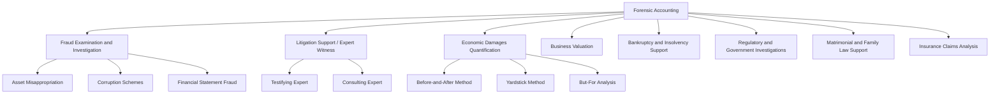
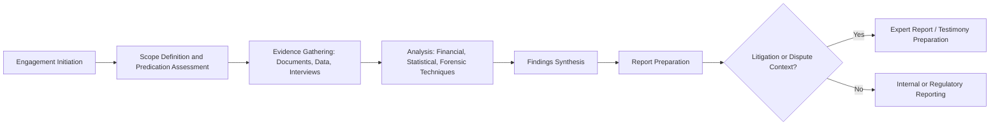

## Definition and Scope of Forensic Accounting

### Overview

Forensic accounting is the specialized practice area that combines accounting, auditing, and investigative skills to examine financial matters in a manner suitable for use in legal proceedings, dispute resolution, or formal investigation. The term "forensic" derives from the Latin *forensis*, meaning "of or before the forum," reflecting the discipline's core orientation toward producing findings that can withstand legal scrutiny — whether in litigation, arbitration, regulatory enforcement, or criminal prosecution.

### Core Definition

Forensic accounting can be defined as the application of accounting principles, theories, and discipline to facts or hypotheses at issue in a legal dispute, and encompasses every branch of accounting knowledge, including auditing, financial statement analysis, valuation, taxation, and cost accounting, applied within a framework that anticipates eventual legal or quasi-legal scrutiny. Unlike traditional financial or external audit work — which provides reasonable assurance on the fairness of financial statements taken as a whole under a going-concern assumption — forensic accounting is typically **engagement-specific**, **fact-finding oriented**, and **conducted with an awareness that findings may be tested through cross-examination, discovery, or regulatory challenge**.

### Distinguishing Forensic Accounting from Related Disciplines

| Discipline | Primary Objective | Standard of Assurance | Typical Trigger |
| --- | --- | --- | --- |
| External (Financial Statement) Audit | Opinion on fair presentation of financial statements as a whole | Reasonable assurance | Recurring, statutory/regulatory requirement |
| Internal Audit | Evaluate internal controls, risk management, governance | Varies by engagement | Ongoing, management/board-directed |
| Forensic Accounting | Investigate specific facts for legal/dispute purposes | Varies; often higher scrutiny given legal use | Suspected fraud, dispute, litigation, regulatory inquiry |
| Fraud Examination | Determine whether fraud occurred, and if so, how and by whom | Investigative, evidence-based | Predicated allegation or red flag |
| Valuation/Damages Analysis | Quantify economic value or loss | Professional valuation standards | Litigation, M&A, shareholder disputes |

A key distinction is that a traditional financial statement **audit is designed to detect material misstatement** in financial statements as a whole, applying professional skepticism and a risk-based approach, but is not specifically designed to detect fraud at the individual transaction level, nor does it provide absolute assurance against fraud. Forensic accounting, by contrast, often begins with a **specific predicated concern** (a known or suspected irregularity) and proceeds with a targeted, evidence-gathering investigative methodology.

### Scope of Forensic Accounting Practice

Forensic accounting is a broad umbrella term encompassing several overlapping practice specializations:

#### 1. Fraud Examination and Investigation

- Investigating suspected occupational fraud (asset misappropriation, corruption, financial statement fraud) within an organization
- Conducting interviews, document review, and evidence-gathering consistent with methodologies such as the **fraud examination process** developed by organizations like the Association of Certified Fraud Examiners (ACFE)
- Applying the **Fraud Triangle** framework (opportunity, pressure/incentive, rationalization) to assess fraud risk and interpret findings

#### 2. Litigation Support and Expert Witness Services

- Providing accounting analysis, calculations, and expert testimony in civil litigation (e.g., breach of contract disputes, shareholder disputes, partnership dissolutions)
- Preparing expert reports that meet applicable evidentiary standards for expert testimony (e.g., in U.S. federal courts, the **Daubert standard**, derived from *Daubert v. Merrell Dow Pharmaceuticals*, governing the admissibility of expert scientific and technical testimony)
- Serving as a **testifying expert** (whose opinions and reports may be discoverable and subject to cross-examination) versus a **consulting expert** (whose work product may be protected by work-product privilege in many jurisdictions, subject to applicable rules)

#### 3. Economic Damages Quantification

- Calculating lost profits, lost business value, or other economic damages arising from breach of contract, business interruption, personal injury, intellectual property infringement, or other tortious conduct
- Applying recognized damages methodologies (e.g., **before-and-after method**, **yardstick/benchmark method**, **but-for analysis**)

#### 4. Business Valuation

- Determining the fair value or fair market value of a business, business interest, or intangible asset for purposes such as shareholder disputes, marital dissolution, estate and gift tax matters, and M&A transactions
- Applying recognized valuation approaches: **income approach** (discounted cash flow, capitalization of earnings), **market approach** (guideline public company, guideline transaction methods), and **asset-based approach**

#### 5. Bankruptcy, Insolvency, and Restructuring Support

- Investigating potential preferential transfers, fraudulent conveyances, or asset dissipation prior to bankruptcy filing
- Assisting trustees, creditors' committees, or debtors in reconstructing financial records and assessing solvency at relevant historical dates

#### 6. Regulatory and Government Investigations

- Supporting investigations by regulatory bodies (e.g., SEC, PCAOB, DOJ) or providing analysis in connection with enforcement actions
- Assisting with **FCPA (Foreign Corrupt Practices Act)** investigations, anti-money laundering (AML) inquiries, and related compliance matters

#### 7. Matrimonial and Family Law Support

- Tracing and valuing marital assets, assessing income for support calculations, and identifying hidden or dissipated assets in divorce proceedings

#### 8. Insurance Claims Analysis

- Quantifying business interruption losses, property damage claims, and fidelity/crime insurance claims following a loss event

### The Forensic Accountant's Skill Set

Effective forensic accounting practice draws on a multidisciplinary skill set:

- **Core accounting and auditing knowledge**: GAAP/IFRS technical proficiency, internal control evaluation, audit sampling and testing methodologies
- **Investigative techniques**: Document examination, interviewing (including cognitive interviewing techniques), evidence chain-of-custody procedures, and digital forensics coordination
- **Legal process familiarity**: Understanding of civil and criminal procedure, rules of evidence, discovery processes, and the litigation lifecycle
- **Quantitative and analytical skills**: Statistical sampling, data analytics, financial modeling, and valuation methodologies
- **Communication skills**: Ability to explain complex financial findings clearly to non-accountant audiences, including judges, juries, and attorneys, both in written reports and oral testimony
- **Professional skepticism and objectivity**: Maintaining independence and an evidence-based approach regardless of which party engaged the forensic accountant

### Professional Standards and Credentials

Several credentials and standard-setting bodies govern or inform forensic accounting practice:

- **Certified Fraud Examiner (CFE)**: Administered by the Association of Certified Fraud Examiners (ACFE), focused specifically on fraud prevention, detection, deterrence, and investigation
- **Certified in Financial Forensics (CFF)**: A credential offered by the AICPA for CPAs specializing in forensic accounting, covering both fraud and non-fraud forensic engagements (e.g., valuation, damages, bankruptcy)
- **Accredited in Business Valuation (ABV)**: An AICPA credential relevant to the business valuation component of forensic practice
- **AICPA Statement on Standards for Forensic Services**: Provides professional guidance specifically addressing forensic accounting engagements, distinct from the auditing standards (e.g., AU-C sections, PCAOB standards) that govern traditional external audits

### Legal Context: Standards Governing Expert Evidence

Because forensic accounting findings frequently support litigation, understanding the legal admissibility framework is part of the discipline's scope:

- **Daubert standard** (U.S. federal courts, and adopted in many U.S. state courts): Requires that expert testimony be based on **reliable methodology** that has been tested, subjected to peer review, has a known or potential error rate, and is generally accepted within the relevant professional community, in addition to being relevant to the facts at issue.
- **Frye standard** (used in some U.S. state courts as an alternative to Daubert): Requires that the methodology be **generally accepted** within the relevant scientific/professional community, a narrower test than Daubert's multi-factor approach.
- Forensic accountants serving as testifying experts must ensure their methodologies, assumptions, and conclusions are **well-documented, replicable, and defensible** under cross-examination, since the admissibility and weight of their testimony depends directly on satisfying the applicable jurisdictional standard.

### The Fraud Triangle as a Foundational Analytical Framework

While detailed fraud scheme classification is addressed elsewhere in forensic accounting curricula, the **Fraud Triangle** (originally derived from criminologist Donald Cressey's research) is foundational to the discipline's conceptual scope:

- **Perceived Pressure/Incentive**: A financial or other pressure that motivates the fraudulent act (e.g., personal financial difficulty, performance-based compensation pressure)
- **Perceived Opportunity**: A weakness in internal controls or oversight that allows the fraud to be committed without detection
- **Rationalization**: The perpetrator's internal justification that makes the fraudulent act psychologically acceptable (e.g., "I'm only borrowing the money," "I deserve this")

$$\text{Fraud Risk} = f(\text{Pressure}, \text{Opportunity}, \text{Rationalization})$$

This framework underpins forensic risk assessment methodologies used throughout fraud examination engagements and is often extended in more advanced treatments to the **Fraud Diamond** (adding "capability" as a fourth element — the perpetrator's personal skills and position enabling execution of the fraud).

### Engagement Lifecycle Overview

A typical forensic accounting engagement, at a high level, follows this general structure:

### Distinguishing Forensic Accounting from Fraud Auditing

While closely related and often used interchangeably in casual usage, a useful distinction exists:

- **Fraud auditing** is generally oriented toward **proactive fraud detection** as an extension of internal control and audit procedures, often embedded within an ongoing internal audit function.
- **Forensic accounting** is broader in scope, encompassing not only fraud-specific investigation but also litigation support, valuation, damages, and other non-fraud dispute-related engagements, and is typically **reactive** — initiated in response to a specific predicated concern, dispute, or legal proceeding, rather than as a routine, recurring control activity.

### Key Points

- Forensic accounting applies accounting, auditing, and investigative expertise to matters intended for use in **legal, regulatory, or dispute-resolution contexts**, distinguishing it from routine financial statement audit or internal audit work.
- The discipline's scope spans **fraud examination, litigation support, economic damages quantification, business valuation, bankruptcy/insolvency support, regulatory investigations, matrimonial support, and insurance claims analysis**.
- Forensic accountants must understand both **accounting/investigative methodology** and the **legal admissibility framework** governing expert testimony (e.g., the Daubert and Frye standards), since engagement findings are frequently subject to legal scrutiny and cross-examination.
- Relevant professional credentials include the **CFE (ACFE)** and **CFF/ABV (AICPA)**, reflecting the discipline's cross-cutting relationship to both fraud examination and broader valuation/forensic specializations.
- The **Fraud Triangle** (pressure, opportunity, rationalization) — and its extension, the Fraud Diamond (adding capability) — provides a foundational conceptual framework underpinning fraud risk assessment throughout forensic accounting practice.

### Related Topics

- The Fraud Triangle and Fraud Diamond: detailed application to occupational fraud schemes
- ACFE Certified Fraud Examiner (CFE) body of knowledge and examination structure
- AICPA Statement on Standards for Forensic Services: detailed engagement guidance
- Daubert and Frye standards: detailed admissibility criteria for expert testimony
- Fraud examination methodology: predication, evidence gathering, and interview techniques
- Business valuation approaches: income, market, and asset-based methods
- Economic damages methodologies: before-and-after, yardstick, and but-for analysis
- Occupational fraud classification: the ACFE Fraud Tree (asset misappropriation, corruption, financial statement fraud)