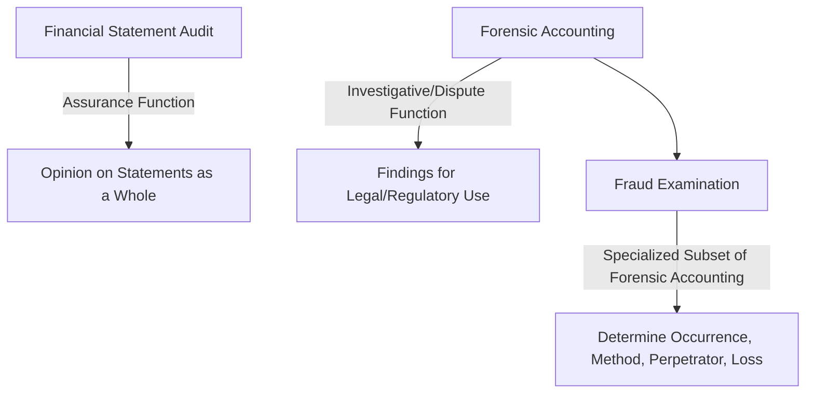
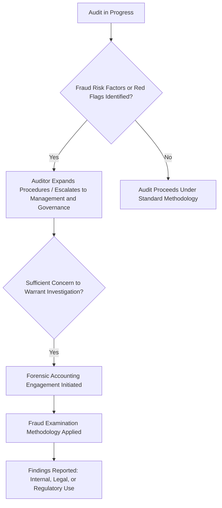

## Forensic Accounting versus Auditing versus Fraud Examination

### Overview

Although forensic accounting, auditing, and fraud examination are closely related and frequently performed by professionals with overlapping skill sets, each discipline has a distinct objective, methodology, standard of assurance, and typical engagement trigger. Clearly distinguishing among the three is essential both for appropriately scoping engagements and for understanding the legal and professional liability implications that attach to each type of work.

### Foundational Distinction: Purpose and Orientation

- **Auditing** is fundamentally an **assurance function**: it exists to provide a level of confidence to financial statement users that the statements, taken as a whole, are free of material misstatement, whether due to error or fraud, in accordance with an applicable financial reporting framework (US GAAP or IFRS).
- **Forensic accounting** is fundamentally an **investigative and dispute-support function**: it exists to develop findings, calculations, or opinions suitable for use in legal, regulatory, or dispute-resolution contexts, and is not typically oriented toward providing assurance on financial statements as a whole.
- **Fraud examination** is a **specialized investigative discipline** focused specifically on determining whether fraud has occurred, and if so, how it was perpetrated, by whom, and the resulting loss — it can be understood as a specific and prominent subset of forensic accounting's broader scope.

### Comparative Framework

| Dimension | Financial Statement Audit | Forensic Accounting | Fraud Examination |
| --- | --- | --- | --- |
| Primary objective | Opinion on fair presentation of financial statements | Support litigation, disputes, valuation, or investigation | Determine whether fraud occurred and quantify it |
| Scope | Financial statements as a whole | Specific facts, transactions, or issues in dispute | Specific predicated allegation or suspicion |
| Trigger | Recurring, statutory/contractual requirement | Litigation, dispute, or regulatory inquiry | Predicated concern, tip, or red flag |
| Standard of assurance | Reasonable assurance (not absolute) | Varies by engagement; often subject to legal/evidentiary standards | Evidence-based; findings must withstand scrutiny |
| Governing standards | GAAS / PCAOB standards / ISA (International Standards on Auditing) | AICPA Statement on Standards for Forensic Services; varies by engagement type | ACFE fraud examination methodology; varies by jurisdiction |
| Sampling approach | Risk-based audit sampling across the population | Often targeted, 100% review of specific transactions in scope | Targeted, evidence-driven, following investigative leads |
| Professional skepticism level | Applied, but not investigative by default | Elevated, investigative orientation from the outset | Highest — presumption of possible wrongdoing until evidence indicates otherwise |
| Typical work product | Audit opinion, management letter | Expert report, damages calculation, valuation report | Investigation report, findings memo |
| Legal exposure of work product | Subject to audit-related litigation risk (e.g., negligence claims) | Frequently discoverable; testifying expert work subject to cross-examination | Findings may support civil, criminal, or employment action |

### Financial Statement Audit: Detailed Characteristics

#### Objective and Assurance Level

An external audit is designed to provide **reasonable assurance** — not absolute assurance — that financial statements are free from material misstatement, whether caused by error or fraud, and to issue an opinion on whether the statements are fairly presented in accordance with the applicable financial reporting framework.

#### Key Limitations Relevant to the Comparison

- **Materiality threshold**: Audits are designed to detect **material** misstatements; individually immaterial fraud (which can still be significant to the organization or represent illegal acts) may fall below the audit's detection threshold.
- **Sampling-based approach**: Audits generally test a sample of transactions rather than the entire population, meaning fraud embedded in untested transactions may not be identified.
- **Management representation reliance**: Auditors reasonably rely on management representations and documentation as part of evidence-gathering, creating inherent limitations where management itself is complicit in concealment.
- **Not designed as a fraud investigation**: Auditing standards (e.g., AU-C 240 in the U.S., ISA 240 internationally) require auditors to consider fraud risk and maintain professional skepticism, but the audit's objective remains providing an opinion on the financial statements as a whole, not conducting a targeted fraud investigation.

#### Auditor Responsibility Regarding Fraud

Auditing standards require auditors to:

- Assess fraud risk factors (drawing conceptually on the Fraud Triangle) during audit planning
- Maintain professional skepticism throughout the engagement
- Respond to identified fraud risks with appropriately designed audit procedures
- Communicate identified or suspected fraud to appropriate levels of management, those charged with governance, and, in certain circumstances, regulators

However, this responsibility does not equate to a guarantee of fraud detection, and auditing standards explicitly acknowledge that the risk of not detecting a material misstatement resulting from fraud is higher than the risk of not detecting one resulting from error, because fraud may involve sophisticated and carefully organized schemes designed to conceal it, including collusion, forgery, or intentional omissions.

### Forensic Accounting: Detailed Characteristics

#### Broader, Dispute-Oriented Scope

As detailed in the discipline's overall definition, forensic accounting's scope extends well beyond fraud-related matters to include litigation support, business valuation, economic damages quantification, bankruptcy support, and regulatory investigation assistance. A forensic accountant may never encounter a suspected fraud in a given engagement — for example, when calculating lost profits in a breach-of-contract dispute where no wrongdoing beyond the alleged breach itself is at issue.

#### Engagement-Specific and Reactive Nature

Unlike the recurring, cyclical nature of statutory audits, forensic accounting engagements are typically **initiated in response to a specific triggering event**: a dispute, a suspected irregularity, a regulatory inquiry, or a legal proceeding. The scope of work is defined by the specific facts and questions at issue, rather than by a standard audit methodology applied to financial statements as a whole.

#### Evidentiary and Legal Awareness

Because forensic accounting findings are frequently prepared with anticipation of legal scrutiny, forensic accountants must maintain heightened attention to:

- **Chain of custody** for documents and electronic evidence
- **Methodology documentation** sufficient to withstand cross-examination and satisfy admissibility standards (e.g., Daubert or Frye, depending on jurisdiction)
- **Objectivity and independence**, regardless of which party (plaintiff, defendant, company, regulator) engaged the forensic accountant

### Fraud Examination: Detailed Characteristics

#### Predication-Driven Methodology

Fraud examination methodology, as formalized by organizations such as the Association of Certified Fraud Examiners (ACFE), emphasizes the concept of **predication**: a fraud examination should be initiated only when there exists a reasonable basis (predication) to believe that fraud has occurred, is occurring, or will occur — as opposed to auditing's routine, non-accusatory, cyclical approach applied regardless of specific suspicion.

#### Investigative Techniques Distinct from Standard Audit Procedures

Fraud examination draws on techniques not typically central to standard audit methodology:

- **Interviewing techniques**: Structured, often cognitive-interviewing-based approaches to witness and suspect interviews, following a methodology that typically progresses from non-accusatory to more pointed questioning as evidence accumulates
- **Covert investigative techniques**: Surveillance, undercover operations (in certain contexts, subject to legal constraints), and public records searches
- **Digital forensics coordination**: Working with digital forensics specialists to recover, preserve, and analyze electronic evidence in a manner that maintains evidentiary integrity
- **Net worth and expenditure analysis**: Techniques used to identify unexplained wealth or spending inconsistent with known legitimate income sources, often used in corruption or embezzlement investigations

#### Standard of Proof and Objectivity

Fraud examiners are expected to approach investigations with the objective of determining the facts, not to prove a predetermined conclusion. Fraud examination methodology, per ACFE guidance, emphasizes that fraud examiners should establish the facts with respect to allegations of fraud from inception to disposition through a methodology designed to resolve unsettled questions, and should approach the process objectively rather than seeking only confirmatory evidence — a professional standard closely analogous to (but distinct in specific methodology from) the auditor's professional skepticism standard.

### Overlap and Interaction Among the Three Disciplines

A common real-world pathway illustrates the interaction: an external auditor identifies unusual fraud risk indicators during the course of a standard audit (e.g., unexplained journal entries, management override indicators); this may prompt expanded audit procedures and communication to the audit committee; if concerns rise to the level warranting a targeted investigation, the organization may engage forensic accountants to conduct a dedicated fraud examination, applying investigative techniques beyond the scope of the original audit engagement.

### Professional Standards Distinctions

| Discipline | Primary Standard-Setting Body / Framework |
| --- | --- |
| External Audit (U.S. public companies) | PCAOB Auditing Standards |
| External Audit (U.S. private companies, other engagements) | AICPA Generally Accepted Auditing Standards (GAAS) |
| External Audit (international) | International Standards on Auditing (ISA), issued by IAASB |
| Forensic Accounting (AICPA members) | AICPA Statement on Standards for Forensic Services |
| Fraud Examination | ACFE fraud examination methodology and Code of Professional Ethics |

### Independence and Objectivity Considerations Across Disciplines

- **Auditor independence**: Governed by strict, codified independence rules (e.g., SEC independence rules for public company auditors, AICPA Code of Professional Conduct), given the audit's assurance function serving the investing public and other financial statement users broadly.
- **Forensic accountant objectivity**: While a forensic accountant may be engaged by one party to a dispute (plaintiff, defendant, or a specific stakeholder), professional standards nonetheless require objectivity in analysis and conclusions; a forensic accountant's credibility as a potential expert witness depends substantially on maintaining defensible objectivity despite being compensated by an interested party.
- **Fraud examiner objectivity**: Similarly required to approach investigations without a predetermined conclusion, notwithstanding that the engagement may have been initiated based on a specific suspicion or allegation.

### Practical Illustration of the Distinctions

**Scenario**: A company's external auditors, during the annual audit, note that accounts receivable aging has deteriorated significantly and certain large customer confirmations were not returned.

- **Audit response**: The auditor would apply alternative procedures (e.g., subsequent cash receipts testing) to obtain sufficient audit evidence regarding the receivable balances' existence and valuation, assess whether this affects the overall audit opinion, and communicate the matter to those charged with governance if it represents a significant deficiency or potential fraud risk indicator. The audit's objective remains reaching a conclusion on the financial statements as a whole.
- **Forensic accounting engagement (if initiated)**: If the audit committee becomes sufficiently concerned to warrant investigation, a forensic accountant might be engaged to specifically investigate whether the receivables represent legitimate, collectible sales or whether they reflect fictitious revenue recognition, potentially including document forensics, customer outreach, and interviews — a targeted, evidence-gathering scope distinct from and typically more intensive than standard audit procedures.
- **Fraud examination component**: If the forensic investigation identifies specific transactions appearing fictitious, a fraud examination would proceed to determine the specific scheme mechanics (e.g., fictitious customer creation, channel stuffing, bill-and-hold abuse), identify responsible individuals, quantify the total loss/overstatement, and prepare findings suitable for potential civil, criminal, or employment-related action.

### Key Points

- **Auditing** provides reasonable (not absolute) assurance on financial statements as a whole through a recurring, standards-governed process; it is not designed as, and should not be relied upon as, a comprehensive fraud detection mechanism.
- **Forensic accounting** is a broader, engagement-specific discipline oriented toward supporting legal, regulatory, and dispute-resolution contexts, encompassing far more than fraud-related work (valuation, damages, bankruptcy, litigation support).
- **Fraud examination** is best understood as a specialized, predication-driven subset of forensic accounting, focused specifically on determining whether fraud occurred and, if so, its mechanics, perpetrators, and quantum.
- The three disciplines frequently **interact sequentially** in practice: audit procedures may surface fraud risk indicators that escalate into a forensic accounting engagement, which may in turn apply fraud examination methodology once predication is established.
- All three disciplines require **professional objectivity**, but the specific standards, methodologies, and evidentiary awareness differ meaningfully — auditors apply professional skepticism within an assurance framework, while forensic accountants and fraud examiners apply an investigative, evidence-driven methodology from the outset, with heightened awareness of eventual legal scrutiny.

### Related Topics

- Definition and scope of forensic accounting
- AU-C 240 / ISA 240: auditor responsibilities relating to fraud in a financial statement audit
- ACFE fraud examination methodology: predication, evidence gathering, and reporting
- The Fraud Triangle and Fraud Diamond frameworks
- PCAOB vs. AICPA vs. ISA auditing standards: structural comparison
- Auditor independence rules and the AICPA Code of Professional Conduct
- Daubert and Frye standards for expert testimony admissibility
- Net worth and expenditure method analysis in fraud investigations