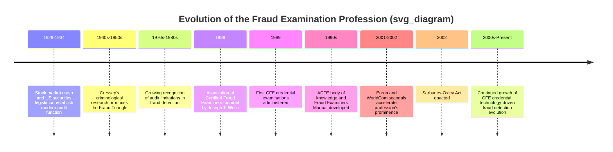

## History and Evolution of the Fraud Examination Profession

### Overview

The fraud examination profession has evolved from informal, ad hoc investigative work performed by accountants and law enforcement into a formally credentialed, methodologically standardized discipline with its own body of knowledge, professional association, and ethical code. This evolution reflects both landmark fraud cases that exposed gaps in traditional auditing's ability to detect fraud, and the parallel development of academic criminological theory that provided the conceptual foundation for modern fraud risk assessment.

### Early Foundations: Accounting and Investigation Before Formalization

#### Pre-20th Century Origins

The conceptual roots of forensic and investigative accounting trace back to the use of accounting expertise in legal proceedings, with documented instances of accountants serving as expert witnesses in court cases as early as the 19th century. However, no formalized discipline, credential, or body of knowledge existed; investigative accounting work was performed on an ad hoc basis by accountants and auditors called upon for specific legal matters, without a distinct professional identity separate from general accounting practice.

#### Early 20th Century: The Rise of the Modern Audit

The modern external audit function developed substantially in the early-to-mid 20th century, driven significantly by the stock market crash of 1929 and the subsequent U.S. securities legislation (the Securities Act of 1933 and Securities Exchange Act of 1934), which established mandatory independent audit requirements for U.S. public companies and created the Securities and Exchange Commission (SEC) as the primary securities regulator. During this period, the audit's role was understood to include a meaningful fraud-detection responsibility, though this understanding would shift over subsequent decades.

### Donald Cressey and the Criminological Foundation (1940s–1950s)

A pivotal contribution to the conceptual foundation of fraud examination came not from accounting but from **criminology**. Donald R. Cressey, a criminologist, conducted research in the 1940s and 1950s studying incarcerated individuals convicted of embezzlement and related financial crimes, seeking to understand the psychological and situational factors that led otherwise trusted individuals to commit fraud.

Cressey's research produced what became known as the **Fraud Triangle**, positing that fraud occurs when three elements converge:

1. **Perceived non-shareable financial pressure**: A financial problem the individual believes cannot be solved through legitimate means or shared with others
2. **Perceived opportunity**: A weakness in oversight or controls that the individual believes can be exploited without detection
3. **Rationalization**: A justification that allows the individual to reconcile the fraudulent act with their self-image as a fundamentally trustworthy person

Cressey's hypothesis, as it came to be summarized, was that trusted persons become trust violators when they conceive of themselves as having a financial problem which is non-shareable, are aware this problem can be secretly resolved by violation of the position of financial trust, and are able to apply to their own conduct in that situation verbalizations which enable them to adjust their conceptions of themselves as trusted persons with their conceptions of themselves as users of the entrusted funds or property.

This framework, though originating in academic criminology decades before the formal fraud examination profession existed, became foundational to the profession once it later formalized, and remains a core analytical tool taught throughout fraud examination curricula.

### The Audit Expectation Gap and Growing Recognition of Fraud Detection Limitations

Through the mid-to-late 20th century, a growing "expectations gap" emerged between what the investing public and other financial statement users believed external audits were designed to accomplish (comprehensive fraud detection) and what auditing standards actually required (reasonable assurance regarding material misstatement in financial statements as a whole). High-profile financial statement frauds and business failures during this period repeatedly exposed this gap, fueling demand for a distinct, specialized investigative discipline better equipped to address fraud specifically, rather than as a secondary byproduct of the audit's broader assurance objective.

### Joseph T. Wells and the Formalization of the Profession (1988)

The formal fraud examination profession is most directly attributed to **Joseph T. Wells**, a former FBI agent and certified public accountant, who founded the **Association of Certified Fraud Examiners (ACFE)** in 1988. Wells's dual background in law enforcement investigation and accounting uniquely positioned him to recognize the need for a discipline that combined investigative methodology with accounting and financial expertise — precisely the combination that traditional auditing, with its assurance-oriented objective and methodology, was not designed to provide.

The ACFE was established with the mission of reducing the incidence of fraud and white-collar crime, and providing training and educational tools to accomplish this mission. This represented the first formal, dedicated professional association specifically organized around the fraud examination discipline, distinct from existing accounting and auditing professional bodies (such as the AICPA).

#### Establishment of the CFE Credential

Shortly after the ACFE's founding, the organization developed the **Certified Fraud Examiner (CFE)** credential, with the first examinations administered in the years immediately following the association's establishment. The CFE credential was designed to formally recognize individuals with demonstrated expertise across the core knowledge domains the ACFE identified as essential to fraud examination practice:

- Financial transactions and fraud schemes
- Law (as it relates to fraud examination, evidence, and legal proceedings)
- Investigation techniques
- Fraud prevention and deterrence

This four-domain structure has remained foundational to the CFE body of knowledge and examination structure since the credential's establishment, reflecting Wells's original conception of fraud examination as fundamentally multidisciplinary, combining accounting, legal, and investigative expertise rather than sitting purely within traditional accounting or auditing practice.

### Development of the Fraud Examiners Manual and Body of Knowledge

Following the ACFE's establishment, the organization developed and continuously updated the **Fraud Examiners Manual**, which codified the profession's methodology, including:

- The **fraud examination process**, emphasizing predication-based investigation
- Classification frameworks for occupational fraud schemes (later formalized as the **ACFE Fraud Tree**, categorizing schemes into asset misappropriation, corruption, and financial statement fraud branches)
- Interviewing methodology
- Legal and evidentiary considerations specific to fraud investigation
- Fraud prevention and deterrence principles, including internal control design considerations

This codification effort represented a significant step in transforming fraud examination from an informal, individually-varied investigative practice into a discipline with a standardized, teachable, and examinable body of knowledge.

### Academic and Empirical Contributions: Expanding Beyond the Fraud Triangle

As the profession matured, subsequent researchers and practitioners proposed refinements and extensions to Cressey's original framework:

- **The Fraud Diamond**: Proposed by researchers David T. Wolfe and Dana R. Hermanson in the early 2000s, adding **capability** as a fourth element alongside pressure, opportunity, and rationalization — reflecting the observation that an individual must also possess the personal traits, position, and skills necessary to recognize and exploit a fraud opportunity and execute the scheme successfully.
- **ACFE Report to the Nations**: Beginning in the 1990s and continuing on a recurring (now biennial) basis, the ACFE has published empirical research on occupational fraud based on data collected from CFEs' actual investigations, providing the profession with an ongoing, evolving evidence base regarding fraud scheme frequency, median losses, detection methods, and perpetrator characteristics — a significant contribution to the profession's empirical maturity beyond its originally theory-driven foundations.

### The Enron Era and Its Impact on the Profession (2001–2002)

The collapse of Enron Corporation in 2001, followed shortly by the WorldCom accounting scandal in 2002, represented a watershed moment that dramatically elevated the fraud examination and forensic accounting profession's public prominence and perceived necessity:

- These scandals exposed significant limitations in existing audit and corporate governance structures, including auditor independence concerns (Arthur Andersen's dual role as Enron's auditor and a significant consulting services provider) and the use of complex off-balance-sheet structures to conceal financial reality.
- The resulting **Sarbanes-Oxley Act of 2002 (SOX)** introduced sweeping reforms, including the creation of the **Public Company Accounting Oversight Board (PCAOB)**, enhanced internal control assessment and reporting requirements (Section 404), restrictions on auditor-provided non-audit services, and enhanced criminal penalties for corporate fraud.
- This period drove substantial growth in demand for forensic accounting and fraud examination services, both as organizations sought to strengthen internal fraud detection and prevention capabilities in response to new regulatory requirements, and as the broader business community developed heightened awareness of fraud risk following these high-profile failures.

### Continued Evolution: Technology and Data Analytics

In more recent decades, the profession has continued to evolve in response to technological change:

- **Data analytics and continuous monitoring**: Fraud examination methodology has increasingly incorporated data analytics techniques (e.g., Benford's Law analysis, anomaly detection, transaction pattern analysis) to supplement traditional document review and interviewing techniques, enabling proactive fraud detection across large transaction populations rather than purely reactive, predication-driven investigation of specific suspected incidents.
- **Digital forensics integration**: The proliferation of electronic communication and digital records has required fraud examiners to develop closer working relationships with digital forensics specialists, and to understand principles of electronic evidence preservation and chain of custody specific to digital environments.
- **Global expansion of the profession**: The ACFE and the CFE credential have expanded significantly beyond their original U.S. origins, with substantial international membership and chapters, reflecting fraud examination's evolution into a globally recognized discipline rather than a U.S.-specific professional development.

### Comparative Timeline: Profession Milestones vs. Broader Regulatory Context

| Period | Fraud Examination Profession Milestone | Broader Regulatory/Business Context |
| --- | --- | --- |
| 1929–1934 | — | Stock market crash; Securities Act of 1933; Securities Exchange Act of 1934; SEC established |
| 1940s–1950s | Cressey's criminological research; Fraud Triangle conceptualized | — |
| 1988 | ACFE founded by Joseph T. Wells | — |
| 1989 | First CFE examinations administered | — |
| 1990s | Fraud Examiners Manual developed; ACFE Fraud Tree classification established | Growing audit expectation gap discourse |
| Early 2000s | Fraud Diamond proposed (Wolfe and Hermanson) | Enron (2001) and WorldCom (2002) scandals |
| 2002 | — | Sarbanes-Oxley Act enacted; PCAOB established |
| 2000s–Present | Data analytics integration; global CFE expansion | Continued regulatory evolution (e.g., Dodd-Frank whistleblower provisions, 2010) |

### Why the Profession Formalized Separately from Auditing

Understanding why fraud examination developed as a distinct profession, rather than remaining fully subsumed within auditing, illuminates the discipline's core identity:

- Auditing's governing standards and objectives were, and remain, oriented toward providing reasonable assurance on financial statements as a whole — a fundamentally different objective from determining whether a specific suspected fraud occurred.
- The investigative techniques central to fraud examination (structured interviewing progressing toward admission-seeking questioning, covert investigative methods, net worth analysis, and close integration with legal process) fall outside the traditional audit methodology and required the development of a distinct, specialized skill set.
- Wells's founding vision explicitly combined law enforcement investigative training with accounting expertise — a combination that did not have a natural institutional home within existing accounting professional bodies at the time, necessitating the creation of a dedicated association and credential.

### Key Points

- The fraud examination profession's conceptual foundation was laid by **Donald Cressey's criminological research** in the 1940s–1950s, producing the Fraud Triangle framework decades before the profession formally organized.
- **Joseph T. Wells** founded the **Association of Certified Fraud Examiners (ACFE)** in **1988**, establishing the first dedicated professional association and, shortly thereafter, the **CFE credential**, formalizing fraud examination as a distinct discipline from auditing.
- The profession developed in direct response to a recognized **audit expectations gap**: external audits were not designed as, and did not reliably function as, comprehensive fraud detection mechanisms.
- The **Enron and WorldCom scandals (2001–2002)** and the resulting **Sarbanes-Oxley Act** significantly accelerated the profession's growth and public prominence, though the profession's formal foundations predate these events by over a decade.
- The profession has continued evolving through **empirical research** (the ACFE's Report to the Nations), **theoretical refinement** (the Fraud Diamond's addition of capability), and **technological integration** (data analytics and digital forensics), reflecting ongoing maturation beyond its original investigative and criminological foundations.

### Related Topics

- The Fraud Triangle and Fraud Diamond: detailed theoretical application
- ACFE Report to the Nations: empirical fraud statistics and trend analysis
- Definition and scope of forensic accounting
- Forensic accounting versus auditing versus fraud examination
- Sarbanes-Oxley Act of 2002: detailed provisions and internal control requirements
- ACFE Fraud Tree: occupational fraud scheme classification
- Data analytics and Benford's Law in fraud detection
- CFE credential: examination structure and continuing education requirements