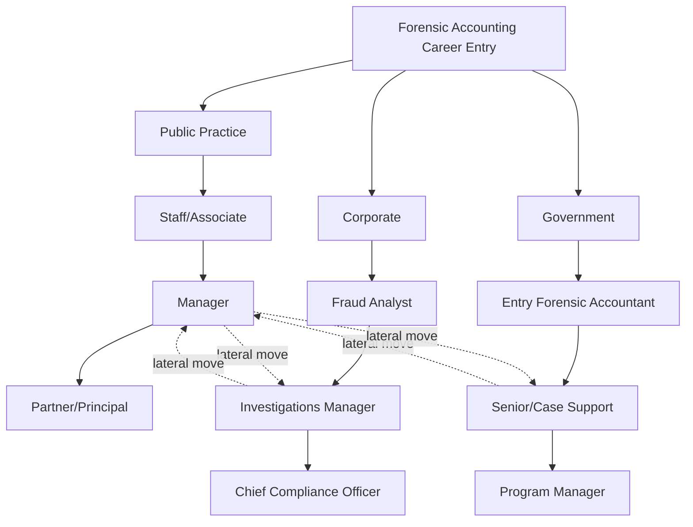

## Career Paths in Corporate, Public Practice, and Government

### Overview of the Forensic Accounting Career Landscape

Forensic accounting and fraud examination careers span three primary employment sectors, each offering distinct work environments, compensation structures, client relationships, and professional trajectories. The discipline sits at the intersection of accounting, auditing, investigation, and law, meaning practitioners often move fluidly between sectors over a career lifecycle.

**Key Points**

- The three sectors—corporate, public practice, and government—are not mutually exclusive; lateral moves between them are common and often career-enhancing
- Credentialing (CPA, CFE, CFF, CIA) functions as a portable currency across all three sectors
- Compensation, autonomy, case variety, and work-life balance trade off differently across sectors
- Entry points typically differ: public practice recruits heavily from campus, government often requires specific hiring processes (federal exams, security clearances), and corporate roles frequently require prior experience

---

### Sector 1: Public Practice (Accounting and Advisory Firms)

#### Structure and Employers

Public practice forensic accounting is delivered through professional services firms ranging from the Big Four (Deloitte, PwC, EY, KPMG) to large national firms (e.g., BDO, RSM, Grant Thornton), mid-market advisory firms, and boutique forensic/litigation support practices.

#### Typical Roles and Progression

$$\text{Staff/Associate} \rightarrow \text{Senior Associate} \rightarrow \text{Manager} \rightarrow \text{Senior Manager} \rightarrow \text{Director} \rightarrow \text{Partner/Principal}$$

- **Staff/Associate (0-2 years):** Data extraction, document review, ratio analysis, drafting workpapers under supervision
- **Senior Associate (2-5 years):** Leads fieldwork segments, drafts sections of expert reports, begins client-facing communication
- **Manager (5-8 years):** Manages engagement teams, budgets, and timelines; primary day-to-day client contact
- **Senior Manager/Director (8-15 years):** Business development, engagement oversight across multiple matters, may begin serving as testifying or consulting expert
- **Partner/Principal (15+ years):** Practice leadership, client relationship ownership, revenue generation (P&L responsibility), often becomes the designated testifying expert

#### Typical Engagement Types

- Financial statement fraud investigations
- Purchase price disputes and M&A due diligence
- Economic damages calculations (lost profits, business interruption)
- Anti-money laundering (AML) and sanctions compliance reviews
- Foreign Corrupt Practices Act (FCPA) and bribery investigations
- Bankruptcy and insolvency forensic reviews
- Matrimonial/divorce asset tracing

**Example**

A Senior Associate at a national firm is staffed on an FCPA internal investigation for a multinational manufacturer. Tasks include: reviewing vendor payment data for shell-company indicators, conducting keyword searches across email archives (eDiscovery), and drafting interview memoranda summarizing findings for outside counsel.

#### Compensation and Lifestyle Profile

- Compensation tends to be highest at Big Four/large national firms, especially at Manager level and above, though base pay at junior levels is often comparable to or lower than corporate
- Billable-hour or utilization targets are common (though less universal in forensic/advisory than in audit)
- Travel requirements can be substantial, particularly for litigation support and cross-border investigations
- [Inference] Work-life balance is generally perceived as more demanding than government roles and comparable to or more demanding than corporate roles, though this varies significantly by firm, group, and matter cycle

#### Credential Emphasis

- CPA is often a prerequisite or near-prerequisite for advancement to Manager and above
- Certified Fraud Examiner (CFE) is heavily valued and frequently required or strongly preferred
- Certified in Financial Forensics (CFF) — an AICPA credential layered on top of CPA — signals specialization
- Chartered Financial Analyst (CFA) is relevant for damages/valuation-focused practices

---

### Sector 2: Corporate (In-House Roles)

#### Structure and Employers

Corporate forensic accounting roles exist within internal audit departments, corporate security/investigations units, compliance and ethics functions, and dedicated forensic/fraud risk teams. Common employers include large multinational corporations, financial institutions, insurance companies, and technology firms with significant fraud exposure (e.g., payments platforms).

#### Typical Roles and Progression

$$\text{Fraud Analyst} \rightarrow \text{Senior Investigator} \rightarrow \text{Fraud/Investigations Manager} \rightarrow \text{Director of Investigations} \rightarrow \text{Chief Compliance Officer / VP Internal Audit}$$

- **Fraud Analyst/Investigator:** Monitors transaction data for anomalies, executes internal investigations of employee misconduct, expense fraud, procurement fraud
- **Senior Investigator/Manager:** Leads complex internal investigations, coordinates with legal, HR, and law enforcement, reports findings to audit committees
- **Director/Head of Investigations:** Sets fraud risk strategy, owns whistleblower hotline programs, briefs the board and audit committee
- **CCO/CAE (executive track):** Enterprise-wide risk oversight, regulatory liaison, strategic governance role

#### Typical Responsibilities

- Employee fraud and embezzlement investigations
- Vendor and procurement fraud (kickback schemes, shell vendors)
- Expense reimbursement fraud
- Whistleblower hotline triage and investigation
- Building and maintaining fraud risk assessments under COSO's Enterprise Risk Management framework
- Data analytics program ownership (continuous monitoring, anomaly detection)
- Sarbanes-Oxley (SOX) Section 404 internal control testing coordination

**Example**

A corporate Fraud Investigations Manager at a retail chain receives a whistleblower hotline tip alleging a regional manager is colluding with a vendor to inflate invoices. The investigation involves pulling procurement system data (P2P cycle), interviewing the vendor's finance contact, reconciling purchase orders to delivery receipts, and preparing a report for the General Counsel recommending termination and potential law enforcement referral.

#### Compensation and Lifestyle Profile

- Base compensation is often competitive with public practice at mid-levels, frequently including bonus and equity components unavailable in public practice or government
- Generally offers more predictable hours than public practice, though investigation-heavy periods can still demand intensity
- Career ceiling can be higher in absolute dollar terms at the executive level (CCO, CAE) than equivalent public practice roles, though this varies by industry and company size
- Single-employer focus means less matter variety than public practice, but greater depth on one organization's systems and risk profile

#### Credential Emphasis

- CFE is the dominant credential for pure investigations roles
- CPA remains valuable, especially for roles bridging internal audit and forensic functions
- Certified Internal Auditor (CIA) is common among practitioners with an internal audit pathway
- Certified Anti-Money Laundering Specialist (CAMS) is relevant for financial institution roles

---

### Sector 3: Government

#### Structure and Employers

Government forensic accounting roles span federal, state, and local levels, and include law enforcement, regulatory, and prosecutorial agencies.

**Federal (illustrative, U.S.-centric; equivalents exist in other jurisdictions):**

- Federal Bureau of Investigation (FBI) — Forensic Accountant series
- Internal Revenue Service Criminal Investigation (IRS-CI)
- Securities and Exchange Commission (SEC) — Division of Enforcement
- Government Accountability Office (GAO)
- Federal Deposit Insurance Corporation (FDIC), Office of Inspector General roles
- Department of Justice (DOJ) litigation support

**State/Local:**

- State Attorney General offices
- State auditor/comptroller offices
- District Attorney forensic accounting units
- State insurance fraud bureaus

#### Typical Roles and Progression

$$\text{Forensic Accountant/Auditor (GS-9/11)} \rightarrow \text{Senior Forensic Accountant (GS-12/13)} \rightarrow \text{Supervisory/Team Lead (GS-14)} \rightarrow \text{Program/Division Manager (GS-15+)}$$

(Grade structure illustrative of U.S. federal General Schedule; other jurisdictions use analogous banded structures.)

- **Entry-level:** Financial statement analysis in support of criminal referrals, tracing illicit funds, preparing summary exhibits for trial
- **Senior/Case Agent Support:** Leads financial analysis on major cases (securities fraud, money laundering, public corruption), testifies as an expert witness for the prosecution
- **Supervisory:** Manages teams of forensic accountants across multiple case loads, liaises with prosecutors
- **Program Management:** Sets investigative priorities, manages interagency task forces (e.g., joint terrorism financing task forces)

#### Typical Responsibilities

- Tracing proceeds of crime (money laundering, asset forfeiture support)
- Preparing net worth analyses and financial profiles of subjects
- Supporting grand jury proceedings with summary financial exhibits
- Reviewing SEC filings for disclosure fraud (10-K/10-Q misstatements)
- Bank Secrecy Act (BSA) and Suspicious Activity Report (SAR) analysis
- Testifying as a summary witness in criminal trials

**Example**

An IRS-CI Special Agent (forensic accounting background) works a tax fraud case involving an unreported cash-intensive business. The agent performs a bank deposits method analysis, reconciling deposits against reported income, identifies structuring patterns designed to evade Currency Transaction Report thresholds ($10,000), and prepares a net worth and expenditures analysis for the criminal referral.

#### Compensation and Lifestyle Profile

- Base compensation is typically lower than Big Four Manager-level or senior corporate roles, though pension benefits, job security, and federal benefits packages offset this over a career
- [Inference] Work-life balance and predictability are generally considered stronger than public practice, though field agent roles (e.g., FBI, IRS-CI with badge/gun authority) can involve irregular hours and travel
- Some federal roles (FBI Special Agent track) require law enforcement academy training in addition to forensic accounting expertise, and involve physical fitness standards and firearms qualification not present in other sectors
- Security clearance requirements are common and can restrict candidate pools (citizenship requirements, background investigations)

#### Credential Emphasis

- CFE is widely recognized and valued across government forensic roles
- CPA is often required or strongly preferred, particularly for GS-13 and above positions
- Specialized government-specific certifications exist (e.g., Certified Government Financial Manager — CGFM)

---

### Comparative Summary

<svg xmlns="http://www.w3.org/2000/svg" width="760" height="340" viewBox="0 0 760 340" font-family="Helvetica, Arial, sans-serif">
<text x="380" y="24" text-anchor="middle" font-size="16" font-weight="bold" fill="#1a1a1a">Sector Comparison: Career Attributes (svg_diagram)</text>

<line x1="120" y1="290" x2="720" y2="290" stroke="#333" stroke-width="1.5" />
<line x1="120" y1="60" x2="120" y2="290" stroke="#333" stroke-width="1.5" />

<text x="40" y="100" font-size="12" fill="#333">Comp. Ceiling</text>

<text x="40" y="150" font-size="12" fill="#333">Job Security</text>

<text x="40" y="200" font-size="12" fill="#333">Matter Variety</text>

<text x="40" y="250" font-size="12" fill="#333">Work-Life Bal.</text>

<rect x="500" y="60" width="12" height="12" fill="#2b6cb0" />
<text x="518" y="70" font-size="11" fill="#333">Public Practice</text>
<rect x="500" y="78" width="12" height="12" fill="#c05621" />
<text x="518" y="88" font-size="11" fill="#333">Corporate</text>
<rect x="500" y="96" width="12" height="12" fill="#2f855a" />
<text x="518" y="106" font-size="11" fill="#333">Government</text>

<rect x="160" y="90" width="80" height="14" fill="#2b6cb0" />
<rect x="160" y="106" width="95" height="14" fill="#c05621" />
<rect x="160" y="122" width="55" height="14" fill="#2f855a" />

<rect x="160" y="140" width="55" height="14" fill="#2b6cb0" />
<rect x="160" y="156" width="65" height="14" fill="#c05621" />
<rect x="160" y="172" width="100" height="14" fill="#2f855a" />

<rect x="160" y="190" width="100" height="14" fill="#2b6cb0" />
<rect x="160" y="206" width="45" height="14" fill="#c05621" />
<rect x="160" y="222" width="75" height="14" fill="#2f855a" />

<rect x="160" y="240" width="45" height="14" fill="#2b6cb0" />
<rect x="160" y="256" width="65" height="14" fill="#c05621" />
<rect x="160" y="272" width="90" height="14" fill="#2f855a" />

<text x="380" y="315" text-anchor="middle" font-size="10" fill="#666" font-style="italic">Illustrative relative positioning only — varies by firm, agency, industry, and individual circumstance [Inference]</text>

</svg>

---

### Cross-Sector Career Mobility

A distinctive feature of this field is bidirectional mobility:

- **Public practice → Corporate:** Common at the Manager/Senior Manager level; practitioners move in-house seeking better work-life balance, equity compensation, or a leadership track toward CCO/CAE
- **Public practice → Government:** Practitioners with Big Four financial statement fraud experience are attractive to SEC Enforcement and DOJ for their technical accounting depth
- **Government → Public practice:** Former federal agents/regulators are highly sought after by advisory firms for their investigative credibility, testimony experience, and regulatory relationships (sometimes called the "revolving door")
- **Corporate → Public practice:** Less common but occurs when in-house investigators seek broader matter exposure or partnership-track compensation

**[Unverified]** The relative frequency and typical timing of these moves varies significantly by jurisdiction, economic cycle, and individual firm/agency hiring practices; no single authoritative dataset comprehensively tracks cross-sector mobility rates in this profession.

---

### Regulatory and Professional Considerations by Sector

| Factor | Public Practice | Corporate | Government |
| --- | --- | --- | --- |
| Primary regulator/oversight | State boards of accountancy, PCAOB (if audit-adjacent) | Audit committee, board of directors | Agency Inspector General, civil service rules |
| Independence requirements | Strict (AICPA/SEC independence rules apply to attest-adjacent work) | Not independence-constrained (internal function) | N/A (investigative, not attest) |
| Testimony role | Retained/consulting or testifying expert | Rarely testifies; supports legal/HR | Frequently testifies as summary witness |
| Client relationship | External, fee-based, engagement letters | Internal stakeholders | Public interest, statutory mandate |

---

### Related Topics

- Professional certifications: CFE, CPA, CFF, CIA, CAMS comparative requirements
- The role of the expert witness: consulting vs. testifying expert distinctions
- COSO Enterprise Risk Management framework and fraud risk assessment
- Whistleblower programs and hotline management (SOX, Dodd-Frank)
- The "revolving door" phenomenon between regulators and private practice
- Compensation benchmarking across forensic accounting sectors
- Building a forensic accounting practice: business development in public practice
- Federal law enforcement hiring processes (background investigations, security clearances)