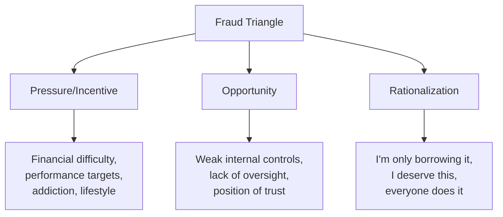

## Overview of Professional Organizations and the CFE Credential

### The Professional Ecosystem of Forensic Accounting

Forensic accounting and fraud examination are governed and shaped by a network of professional bodies that set standards, issue credentials, publish research, and enforce codes of ethics. Understanding this ecosystem is foundational to navigating the profession, since credentials, continuing education, and standards of practice all originate from these organizations.

**Key Points**

- No single global regulator oversees forensic accounting; the field is shaped by a constellation of professional associations, each with its own credential(s), standards, and enforcement mechanisms
- The Association of Certified Fraud Examiners (ACFE) is the dominant body specifically for fraud examination and issues the Certified Fraud Examiner (CFE) credential
- Accounting-adjacent bodies (AICPA, IIA, ACAMS, ACFCS) issue complementary credentials that often overlap with forensic practice
- Credentials serve as signaling mechanisms to employers, courts (for expert witness qualification), and regulators

---

### Major Professional Organizations

#### Association of Certified Fraud Examiners (ACFE)

- Founded in 1988 by Dr. Joseph T. Wells, a former FBI agent and CPA
- Headquartered in Austin, Texas; the world's largest anti-fraud organization by membership
- Publishes the **Report to the Nations**, a biennial global fraud study widely cited as the benchmark source for occupational fraud statistics (median loss figures, fraud triangle prevalence data, detection method statistics)
- Maintains the **Fraud Examiners Manual**, the authoritative body of knowledge underlying the CFE exam
- Issues the CFE credential (detailed below)
- Enforces a **Code of Professional Ethics** and a **Code of Professional Standards** binding on CFEs

#### American Institute of Certified Public Accountants (AICPA)

- Issues the CPA license (via state boards) and the **Certified in Financial Forensics (CFF)** credential, a specialty credential layered on top of an active CPA
- Publishes forensic-specific guidance, including the **Statement on Standards for Forensic Services (SSFS No. 1)**, which governs CPAs performing litigation and investigative engagements
- CFF competency areas include bankruptcy/insolvency, computer forensics, economic damages, family law, financial statement misrepresentation, and valuation

#### Institute of Internal Auditors (IIA)

- Issues the **Certified Internal Auditor (CIA)** credential
- Publishes the **International Professional Practices Framework (IPPF)**, which includes standards relevant to fraud risk assessment within internal audit functions
- Relevant to corporate-sector forensic practitioners whose roles intersect with internal audit

#### Association of Certified Anti-Money Laundering Specialists (ACAMS)

- Issues the **CAMS (Certified Anti-Money Laundering Specialist)** credential
- Central to forensic accountants working in financial institution compliance, BSA/AML investigations, and sanctions screening

#### Association of Certified Financial Crime Specialists (ACFCS)

- Issues the **CFCS (Certified Financial Crime Specialist)** credential, covering a broader financial crime scope (fraud, money laundering, cybercrime, sanctions) than the CFE alone

#### National Association of Certified Valuators and Analysts (NACVA) and American Society of Appraisers (ASA)

- Relevant where forensic accounting intersects with business valuation and economic damages calculation
- Issue credentials such as **CVA (Certified Valuation Analyst)** and **ASA (Accredited Senior Appraiser)**

**Example**

A practitioner building a well-rounded forensic accounting career might hold: CPA (state license) → CFE (fraud specialization) → CFF (AICPA forensic specialty). This combination signals both core accounting competency and dual forensic specialization to courts qualifying expert witnesses under evidentiary standards.

---

### The Certified Fraud Examiner (CFE) Credential

#### Eligibility Requirements

- **Membership:** Active ACFE membership in good standing
- **Education:** Bachelor's degree from an accredited institution (in some cases, work experience can substitute for a portion of the education requirement, subject to ACFE's minimum points system)
- **Professional Experience:** Minimum of two years in a fraud-related field, which the ACFE interprets broadly to include accounting, auditing, criminology, investigation, law, and loss prevention
- **Character Reference:** Requires professional references attesting to the candidate's character
- **Points System:** ACFE uses a cumulative points system across education, professional experience, and professional/character references; candidates must reach a minimum threshold to qualify to sit for the exam

#### Exam Structure

The CFE Exam is a computer-based examination covering four core content areas, historically administered as four sections (each independently passable and retakeable):

$$\text{CFE Exam} = \{\text{Financial Transactions \& Fraud Schemes}, \text{Law}, \text{Investigation}, \text{Fraud Prevention \& Deterrence}\}$$

1. **Financial Transactions and Fraud Schemes**
   - Asset misappropriation schemes (skimming, larceny, fraudulent disbursements)
   - Corruption schemes (bribery, illegal gratuities, conflicts of interest, economic extortion)
   - Financial statement fraud schemes (fictitious revenues, improper asset valuation, concealed liabilities)
   - Money laundering stages: placement, layering, integration
2. **Law**
   - Criminal and civil law fundamentals relevant to fraud
   - Rules of evidence
   - Rights of the accused and the fraud examiner's legal boundaries during investigations
   - [Note: content is U.S.-law-weighted historically, though ACFE has expanded international content over time]
3. **Investigation**
   - Interview techniques (including cognitive interviewing methods)
   - Evidence collection, chain of custody, and forensic document examination
   - Tracing illicit transactions
   - Digital forensics fundamentals and electronic evidence handling
   - Report writing standards for investigative findings
4. **Fraud Prevention and Deterrence**
   - Fraud risk assessment frameworks
   - Internal control design and evaluation
   - Corporate governance and the role of the board/audit committee
   - Behavioral aspects of fraud (fraud triangle, fraud diamond, rationalization patterns)

**[Unverified]** Exact question counts, passing score thresholds, and exam delivery format details change periodically as ACFE updates its exam; candidates should verify current specifications directly against ACFE's official exam guide rather than relying on any fixed historical figures, since these are administrative details subject to revision.

#### The Fraud Triangle (Foundational CFE Concept)

<svg xmlns="http://www.w3.org/2000/svg" width="600" height="480" viewBox="0 0 600 480" font-family="Helvetica, Arial, sans-serif">
<text x="300" y="24" text-anchor="middle" font-size="16" font-weight="bold" fill="#1a1a1a">The Fraud Triangle (svg_diagram)</text>
<polygon points="300,60 480,400 120,400" fill="none" stroke="#2b6cb0" stroke-width="3" />
<circle cx="300" cy="60" r="42" fill="#2b6cb0" />
<text x="300" y="55" text-anchor="middle" font-size="12" fill="#fff" font-weight="bold">Pressure</text>
<text x="300" y="70" text-anchor="middle" font-size="10" fill="#fff">Incentive</text>
<circle cx="480" cy="400" r="42" fill="#c05621" />
<text x="480" y="395" text-anchor="middle" font-size="12" fill="#fff" font-weight="bold">Opportunity</text>
<circle cx="120" cy="400" r="42" fill="#2f855a" />
<text x="120" y="395" text-anchor="middle" font-size="12" fill="#fff" font-weight="bold">Rationali-</text>
<text x="120" y="410" text-anchor="middle" font-size="12" fill="#fff" font-weight="bold">zation</text>

<text x="300" y="440" text-anchor="middle" font-size="11" fill="#333">Weak internal controls / lack of oversight</text>

<text x="120" y="455" text-anchor="middle" font-size="11" fill="#333" width="200">"Everyone does it" /</text>

<text x="120" y="468" text-anchor="middle" font-size="11" fill="#333">"I'll pay it back"</text>

<text x="480" y="455" text-anchor="middle" font-size="11" fill="#333">Financial strain /</text>

<text x="480" y="468" text-anchor="middle" font-size="11" fill="#333">performance targets</text>

</svg>

Developed conceptually from Donald Cressey's criminology research and central to ACFE curriculum; later extended by other researchers into the **fraud diamond** (adding "capability" as a fourth element).

#### Continuing Professional Education (CPE) and Maintenance

- CFEs must complete ongoing Continuing Professional Education (CPE) credits annually to maintain the credential, with a portion typically required to be fraud-related content
- Annual membership dues are required to remain in good standing
- ACFE enforces its Code of Professional Ethics; violations can result in credential revocation

#### Value of the CFE Credential

- **Employer signaling:** Widely listed as preferred or required in job postings across all three career sectors (public practice, corporate, government)
- **Court qualification:** Assists in qualifying a practitioner as an expert witness on fraud-related matters, though courts evaluate expert qualification independently under applicable evidentiary rules (e.g., Daubert or Frye standards in U.S. courts) — the credential supports but does not guarantee qualification
- **Global recognition:** ACFE has chapters and members across most countries, making the CFE relatively portable internationally compared to jurisdiction-specific credentials like CPA

**[Inference]** Employers in some jurisdictions or sectors may weight the CFE differently relative to CPA/CFF or local equivalents; the relative hiring premium of holding a CFE versus other forensic credentials varies by region, employer, and role level, and is not uniformly documented across markets.

---

### Comparative Credential Table

| Credential | Issuing Body | Prerequisite | Core Focus |
| --- | --- | --- | --- |
| CFE | ACFE | Bachelor's degree + 2 yrs relevant experience | Fraud examination (schemes, law, investigation, prevention) |
| CPA | State boards (via AICPA exam) | Accounting education + exam + experience (varies by state) | General accounting/audit competency; legal basis for attest work |
| CFF | AICPA | Active CPA license | Forensic accounting specialization |
| CIA | IIA | Education + experience | Internal audit standards and practice |
| CAMS | ACAMS | Experience-based eligibility | Anti-money laundering compliance |
| CFCS | ACFCS | Experience-based eligibility | Broad financial crime (fraud, AML, cyber, sanctions) |

---

### Related Topics

- The Fraud Triangle and Fraud Diamond theoretical frameworks in depth
- ACFE's Report to the Nations: structure, methodology, and key statistics
- AICPA Statement on Standards for Forensic Services (SSFS No. 1)
- Expert witness qualification standards (Daubert vs. Frye)
- Continuing Professional Education requirements across credentialing bodies
- Code of Professional Ethics comparison: ACFE vs. AICPA
- Building a credential roadmap: sequencing CPA, CFE, and CFF
- International equivalents to the CFE (e.g., regional anti-fraud associations)