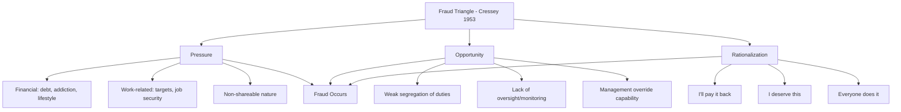

## The Fraud Triangle: Pressure, Opportunity, and Rationalization

### Theoretical Origins

The fraud triangle is the foundational conceptual model in fraud examination, explaining why otherwise trusted individuals commit fraud. It originates from the criminological research of **Dr. Donald R. Cressey**, a sociologist who studied incarcerated embezzlers in the 1950s. Cressey's hypothesis, published in his 1953 work *Other People's Money*, is often summarized as:

> [Paraphrased, not quoted verbatim] Trusted persons become fraud perpetrators when they perceive a non-shareable financial problem, recognize an opportunity to resolve it secretly through their position of trust, and construct a rationalization that allows them to view the act as consistent with their self-image as a trustworthy person.

**Key Points**

- Cressey's original research focused specifically on embezzlement (violation of financial trust), not fraud generally, though the model has since been generalized across fraud examination
- All three elements are theorized as necessary conditions; the model posits that removing any single element should, in theory, prevent the fraud from occurring
- Joseph Wells and the ACFE later popularized and operationalized Cressey's hypothesis as "the fraud triangle" for practitioner use
- The model is descriptive/explanatory rather than predictive at the individual level — it explains fraud after the fact more reliably than it predicts specific future perpetrators

---

### The Three Elements

#### 1. Pressure (Incentive/Motivation)

Pressure refers to a financial or non-financial problem the individual feels compelled to solve, often one they perceive as **non-shareable** — meaning they cannot disclose it to others without personal, professional, or social cost.

**Common categories of pressure:**

- **Financial pressure:** Personal debt, medical expenses, gambling losses, addiction, lifestyle beyond means, investment losses
- **Vice-driven pressure:** Substance abuse, gambling addiction
- **Work-related pressure:** Unrealistic performance targets, fear of job loss, desire for bonus/promotion, pressure to meet analyst earnings expectations (common driver in financial statement fraud)
- **Other pressures:** Family expectations, status-seeking, revenge against an employer

**Example**

A controller facing personal bankruptcy due to a spouse's medical bills begins skimming from the petty cash fund. The debt is "non-shareable" because disclosing it to the employer could jeopardize the controller's professional standing, and pride prevents disclosure to family or friends.

#### 2. Opportunity

Opportunity is the perceived ability to commit the fraud and avoid detection, typically arising from weaknesses in internal controls, lack of oversight, or the perpetrator's position of trust.

**Common enablers of opportunity:**

- Weak or absent segregation of duties (e.g., one person both authorizing and recording transactions)
- Inadequate management oversight or a culture of unquestioning trust in long-tenured employees
- Poor documentation and record-keeping standards
- Lack of, or infrequent, independent verification/reconciliation
- Override capability by management (management override of controls is a leading factor in financial statement fraud)
- Complexity of transactions that obscures visibility (e.g., related-party transactions, complex derivatives)

Opportunity is generally considered the **only element of the triangle that an organization can directly control** through internal control design, which is why fraud prevention programs focus heavily on reducing opportunity (segregation of duties, authorization matrices, surprise audits, whistleblower hotlines) rather than attempting to eliminate individual pressure or rationalization.

**Example**

An accounts payable clerk is the sole individual responsible for both creating new vendors in the ERP system and approving vendor payments. This absence of segregation of duties creates the opportunity to establish a shell vendor and issue fraudulent payments to it.

#### 3. Rationalization

Rationalization is the cognitive process by which the perpetrator reconciles the fraudulent act with their self-concept as a fundamentally honest or law-abiding person. Because most fraud perpetrators are first-time offenders without a criminal history, rationalization is what allows them to cross the line psychologically.

**Common rationalizations documented in ACFE and criminological literature:**

- "I'm only borrowing the money; I'll pay it back."
- "The company owes me this; I'm underpaid/undervalued."
- "Everyone else does it."
- "No one will be hurt by this."
- "I deserve this given how hard I work."
- "The company is dishonest/unethical to me, so this is fair."

**[Inference]** Rationalization is generally considered the least directly observable of the three elements during a live investigation, since it is an internal cognitive process rather than an environmental condition; investigators typically infer it retrospectively through interview statements, written admissions, or behavioral indicators rather than detecting it in advance.

---

### Visual Model

<svg xmlns="http://www.w3.org/2000/svg" width="640" height="500" viewBox="0 0 640 500" font-family="Helvetica, Arial, sans-serif">
<text x="320" y="24" text-anchor="middle" font-size="16" font-weight="bold" fill="#1a1a1a">Fraud Triangle: Element Interaction (svg_diagram)</text>
<polygon points="320,60 500,410 140,410" fill="none" stroke="#333" stroke-width="2.5" />
<circle cx="320" cy="60" r="46" fill="#2b6cb0" />
<text x="320" y="55" text-anchor="middle" font-size="13" fill="#fff" font-weight="bold">PRESSURE</text>
<text x="320" y="70" text-anchor="middle" font-size="9" fill="#fff">Non-shareable problem</text>
<circle cx="500" cy="410" r="46" fill="#c05621" />
<text x="500" y="405" text-anchor="middle" font-size="13" fill="#fff" font-weight="bold">OPPORTUNITY</text>
<text x="500" y="420" text-anchor="middle" font-size="9" fill="#fff">Weak controls</text>
<circle cx="140" cy="410" r="46" fill="#2f855a" />
<text x="140" y="400" text-anchor="middle" font-size="13" fill="#fff" font-weight="bold">RATIONAL-</text>
<text x="140" y="415" text-anchor="middle" font-size="13" fill="#fff" font-weight="bold">IZATION</text>
<text x="140" y="428" text-anchor="middle" font-size="9" fill="#fff">Self-justification</text>
<circle cx="320" cy="290" r="34" fill="#742a2a" opacity="0.9" />
<text x="320" y="285" text-anchor="middle" font-size="11" fill="#fff" font-weight="bold">FRAUD</text>
<text x="320" y="298" text-anchor="middle" font-size="10" fill="#fff">occurs</text>
<line x1="320" y1="106" x2="320" y2="256" stroke="#999" stroke-width="1.5" stroke-dasharray="4,3" />
<line x1="470" y1="390" x2="350" y2="305" stroke="#999" stroke-width="1.5" stroke-dasharray="4,3" />
<line x1="170" y1="390" x2="290" y2="305" stroke="#999" stroke-width="1.5" stroke-dasharray="4,3" />

<text x="320" y="470" text-anchor="middle" font-size="11" fill="#666" font-style="italic">All three elements theorized as necessary; removing any one should prevent occurrence</text>

</svg>

---

### Extensions to the Original Model

#### The Fraud Diamond

Proposed by **David T. Wolfe and Dana R. Hermanson (2004)**, the fraud diamond adds a fourth element:

$$\text{Fraud Diamond} = \{\text{Pressure}, \text{Opportunity}, \text{Rationalization}, \text{Capability}\}$$

- **Capability:** The individual must possess the personal traits, position, intelligence, ego, and skill set necessary to actually recognize and exploit the opportunity — not everyone with pressure, opportunity, and a rationalization will act, absent the capability to execute and conceal the scheme
- [Inference] The fraud diamond is generally viewed by practitioners as a refinement addressing why some individuals with apparent motive and opportunity still do not commit fraud, though it has not fully displaced the original triangle in ACFE curriculum, which continues to use the triangle as its primary teaching model

#### Other Related Frameworks

- **Fraud Pentagon** (Crowe, 2011): adds "competence" and "arrogance" as further refinements, though this model has seen less widespread adoption than the triangle or diamond
- **Meta-model / Fraud Scale** (Albrecht, 1984): situational pressures and personal integrity plotted against perceived opportunity, predating but conceptually parallel to Cressey's framework

---

### Practical Application in Fraud Examination

#### Use in Fraud Risk Assessment

Auditors and forensic accountants apply the fraud triangle systematically during risk assessment procedures, mapping each element to specific risk indicators (red flags):

| Element | Red Flag Category | Example Indicators |
| --- | --- | --- |
| Pressure | Financial distress signals | Living beyond means, high personal debt, creditor pressure |
| Opportunity | Control environment weaknesses | Lack of segregation of duties, dominant unchecked individual, related-party complexity |
| Rationalization | Behavioral/attitudinal signals | Wheeler-dealer attitude, disregard for controls, past ethical violations, excessive control-defiance |

#### Use Under Auditing Standards

The fraud triangle underpins fraud risk consideration requirements in professional auditing standards (e.g., historically codified in standards such as AU-C 240 in U.S. GAAS and analogous provisions in ISA 240 internationally), which require auditors to consider incentives/pressures, opportunities, and attitudes/rationalizations when assessing fraud risk in financial statement audits.

**[Unverified]** Specific standard numbering and requirements are subject to periodic standard-setting board revisions; practitioners should confirm current standard citations against the applicable current authoritative literature for their jurisdiction rather than relying on a fixed reference.

---

### Limitations and Critiques of the Model

- **Retrospective bias:** The model was built from confessions of already-caught embezzlers, meaning it may better explain detected/confessed fraud than undetected fraud or fraud committed by individuals with different psychological profiles
- **Not predictive at the individual level:** Presence of all three elements does not reliably predict that a specific individual will commit fraud; many individuals under pressure, with opportunity, who could rationalize, never offend
- **Limited applicability to certain fraud types:** [Inference] The original model, developed from embezzlement research, may map less cleanly onto some collusive, organized, or predatory fraud schemes (e.g., fraud committed by career criminals who do not require rationalization because they lack the self-image of an honest person the model assumes)
- **Cultural and contextual variability:** What constitutes a "non-shareable" pressure or an acceptable rationalization can vary across cultures and organizational contexts, limiting universal applicability

---

### Related Topics

- The Fraud Diamond and Fraud Pentagon extended models
- Fraud risk assessment procedures under AU-C 240 / ISA 240
- Behavioral red flags and the "concealment" and "conversion" stages of fraud
- Cressey's original embezzlement research methodology
- Segregation of duties as a primary opportunity-reduction control
- Interview and interrogation techniques for eliciting rationalization statements
- Tone at the top and organizational culture's effect on the fraud triangle
- Case studies applying the fraud triangle to major financial statement fraud scandals