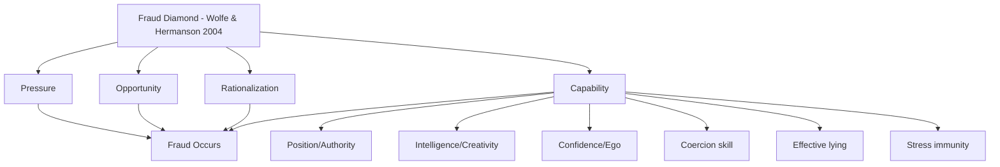

## The Fraud Diamond and Extended Fraud Models

### Overview

While the fraud triangle remains the foundational model in fraud examination, researchers have proposed several extensions designed to address its perceived limitations — particularly its weak explanatory power for *who*, among many people with pressure and opportunity, actually acts. These extended models add elements such as capability, arrogance, and competence to build a more complete behavioral profile of the fraud perpetrator.

**Key Points**

- Extended models do not replace the fraud triangle in professional curricula (ACFE continues to teach the triangle as its core model); they are supplementary analytical lenses
- Each extension responds to a specific critique of the original triangle: primarily, that pressure + opportunity + rationalization does not explain why some capable individuals act while others in identical circumstances do not
- These models are most useful in **profiling and risk assessment** contexts (e.g., evaluating executive-level fraud risk) rather than as standalone detection tools
- [Inference] Practitioner adoption varies; the fraud diamond has achieved meaningfully wider recognition and citation in professional literature than the pentagon or later models, though the triangle remains dominant overall

---

### The Fraud Diamond (Wolfe & Hermanson, 2004)

#### Origin and Rationale

David T. Wolfe and Dana R. Hermanson introduced the fraud diamond in a 2004 article in the *CPA Journal*, arguing that many frauds involving pressure, opportunity, and rationalization still would not occur without a fourth necessary element: **capability**.

$$\text{Fraud Diamond} = \{\text{Pressure}, \text{Opportunity}, \text{Rationalization}, \text{Capability}\}$$

Their core argument: opportunity opens the door to fraud, but pressure and rationalization can draw a person toward it — capability determines whether the person actually recognizes the open door as an opportunity and possesses the skills to walk through it and conceal the act.

#### Capability: Component Traits

Wolfe and Hermanson decomposed capability into several sub-traits an individual typically needs to execute and sustain a fraud scheme:

- **Position/Function:** The person's role provides access or authority to create or exploit the opportunity (e.g., CFO access to financial reporting systems)
- **Intelligence and Creativity:** Sufficient understanding of internal controls to identify weaknesses and design a scheme to exploit them undetected
- **Confidence/Ego:** Belief that they will not be detected, or that they could talk their way out of it if caught
- **Ability to Coerce Others:** Skill in persuading or pressuring subordinates or colleagues to participate or remain silent
- **Effective Lying:** Ability to maintain consistent, convincing deception under scrutiny (including during interviews or audits)
- **Immunity to Stress:** Capacity to manage the psychological stress of ongoing deception without behavioral tells that would raise suspicion

**Example**

Two mid-level managers at the same company face identical financial pressure and have identical opportunity (both control a discretionary budget with weak oversight). Manager A lacks the technical understanding of the accounting system to conceal a scheme and abandons the idea. Manager B has previously worked in internal audit, understands exactly which reconciliations are never reviewed, and possesses the confidence to fabricate supporting documentation convincingly. Manager B proceeds; Manager A does not. The fraud diamond attributes this divergence to differing **capability**, despite identical pressure, opportunity, and plausible rationalization.

#### Visual Model

<svg xmlns="http://www.w3.org/2000/svg" width="640" height="480" viewBox="0 0 640 480" font-family="Helvetica, Arial, sans-serif">
<text x="320" y="24" text-anchor="middle" font-size="16" font-weight="bold" fill="#1a1a1a">The Fraud Diamond (svg_diagram)</text>
<polygon points="320,50 560,240 320,430 80,240" fill="none" stroke="#333" stroke-width="2.5" />
<circle cx="320" cy="50" r="40" fill="#2b6cb0" />
<text x="320" y="55" text-anchor="middle" font-size="12" fill="#fff" font-weight="bold">PRESSURE</text>
<circle cx="560" cy="240" r="40" fill="#c05621" />
<text x="560" y="245" text-anchor="middle" font-size="12" fill="#fff" font-weight="bold">OPPORTUNITY</text>
<circle cx="320" cy="430" r="40" fill="#2f855a" />
<text x="320" y="425" text-anchor="middle" font-size="12" fill="#fff" font-weight="bold">RATIONAL-</text>
<text x="320" y="440" text-anchor="middle" font-size="12" fill="#fff" font-weight="bold">IZATION</text>
<circle cx="80" cy="240" r="40" fill="#805ad5" />
<text x="80" y="245" text-anchor="middle" font-size="12" fill="#fff" font-weight="bold">CAPABILITY</text>

<text x="80" y="290" text-anchor="middle" font-size="9" fill="#333">Position, skill,</text>

<text x="80" y="302" text-anchor="middle" font-size="9" fill="#333">confidence, ability</text>

<text x="80" y="314" text-anchor="middle" font-size="9" fill="#333">to conceal</text>

</svg>

#### Practical Application

- Most useful for assessing **management-level and executive fraud risk**, where capability (positional power, sophistication) is a differentiating factor not well captured by the triangle
- Frequently applied in analyzing large-scale financial statement fraud cases where perpetrators required specific technical or positional capability (e.g., detailed knowledge of consolidation accounting, or authority to override controls)
- Used in executive hiring and succession risk assessments, where evaluating capability-related traits (ego, history of control circumvention, technical sophistication) supplements standard background checks

---

### The Fraud Pentagon (Crowe Horwath, 2011)

#### Origin and Rationale

Developed by Jonathan T. Marks at Crowe Horwath (a consulting/audit firm), the fraud pentagon — sometimes called "Crowe's Fraud Pentagon Theory" — extends the diamond by adding two further elements: **competence** and **arrogance**.

$$\text{Fraud Pentagon} = \{\text{Pressure}, \text{Opportunity}, \text{Rationalization}, \text{Competence}, \text{Arrogance}\}$$

- **Competence:** Substantially overlaps with Wolfe and Hermanson's "capability" — the ability to override controls and manage the social/organizational situation to one's advantage
- **Arrogance:** A distinct addition — a lack of conscience, or an attitude of superiority and entitlement, leading the individual to believe that internal controls or policies simply do not apply to them personally

**[Inference]** The pentagon's separation of "arrogance" from "competence"/"capability" is intended to capture cases — often high-profile executive fraud — where the perpetrator's defining trait is not skill but an entitled disregard for rules, distinguishing this profile from a merely technically capable but rule-abiding employee under pressure.

**[Unverified]** Adoption of the fraud pentagon in mainstream academic and professional fraud examination curricula (including ACFE materials) remains considerably more limited than the triangle or diamond; it appears more frequently in academic accounting/auditing research (particularly in earnings management and financial statement fraud studies) than in practitioner training programs.

---

### Comparative Summary of Models

| Model | Year | Author(s) | Elements |
| --- | --- | --- | --- |
| Fraud Triangle | 1953 | Donald Cressey | Pressure, Opportunity, Rationalization |
| Fraud Diamond | 2004 | Wolfe & Hermanson | Triangle + Capability |
| Fraud Pentagon (Crowe) | 2011 | Jonathan Marks / Crowe Horwath | Triangle + Competence + Arrogance |
| Fraud Scale (predates triangle's popularization) | 1984 | W. Steve Albrecht | Situational pressure, perceived opportunity, personal integrity |

**[Unverified]** Some academic literature also references a "Fraud Hexagon" or "S.C.O.R.E." model incorporating additional elements such as "stimulus" or "ego"; the naming and composition of these later extensions vary across sources, and no single hexagon formulation has achieved the level of consensus recognition that the triangle, diamond, or Crowe's pentagon have — practitioners should treat any hexagon-labeled model as emerging/non-standardized rather than an established industry framework.

---

### Practical Use in Forensic Engagements

**Example**

In a financial statement fraud investigation involving a CFO who directed the improper capitalization of operating expenses, a forensic accountant might document findings against a diamond or pentagon framework in an expert report:

- **Pressure:** Missed analyst earnings targets threatening stock price and executive bonus payouts
- **Opportunity:** CFO had override authority over the general ledger close process with minimal board-level financial literacy to challenge entries
- **Rationalization:** Interview notes and emails suggesting belief that the capitalized costs would "become legitimate" once a pending product launch succeeded
- **Capability/Competence:** CFO's technical accounting sophistication allowed construction of a multi-entity capitalization schedule difficult for auditors to unwind
- **Arrogance (pentagon-specific):** Documented pattern of dismissing internal audit findings and overriding controller objections

Mapping findings to these elements helps structure both the investigative narrative and, where applicable, expert testimony explaining perpetrator behavior to a jury or trier of fact.

#### Limitations Shared Across Extended Models

- Like the original triangle, these models remain **explanatory rather than predictive** — they are far more reliable for structuring analysis of a fraud that has already occurred than for prospectively identifying which specific individual will offend
- Overlap between elements (e.g., "capability" and "competence" are near-synonymous across the diamond and pentagon) creates some definitional redundancy in the literature
- [Inference] Limited independent empirical validation exists comparing the predictive or explanatory power of the pentagon against the simpler diamond or triangle, meaning claims of superior explanatory power for the newer models should be treated cautiously pending further research consensus

---

### Related Topics

- Cressey's original fraud triangle and its criminological foundations
- Executive-level fraud risk profiling using the fraud diamond
- Management override of controls as a capability-driven risk factor
- Behavioral red flags associated with arrogance and entitlement in financial statement fraud
- Application of extended fraud models in expert witness reports
- Earnings management research employing the fraud pentagon
- Corporate governance mechanisms designed to counter high-capability perpetrators (board financial literacy, whistleblower protections)