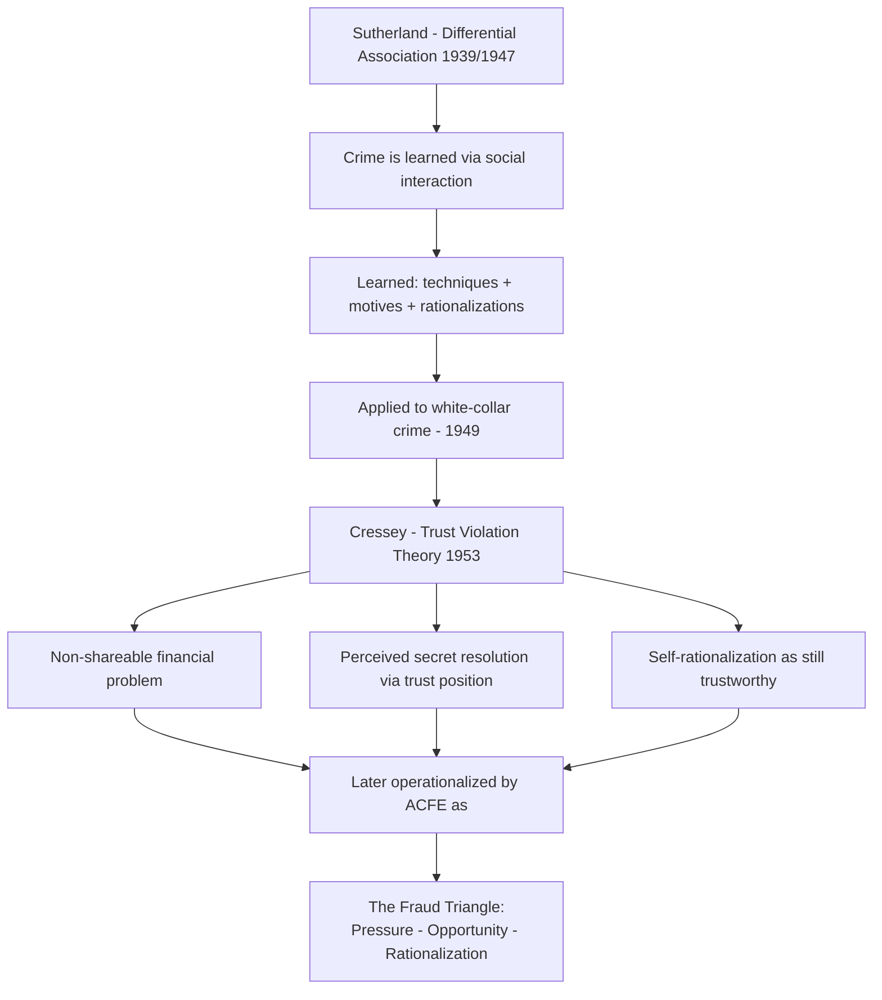

## Cressey's Theory and Sutherland's Differential Association

### Overview

The criminological roots of modern fraud examination trace back to two related but distinct bodies of theory: **Edwin Sutherland's differential association theory** (1939/1947), which explains how individuals learn criminal behavior, including white-collar crime, and **Donald Cressey's hypothesis of trust violation** (1953), which built directly on Sutherland's foundational framework to explain embezzlement specifically. Understanding the relationship between these two theories clarifies why the fraud triangle exists in its current form and what its theoretical limitations are.

**Key Points**

- Cressey was Sutherland's doctoral student at Indiana University; Cressey's embezzlement research is a direct theoretical descendant of Sutherland's broader criminology
- Sutherland is also credited with coining the term **"white-collar crime"** in a landmark 1939 address to the American Sociological Society
- Differential association theory explains criminal behavior generally (learned through social interaction); Cressey's theory narrows the focus specifically to violation of financial trust
- Both theories reject purely individual-pathology explanations of crime (i.e., that criminals are inherently different/deviant people) in favor of social-process explanations

---

### Edwin Sutherland and Differential Association Theory

#### Background

Edwin H. Sutherland (1883–1950) was an American sociologist whose 1939 textbook *Principles of Criminology* (and its subsequent editions) introduced differential association theory as a general theory of criminal behavior. His 1949 book *White Collar Crime* extended this framework specifically to crimes committed by persons of high social status in the course of their occupations.

#### Core Propositions of Differential Association

Sutherland formalized the theory into nine propositions; the core mechanism can be summarized as follows:

$$\text{Criminal Behavior} = f(\text{Learned Definitions Favorable to Violation} > \text{Learned Definitions Unfavorable to Violation})$$

1. Criminal behavior is **learned**, not inherited or the product of individual pathology
2. It is learned in interaction with other persons, primarily within intimate personal groups
3. The learning includes both the **techniques** of committing the crime and the specific **direction of motives, drives, rationalizations, and attitudes**
4. The specific direction of motives is learned from definitions of legal codes as favorable or unfavorable
5. A person becomes delinquent/criminal when definitions favorable to law violation **exceed** definitions unfavorable to law violation (the principle of **differential association**)
6. Differential associations vary in **frequency, duration, priority, and intensity**
7. The process of learning criminal behavior involves the same mechanisms as any other learning
8. Criminal behavior is an expression of general needs and values but is **not explained by those needs/values alone** (since non-criminals share the same general needs, e.g., financial security)

**Key Points**

- The theory's central insight is that criminal behavior — including fraud and white-collar crime — is **socially transmitted** through association with others who model, normalize, or teach it, not simply a product of individual moral failure
- This directly informs modern understanding of **organizational fraud culture**: if enough individuals within a firm normalize control circumvention (e.g., "everyone inflates their expense reports"), new employees may learn both the technique and the accompanying rationalization through workplace socialization
- Sutherland's white-collar crime research specifically challenged the assumption that crime was concentrated among the poor, demonstrating that individuals of high social and occupational status also systematically violate the law in the course of their work

**Example**

A newly hired procurement officer joins a department where senior colleagues routinely accept small "gifts" from vendors and describe the practice as harmless relationship-building rather than a conflict of interest. Over time, through repeated exposure to this framing (high frequency, long duration, from high-priority/high-status colleagues), the new employee adopts both the technique (how to receive and conceal such gifts) and the rationalization ("it's normal, not really wrong"). Differential association theory explains this as learned behavior transmitted through the immediate social/professional environment, rather than as a product of the individual's pre-existing moral character.

---

### Donald Cressey and the Theory of Trust Violation

#### Background

Donald R. Cressey (1919–1987) studied under Sutherland and applied differential association's learning-based framework to a specific criminological question: why do persons in positions of financial trust violate that trust? His research, based on interviews with incarcerated embezzlers, was published in *Other People's Money: A Study in the Social Psychology of Embezzlement* (1953).

#### Cressey's Hypothesis

Cressey's central hypothesis (paraphrased, not a verbatim quotation) holds that trusted persons become trust violators when they:

1. Conceive of themselves as having a **financial problem which is non-shareable**
2. Are aware that this problem can be **secretly resolved by violation of the position of financial trust**
3. Are able to apply to their own conduct **rationalizations** that allow them to adjust their perception of themselves as trusted persons with their perception of themselves as users of the entrusted funds/property

This three-part hypothesis is the direct ancestor of what the ACFE later operationalized as the fraud triangle (pressure, opportunity, rationalization), though Cressey himself did not use triangular terminology or diagram the concept as a triangle — that visual/pedagogical framing was a later development by fraud examination practitioners.

<svg xmlns="http://www.w3.org/2000/svg" width="700" height="420" viewBox="0 0 700 420" font-family="Helvetica, Arial, sans-serif">
<text x="350" y="24" text-anchor="middle" font-size="16" font-weight="bold" fill="#1a1a1a">Theoretical Lineage: Sutherland to Cressey to Fraud Triangle (svg_diagram)</text>
<rect x="40" y="60" width="260" height="90" rx="6" fill="#2b6cb0" />
<text x="170" y="90" text-anchor="middle" font-size="13" fill="#fff" font-weight="bold">Sutherland (1939/1947)</text>
<text x="170" y="108" text-anchor="middle" font-size="11" fill="#fff">Differential Association</text>
<text x="170" y="124" text-anchor="middle" font-size="10" fill="#fff">Crime is learned through</text>
<text x="170" y="138" text-anchor="middle" font-size="10" fill="#fff">social interaction</text>
<rect x="400" y="60" width="260" height="90" rx="6" fill="#c05621" />
<text x="530" y="90" text-anchor="middle" font-size="13" fill="#fff" font-weight="bold">Sutherland (1949)</text>
<text x="530" y="108" text-anchor="middle" font-size="11" fill="#fff">White Collar Crime</text>
<text x="530" y="124" text-anchor="middle" font-size="10" fill="#fff">Applied theory to high-status</text>
<text x="530" y="138" text-anchor="middle" font-size="10" fill="#fff">occupational offenders</text>
<line x1="300" y1="105" x2="400" y2="105" stroke="#333" stroke-width="2" marker-end="url(#arrow)" />
<rect x="220" y="200" width="260" height="90" rx="6" fill="#2f855a" />
<text x="350" y="230" text-anchor="middle" font-size="13" fill="#fff" font-weight="bold">Cressey (1953)</text>
<text x="350" y="248" text-anchor="middle" font-size="11" fill="#fff">Trust Violation Hypothesis</text>
<text x="350" y="264" text-anchor="middle" font-size="10" fill="#fff">Non-shareable problem +</text>
<text x="350" y="278" text-anchor="middle" font-size="10" fill="#fff">secret solution + rationalization</text>
<line x1="170" y1="150" x2="300" y2="200" stroke="#333" stroke-width="2" marker-end="url(#arrow)" />
<line x1="530" y1="150" x2="400" y2="200" stroke="#333" stroke-width="2" marker-end="url(#arrow)" />
<rect x="220" y="340" width="260" height="60" rx="6" fill="#742a2a" />
<text x="350" y="365" text-anchor="middle" font-size="13" fill="#fff" font-weight="bold">ACFE Fraud Triangle</text>
<text x="350" y="382" text-anchor="middle" font-size="10" fill="#fff">Pressure - Opportunity - Rationalization</text>
<line x1="350" y1="290" x2="350" y2="340" stroke="#333" stroke-width="2" marker-end="url(#arrow)" />
</svg>

#### Key Distinctions Between Cressey's Two Original Elements and the Later Triangle

- **"Non-shareable problem"** in Cressey's original formulation is narrower than the modern triangle's broad "pressure" category — Cressey emphasized specifically the *non-shareable* nature of the problem (the perpetrator's inability to disclose it to others) as the critical psychological driver, not merely financial strain in general
- Cressey's second element combined what fraud examiners now separate into "opportunity" (the structural ability to violate trust) and the perpetrator's **awareness** of that opportunity as a viable secret solution — a subtle but meaningful distinction, since a structural opportunity that the perpetrator does not perceive would not, under Cressey's original theory, lead to trust violation
- Cressey's third element (rationalization enabling self-concept preservation) maps closely onto the modern triangle's rationalization component

**[Inference]** The ACFE's later triangular packaging of Cressey's hypothesis simplified and popularized the theory for practitioner training purposes, which increased its pedagogical accessibility but arguably lost some of the original theoretical nuance — particularly Cressey's emphasis on the perpetrator's *subjective perception* (non-shareability, awareness of opportunity) rather than objective environmental conditions alone.

---

### Relationship and Theoretical Continuity

| Aspect | Sutherland (Differential Association) | Cressey (Trust Violation) |
| --- | --- | --- |
| Scope | General theory of criminal behavior | Specific to financial trust violation (embezzlement) |
| Mechanism | Crime is learned through social interaction and differential exposure to favorable/unfavorable definitions | Trust violation results from non-shareable problem + perceived secret solution + rationalization |
| Unit of analysis | Social process (learning over time, through groups) | Individual psychological state at point of offense |
| Explains | How criminal techniques and attitudes are transmitted | Why a specific trusted individual crosses the line |
| Legacy | Foundational general criminology; basis for later social learning theories of crime | Direct ancestor of the ACFE fraud triangle |

**Key Points**

- Sutherland's theory addresses **how criminal behavior is transmitted and normalized** across individuals and organizations over time — relevant to understanding organizational fraud culture, collusive schemes, and the socialization of new employees into unethical practices
- Cressey's theory addresses **why a specific individual, at a specific moment, crosses from trusted status into trust violation** — relevant to individual-level fraud risk assessment
- Modern fraud examination draws on both: Sutherland's framework informs analysis of organizational culture and tone-at-the-top risk factors, while Cressey's framework (via the fraud triangle) informs individual-level red flag assessment

---

### Critiques and Limitations

- **Sutherland's differential association** has been critiqued for being difficult to operationalize/test empirically (frequency, duration, priority, and intensity of associations are hard to measure precisely) and for not fully explaining why some individuals exposed to criminal associations do not offend while others do
- **Cressey's trust violation theory**, like the fraud triangle it spawned, is largely retrospective — built from confessions of caught embezzlers — and shares the same predictive limitations discussed in fraud triangle critiques: presence of the three conditions does not reliably predict which specific individual will act
- [Inference] Both theories are generally considered complementary rather than competing: differential association explains the *social transmission* of criminal knowledge and attitudes, while Cressey's theory explains the *individual psychological threshold* at which a trusted person acts on that knowledge

---

### Related Topics

- The fraud triangle: pressure, opportunity, and rationalization (direct application of Cressey's theory)
- The fraud diamond and extended fraud models
- Organizational fraud culture and tone at the top
- White-collar crime theory and Sutherland's broader criminological legacy
- Social learning theory and its extensions of differential association (e.g., Akers' social learning theory)
- Collusive fraud schemes and the role of social transmission among perpetrators
- Interview techniques for eliciting rationalization and self-justification narratives