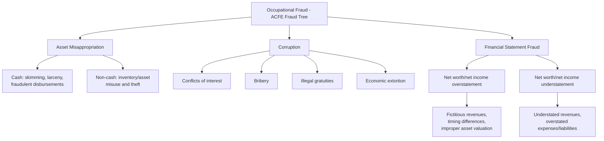

## White-Collar Crime Typologies

### Overview

White-collar crime encompasses a broad category of non-violent offenses committed for financial gain, typically by individuals in positions of trust, authority, or professional status during the course of their occupation. Since Edwin Sutherland coined the term in 1939, criminologists and fraud examiners have developed multiple typologies to classify these offenses by perpetrator characteristics, victim relationship, organizational context, and scheme mechanics. Understanding these typologies helps forensic accountants categorize risk, tailor investigative approach, and communicate findings using shared professional vocabulary.

**Key Points**

- No single universally-adopted typology exists; classification frameworks differ by academic discipline (criminology vs. accounting vs. legal), each emphasizing different organizing principles
- Common organizing dimensions include: perpetrator vs. organization as primary beneficiary, individual vs. collusive schemes, and the specific mechanism of financial harm
- The ACFE's **Occupational Fraud Classification System** ("Fraud Tree") is the dominant practitioner-oriented typology used in fraud examination specifically
- Broader criminological typologies (Sutherland, Clinard & Quinney, Edelhertz) classify white-collar crime beyond occupational fraud alone, including regulatory and corporate crime

---

### Foundational Criminological Typologies

#### Sutherland's Original Conception (1939/1949)

Sutherland's original definition characterized white-collar crime as **crime committed by a person of respectability and high social status in the course of his occupation**. His work emphasized that the defining feature was the offender's social status and occupational context, not the specific criminal technique used.

**[Unverified]** Sutherland's original status-based definition has been extensively debated and revised by subsequent criminologists, some of whom argue it too narrowly excludes lower-status occupational offenders (e.g., a cashier's embezzlement) while others argue it should be broadened further; there is no single definition universally agreed upon in current criminological literature.

#### Clinard and Quinney's Occupational vs. Corporate Crime Distinction (1973)

Marshall Clinard and Richard Quinney proposed a foundational bifurcation still widely referenced:

$$\text{White-Collar Crime} = \{\text{Occupational Crime}, \text{Corporate Crime}\}$$

- **Occupational crime:** Offenses committed by individuals for **personal gain** in the course of their occupation, at the expense of their employer, clients, or the public (e.g., an employee embezzling from their employer)
- **Corporate crime:** Offenses committed by, or on behalf of, a **corporation/organization** primarily to benefit the organization itself, often with the knowledge or direction of senior management (e.g., price-fixing, environmental violations, regulatory fraud undertaken to benefit the company)

This distinction remains central to modern fraud examination, since it separates the investigative posture (individual perpetrator vs. organizational/systemic misconduct) and the parties who bear liability.

#### Edelhertz's Typology (1970)

Herbert Edelhertz proposed a four-category typology emphasizing the *purpose and structure* of the offense:

1. **Personal crimes:** Committed by individuals acting alone for direct personal benefit outside an organizational or business context (e.g., individual tax evasion, personal credit fraud)
2. **Abuses of trust:** Committed by individuals in positions of trust within business, government, or other organizations, against the organization or those it serves (e.g., embezzlement, kickbacks)
3. **Business crimes:** Committed in the course of legitimate business operations, incidental to the business's primary purpose (e.g., securities fraud, antitrust violations, false advertising)
4. **Con games:** Crimes structured as the entire business itself — the business exists specifically as a vehicle for the fraud (e.g., Ponzi schemes, advance-fee fraud operations)

**Example**

Applying Edelhertz's typology: an individual falsifying a personal loan application is a *personal crime*; a controller embezzling company funds is an *abuse of trust*; a public company manipulating revenue recognition to meet earnings targets is a *business crime*; and an operation like Bernie Madoff's investment fund — where the entire enterprise existed to perpetrate fraud rather than incidentally committing fraud within a legitimate business — is a *con game*.

---

### The ACFE Occupational Fraud Classification System ("Fraud Tree")

The ACFE's Fraud Tree is the dominant practitioner typology specifically for occupational fraud (fraud committed by employees against their employing organization) and organizes schemes into three primary branches:

<svg xmlns="http://www.w3.org/2000/svg" width="700" height="400" viewBox="0 0 700 400" font-family="Helvetica, Arial, sans-serif">
<text x="350" y="24" text-anchor="middle" font-size="16" font-weight="bold" fill="#1a1a1a">ACFE Fraud Tree: Three Primary Branches (svg_diagram)</text>
<rect x="270" y="50" width="160" height="50" rx="6" fill="#333" />
<text x="350" y="80" text-anchor="middle" font-size="13" fill="#fff" font-weight="bold">Occupational Fraud</text>
<line x1="350" y1="100" x2="130" y2="150" stroke="#333" stroke-width="2" />
<line x1="350" y1="100" x2="350" y2="150" stroke="#333" stroke-width="2" />
<line x1="350" y1="100" x2="570" y2="150" stroke="#333" stroke-width="2" />
<rect x="40" y="150" width="180" height="60" rx="6" fill="#2b6cb0" />
<text x="130" y="175" text-anchor="middle" font-size="12" fill="#fff" font-weight="bold">Asset</text>
<text x="130" y="192" text-anchor="middle" font-size="12" fill="#fff" font-weight="bold">Misappropriation</text>
<rect x="260" y="150" width="180" height="60" rx="6" fill="#c05621" />
<text x="350" y="185" text-anchor="middle" font-size="13" fill="#fff" font-weight="bold">Corruption</text>
<rect x="480" y="150" width="180" height="60" rx="6" fill="#2f855a" />
<text x="570" y="175" text-anchor="middle" font-size="12" fill="#fff" font-weight="bold">Financial Statement</text>
<text x="570" y="192" text-anchor="middle" font-size="12" fill="#fff" font-weight="bold">Fraud</text>

<text x="130" y="250" text-anchor="middle" font-size="10" fill="#333">Most common</text>

<text x="130" y="264" text-anchor="middle" font-size="10" fill="#333">Lowest median loss</text>

<text x="350" y="250" text-anchor="middle" font-size="10" fill="#333">Bribery, kickbacks,</text>

<text x="350" y="264" text-anchor="middle" font-size="10" fill="#333">conflicts of interest</text>

<text x="570" y="250" text-anchor="middle" font-size="10" fill="#333">Least common</text>

<text x="570" y="264" text-anchor="middle" font-size="10" fill="#333">Highest median loss</text>

</svg>

#### Branch 1: Asset Misappropriation

- Theft or misuse of an organization's assets; the **most common** category by frequency in ACFE research but historically associated with the **lowest median loss** per scheme among the three branches
- **Cash schemes:** Skimming (theft before recording), larceny (theft after recording), fraudulent disbursements (billing schemes, payroll schemes, expense reimbursement schemes, check tampering, register disbursements)
- **Non-cash schemes:** Misuse or theft of inventory, equipment, or other physical/intangible assets

#### Branch 2: Corruption

- Involves the employee's wrongful use of influence in a business transaction to procure a benefit contrary to their duty to the employer
- **Conflicts of interest:** Undisclosed personal interest in a transaction affecting the employer
- **Bribery:** Offering, giving, receiving, or soliciting something of value to influence an official act or business decision
- **Illegal gratuities:** Similar to bribery but given/received after the fact, without the specific intent to influence a particular decision made in advance
- **Economic extortion:** The reverse of bribery — an employee demands payment from a vendor/contractor in exchange for a favorable business decision

#### Branch 3: Financial Statement Fraud

- Deliberate misstatement of financial statements, typically to mislead financial statement users
- **Least common** by frequency but historically associated with the **highest median loss** among the three branches, given the scale typically involved
- **Overstatement schemes:** Fictitious revenues, timing differences (premature revenue recognition), improper asset valuation, concealed liabilities/expenses
- **Understatement schemes:** Less common; may occur to reduce tax liability or smooth earnings across periods

**[Unverified]** Specific frequency and median loss figures by category are published biennially in the ACFE's Report to the Nations and change with each survey cycle; practitioners should reference the current edition rather than relying on fixed historical figures.

---

### Additional Classification Dimensions

#### By Perpetrator Structure

- **Individual (solo) fraud:** A single actor perpetrates the scheme without collusion
- **Collusive fraud:** Two or more individuals conspire, often defeating segregation-of-duties controls that assume independent actors (e.g., collusion between a purchasing agent and a vendor)
- **Organizational/corporate fraud:** The scheme is directed by, or substantially benefits, the organization itself rather than a rogue individual (aligning with Clinard and Quinney's "corporate crime" category)

#### By Victim

- **Employer-victim fraud:** Occupational fraud as classified by the ACFE Fraud Tree (employee defrauds employer)
- **Investor/shareholder-victim fraud:** Financial statement fraud, securities fraud, Ponzi/investment schemes
- **Consumer-victim fraud:** Consumer fraud, false advertising, predatory lending
- **Government/public-victim fraud:** Tax fraud, procurement fraud, benefits fraud, public corruption

#### By Regulatory Domain

- **Securities fraud:** Violations under securities laws (insider trading, market manipulation, disclosure fraud)
- **Tax fraud:** Evasion of tax obligations through concealment or misrepresentation
- **Healthcare fraud:** Billing fraud, upcoding, kickback schemes within healthcare systems
- **Banking/financial services fraud:** Loan fraud, check fraud, money laundering, BSA/AML violations
- **Procurement/contract fraud:** Bid-rigging, false claims, cost/labor mischarging in government or corporate contracting
- **Insurance fraud:** Premium fraud, claims fraud (both first-party policyholder fraud and third-party/provider fraud)

**Example**

A single fact pattern can span multiple typology dimensions simultaneously. Consider a hospital billing manager who colludes with an external physician to submit fraudulent claims for services never rendered, splitting the proceeds: this is simultaneously (a) an *abuse of trust* under Edelhertz, (b) *corruption* (specifically a kickback arrangement) under the ACFE Fraud Tree, (c) *collusive* under perpetrator-structure classification, and (d) *healthcare fraud* under regulatory domain classification. Forensic accountants often apply several typology lenses concurrently to fully characterize a single scheme.

---

### Comparative Summary Table

| Typology | Organizing Principle | Primary Use Case |
| --- | --- | --- |
| Sutherland (1939) | Offender social status | Foundational/historical; defines the field |
| Clinard & Quinney (1973) | Beneficiary: individual vs. organization | Distinguishing occupational from corporate crime |
| Edelhertz (1970) | Structure/purpose of the offense | Legal/prosecutorial classification |
| ACFE Fraud Tree | Scheme mechanism (asset misappropriation/corruption/financial statement fraud) | Occupational fraud examination practice |
| Victim-based | Who bears the loss | Regulatory jurisdiction and civil recovery strategy |
| Regulatory domain | Applicable statutory/regulatory framework | Determining governing law and enforcement agency |

---

### Practical Relevance to Forensic Accounting Practice

- **Scoping investigations:** Correctly typing a suspected scheme early (e.g., asset misappropriation vs. financial statement fraud) shapes the evidence-gathering approach, required expertise, and applicable standards
- **Regulatory referral:** Typology by regulatory domain determines which agency has jurisdiction (SEC for securities fraud, IRS-CI for tax fraud, state insurance regulators for insurance fraud)
- **Risk assessment design:** Organizations build fraud risk assessments structured around the ACFE Fraud Tree categories, ensuring control coverage across all three branches rather than over-concentrating on one (commonly asset misappropriation, given its higher frequency, at the expense of financial statement fraud controls)
- **Expert testimony framing:** Typological classification provides a structured, court-comprehensible vocabulary for explaining scheme mechanics to a judge or jury

---

### Related Topics

- The ACFE Fraud Tree in detail: asset misappropriation sub-schemes
- Corruption schemes: bribery, kickbacks, and conflicts of interest in depth
- Financial statement fraud: revenue recognition and improper capitalization schemes
- Sutherland's differential association and the criminological origins of white-collar crime theory
- Securities fraud and SEC enforcement typologies
- Healthcare fraud, waste, and abuse classification frameworks
- Collusive fraud schemes and the defeat of segregation-of-duties controls
- The ACFE Report to the Nations: frequency and median loss data by scheme type