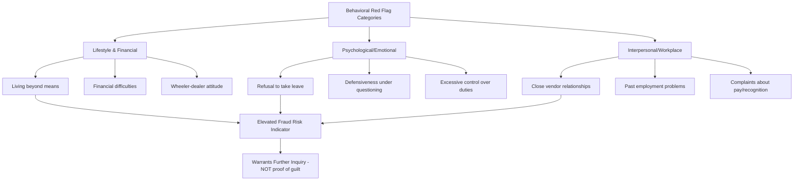

## Behavioral Red Flags of Fraud Perpetrators

### Overview

Behavioral red flags are observable changes in an individual's conduct, lifestyle, or workplace demeanor that correlate empirically with the commission of occupational fraud. Unlike financial or transactional red flags (which appear in the data), behavioral red flags are perceived by colleagues, supervisors, and HR personnel through direct observation. The ACFE's Report to the Nations has tracked behavioral red flag prevalence across thousands of confirmed fraud cases since its inception, making this one of the most empirically documented areas of fraud examination.

**Key Points**

- Behavioral red flags are **correlational, not causal or diagnostic** — their presence does not prove fraud, and their absence does not rule it out; they indicate elevated risk warranting further inquiry, not guilt
- ACFE research consistently finds that the majority of fraud perpetrators display **at least one behavioral red flag** prior to detection, making behavioral observation a meaningfully productive (though imperfect) detection channel
- Red flags cluster into categories: **lifestyle changes**, **psychological/emotional indicators**, and **interpersonal/workplace conduct changes**
- Over-reliance on behavioral red flags carries a documented risk of **false positives and discriminatory application** (e.g., disproportionately scrutinizing employees based on demographic or personality traits rather than genuine behavioral change) — this is a recognized ethical and practical limitation of behavioral red flag frameworks

---

### Category 1: Lifestyle and Financial Behavior Changes

- **Living beyond apparent means:** Purchases, vacations, vehicles, or property inconsistent with known salary
- **Financial difficulties:** Visible signs of debt stress, wage garnishment notices, calls from creditors at work
- **Unusually close association with a vendor or customer:** Excessive familiarity, unexplained favoritism, or a pattern of steering business to a particular counterparty
- **Wheeler-dealer attitude:** A general pattern of cutting corners, bending rules, or displaying excessive risk-taking beyond the specific fraud scheme itself
- **Excessive gambling or known addiction indicators**

**Example**

A mid-level accounts payable clerk earning a modest salary begins driving a new luxury vehicle and mentions an upcoming overseas vacation. Combined with no known additional income source (inheritance, spousal income, side business), this lifestyle change is a classic "living beyond means" indicator — historically the single most commonly observed behavioral red flag in ACFE's longitudinal fraud data.

---

### Category 2: Psychological and Emotional Indicators

- **Increased irritability, defensiveness, or suspicion when questioned** about specific transactions, accounts, or discrepancies
- **Unusual stress, anxiety, or visible behavioral change** not explained by other known life circumstances
- **Refusal to take vacation or sick leave**, or unusual anxiety about doing so — historically significant because many concealment schemes (e.g., check kiting, lapping schemes) require continuous, hands-on management by the perpetrator and unravel when someone else handles the duties during an absence
- **Excessive control or possessiveness** over specific files, accounts, systems access, or processes, resisting delegation or cross-training
- **Rationalizing or minimizing language** when discussing control weaknesses or policy violations (echoing the "rationalization" element of the fraud triangle)

**Example**

A controller who has not taken a vacation in over three years and becomes visibly agitated when a colleague is assigned to cover their responsibilities during a mandatory leave period exhibits a classic red flag associated with concealment-dependent schemes. This pattern historically underlies the internal control recommendation of **mandatory vacation policies** paired with duty rotation, specifically designed to force a break in ongoing concealment activity.

---

### Category 3: Interpersonal and Workplace Conduct Changes

- **Divorce or family problems:** Documented correlation with financial pressure–driven fraud, though this is a sensitive indicator requiring careful, non-intrusive interpretation
- **Irritability, suspiciousness, or defensiveness** toward colleagues, particularly regarding specific work areas
- **Unusually close relationships with vendors, contractors, or customers** outside normal business protocol
- **Past employment-related, legal, or regulatory problems:** Prior instances of policy violations, undisclosed prior terminations, or regulatory sanctions
- **Complaints about inadequate pay or feeling undervalued**, sometimes voiced repeatedly and disproportionately relative to the work environment
- **Social isolation or withdrawal from colleagues**, in some cases the inverse of overt lifestyle changes — a perpetrator managing internal guilt or fear of detection

<svg xmlns="http://www.w3.org/2000/svg" width="680" height="420" viewBox="0 0 680 420" font-family="Helvetica, Arial, sans-serif">
<text x="340" y="24" text-anchor="middle" font-size="16" font-weight="bold" fill="#1a1a1a">Behavioral Red Flag Clusters (svg_diagram)</text>
<rect x="40" y="60" width="180" height="100" rx="6" fill="#2b6cb0" />
<text x="130" y="85" text-anchor="middle" font-size="12" fill="#fff" font-weight="bold">Lifestyle &amp;</text>
<text x="130" y="100" text-anchor="middle" font-size="12" fill="#fff" font-weight="bold">Financial</text>
<text x="130" y="122" text-anchor="middle" font-size="10" fill="#fff">Living beyond means</text>
<text x="130" y="138" text-anchor="middle" font-size="10" fill="#fff">Financial difficulty</text>
<rect x="250" y="60" width="180" height="100" rx="6" fill="#c05621" />
<text x="340" y="85" text-anchor="middle" font-size="12" fill="#fff" font-weight="bold">Psychological /</text>
<text x="340" y="100" text-anchor="middle" font-size="12" fill="#fff" font-weight="bold">Emotional</text>
<text x="340" y="122" text-anchor="middle" font-size="10" fill="#fff">Refusal to take leave</text>
<text x="340" y="138" text-anchor="middle" font-size="10" fill="#fff">Defensiveness</text>
<rect x="460" y="60" width="180" height="100" rx="6" fill="#2f855a" />
<text x="550" y="85" text-anchor="middle" font-size="12" fill="#fff" font-weight="bold">Interpersonal /</text>
<text x="550" y="100" text-anchor="middle" font-size="12" fill="#fff" font-weight="bold">Workplace</text>
<text x="550" y="122" text-anchor="middle" font-size="10" fill="#fff">Close vendor ties</text>
<text x="550" y="138" text-anchor="middle" font-size="10" fill="#fff">Past HR issues</text>
<line x1="130" y1="160" x2="340" y2="260" stroke="#999" stroke-width="1.5" stroke-dasharray="4,3" />
<line x1="340" y1="160" x2="340" y2="260" stroke="#999" stroke-width="1.5" stroke-dasharray="4,3" />
<line x1="550" y1="160" x2="340" y2="260" stroke="#999" stroke-width="1.5" stroke-dasharray="4,3" />
<rect x="220" y="260" width="240" height="60" rx="6" fill="#742a2a" />
<text x="340" y="285" text-anchor="middle" font-size="12" fill="#fff" font-weight="bold">Elevated Risk Indicator</text>
<text x="340" y="302" text-anchor="middle" font-size="10" fill="#fff">Not proof of guilt</text>

<text x="340" y="360" text-anchor="middle" font-size="11" fill="#666" font-style="italic">Correlational signal requiring corroboration, not standalone evidence</text>

</svg>

---

### Empirical Context from ACFE Research

The ACFE's Report to the Nations has, across multiple survey cycles, consistently found that a substantial majority of occupational fraud cases in its dataset involved **at least one observable behavioral red flag** exhibited by the perpetrator prior to detection, with "living beyond means" and "financial difficulties" typically ranking among the most frequently cited indicators.

**[Unverified]** Precise percentages and the specific ranking of individual red flags by frequency shift somewhat between ACFE survey cycles as the underlying case dataset changes; practitioners should reference the current edition of the Report to the Nations for exact current statistics rather than relying on any single historical figure, since this document is the authoritative and regularly updated source for this data.

---

### Combining Behavioral Red Flags with the Fraud Triangle

Behavioral red flags map onto the fraud triangle's elements, offering a practical bridge between theory and workplace observation:

| Fraud Triangle Element | Corresponding Behavioral Red Flags |
| --- | --- |
| Pressure | Financial difficulties, living beyond means, complaints about pay, divorce/family stress |
| Opportunity | Excessive control over a process, refusal to delegate/take leave, resistance to cross-training |
| Rationalization | Wheeler-dealer attitude, minimizing language about policy violations, "everyone does it" framing |

**Example**

An internal audit function designing a whistleblower-adjacent behavioral monitoring program (typically embedded in HR/ethics policy rather than surveillance-based systems) might train managers to recognize and appropriately escalate observed combinations of these indicators — for instance, an employee simultaneously displaying financial difficulty (pressure) and refusing to take earned vacation (opportunity-related concealment behavior) presents a materially higher combined risk profile than either indicator alone.

---

### Practical and Ethical Limitations

- **Not diagnostic:** No behavioral red flag, or combination of red flags, constitutes proof of fraud; they are risk indicators that should prompt further inquiry through appropriate, proportionate, and non-discriminatory means
- **Risk of bias and false positives:** Uncritical application of red flag checklists carries a documented risk of disproportionately targeting employees based on personality traits, cultural communication norms, or protected characteristics rather than genuine behavioral change — organizations should apply behavioral red flag frameworks within clearly governed HR/ethics policies with appropriate due process safeguards
- **Base rate problem:** Because many of these behaviors (financial stress, workplace irritability, family problems) are common in any workforce for entirely innocent reasons, the base rate of the behavior occurring without associated fraud is high, meaning behavioral observation alone has a meaningfully imperfect positive predictive value and should be corroborated with financial/transactional evidence before any adverse action is taken
- **Retrospective bias in the underlying research:** As with the fraud triangle generally, behavioral red flag statistics are compiled from confirmed, detected fraud cases, meaning the dataset may not capture behavioral patterns of undetected perpetrators

---

### Application in Forensic Investigations

- **Pre-investigation risk scoring:** Behavioral indicators, corroborated with data analytics findings, help prioritize which of several flagged transactions or individuals warrant deeper investigative resources
- **Interview planning:** Awareness of documented rationalization language patterns assists interviewers (e.g., using the ACFE-endorsed cognitive interview or similar structured techniques) in recognizing and probing rationalization statements during voluntary interviews
- **Expert report narrative:** Behavioral red flag evidence, when properly documented and corroborated, can support the narrative context of an expert witness report explaining perpetrator motive and method to a trier of fact, though it is typically presented as corroborating context alongside — never as a substitute for — the documentary and financial evidence establishing the scheme itself

---

### Related Topics

- The fraud triangle: pressure, opportunity, and rationalization
- ACFE Report to the Nations: detection methods and red flag statistics
- Interview and interrogation techniques in fraud examination
- Mandatory vacation and job rotation as internal controls
- Whistleblower hotline design and tip-based detection
- Ethical and legal limits on employee monitoring and behavioral surveillance
- Fraud risk assessment frameworks incorporating behavioral indicators
- Data analytics red flags versus behavioral red flags: complementary detection channels