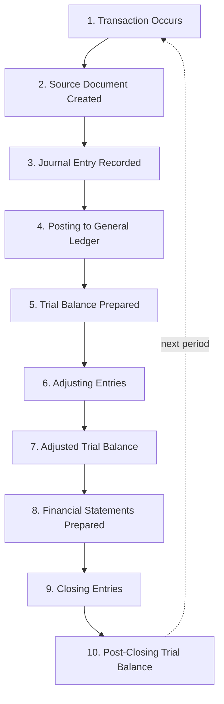
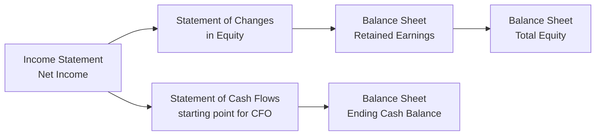

## Financial Statement Structure and the Accounting Cycle

### Overview

A working command of financial statement structure and the accounting cycle is foundational to fraud examination, since virtually every fraud scheme — whether asset misappropriation, corruption, or financial statement fraud — ultimately manifests as a distortion somewhere within this cycle. Forensic accountants must understand not merely *what* the financial statements say, but *how* each number arrives there, since concealment techniques typically exploit specific junctures in the cycle where controls are weakest or judgment is most subjective.

**Key Points**

- The accounting cycle is the sequential process by which raw economic transactions are captured, classified, summarized, and ultimately presented in financial statements
- The four primary financial statements — balance sheet, income statement, statement of cash flows, and statement of changes in equity — are interconnected through **articulation**, meaning a change in one statement necessarily affects at least one other
- Fraud examiners use knowledge of the cycle to identify **points of vulnerability**: journal entry manipulation, estimate manipulation, cutoff manipulation, and classification manipulation are all cycle-stage-specific concealment techniques
- Understanding double-entry bookkeeping mechanics (debits/credits) is essential for tracing how a fraudulent entry was structured to avoid detection through the normal control environment

---

### The Accounting Cycle: Sequential Stages

<svg xmlns="http://www.w3.org/2000/svg" width="720" height="360" viewBox="0 0 720 360" font-family="Helvetica, Arial, sans-serif">
<text x="360" y="24" text-anchor="middle" font-size="16" font-weight="bold" fill="#1a1a1a">The Accounting Cycle (svg_diagram)</text>
<circle cx="360" cy="200" r="150" fill="none" stroke="#ccc" stroke-width="1" />
<g font-size="10" fill="#fff" text-anchor="middle">
<circle cx="360" cy="60" r="34" fill="#2b6cb0" /><text x="360" y="55">1. Transaction</text><text x="360" y="67">occurs</text>
<circle cx="480" cy="90" r="34" fill="#2b6cb0" /><text x="480" y="85">2. Source</text><text x="480" y="97">document</text>
<circle cx="550" cy="180" r="34" fill="#c05621" /><text x="550" y="175">3. Journal</text><text x="550" y="187">entry</text>
<circle cx="540" cy="280" r="34" fill="#c05621" /><text x="540" y="275">4. Post to</text><text x="540" y="287">ledger</text>
<circle cx="450" cy="340" r="34" fill="#c05621" /><text x="450" y="335">5. Trial</text><text x="450" y="347">balance</text>
<circle cx="330" cy="350" r="34" fill="#2f855a" /><text x="330" y="345">6. Adjusting</text><text x="330" y="357">entries</text>
<circle cx="220" cy="320" r="34" fill="#2f855a" /><text x="220" y="315">7. Adjusted</text><text x="220" y="327">TB</text>
<circle cx="160" cy="240" r="34" fill="#742a2a" /><text x="160" y="235">8. Financial</text><text x="160" y="247">statements</text>
<circle cx="170" cy="140" r="34" fill="#742a2a" /><text x="170" y="135">9. Closing</text><text x="170" y="147">entries</text>
<circle cx="250" cy="75" r="34" fill="#742a2a" /><text x="250" y="70">10. Post-close</text><text x="250" y="82">TB</text>
</g>
</svg>

#### Stage Detail

1. **Transaction occurs:** An economic event with measurable financial effect takes place (sale, purchase, payment, receipt)
2. **Source document created:** Invoice, receipt, purchase order, contract — the original evidentiary record; **the primary target of forensic document examination**
3. **Journal entry recorded:** The transaction is recorded in the general journal using double-entry bookkeeping, with equal debits and credits
4. **Posting to the general ledger:** Journal entries are transferred to individual ledger accounts, aggregating all transactions affecting each account
5. **Trial balance prepared:** All ledger account balances are listed to confirm total debits equal total credits (a mathematical check, not a substantive one)
6. **Adjusting entries:** Accruals, deferrals, depreciation, and estimates are recorded to align the accounts with the accrual basis of accounting — **a high-risk stage for financial statement fraud**, since estimates involve judgment
7. **Adjusted trial balance:** Reflects all adjusting entries, forming the basis for statement preparation
8. **Financial statements prepared:** Balance sheet, income statement, statement of cash flows, and statement of changes in equity are drawn from the adjusted trial balance
9. **Closing entries:** Temporary accounts (revenues, expenses, dividends) are closed to retained earnings, resetting them to zero for the next period
10. **Post-closing trial balance:** Confirms only permanent (balance sheet) accounts remain open, beginning the next cycle

**Example**

A revenue recognition fraud scheme frequently targets stages 3 and 6 specifically. At stage 3, a fictitious sales invoice (an unsupported or backdated source document) is used to justify a journal entry recording revenue for goods never shipped. At stage 6, a legitimate transaction may be manipulated through an improper adjusting entry — for example, failing to record a needed reserve or allowance that would otherwise reduce reported income, or recognizing revenue in the wrong period through a cutoff manipulation.

---

### Double-Entry Bookkeeping Mechanics

Every transaction affects at least two accounts, with total debits always equal to total credits — the foundational self-balancing mechanism of the accounting system:

$$\sum \text{Debits} = \sum \text{Credits} \quad \text{for every recorded transaction}$$

$$\text{Assets} = \text{Liabilities} + \text{Equity}$$

| Account Type | Increases With | Decreases With | Normal Balance |
| --- | --- | --- | --- |
| Assets | Debit | Credit | Debit |
| Liabilities | Credit | Debit | Credit |
| Equity | Credit | Debit | Credit |
| Revenue | Credit | Debit | Credit |
| Expenses | Debit | Credit | Debit |

**Key Points**

- The self-balancing nature of double-entry bookkeeping is **not, by itself, a fraud-prevention mechanism** — a fraudulent entry that debits one account and credits another (e.g., debiting a fictitious receivable and crediting fictitious revenue) will still balance perfectly, illustrating why a trial balance "balancing" provides no assurance of the legitimacy of the underlying transactions
- Forensic accountants performing a **journal entry testing** procedure specifically search for entries with unusual characteristics (round-dollar amounts, postings by unauthorized users, entries made outside normal business hours, entries lacking descriptive narrative, or entries posted directly to unusual account combinations) precisely because the balancing mechanism alone cannot flag them

---

### The Four Primary Financial Statements

#### 1. Balance Sheet (Statement of Financial Position)

A point-in-time snapshot of an entity's assets, liabilities, and equity.

$$\text{Assets} = \text{Liabilities} + \text{Stockholders' Equity}$$

- Organized by liquidity (current vs. non-current for assets and liabilities under most frameworks)
- Common fraud targets: overstated assets (inflated inventory, fictitious receivables), understated liabilities (off-balance-sheet financing, unrecorded contingencies)

#### 2. Income Statement (Statement of Operations)

Reports revenues, expenses, and resulting net income over a period of time.

$$\text{Net Income} = \text{Revenues} - \text{Expenses}$$

- Common fraud targets: fictitious or prematurely recognized revenue, improperly capitalized expenses (converting an expense into an asset to avoid reducing current-period income), channel stuffing

#### 3. Statement of Cash Flows

Reports cash inflows and outflows classified into three activities, reconciling net income (accrual basis) to the change in cash (cash basis):

$$\Delta \text{Cash} = \text{CFO} + \text{CFI} + \text{CFF}$$

Where CFO = cash flow from operating activities, CFI = investing activities, CFF = financing activities.

- Often described by fraud examiners as **harder to manipulate directly** than the income statement (since actual cash movements are more difficult to fabricate than accounting estimates), though misclassification between operating, investing, and financing categories is a documented earnings-quality manipulation technique (e.g., misclassifying operating cash outflows as investing to inflate reported operating cash flow)

#### 4. Statement of Changes in Equity

Reconciles the beginning and ending balances of each equity account (common stock, additional paid-in capital, retained earnings, treasury stock, accumulated other comprehensive income).

$$\text{Ending Retained Earnings} = \text{Beginning Retained Earnings} + \text{Net Income} - \text{Dividends}$$

---

### Statement Articulation

The four statements are not independent; they **articulate** — meaning each is mathematically linked to the others, and a fraudulent entry in one statement necessarily creates a traceable effect elsewhere.

**Example**

A scheme that inflates revenue on the income statement must create a corresponding entry elsewhere — typically an inflated accounts receivable balance on the balance sheet (if the "sale" was never collected in cash). A forensic accountant examining the statement of cash flows will observe that reported net income grows while cash flow from operations does not correspondingly increase — a classic **earnings quality divergence** red flag, since the articulation between statements means a fabricated income statement entry cannot be hidden from the cash flow statement without a second layer of concealment.

---

### Points of Vulnerability for Fraud Examiners to Target

| Cycle Stage | Common Manipulation Technique | Investigative Response |
| --- | --- | --- |
| Source document creation | Fabricated or altered invoices, purchase orders | Document examination, vendor confirmation |
| Journal entry recording | Unsupported/unauthorized manual entries | Journal entry testing (data analytics) |
| Adjusting entries (estimates) | Manipulated reserves, allowances, depreciation assumptions | Re-computation, benchmarking against historical patterns |
| Period-end cutoff | Recording next-period transactions in current period | Cutoff testing around period-end |
| Classification | Misclassifying expenses as assets, or operating as investing cash flows | Account analysis, ratio/trend analysis |
| Consolidation (if applicable) | Related-party or intercompany elimination manipulation | Intercompany reconciliation review |

---

### Related Topics

- Journal entry testing techniques and data analytics for fraud detection
- Revenue recognition fraud schemes and standards (ASC 606 / IFRS 15)
- Financial statement fraud: overstatement and understatement schemes
- Ratio analysis and horizontal/vertical analysis in fraud detection
- The Beneish M-Score and other financial statement fraud prediction models
- Internal controls over financial reporting (SOX Section 404)
- Cutoff testing procedures in forensic examinations
- Earnings quality and cash flow divergence analysis