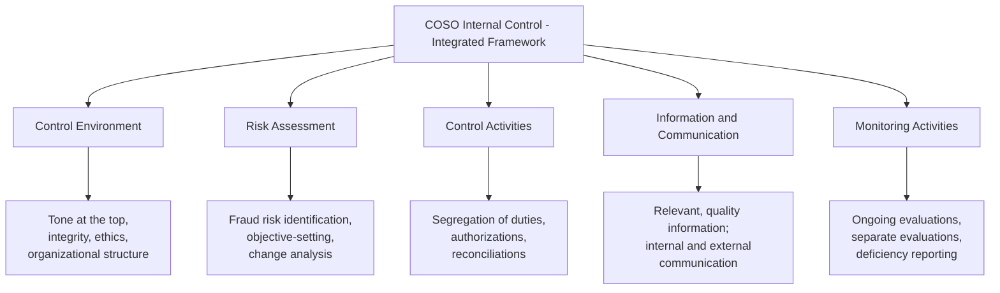

## Internal Control Frameworks and the COSO Model


### Overview

Internal control is the primary organizational defense against fraud, and forensic accountants must understand control frameworks both to assess an organization's fraud risk environment and to explain, in investigative reports and expert testimony, *why* a scheme succeeded (i.e., which control failed or was overridden). The **Committee of Sponsoring Organizations of the Treadway Commission (COSO)** framework is the dominant global standard for internal control design and evaluation, referenced throughout auditing standards, SOX compliance programs, and fraud risk assessment methodologies.

**Key Points**

- COSO is a private-sector organization (jointly sponsored by five professional associations: AICPA, IIA, AAA, IMA, and FEI) that issues voluntary, widely-adopted frameworks — it is not a government regulator, though its frameworks are incorporated by reference into regulatory requirements such as SOX Section 404
- The COSO **Internal Control – Integrated Framework** (originally 1992, updated 2013) is the foundational model; COSO also issues the separate **Enterprise Risk Management (ERM) – Integrating with Strategy and Performance** framework (2017), which is broader and complements but does not replace the internal control framework
- The framework organizes internal control around **five interrelated components** and, since the 2013 update, **seventeen principles** that articulate what must be present and functioning for each component to be considered effective
- Fraud examiners use COSO both prospectively (advising on control design) and retrospectively (analyzing which specific component or principle failed, enabling a fraud scheme)

---

### The Five Components of Internal Control



<svg xmlns="http://www.w3.org/2000/svg" width="700" height="420" viewBox="0 0 700 420" font-family="Helvetica, Arial, sans-serif">
<text x="350" y="24" text-anchor="middle" font-size="16" font-weight="bold" fill="#1a1a1a">COSO Cube: Five Components (svg_diagram)</text>

<g transform="translate(60,60)">
<polygon points="0,260 220,260 280,200 60,200" fill="#2b6cb0" opacity="0.9" />
<text x="140" y="235" text-anchor="middle" font-size="11" fill="#fff" font-weight="bold">Control Environment</text>



```
<polygon points="0,200 220,200 280,140 60,140" fill="#c05621" opacity="0.9" />
<text x="140" y="175" text-anchor="middle" font-size="11" fill="#fff" font-weight="bold">Risk Assessment</text>

<polygon points="0,140 220,140 280,80 60,80" fill="#2f855a" opacity="0.9" />
<text x="140" y="115" text-anchor="middle" font-size="11" fill="#fff" font-weight="bold">Control Activities</text>

<polygon points="0,80 220,80 280,20 60,20" fill="#805ad5" opacity="0.9" />
<text x="140" y="55" text-anchor="middle" font-size="10" fill="#fff" font-weight="bold">Information &amp; Communication</text>

<polygon points="0,20 220,20 280,-40 60,-40" fill="#742a2a" opacity="0.9" />
<text x="140" y="-5" text-anchor="middle" font-size="11" fill="#fff" font-weight="bold">Monitoring Activities</text>
```

</g>

<text x="350" y="400" text-anchor="middle" font-size="10" fill="#666" font-style="italic">Simplified flat representation; the original COSO cube also depicts entity structure and objective categories on adjacent faces</text>

</svg>

**[Unverified]** The original COSO cube is a three-dimensional model depicting the five components on one face, categories of objectives (operations, reporting, compliance) on a second face, and organizational structure/entity levels on a third face; the flattened representation above simplifies this for linear presentation and omits the full three-dimensional structure — readers should consult the official COSO publication for the complete cube diagram.

#### 1. Control Environment

The foundation for all other components — the set of standards, processes, and structures providing the basis for carrying out internal control across the organization.

- Sets the **"tone at the top"**: management's and the board's commitment to integrity and ethical values
- Establishes organizational structure, reporting lines, and appropriate authorities/responsibilities
- Governs commitment to competence and accountability

**Fraud relevance:** A weak control environment (e.g., a dominant, unchallenged CEO; a board with limited financial expertise; a culture tolerating minor policy violations) is consistently identified in major financial statement fraud cases as a root-cause enabler, since it is the component within which management override of controls — the leading mechanism in large-scale financial statement fraud — becomes possible.

#### 2. Risk Assessment

The entity's process for identifying and analyzing risks relevant to achieving its objectives, forming a basis for determining how risks should be managed.

- Requires the organization to specify objectives clearly enough to identify and assess risks to those objectives
- **Explicitly includes fraud risk assessment** as a distinct principle (Principle 8 under the 2013 framework: "The organization considers the potential for fraud in assessing risks to the achievement of objectives")
- Requires identification and analysis of significant changes that could impact the system of internal control

**Fraud relevance:** This is the component most directly and explicitly tied to fraud examination practice — COSO 2013 formally requires organizations to consider fraud risk (including incentives/pressures, opportunities, and rationalization/attitudes — a direct reference to the fraud triangle) as part of the standard risk assessment process, not as an optional add-on.

#### 3. Control Activities

The actions established through policies and procedures that help ensure management directives to mitigate risk are carried out.

- **Preventive controls:** Segregation of duties, authorization requirements, physical safeguards over assets
- **Detective controls:** Reconciliations, independent verifications, exception reporting
- **Manual and automated (IT general and application) controls**

**Fraud relevance:** This is the component most directly manipulated or circumvented by fraud perpetrators, since it contains the specific, tangible mechanisms (segregation of duties, approval thresholds, reconciliations) that a scheme must defeat, bypass, or exploit a gap in.

#### 4. Information and Communication

The quality of information used by the entity to support internal control functioning, and the internal/external communication necessary to enable personnel to carry out their responsibilities.

- Requires relevant, timely, accurate information
- Includes communication of internal control responsibilities, and mechanisms for reporting concerns (e.g., whistleblower channels)

**Fraud relevance:** Whistleblower hotlines and ethics reporting channels — consistently identified in ACFE research as the **most common initial detection method** for occupational fraud — are a direct organizational manifestation of this component.

#### 5. Monitoring Activities

Ongoing evaluations, separate evaluations, or a combination of both, used to ascertain whether each of the other four components is present and functioning.

- **Ongoing monitoring:** Built into business processes (e.g., management review of variance reports)
- **Separate evaluations:** Periodic assessments conducted by internal audit or external parties
- Requires timely communication and remediation of identified deficiencies

**Fraud relevance:** Internal audit's fraud risk assessment activities and periodic control testing programs are the primary organizational expression of this component; weaknesses here allow control failures in other components to persist undetected over extended periods.

---

### The Seventeen Principles (COSO 2013 Update)

The 2013 update to the Internal Control – Integrated Framework introduced 17 explicit principles mapped to the five components, providing more granular, testable criteria for evaluating control effectiveness:

| Component | Principles (Summary) |
| --- | --- |
| Control Environment | 1. Commitment to integrity/ethics · 2. Board independence/oversight · 3. Structure, authority, responsibility · 4. Commitment to competence · 5. Accountability enforcement |
| Risk Assessment | 6. Specifies clear objectives · 7. Identifies/analyzes risk · 8. **Considers fraud risk** · 9. Identifies/analyzes significant change |
| Control Activities | 10. Selects/develops control activities · 11. Selects/develops general controls over technology · 12. Deploys through policies/procedures |
| Information & Communication | 13. Uses relevant, quality information · 14. Communicates internally · 15. Communicates externally |
| Monitoring Activities | 16. Conducts ongoing/separate evaluations · 17. Evaluates and communicates deficiencies |

**Key Points**

- **Principle 8** is the explicit fraud-risk principle, requiring organizations to formally document consideration of fraudulent reporting, potential loss of assets, and corruption within their risk assessment process
- All 17 principles must be present and functioning, and operating together, for a component to be judged effective; this "present and functioning" standard is the operational bar auditors and forensic accountants apply when assessing control effectiveness under the framework
- [Inference] The explicit codification of fraud risk consideration as a named principle (rather than an implicit expectation) is widely regarded by practitioners as one of the most significant practical changes introduced in the 2013 update relative to the original 1992 framework, since it created a documented compliance expectation specifically for fraud risk assessment

---

### COSO ERM Framework (2017) — Distinction from Internal Control Framework

COSO's separate **Enterprise Risk Management – Integrating with Strategy and Performance** (2017) framework should not be conflated with the Internal Control – Integrated Framework:

$$\text{COSO ERM (2017)} \neq \text{COSO Internal Control (2013)}$$

- **Internal Control framework:** Narrower scope; focused on the control structures needed to provide reasonable assurance regarding operations, reporting, and compliance objectives
- **ERM framework:** Broader scope; integrates risk considerations into strategy-setting and performance management across the entire enterprise, using five interrelated components (Governance & Culture, Strategy & Objective-Setting, Performance, Review & Revision, Information/Communication/Reporting) distinct from the internal control framework's five components

**[Unverified]** The degree to which a given organization has formally adopted the ERM framework versus relying solely on the Internal Control framework varies considerably by industry, regulatory requirement, and organizational maturity; forensic accountants should confirm which specific COSO framework (or combination) a client organization has adopted before referencing framework-specific terminology in a report.

---

### Application in Fraud Examination Practice

#### Root-Cause Analysis

After a fraud is detected, forensic accountants commonly perform a **root-cause analysis** mapped to COSO components, identifying not just *what* the perpetrator did but *which specific component and principle failed* to allow it. This mapping is frequently included in post-investigation remediation reports to management and audit committees.

**Example**

A logistics company discovers a $2M fraudulent disbursement scheme run by an accounts payable supervisor over 18 months. Root-cause mapping identifies: **Control Activities failure** (the supervisor had both vendor-creation and payment-approval access — a segregation of duties gap); **Monitoring failure** (internal audit had not tested the AP function in over three years); and a contributing **Control Environment** factor (a documented prior instance of a similar, smaller-scale override was not escalated to the audit committee). The remediation report recommends specific control redesigns mapped to each failed component.

#### Management Override — A COSO-Recognized Limitation

COSO explicitly acknowledges that internal control, however well-designed, provides only **reasonable, not absolute, assurance** against fraud, in part because senior management retains the practical ability to override controls. This is a recognized inherent limitation of any control framework and a primary reason financial statement fraud — despite being the least frequent category in the ACFE Fraud Tree — carries the highest median loss, since it is frequently perpetrated by individuals with the positional authority to override the very controls designed to prevent it.

---

### Related Topics

- The fraud triangle and its explicit incorporation into COSO Principle 8
- Segregation of duties design and testing methodologies
- Sarbanes-Oxley Section 404 and management's internal control assessment
- Root-cause analysis methodology in post-fraud remediation
- Whistleblower hotlines as an Information and Communication component
- COSO ERM framework in depth: governance, strategy, and performance integration
- Management override of controls in financial statement fraud cases
- Internal audit's role in monitoring activities and fraud risk assessment