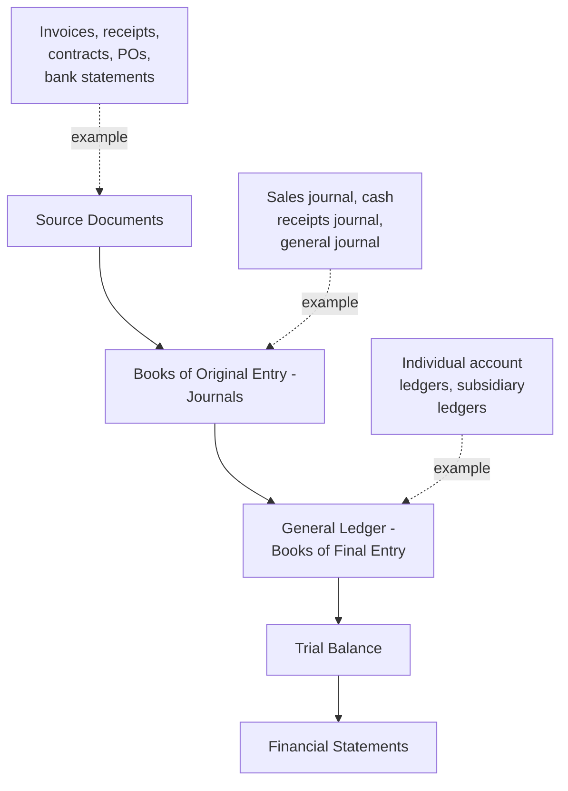

## Books, Records, and Source Document Integrity

### Overview

Source documents and books of record form the evidentiary backbone of every fraud examination. A forensic accountant's findings are only as reliable as the integrity of the underlying documents from which those findings are derived — meaning document authentication, custody, and reliability assessment are foundational skills distinct from, but prerequisite to, substantive financial analysis. This topic addresses the hierarchy of accounting records, the indicators of document manipulation, and the procedures forensic accountants use to establish and defend record integrity.

**Key Points**

- Books and records exist in a **hierarchy of reliability**, from primary source documents through to summarized financial statements; forensic examination typically works backward down this hierarchy from a suspicious statement-level anomaly to the underlying source document
- Document integrity encompasses both **authenticity** (is the document genuine and unaltered) and **completeness** (does the available record set represent the full population of relevant transactions)
- Chain of custody procedures, applied to accounting records exactly as they would be to any physical evidence, are essential to preserving the evidentiary value of documents that may later be used in litigation or criminal prosecution
- Digital records introduce distinct integrity considerations (metadata, audit trails, version history) not present with paper-based records, requiring specialized handling

---

### The Hierarchy of Accounting Books and Records

<svg xmlns="http://www.w3.org/2000/svg" width="680" height="360" viewBox="0 0 680 360" font-family="Helvetica, Arial, sans-serif">
<text x="340" y="24" text-anchor="middle" font-size="16" font-weight="bold" fill="#1a1a1a">Reliability Hierarchy of Accounting Records (svg_diagram)</text>
<rect x="240" y="50" width="200" height="50" rx="6" fill="#742a2a" />
<text x="340" y="80" text-anchor="middle" font-size="12" fill="#fff" font-weight="bold">Financial Statements</text>
<rect x="240" y="120" width="200" height="50" rx="6" fill="#c05621" />
<text x="340" y="150" text-anchor="middle" font-size="12" fill="#fff" font-weight="bold">General Ledger</text>
<rect x="240" y="190" width="200" height="50" rx="6" fill="#2f855a" />
<text x="340" y="220" text-anchor="middle" font-size="12" fill="#fff" font-weight="bold">Journals (Original Entry)</text>
<rect x="240" y="260" width="200" height="50" rx="6" fill="#2b6cb0" />
<text x="340" y="290" text-anchor="middle" font-size="12" fill="#fff" font-weight="bold">Source Documents</text>
<line x1="340" y1="100" x2="340" y2="120" stroke="#333" stroke-width="2" marker-end="url(#arrowr)" />
<line x1="340" y1="170" x2="340" y2="190" stroke="#333" stroke-width="2" marker-end="url(#arrowr)" />
<line x1="340" y1="240" x2="340" y2="260" stroke="#333" stroke-width="2" marker-end="url(#arrowr)" />

<text x="480" y="290" font-size="10" fill="#333">Highest evidentiary</text>

<text x="480" y="304" font-size="10" fill="#333">reliability (primary)</text>

<text x="480" y="80" font-size="10" fill="#333">Most summarized,</text>

<text x="480" y="94" font-size="10" fill="#333">furthest from event</text>

</svg>

#### Source Documents

The primary evidence of a transaction, created at or near the point the economic event occurred. Examples: invoices, purchase orders, receiving reports, contracts, bank statements, canceled checks, shipping documents, timesheets, expense receipts.

- **Highest evidentiary reliability** in the hierarchy, since they are closest in time and directness to the underlying transaction
- Primary target of forensic document examination techniques (see below)

#### Books of Original Entry (Journals)

Chronological records where transactions are first formally entered, organized by transaction type (sales journal, cash receipts journal, cash disbursements journal, purchases journal, general journal for non-routine entries).

- The **general journal** specifically is a common target for fraud, since it is used for manual, non-routine, and adjusting entries that bypass the automated controls embedded in specialized journals (e.g., the sales journal, which is typically system-generated from the order-to-cash process)

#### General Ledger (Books of Final Entry)

The complete set of accounts to which journal entries are posted, organized by account rather than chronologically.

- Includes subsidiary ledgers (e.g., accounts receivable subsidiary ledger, detailing individual customer balances) that support and must reconcile to general ledger control accounts

#### Trial Balance and Financial Statements

Summarized outputs derived from the general ledger, representing the most aggregated (and therefore evidentially most distant from the underlying transaction) level of the hierarchy.

**Key Points**

- Forensic examination methodology typically proceeds **"top-down"** analytically (identifying an anomaly at the financial statement or ratio level) but then proceeds **"bottom-up"** evidentially (tracing that anomaly down through the general ledger, journal entries, and ultimately to source documents to establish or refute its legitimacy)
- A document's position in this hierarchy directly affects its weight as evidence: a forged source document undermines every subsequent layer built upon it, whereas a summarization error at the trial balance level, if the underlying journals and source documents are sound, is more likely a clerical error than fraud

---

### Indicators of Source Document Manipulation

Forensic document examination — sometimes performed in conjunction with a certified forensic document examiner for physical/handwriting analysis, though many indicators are assessable by a forensic accountant directly — looks for the following categories of anomalies:

#### Physical/Visual Indicators (Paper Documents)

- Alterations visible under magnification, alternate light sources, or infrared/ultraviolet examination
- Inconsistent fonts, spacing, or alignment suggesting insertion or splicing
- Evidence of erasure, whiteout, or correction fluid
- Photocopies presented where an original would be expected, obscuring alteration evidence
- Sequential numbering gaps or irregularities (missing invoice numbers, check numbers, purchase order numbers)

#### Content/Logical Indicators

- Vendor addresses matching employee addresses (a classic shell company indicator)
- Round-dollar amounts inconsistent with typical transaction patterns for that vendor/customer
- Dates inconsistent with business operations (weekend dates for a business closed weekends, dates preceding vendor incorporation)
- Documents lacking customary approval signatures, initials, or stamps required by policy
- Inconsistent formatting across a document population purportedly from the same source (e.g., invoices claiming to be from the same vendor using different letterhead templates)

#### Digital/Metadata Indicators

- **File metadata** inconsistent with the claimed document creation date (e.g., a "created" timestamp postdating the transaction date)
- **Document properties** showing an author, editing history, or software version inconsistent with the purported originator
- **PDF/document version history** showing edits after the claimed finalization date
- Absence of a corresponding entry in the originating system's transaction log for a document purportedly system-generated

**Example**

A forensic accountant investigating a suspected fictitious vendor scheme examines PDF invoices submitted for payment. Metadata analysis reveals the "author" field on all twelve invoices, purportedly from three different vendors, references the same individual's name — the accounts payable clerk under investigation — and the file creation timestamps cluster within a narrow window inconsistent with invoices supposedly generated by different companies over several months. This metadata pattern, combined with content-level indicators, corroborates the fictitious vendor hypothesis independent of any handwriting or physical document analysis.

---

### Chain of Custody for Accounting Records

Once documents are identified as relevant to a suspected fraud, formal chain of custody procedures — analogous to those used for physical evidence in any investigation — must be established and maintained to preserve their evidentiary integrity for potential litigation, arbitration, or criminal referral.

#### Core Chain of Custody Elements

1. **Documentation of acquisition:** Who obtained the document, from where, on what date, and by what means
2. **Preservation of originals:** Original physical documents should be preserved unaltered; working copies used for analysis, with originals secured
3. **Access logging:** A record of every individual who has accessed, reviewed, or handled the document/evidence, with dates
4. **Secure storage:** Physical documents secured in locked storage; digital evidence preserved using forensically sound imaging techniques preventing alteration of original files or metadata
5. **Transfer documentation:** Any transfer of custody (e.g., to outside counsel, to a testifying expert, to law enforcement) formally logged

**Key Points**

- A broken or undocumented chain of custody does not necessarily render evidence inadmissible, but it materially **weakens its evidentiary weight** and creates a vulnerability that opposing counsel can exploit to challenge authenticity in litigation or criminal proceedings
- For digital evidence specifically, forensic accountants typically rely on **write-blocking technology** and forensic imaging (creating an exact, verifiable bit-for-bit copy) to ensure the original digital media is never altered during examination — a function often performed in coordination with dedicated digital forensics specialists rather than the forensic accountant directly
- [Inference] Chain of custody rigor should generally be calibrated to the likely end use of the evidence: documents supporting an internal HR investigation may warrant less formal procedures than documents intended to support a criminal referral or civil litigation, though establishing rigorous custody procedures from the outset of any investigation is a defensible practice, since the eventual use of evidence is not always known at the time it is first gathered

---

### Completeness Assessment

Beyond authenticating individual documents, forensic accountants must assess whether the **available record population is complete** — a distinct integrity dimension, since a perpetrator may not alter existing records but instead simply omit or destroy inconvenient ones.

- **Sequential testing:** Verifying continuous numerical or chronological sequences (invoice numbers, check numbers) to identify gaps suggesting missing or destroyed documents
- **Reconciliation to independent sources:** Comparing internal records against third-party records (bank statements, vendor statements, customer confirmations) to identify discrepancies suggesting incomplete internal records
- **System audit trail review:** Examining underlying accounting system logs for evidence of deleted transactions, voided entries, or access outside normal user permissions
- **Interview corroboration:** Cross-referencing document population against witness statements regarding the volume or nature of activity, to identify gaps between testimonial and documentary evidence

**Example**

A forensic accountant reviewing a company's check register for a suspected disbursement fraud identifies that check numbers 1050 through 1075 are represented in the register, but bank statement records show checks 1050–1058 and 1064–1075 cleared, while checks 1059–1063 never appear — despite being recorded as issued in the company's books. This sequence gap prompts investigation into whether those five checks were voided legitimately, are outstanding, or represent a concealment technique (e.g., "lapping" or check-kiting-adjacent manipulation) requiring further document requests directly from the bank.

---

### Legal and Standards Context

- **Best evidence rule:** Under most evidentiary frameworks, original documents are generally preferred over copies where authenticity is contested, reinforcing the importance of original document preservation during an investigation
- **AICPA Statement on Standards for Forensic Services (SSFS No. 1):** Establishes professional standards for CPAs performing forensic engagements, including expectations around evidence handling and documentation
- **Spoliation risk:** Organizations under investigation (or reasonably anticipating litigation) generally have a legal duty to preserve relevant records; failure to do so can result in adverse legal consequences (spoliation sanctions) independent of the underlying fraud findings — forensic accountants should advise counsel promptly if document destruction or record gaps are identified

---

### Related Topics

- Financial statement structure and the accounting cycle
- Journal entry testing and data analytics for fraud detection
- Digital forensics fundamentals: imaging, metadata, and write-blocking
- Chain of custody procedures in fraud investigations
- Fictitious vendor and shell company detection techniques
- The best evidence rule and document admissibility in litigation
- Spoliation of evidence and legal preservation obligations
- Bank reconciliation and third-party confirmation procedures