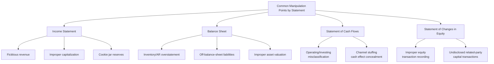

## Common Manipulations Affecting Each Financial Statement

### Overview

Because the four primary financial statements articulate with one another, a manipulation introduced on one statement inevitably leaves a trace elsewhere — but perpetrators typically target the statement(s) most directly tied to the incentive driving the fraud (e.g., inflating the income statement to meet earnings targets, or inflating the balance sheet to satisfy loan covenants). This topic catalogs the most commonly documented manipulation techniques organized by statement, providing the forensic accountant's working reference for scheme identification.

**Key Points**

- Manipulations are rarely confined to a single statement in practice, given articulation; this organization-by-statement reflects where the manipulation is **primarily visible or initiated**, not where its full effect is confined
- Techniques generally fall into two broad categories: manipulation of **judgment/estimates** (harder to detect, since estimates are inherently subjective) and manipulation of **transaction recording** (fabricated or misclassified entries)
- Understanding common manipulation techniques by statement allows forensic accountants to structure analytical procedures (ratio analysis, trend analysis, benchmarking) around the specific accounts most vulnerable to each technique

---

### Income Statement Manipulations

#### Revenue Recognition Schemes

- **Fictitious revenue:** Recording sales that never occurred, often supported by fabricated invoices or shipping documents
- **Channel stuffing:** Inducing distributors/customers to purchase more product than needed near period-end, inflating current-period revenue at the expense of future periods
- **Bill-and-hold schemes:** Recognizing revenue for goods invoiced but not yet shipped or delivered to the customer, violating standard recognition criteria
- **Round-tripping:** Two parties exchange assets or services of approximately equal value, each recording revenue, artificially inflating both parties' reported activity with no genuine economic substance
- **Premature revenue recognition:** Recording revenue before performance obligations are satisfied under ASC 606 / IFRS 15 criteria (e.g., before delivery, before customer acceptance where required, or before services are rendered)
- **Side agreements:** Undisclosed agreements (e.g., a right of return, or a contingency on payment) that would preclude revenue recognition if known, concealed from the auditor

#### Expense Manipulation Schemes

- **Improper capitalization:** Recording expenditures that should be expensed immediately (e.g., routine maintenance, R&D under most frameworks) as capitalized assets instead, deferring the expense recognition and inflating current-period income
- **Cookie jar reserves:** Overstating reserves/allowances in profitable periods, then releasing them in weaker periods to smooth earnings
- **Big bath accounting:** The reverse — taking excessive write-offs and charges in a single period (often coinciding with a leadership change or already-poor period) to depress current earnings and set up easier comparisons in future periods
- **Expense deferral/omission:** Failing to record expenses incurred (e.g., delaying recognition of a known liability) to inflate current-period income
- **Related-party expense manipulation:** Shifting expenses to or from related entities to manage reported results at the parent or subsidiary level

**Example**

A software company nearing the end of its fiscal year recognizes revenue on a multi-year enterprise licensing contract in full upon signing, rather than ratably over the contract term as required under ASC 606's performance obligation guidance. This premature recognition inflates current-period revenue and net income; a forensic accountant would identify this by comparing recognized revenue timing against the underlying contract's delivery and performance terms, a discrepancy invisible from the financial statements alone but evident upon reviewing the source contract.

---

### Balance Sheet Manipulations

#### Asset Overstatement

- **Inventory manipulation:** Fictitious inventory, inflated per-unit costs, failure to write down obsolete/damaged inventory, or physical count manipulation during observation
- **Fictitious or overstated accounts receivable:** Recording receivables for sales that did not occur (tied directly to fictitious revenue schemes), or failing to write off known uncollectible accounts
- **Improper asset valuation:** Failing to record appropriate impairment on goodwill, intangibles, investments, or property, plant, and equipment
- **Capitalized costs that should be expensed:** As noted above, this simultaneously overstates the balance sheet asset and understates the corresponding period expense

#### Liability Understatement

- **Off-balance-sheet financing:** Structuring arrangements (e.g., certain lease structures, special purpose entities) to keep debt obligations off the reported balance sheet
- **Unrecorded or understated contingent liabilities:** Failing to record or disclose known litigation exposure, warranty obligations, or environmental liabilities
- **Unrecorded liabilities at period-end:** Delaying recording of known payables or accrued expenses into the following period (a cutoff manipulation)
- **Debt reclassification:** Improperly classifying current liabilities as long-term (or vice versa, depending on the incentive) to manage liquidity ratios or covenant compliance

**Example**

A construction company facing a bank covenant requiring a minimum current ratio understates current liabilities by improperly classifying a note payable due within twelve months as long-term debt. A forensic accountant reviewing the loan agreement's actual maturity schedule against the balance sheet classification identifies the discrepancy, revealing the covenant compliance was achieved through misclassification rather than genuine liquidity.

<svg xmlns="http://www.w3.org/2000/svg" width="700" height="380" viewBox="0 0 700 380" font-family="Helvetica, Arial, sans-serif">
<text x="350" y="24" text-anchor="middle" font-size="16" font-weight="bold" fill="#1a1a1a">Manipulation Techniques Across the Four Statements (svg_diagram)</text>
<rect x="20" y="60" width="160" height="110" rx="6" fill="#2b6cb0" />
<text x="100" y="85" text-anchor="middle" font-size="12" fill="#fff" font-weight="bold">Income Statement</text>
<text x="100" y="108" text-anchor="middle" font-size="9" fill="#fff">Fictitious revenue</text>
<text x="100" y="124" text-anchor="middle" font-size="9" fill="#fff">Improper capitalization</text>
<text x="100" y="140" text-anchor="middle" font-size="9" fill="#fff">Cookie jar reserves</text>
<text x="100" y="156" text-anchor="middle" font-size="9" fill="#fff">Big bath charges</text>
<rect x="200" y="60" width="160" height="110" rx="6" fill="#c05621" />
<text x="280" y="85" text-anchor="middle" font-size="12" fill="#fff" font-weight="bold">Balance Sheet</text>
<text x="280" y="108" text-anchor="middle" font-size="9" fill="#fff">Inventory/AR overstate</text>
<text x="280" y="124" text-anchor="middle" font-size="9" fill="#fff">Off-B/S liabilities</text>
<text x="280" y="140" text-anchor="middle" font-size="9" fill="#fff">Asset valuation</text>
<text x="280" y="156" text-anchor="middle" font-size="9" fill="#fff">Debt reclassification</text>
<rect x="380" y="60" width="160" height="110" rx="6" fill="#2f855a" />
<text x="460" y="85" text-anchor="middle" font-size="12" fill="#fff" font-weight="bold">Cash Flow Statement</text>
<text x="460" y="108" text-anchor="middle" font-size="9" fill="#fff">CFO/CFI misclassify</text>
<text x="460" y="124" text-anchor="middle" font-size="9" fill="#fff">Factoring receivables</text>
<text x="460" y="140" text-anchor="middle" font-size="9" fill="#fff">as operating inflow</text>
<rect x="560" y="60" width="120" height="110" rx="6" fill="#805ad5" />
<text x="620" y="85" text-anchor="middle" font-size="11" fill="#fff" font-weight="bold">Equity Statement</text>
<text x="620" y="108" text-anchor="middle" font-size="9" fill="#fff">Related-party</text>
<text x="620" y="122" text-anchor="middle" font-size="9" fill="#fff">capital transactions</text>

<text x="350" y="220" text-anchor="middle" font-size="11" fill="#666" font-style="italic">Articulation means a manipulation on one statement creates traceable effects on others</text>

</svg>

---

### Statement of Cash Flows Manipulations

Because genuine cash movements are generally harder to fabricate outright than accounting estimates, cash flow statement manipulation more commonly involves **misclassification between the three activity categories** rather than fabrication of cash itself.

- **Operating vs. investing misclassification:** Classifying an operating cash outflow (e.g., capitalized costs that should have been expensed and reflected as an operating outflow) as an investing outflow, inflating reported cash flow from operations (CFO) — a metric heavily scrutinized by analysts and lenders as an "earnings quality" indicator
- **Receivables factoring/securitization:** Selling receivables to a third party and classifying the proceeds as an operating inflow, potentially obscuring the true collection performance of core operations
- **Sale-leaseback and similar structured transactions:** Using transaction structuring to shift the timing or classification of cash flows favorably
- **Bank overdraft classification:** Manipulating the classification of book overdrafts between operating and financing activities

**Example**

A retailer facing declining organic cash generation begins factoring (selling) a substantial portion of its receivables to a third-party finance company near each period-end, classifying the proceeds as operating cash inflow. Reported CFO appears healthy and growing, while the underlying operating cash conversion cycle has actually deteriorated. A forensic accountant identifies this by comparing days sales outstanding (DSO) trends against reported CFO growth and reviewing footnote disclosures on receivables sale/factoring arrangements — a classic earnings quality divergence indicator.

---

### Statement of Changes in Equity Manipulations

Manipulations directly targeting the equity statement are less common as a *primary* fraud vector but frequently appear as the downstream effect of other schemes, or as a distinct mechanism in specific contexts:

- **Undisclosed or improperly valued related-party capital contributions:** Concealing the true source or valuation of capital injected into the business, sometimes to mask insolvency or related-party dependency
- **Improper treatment of stock-based compensation:** Misstating the valuation or vesting treatment of equity compensation, affecting both the equity statement and the income statement (compensation expense)
- **Treasury stock transaction manipulation:** Improperly timed or valued stock buybacks used to manage per-share metrics (e.g., earnings per share) rather than genuine capital allocation objectives
- **Dividend/distribution manipulation:** In closely-held or fraud-adjacent entities, improperly characterizing distributions to obscure related-party fund diversion

---

### Cross-Statement Detection Principle: Following the Articulation

Because manipulations rarely stay confined to one statement, forensic accountants systematically exploit articulation as a **detection tool**: a manipulation designed to look legitimate on one statement often creates an anomaly on another that is harder for the perpetrator to simultaneously conceal.

| Primary Manipulation | Statement Where It's Visible | Statement Where the Trace Appears |
| --- | --- | --- |
| Fictitious revenue | Income Statement (inflated revenue) | Balance Sheet (inflated AR that never collects); Cash Flow Statement (CFO doesn't grow with net income) |
| Improper capitalization | Balance Sheet (inflated asset) | Income Statement (understated expense, inflated net income) |
| Off-balance-sheet liability | Balance Sheet (understated liabilities) | Footnote disclosures (often the only visible trace); sometimes Cash Flow Statement financing activity |
| Cookie jar reserves | Balance Sheet (overstated reserve/allowance) | Income Statement (understated expense in the reserve-building period; overstated income in the release period) |

**[Inference]** This cross-statement, articulation-based detection approach is generally considered more robust than analyzing any single statement in isolation, since a sophisticated perpetrator concealing a fabrication on one statement must simultaneously manage its effects across the other three to avoid detection — a substantially harder concealment task than manipulating a single number in isolation.

---

### Related Topics

- Financial statement structure and the accounting cycle
- Revenue recognition standards and schemes (ASC 606 / IFRS 15)
- Ratio analysis and horizontal/vertical analysis in fraud detection
- The Beneish M-Score and financial statement fraud prediction models
- Earnings management versus fraudulent financial reporting: the legal distinction
- Journal entry testing and data analytics for fraud detection
- Off-balance-sheet financing structures and special purpose entities
- Cash flow statement analysis and earnings quality assessment