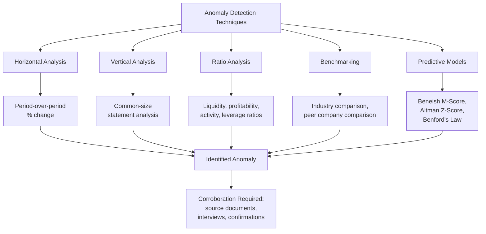

## Applying Accounting Knowledge to Detect Anomalies

### Overview

Detecting financial anomalies requires more than familiarity with fraud schemes — it demands the ability to apply core accounting knowledge (accrual mechanics, GAAP/IFRS recognition criteria, industry-specific norms) to recognize when reported figures deviate from what legitimate underlying economics would produce. This topic synthesizes the analytical techniques forensic accountants use to convert accounting expertise into anomaly detection: ratio analysis, trend analysis, benchmarking, and professional skepticism applied systematically.

**Key Points**

- Anomaly detection sits between two disciplines: **accounting knowledge** (understanding what "normal" looks like under applicable standards) and **analytical technique** (the specific procedures used to surface deviations from normal)
- Techniques range from simple period-over-period comparison to sophisticated statistical and predictive models; forensic accountants typically layer multiple techniques rather than relying on any single method
- Professional skepticism — a documented, disciplined questioning mindset rather than either blind trust or reflexive suspicion — underlies all anomaly detection work
- Anomalies are **starting points for inquiry, not conclusions**; every anomaly identified through analytical technique requires corroboration against source documents, interviews, or independent confirmation before being characterized as evidence of fraud

---

### Horizontal and Vertical Analysis

#### Horizontal Analysis (Trend Analysis)

Compares a financial statement line item across multiple periods, expressing change in dollar terms and percentage terms.

$$\text{\% Change} = \frac{\text{Current Period} - \text{Prior Period}}{\text{Prior Period}} \times 100$$

- Surfaces unusual growth or decline inconsistent with known business conditions (e.g., revenue growing 40% while the broader industry is flat or declining)
- Particularly effective for identifying accounts growing inconsistently with related accounts that should move together (e.g., revenue growing while cost of goods sold stays flat, an unusual and investigable pattern)

#### Vertical Analysis (Common-Size Analysis)

Expresses each line item as a percentage of a base figure (total revenue for the income statement, total assets for the balance sheet), enabling comparison across periods or against industry benchmarks regardless of absolute size.

$$\text{Common-Size \%} = \frac{\text{Line Item}}{\text{Base Figure (Revenue or Total Assets)}} \times 100$$

**Example**

A vertical analysis of a manufacturing company's income statement shows gross margin holding steady at approximately 35% for four consecutive years, then jumping to 48% in the current year without a corresponding change in pricing strategy, input costs, or product mix communicated by management. This anomaly — a common-size percentage shift inconsistent with known operational drivers — prompts closer examination of cost of goods sold, revealing understated inventory obsolescence reserves as the underlying cause.

<svg xmlns="http://www.w3.org/2000/svg" width="700" height="380" viewBox="0 0 700 380" font-family="Helvetica, Arial, sans-serif">
<text x="350" y="24" text-anchor="middle" font-size="16" font-weight="bold" fill="#1a1a1a">From Anomaly to Evidence: The Corroboration Chain (svg_diagram)</text>
<rect x="40" y="60" width="140" height="60" rx="6" fill="#2b6cb0" />
<text x="110" y="86" text-anchor="middle" font-size="11" fill="#fff" font-weight="bold">Analytical</text>
<text x="110" y="102" text-anchor="middle" font-size="11" fill="#fff" font-weight="bold">Technique</text>
<rect x="280" y="60" width="140" height="60" rx="6" fill="#c05621" />
<text x="350" y="86" text-anchor="middle" font-size="11" fill="#fff" font-weight="bold">Anomaly</text>
<text x="350" y="102" text-anchor="middle" font-size="11" fill="#fff" font-weight="bold">Identified</text>
<rect x="520" y="60" width="140" height="60" rx="6" fill="#2f855a" />
<text x="590" y="86" text-anchor="middle" font-size="11" fill="#fff" font-weight="bold">Hypothesis</text>
<text x="590" y="102" text-anchor="middle" font-size="11" fill="#fff" font-weight="bold">Formed</text>
<line x1="180" y1="90" x2="280" y2="90" stroke="#333" stroke-width="2" marker-end="url(#a1)" />
<line x1="420" y1="90" x2="520" y2="90" stroke="#333" stroke-width="2" marker-end="url(#a1)" />
<rect x="280" y="180" width="140" height="60" rx="6" fill="#805ad5" />
<text x="350" y="206" text-anchor="middle" font-size="11" fill="#fff" font-weight="bold">Corroboration</text>
<text x="350" y="222" text-anchor="middle" font-size="11" fill="#fff" font-weight="bold">(docs/interviews)</text>
<line x1="590" y1="120" x2="350" y2="180" stroke="#333" stroke-width="2" marker-end="url(#a1)" />
<rect x="280" y="290" width="140" height="60" rx="6" fill="#742a2a" />
<text x="350" y="316" text-anchor="middle" font-size="11" fill="#fff" font-weight="bold">Confirmed or</text>
<text x="350" y="332" text-anchor="middle" font-size="11" fill="#fff" font-weight="bold">Refuted</text>
<line x1="350" y1="240" x2="350" y2="290" stroke="#333" stroke-width="2" marker-end="url(#a1)" />
</svg>

---

### Ratio Analysis for Anomaly Detection

Ratios distill relationships between accounts, and unusual movement in a ratio — particularly one that should be relatively stable for a given business model — is a well-established anomaly signal.

| Ratio Category | Key Ratios | What an Anomaly Might Suggest |
| --- | --- | --- |
| **Liquidity** | Current ratio, quick ratio | Deteriorating true liquidity masked by asset overstatement or liability understatement |
| **Profitability** | Gross margin, operating margin, net margin | Revenue or expense manipulation; unusual margin stability can itself be suspicious if peers show volatility |
| **Activity/Efficiency** | Days sales outstanding (DSO), days inventory outstanding (DIO), asset turnover | Fictitious receivables (rising DSO); inflated/obsolete inventory (rising DIO) |
| **Leverage** | Debt-to-equity, interest coverage | Off-balance-sheet liabilities suppressing reported leverage |
| **Earnings quality** | Accruals ratio, CFO-to-net-income ratio | Net income growing while operating cash flow lags — a classic earnings quality red flag |

#### Earnings Quality Ratio (Accruals-Based Detection)

$$\text{Accruals Ratio} = \frac{\text{Net Income} - \text{Cash Flow from Operations}}{\text{Total Assets}}$$

A persistently high or increasing accruals ratio suggests reported earnings are increasingly driven by non-cash accounting judgments (accruals and estimates) rather than cash-generating operations — a pattern empirically associated in academic accounting research with elevated risk of subsequent financial statement fraud or restatement, though a high ratio alone is not proof of manipulation, since legitimate business growth (e.g., rapidly expanding receivables from genuine sales growth) can also drive it.

---

### Benchmarking

Comparing a company's financial metrics against relevant external reference points to identify deviations that a purely internal (period-over-period) analysis might miss.

- **Industry benchmarking:** Comparing margins, turnover ratios, and growth rates against published industry statistics or trade association data
- **Peer company benchmarking:** Direct comparison against similarly-situated competitors, particularly useful when industry-wide statistics are too broad to be meaningful
- **Historical self-benchmarking:** Comparing the company against its own multi-year historical pattern, useful for identifying inflection points that coincide with a change in management, ownership, or known pressure events (e.g., approaching a loan covenant deadline or IPO)

**[Inference]** Benchmarking is generally most effective when combined with contextual business knowledge — a deviation from industry norms is meaningful only when the forensic accountant can also assess whether a legitimate business explanation (new product launch, acquisition, market disruption) plausibly accounts for it, since industry averages by construction include considerable legitimate variation.

---

### Statistical and Predictive Detection Models

#### Benford's Law

A mathematical observation that in many naturally occurring numerical datasets, the leading digit is not uniformly distributed — the digit 1 appears as the leading digit far more often (roughly 30%) than higher digits, following a logarithmic distribution:

$$P(d) = \log_{10}\left(1 + \frac{1}{d}\right), \quad d \in \{1, 2, \ldots, 9\}$$

- Applied to large transaction populations (e.g., disbursements, journal entries) to identify sets whose digit distribution deviates significantly from the expected Benford distribution, flagging populations warranting closer review
- **[Inference]** Benford's Law is best understood as a screening tool for prioritizing further inquiry across large datasets, not a standalone fraud detection method, since many legitimate datasets (particularly those with imposed constraints, such as prices set at round numbers or values bounded within a narrow range) naturally deviate from the expected distribution without any fraud present

#### The Beneish M-Score

A statistical model combining eight financial ratios (including days sales in receivables index, gross margin index, asset quality index, sales growth index, and others) to generate a composite score estimating the probability that a company has manipulated its earnings.

$$M\text{-Score} = -4.84 + 0.92(DSRI) + 0.528(GMI) + 0.404(AQI) + 0.892(SGI) + 0.115(DEPI) - 0.172(SGAI) + 4.679(TATA) - 0.327(LVGI)$$

**[Unverified]** The specific coefficients above reflect the originally published Beneish model; practitioners should verify current formulation and threshold interpretation against the original academic source or a current secondary reference before applying it in professional work, since model coefficients and interpretation guidance are sometimes refined or re-validated in subsequent academic literature.

#### The Altman Z-Score

Though originally designed to predict bankruptcy risk rather than fraud specifically, the Altman Z-Score is sometimes used by forensic accountants as a contextual indicator, since severe financial distress is a well-documented pressure-category risk factor under the fraud triangle, correlating with elevated fraud risk even though the model itself measures solvency rather than manipulation directly.

---

### Professional Skepticism as an Applied Discipline

Professional skepticism is the disciplined mindset underlying effective application of all the above techniques — a questioning attitude alert to conditions indicating possible misstatement, combined with a critical assessment of evidence, without assuming either dishonesty or honesty on the part of those being relied upon.

**Key Points**

- Professional skepticism requires **corroborating explanations, not merely accepting them**: when management offers a plausible business explanation for an anomaly, the skeptical forensic accountant seeks independent evidence supporting that explanation rather than closing the inquiry on management's assertion alone
- This applies symmetrically — skepticism cautions equally against reflexive over-suspicion that treats every anomaly as fraud without adequate corroboration, which can produce false accusations, wasted investigative resources, and reputational harm
- [Inference] Because analytical anomaly-detection techniques by their nature generate statistical signals rather than direct evidence of wrongdoing, professional skepticism functions as the necessary bridge discipline converting a quantitative anomaly into a properly evidenced investigative finding

---

### Integrated Application: A Worked Example

**Example**

A forensic accountant engaged to assess fraud risk at a mid-size distributor performs the following layered analysis: (1) horizontal analysis reveals revenue grew 22% year-over-year while the broader distribution sector, per industry data, grew approximately 4%; (2) vertical analysis shows gross margin expanding from 28% to 34% without a disclosed pricing or sourcing change; (3) ratio analysis shows DSO increasing from 45 to 78 days, indicating receivables are growing faster than collections; (4) the accruals ratio has risen sharply relative to the prior three years. No single metric proves fraud, but the **convergence of multiple independent anomalies**, each consistent with a fictitious or prematurely recognized revenue hypothesis, justifies escalating to substantive procedures: reviewing a sample of large late-year sales contracts against shipping records and customer confirmations. This staged approach — broad analytical screening narrowing to targeted substantive corroboration — reflects standard forensic accounting methodology.

---

### Related Topics

- Common manipulations affecting each financial statement
- The Beneish M-Score and Altman Z-Score in depth
- Benford's Law: theory, application, and limitations
- Journal entry testing and data analytics for fraud detection
- Professional skepticism standards under auditing and forensic engagement frameworks
- Earnings quality assessment and accrual-based detection models
- Ratio analysis benchmarking against industry and peer data sources
- Building a fraud risk assessment using converging analytical indicators