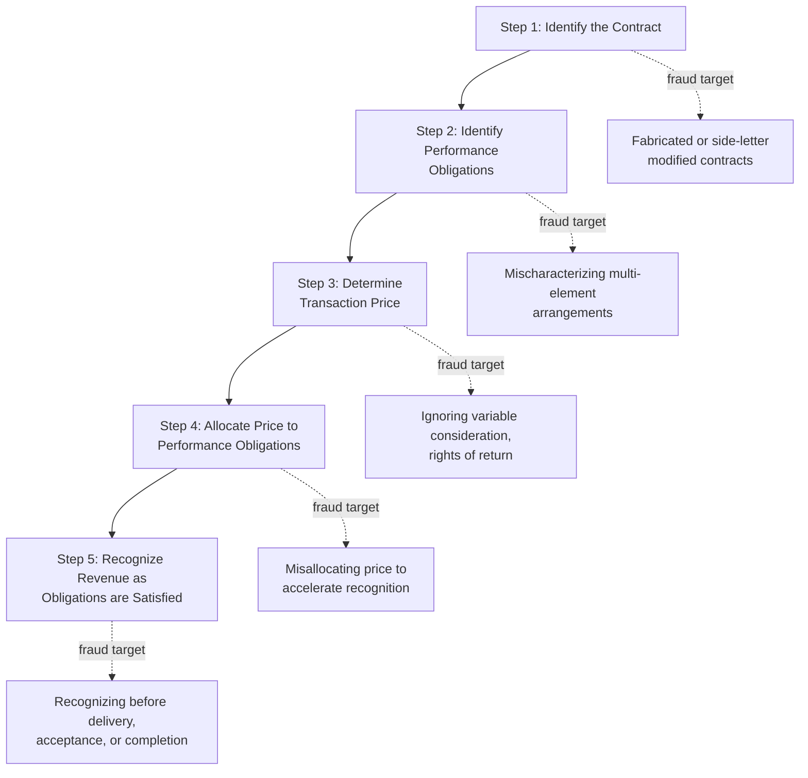

## Revenue Recognition Fraud Schemes


### Overview

Revenue recognition fraud is consistently identified in ACFE and SEC enforcement research as the single most common category of financial statement fraud, reflecting revenue's central role in earnings-based performance metrics, analyst expectations, executive compensation, and covenant compliance. This topic provides a comprehensive catalog of revenue recognition fraud schemes, the accounting standards they violate, and the detection techniques forensic accountants apply.

**Key Points**

- Revenue recognition fraud generally falls into two mechanical categories: **recording revenue that should not be recorded at all** (fictitious revenue) and **recording legitimate revenue in the wrong period** (timing/cutoff manipulation)
- The governing accounting standards — **ASC 606** (Revenue from Contracts with Customers) under U.S. GAAP and its converged counterpart **IFRS 15** — establish a five-step model that, properly understood, provides the forensic accountant's framework for identifying where and how recognition criteria were violated
- SEC enforcement data and academic research consistently identify revenue recognition as the most frequently cited fraud category in financial statement fraud cases
- Detection typically requires triangulating the income statement against source documents (contracts, shipping records, customer correspondence) rather than analysis of the financial statements alone

---

### The ASC 606 / IFRS 15 Five-Step Model as a Forensic Framework

$$\text{Revenue Recognition} = f(\text{Contract Identification}, \text{Performance Obligations}, \text{Transaction Price}, \text{Allocation}, \text{Satisfaction})$$



<svg xmlns="http://www.w3.org/2000/svg" width="700" height="340" viewBox="0 0 700 340" font-family="Helvetica, Arial, sans-serif">
<text x="350" y="24" text-anchor="middle" font-size="16" font-weight="bold" fill="#1a1a1a">Five-Step Model: Where Fraud Is Typically Introduced (svg_diagram)</text>
<g font-size="10" fill="#fff" text-anchor="middle">
<rect x="20" y="60" width="120" height="70" rx="6" fill="#2b6cb0" />
<text x="80" y="85">Step 1</text><text x="80" y="100">Contract</text><text x="80" y="115">Identification</text>



```
<rect x="160" y="60" width="120" height="70" rx="6" fill="#c05621" />
<text x="220" y="80">Step 2</text><text x="220" y="95">Performance</text><text x="220" y="110">Obligations</text>

<rect x="300" y="60" width="120" height="70" rx="6" fill="#2f855a" />
<text x="360" y="80">Step 3</text><text x="360" y="95">Transaction</text><text x="360" y="110">Price</text>

<rect x="440" y="60" width="120" height="70" rx="6" fill="#805ad5" />
<text x="500" y="80">Step 4</text><text x="500" y="95">Price</text><text x="500" y="110">Allocation</text>

<rect x="580" y="60" width="100" height="70" rx="6" fill="#742a2a" />
<text x="630" y="85">Step 5</text><text x="630" y="100">Recognition</text><text x="630" y="115">Timing</text>
```

</g>

<text x="350" y="200" text-anchor="middle" font-size="11" fill="#333" font-weight="bold">Most fraud concentrates at Steps 1 and 5</text>

<text x="350" y="220" text-anchor="middle" font-size="10" fill="#666">(contract existence/terms, and timing of obligation satisfaction)</text>

</svg>

---

### Category 1: Fictitious Revenue Schemes

Revenue recorded for transactions that lack genuine economic substance.

- **Sham sales to fictitious customers:** Entirely fabricated customer entities, often with addresses or contact details traceable to insiders
- **Sales with side agreements:** A genuine customer exists, but an undisclosed side letter grants a right of return, extended payment terms contingent on resale, or a cancellation right that would preclude revenue recognition if known to the auditor
- **Round-tripping / circular transactions:** Two related or colluding parties exchange cash or assets of equivalent value, each recording revenue from the "sale" to the other, inflating both parties' top-line figures with no net economic effect
- **Consignment sales recorded as outright sales:** Goods shipped on consignment (where the recipient can return unsold goods) are recorded as completed sales, when control of the goods has not actually transferred under ASC 606 criteria

**Example**

A technology reseller inflates quarterly revenue by recording sales to a network of shell distributors it secretly controls. Goods are shipped, revenue is recorded, and the transaction appears in every respect legitimate from the income statement alone — but the "customers" never sell the goods to end users, and the reseller quietly accepts unlimited returns under an undisclosed verbal side agreement. A forensic accountant identifies the scheme by tracing shipments to the distributors' actual resale activity (via inventory tracking or distributor confirmation) and discovering no corresponding end-customer sales.

---

### Category 2: Timing and Cutoff Manipulation

Legitimate revenue recognized in the wrong accounting period, most commonly accelerated into an earlier period than the recognition criteria support.

- **Bill-and-hold schemes:** Revenue recognized upon invoicing, even though goods remain in the seller's warehouse and have not been delivered or transferred to customer control — permissible only under narrow, specifically documented conditions under ASC 606, and frequently abused
- **Premature recognition before performance obligation satisfaction:** Recognizing revenue on multi-element or service contracts before the relevant deliverable is actually provided or the service actually performed
- **Channel stuffing:** Inducing distributors to accept larger-than-normal shipments near period-end (often through incentives, extended payment terms, or pressure), inflating current-period revenue at the expense of future periods and creating an unsustainable revenue pattern
- **Extended or altered shipping terms:** Manipulating FOB (free on board) shipping point versus destination terms, or backdating shipping documents, to shift the recognition date across a period boundary
- **Holding the books open:** Continuing to record subsequent-period sales as if they occurred before period-end, a direct cutoff violation

---

### Category 3: Multi-Element Arrangement and Allocation Manipulation

Particularly relevant to software, technology, and bundled-services businesses where a single contract contains multiple distinct performance obligations.

- **Misallocation of transaction price:** Deliberately over-allocating price to performance obligations satisfied earlier (e.g., upfront licensing) and under-allocating to obligations satisfied later (e.g., ongoing support/maintenance), accelerating recognized revenue relative to the contract's true economics
- **Mischaracterizing obligations as distinct when they are not (or vice versa):** Manipulating the performance obligation identification step itself to achieve a preferred recognition pattern
- **Ignoring variable consideration constraints:** Failing to appropriately constrain estimates of variable consideration (discounts, rebates, performance bonuses, penalties) that ASC 606 requires be included only to the extent it is probable a significant reversal will not occur

**Example**

A SaaS company sells a bundled contract including perpetual software licenses, implementation services, and three years of technical support. Rather than allocating the transaction price across all three performance obligations based on relative standalone selling price (as ASC 606 requires) and recognizing the license and implementation revenue upon delivery/completion while deferring support revenue ratably over three years, the company allocates a disproportionate share of the total price to the license element, recognizing it immediately. This front-loads revenue recognition relative to the contract's true economic delivery pattern.

---

### Category 4: Related-Party and Structured Revenue Schemes

- **Undisclosed related-party sales:** Revenue generated through transactions with related entities, without appropriate disclosure, potentially lacking arm's-length substance
- **Structured transactions designed around specific recognition rules:** Complex, multi-party, or multi-step transactions engineered specifically to satisfy the technical letter of recognition criteria while defeating their underlying substance (a pattern historically associated with some of the largest financial statement fraud cases)
- **Barter and non-monetary transaction inflation:** Recording non-cash exchanges (particularly common in historical dot-com era advertising-barter schemes) at inflated fair values to boost reported revenue

---

### Detection Techniques Specific to Revenue Recognition Fraud

| Technique | What It Reveals |
| --- | --- |
| **DSO (Days Sales Outstanding) trend analysis** | Rising DSO alongside revenue growth suggests receivables are not converting to cash, consistent with fictitious or premature revenue |
| **Revenue vs. cash flow from operations divergence** | Net income/revenue growing while CFO lags is a classic earnings-quality red flag tied to non-cash revenue recognition |
| **Cutoff testing** | Sampling transactions immediately before and after period-end to verify recognition occurred in the correct period per shipping/delivery documentation |
| **Contract and side-letter review** | Identifying undisclosed terms (rights of return, contingencies) that would preclude recognition as recorded |
| **Customer confirmation** | Independent confirmation with customers of sale terms, amounts, and any side agreements, bypassing internally-controlled documentation |
| **Sales returns and credit memo analysis** | Unusually high post-period-end returns or credits can indicate channel stuffing or premature recognition in the prior period |
| **Related-party transaction mapping** | Identifying revenue concentration with related or affiliated entities lacking clear arm's-length substance |

**Key Points**

- **DSO analysis and cash flow divergence** are frequently the first analytical signals prompting deeper revenue recognition inquiry, since they are derivable from standard financial statements without requiring access to underlying contracts
- **Customer confirmation** is considered a particularly powerful detection technique specifically because it obtains information from a source entirely outside the company's own control, making it resistant to internal document fabrication (though vulnerable to confirmation fraud if the "customer" itself is complicit or fictitious)
- [Inference] No single detection technique is generally considered sufficient in isolation; effective revenue recognition fraud detection typically layers analytical procedures (DSO, cash flow divergence) with substantive procedures (cutoff testing, confirmation, contract review) to both identify and corroborate suspected schemes

---

### Regulatory and Standard-Setting Context

- **ASC 606 (U.S. GAAP)** and **IFRS 15** represent a converged, principles-based revenue recognition model, replacing numerous industry-specific legacy rules; the shift to a principles-based model places greater reliance on management judgment in applying the five-step framework, which forensic accountants note can create both legitimate interpretive complexity and opportunity for deliberate misapplication
- **SEC enforcement priorities** have historically and consistently identified revenue recognition as a leading category of financial reporting enforcement actions, reflecting its central role in earnings management incentives
- **SAB 101/104 (historical SEC guidance, predating ASC 606)** established foundational recognition criteria (persuasive evidence of an arrangement, delivery/performance, fixed or determinable price, reasonable assurance of collectability) that remain conceptually embedded within the modern five-step model's underlying principles

**[Unverified]** Current SEC enforcement statistics and the precise proportion of financial reporting cases involving revenue recognition specifically change year to year and are published in SEC annual enforcement reports; practitioners should reference the current report rather than a fixed historical percentage.

---

### Related Topics

- Common manipulations affecting each financial statement
- Channel stuffing and distributor incentive schemes in depth
- ASC 606 / IFRS 15 five-step model: detailed application guidance
- Cutoff testing procedures and period-end transaction sampling
- Earnings quality analysis and cash flow divergence detection
- Related-party transaction identification and analysis
- The Beneish M-Score and its revenue-related component ratios (DSRI, SGI)
- Customer confirmation procedures in forensic and audit engagements